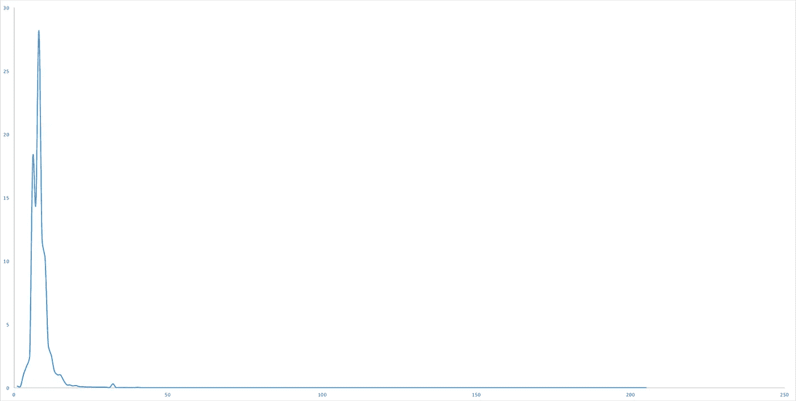
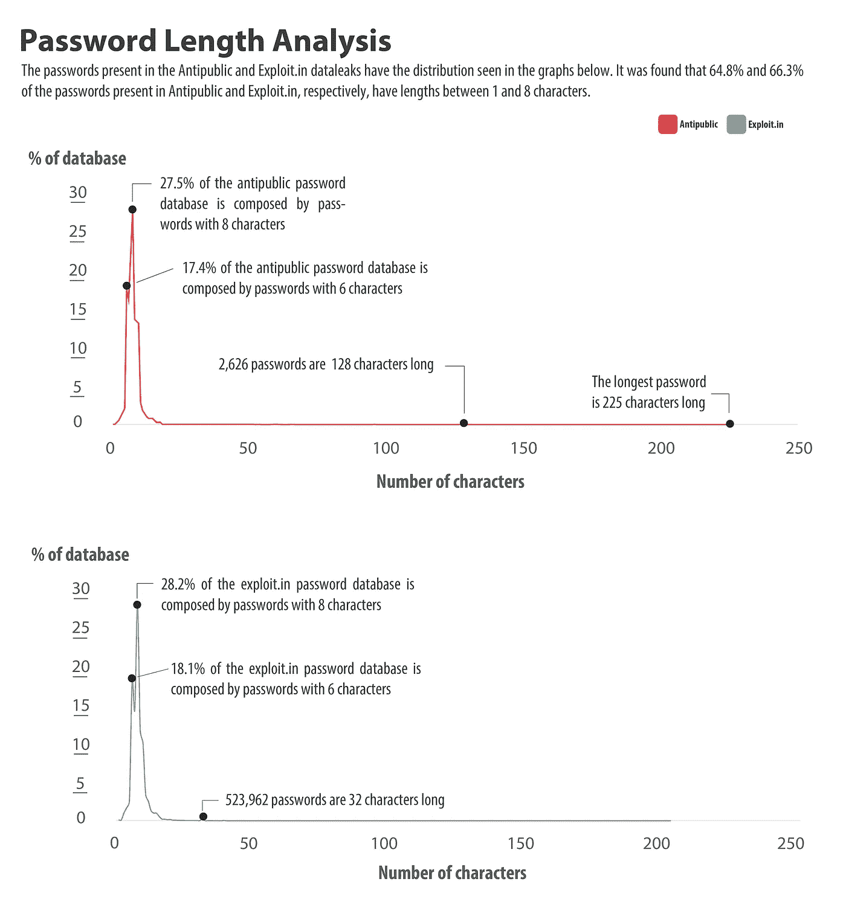

# 密码分析

> 原文：<https://medium.com/hackernoon/password-analysis-7a8181185143>

2016 年末，两个包含数百万凭据的数据库被公开——anti public Combo List 和 Exploit.in Combo List。这些数据库包含来自不同在线服务的用户名/电子邮件地址和密码的组合。

BinaryEdge 让我有机会对这些数据库的内容进行全面分析。想法是收集两个列表中出现的所有密码，并对它们进行分析，以提取重要的统计数据。

这对我来说是一个特别具有挑战性的项目，因为我以前从未做过密码分析。

虽然分析已经在 [BinaryEdge 的博客](https://blog.binaryedge.io/2017/07/24/antipublic-password-analysis/)中描述过，这篇文章更侧重于我在创建可视化来呈现发现的统计数据时使用的过程。我将从那里提出的许多例子中举几个例子。

所以，首先，我对这些名单做了一些研究。当时(2017 年初)，人们对它们知之甚少(除了内容之外)，也不知道它们来自哪里。

我的第一个想法是“我该从哪里开始？”。在检查了我正在处理的文件的大小后，我做了一个基本的分析来检查文件的行数，其中哪些是唯一的，有多少电子邮件地址、密码和用户名出现在这些列表上。这是容易的部分。然后，我继续分别分析电子邮件和密码。

虽然对两个数据库的分析是独立完成的，但我想把结果放在一起展示——我认为最好的方法是使用代表每个数据库的颜色，在整个可视化过程中保持一致性。

color labels present in all the designs

## 电子邮件地址

分析电子邮件地址并不是最初任务的一部分，但出于好奇，我最终也分析了它们。这一分析给了我关于域名和顶级域名(顶级域名，如。com)。

下图显示了所分析的数据库中存在的域。对我来说，强调最突出的数字(在这种情况下是雅虎的数字)是非常重要的，而且，我再次认为颜色会是一个很好的选择，因为读者会立即被重定向到那个框。

我在结果上遇到的一个困难是，它们有点倾斜，这意味着它在常规图中看起来不太好——最小值不可读。另一种方法是使用刻度分隔线或断开的 y 轴，或者绘制两次，一次绘制最大值，另一次绘制最小值。对我来说，更有意义的不仅是使用百分比而不是数值，因为这样更容易比较它们，而且还可以创建一个替代的表示，如下所示。

data visualisation design created in Adobe Illustrator

我认为一个小小的细节让一切变得不同，那就是顶部那个小小的黑白盒子。我总是添加一些东西，以某种方式引导读者，让他更容易理解他在看什么。在这种情况下，该框让您知道您看到的百分比是完整数据库中的域。

事实上，自从我们公布这些数据后，我就再也没有看过它们。在写这篇文章的时候，我花了一些时间再看了一遍，并得出结论，如果我今天这样做，我不会用完全相同的方式来做。

例如，我记得当时的想法是，这么多的 yahoo.com 电子邮件地址(右边的方框)应该在这里提到，因为这是一条重要的信息。然而，我现在意识到，这本来可以包括在博客本身，不一定要在数字中。

[PACK(密码分析和破解工具包)](http://thesprawl.org/projects/pack/)，一个提取密码统计数据的伟大工具，被用来分析密码的长度——结果是一个 CSV 文件，其中包含密码的长度和它们被发现的次数。然后，我将这些数据加载到 Microsoft Excel 中，并创建了下图。

exploit.in — password length plot

在这个具体的例子中，我选择使用一个简单的工具，比如 Excel，因为我知道我想在我的设计中增加一些细节。因此，通过将数据加载到 Excel 中，我只需绘制一个基本的图并将其导出。

请注意，使用任何工具创建的图，无论是 Microsoft Excel、R 还是 Python，看起来都应该比上面的好得多——它们至少应该在两个轴上都有标题和标签。在这个具体的例子中，我知道我想添加一些细节，所以我选择了最基本的情节。下图是最终的设计。

final design

我给你看的例子(在这篇和以前的博文中)是用 Adobe Illustrator 绘制的。然而，一个好主意是在 R(例如)中进行数据分析，并在那里创建一个基本的绘图。然后，您可以导出该绘图，并在 Adobe Illustrator 中清理它。这就是我在分析组合列表中的密码长度时所做的。

step-by-step plot clean up in Adobe Illustrator

我的想法是在最相关的数据点上添加一些注释，以简化两个数据库结果之间的比较过程。没有必要一直添加这些细节，但在这种情况下，这是有意义的，因为我们正在比较两个不同的数据库，并且图形具有非常相似的形状。例如，如果最相关的数据点上没有标签，我认为将很难比较两个图表。

## 结论

总之，每一个观想都应该独立于其他观想(每一个观想都有一个颜色指南)，它应该包含读者理解它所需要的所有信息，而不必不断地回头。但是，最后，最重要的想法是让别人尽可能容易地理解你的设计。