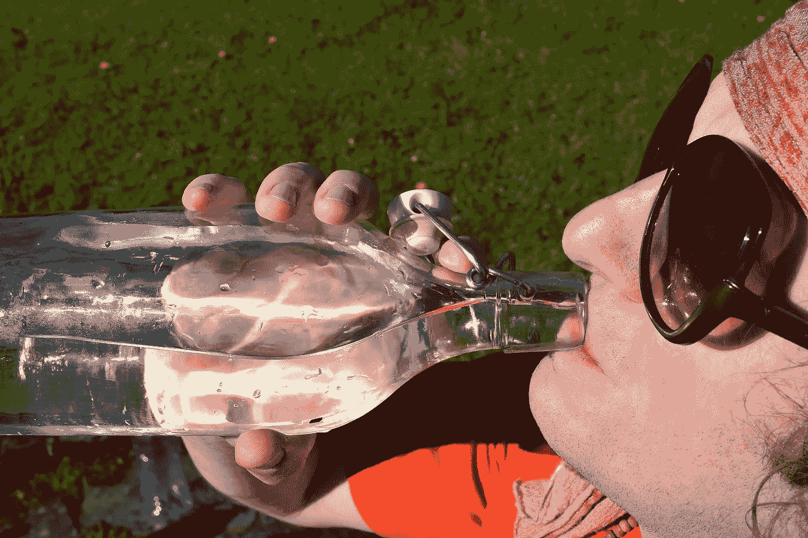
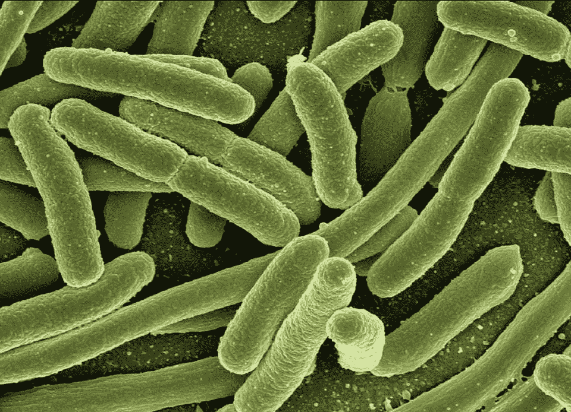

# 病原体检测:我们现在都需要的技术

> 原文：<https://medium.com/hackernoon/pathogen-detection-technology-acb7967595dd>

从饮用水供应中去除有害病原体的需求长期以来被认为是全世界的迫切需求。这是因为水的致病性污染导致疾病爆发，这反过来增加了世界各地的背景疾病率，在发展中国家更是如此。事实上，根据疾病控制和预防中心发布的信息图表，食源性疾病仍然是世界上最大的健康问题之一，据估计每年有 4800 万例感染和 3000 例死亡。

更糟糕的是，全世界至少有 18 亿 T2 人使用被粪便污染的饮用水源。这给人们带来了严重的健康风险，因为受污染的水通常含有各种水传播的病原体，如*大肠杆菌*，根据世界卫生组织的数据，这种病原体每年导致约 63，000 人死亡。

因此，检测大肠杆菌和其他病原体已经成为预防疾病的重要措施。部分原因是大肠杆菌本身是一种危险的病原体，还因为这种细菌的存在通常意味着其他病原体也可能存在。

微生物问题也日益蔓延，引起了监管者、水处理运营商甚至媒体的关注。虽然有各种各样的处理方法来消除饮用水中的病原体，但是各种各样的处理过程可能需要通过各种方法来寻找最有效和高效的方法。

*The E. coli bacteria is responsible for many foodborne illnesses, and early detection is a vital prevention measure that should be practiced. (*[*Source*](https://pixabay.com/en/koli-bacteria-escherichia-coli-123081/)*)*

事实上，根据世界卫生组织(世卫组织)的报告，“饮用水微生物质量的验证包括检测大肠杆菌*作为粪便污染的指标。*大肠杆菌*提供了近期粪便污染的确凿证据，不应出现在饮用水中。”*

问题是，用于检测大肠杆菌的仪器并不总是可用的，尤其是在大多数农村地区，不出所料，那里大肠杆菌非常普遍。此外，即使是现成的，通常也要等 2-4 天才能得到结果，这可能会对健康造成严重影响。

# **面临重大健康问题**

因此，病原体污染的问题仍然是一个主要的问题，这是需要[LexaGene](https://lexagene.com/)([OTC QB:lxx gf)](https://finance.yahoo.com/quote/lxxgf?ltr=1)([TSX)。V:LXG](https://finance.yahoo.com/quote/lxg.v/) )希望解决。作为美国一家新兴的生物技术公司，LexaGene 目前专注于开发可用于样本收集现场的全自动病原体检测系统。

该公司位于美国马萨诸塞州的大波士顿地区，旨在改变疾病的诊断和预防方式，重点关注兽医诊断、食品安全、水产养殖病原体监测和水质监测等各个领域。

目前，该公司专注于自己的专利微流体系统，该系统将用于检测多种病原体。LX2 自动化系统由该公司的首席执行官和创始人 Jack Regan 博士发明，是 LXG 的旗舰产品，旨在满足世界对改进病原体检测技术的需求。

该公司的创始人兼首席执行官里根博士是劳伦斯利弗莫尔国家实验室的首席科学家，负责开发一种检测呼吸道病原体的仪器，以及开发一种用于生物战监测的前身仪器。这两种仪器都是在 2000 万美元的政府资助下设计和开发的，后者后来被国土安全部用于其自己的生物观察计划。

现在，里根博士将他的专业知识带到了自己的生物技术公司，将重点放在病原体检测和改进测试可以服务的各种市场上。

有了 LXG 专利微流控系统，人们现在可以通过提高特异性和灵敏度来轻松检测多种病原体。该设备是全自动的，能够一次筛查多达 28 种病原体，使整个过程更快、更方便。此外，使用该仪器不需要任何微生物学家或专家，因为它易于使用，启动样品处理不到一分钟。该机器还可以在不到一个小时内得出结果，大大减少了等待时间。这缩短了获得结果的时间，是当前测试方法中的一个干扰因素。

公司最早成立于 2017 年初。此外，尽管该仪器仍处于测试开发阶段，但该公司希望在 2019 年 1 月之前开始向测试客户分发测试版设备，LXG 将在此后专注于商业化。

展望未来，LXG 的病原体检测技术完全有可能快速确定饮用水的安全性和清洁度，从而预防疾病并提高每个人的生活质量，无论他们位于世界的哪个角落。