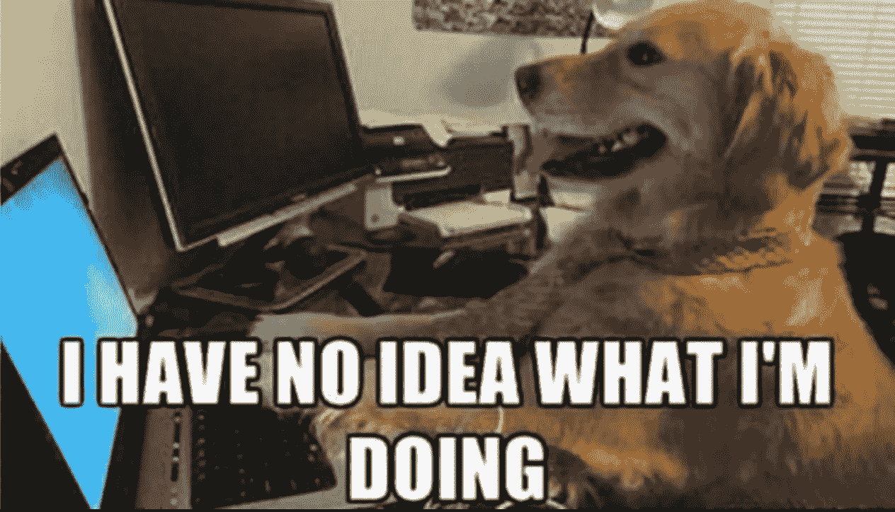

# 人们是愚蠢的，应该被当作白痴对待

> 原文：<https://medium.com/hackernoon/people-are-dumb-and-should-be-treated-like-morons-78cb6e5051d0>

## 良好用户体验设计指南

在我十年的网页开发和网页设计中，我看到人们在设计网站时一遍又一遍地犯同样愚蠢的错误。大多数人认为，仅仅因为他们理解某事，每个人都以同样的方式理解它。但事实并非如此。永远不会。

> ***重要:*** *某个地方的某个人，不会以和你一样的方式去理解某件事，无论某件事在你看来多么简单或直观，在别人看来都是没有意义的，我们任何人都对此无能为力。你必须接受这一点，理解这一点，并继续了解这一点。*

我想让你再读一遍。理解我刚才说的对你做的几乎任何事情都是成功的至关重要的，但最重要的是设计和用户体验。这些人是最小公分母。也就是说，就像把分数相加一样，在我们把它们加在一起之前，我们需要分解它们。

我一直遵循**一个简单的规则，**，作为一名网页开发者、设计师，以及我做过的几乎所有其他事情，这个规则都非常成功。

> “人们是愚蠢的，应该被当作白痴对待”

如果你不想让用户想什么，你最好澄清一下，因为有人会想。如果你不想让用户点击某个东西，你最好隐藏它或者禁用它，因为不管它说它能做什么，一些白痴还是会点击它。

**保持简单，保持愚蠢！**

仅仅因为某件事对你有意义并不意味着对其他人也有意义，在澄清问题上犯错误总比因为你认为每个人都理解某件事而留下重要的空白要好。

想象一下，例如，阅读棋盘游戏的规则，他们告诉你你可以用红色代币作为生命值。但是，当你看游戏中的所有东西时，你会意识到有 3 种不同的红色代币，而规则从来没有明确规定使用哪种红色代币。可能是那些上面有十字架的，但是谁知道呢！我没有创造这个游戏。

这种事随时随地都在发生！如果人们能冷静一分钟，停止基于逻辑的假设，我们就能解决很多问题。大多数人，即使是聪明的人，也可能缺乏逻辑思维的能力，如果不是一直如此，那么至少有时会。

作为开发人员和用户体验设计师，我们的工作就是努力让事情变得简单、直观，让任何人、任何年龄、任何智力都能理解。问问你自己，**我奶奶会理解这个**。尽管如此。

这些年来，我和很多人一起工作，他们都在为这个概念而挣扎，糟糕的是，这些人通常和其他人的想法不一样。我经常把这称为智慧的诅咒，当一个人非常聪明的时候，他会变得固执和过分逻辑化。任何在 IT 行业工作超过一年的人都知道我在说谁，如果你不知道，很有可能就是你，所以继续读下去。

> “当我想到设计和创造伟大的用户体验时，我通常从三个方面来考虑:可用性、实用性和合意性。”——**乔恩·威利，谷歌**

# 10 用户界面设计指南

## **系统状态可见性**。

用户应始终被告知系统操作，在合理的时间内在屏幕上显示易于理解和高度可见的状态。

**示例:**如果一个页面或者页面上的一个部分正在加载数据，向用户显示一个加载图标。不要等到你的页面加载后才把用户带到那个页面。这造成了延迟，让用户觉得网站崩溃了。人们缺乏耐心，需要即时反馈。

## **系统与现实世界的匹配**。

设计者应该根据他们的目标用户，努力反映用户在现实世界中会发现的语言和概念。按照逻辑顺序呈现信息，并基于用户从现实世界中获得的期望，将减少认知压力，使系统更容易使用。

**例子**:你不会让你的用户在网上商店购物之前*填写他的信用卡信息。你可能也不会把他们的购物车设为默认主页。因为人们不是这样购物的。你去商店，看产品，装满你的购物车，然后结账。你的用户体验应该反映这一点。*

## **用户控制和自由**。

为用户提供一个可以后退的数字空间，包括撤销和重做之前的操作。

**举例:**天啊，我们以前都用过这些网站。你填了一半表格，然后你意识到你＄# @！勃起了。坏了，可以回去，从头再来。是啊…不要那样做。

## **一致性和标准**。

界面设计师应该确保图形元素和术语在相似的平台上得到维护。例如，代表一个类别或概念的图标在不同的屏幕上使用时不应该代表不同的概念。

**例子:**神圣的废话，这可能是最被滥用的规则。了解更多，阅读更多，阅读，查看更多，查看更多…选择一个！！！它们其实都是一回事！关闭，取消，完成，完成，X…是的，有时有不同的喜欢和关闭和取消是有意义的。与*如何使用*关闭和取消保持一致。如果“关闭”是一个红色按钮，带有 X“一页”,最好不要是绿色按钮，带有“检查另一页”。

## **防误**。

只要有可能，设计系统时要将潜在的错误保持在最低限度。用户不喜欢被要求检测和修复问题，这有时可能超出了他们的专业水平。消除或标记可能导致错误的操作是实现错误预防的两种可能方法。

例:尽量不要向用户显示错误，除非有用户可以修复的方法，并且让这种方法简单明了。如果您的用户正在填写表单，并且某些数据需要或必须是特定的格式，不要让他们在没有填写数据的情况下提交表单。如果您的用户没有访问某个页面或操作的权限，请将其隐藏，这样当他们点击或试图访问该页面时就不会收到错误消息。

## **认可而不是回忆。**

当用户浏览界面时，通过在显示屏上保持与任务相关的信息来最小化认知负荷。人类的注意力是有限的，我们一次只能在短期记忆中保持大约五个项目。由于短期记忆的局限性，设计者应该确保用户可以简单地使用识别，而不是回忆对话中的信息。识别事物总是比回忆容易，因为识别包括感知线索，这些线索有助于我们深入庞大的记忆，并让相关信息浮出水面。例如，在[考试](https://www.interaction-design.org/literature/topics/test)中，我们经常发现多项选择题的格式比简答题更容易，因为它只要求我们认出答案，而不是从记忆中回忆出来。

例如:假设你想在用户从你的网上商店结账后做一个简短的调查，尽管很烦人，但实际上没有人会去填写。不要要求你的用户在文本框中描述他们的体验，给他们提供多种选择，比如；很棒，很好，很糟糕，很可怕，然后给他们 ***选项*** 来表达他们为什么会有这种感觉，尽管他们永远不会填写。同样有用的是，如果您的调查有多页，并且您想要引用前一个问题的某些内容，请在用户当前所在的页面上包含一些关于该问题及其答案的简介。这样用户就知道你在问他们什么……即使他们永远不会填写(-_-)

## **灵活性和使用效率**。

随着使用的增加，需要更少的交互来实现更快的导航。这可以通过使用缩写、功能键、隐藏命令和宏工具来实现。用户应该能够定制或裁剪界面以适应他们的需求，以便通过更方便的方式实现频繁的操作。

**例子:** Medium 有一个很棒的隐藏命令的例子。如果你用 Medium 写一篇文章，按下[Command]+[ / ]会在你的浏览器中打开快捷键菜单。它不是可定制的，但是很容易找到有用的快捷键。

## **唯美极简设计**。

保持混乱最小化。所有不必要的信息都会争夺用户有限的注意力资源，这会抑制用户对相关信息的记忆提取。因此，显示必须减少到当前任务的必要组件，同时提供清晰可见和明确的导航到其他内容的方式。

**例子:**删掉那些散落在你网页上的烦人的侵扰性广告。我知道，这就是你赚钱的方式，但是圣母啊，真的有人会故意点击这些东西吗？Medium 是简洁用户界面的另一个很好的例子。没有什么能分散用户对故事的注意力。有时候少即是多。

## **帮助用户识别、诊断并从错误中恢复**。

设计师应该假设用户无法理解技术术语，因此，错误信息应该总是用简单的语言表达，以确保在翻译过程中不会丢失任何东西。

例子:我已经谈到了这一点，但是这里更重要的是用简单的英语——或者你的网站使用的任何母语。一个错误**不应该**读作“我们的服务器无法验证你的身份令牌”，它**应该**只是“登录失败”……因为，它就是这样。保持简单，保持愚蠢。请记住，人们是愚蠢的，即使你的网站就像是调试超级计算机的技术文档，并且只有计算机科学家才会阅读它。不要假设他们知道你在说什么，因为就像我之前说的，有人不会明白。

## **帮助和文档**。

理想情况下，我们希望用户无需借助文档就能导航系统。但是，根据解决方案的类型，可能需要文档。当用户需要帮助时，确保帮助容易找到，针对手边的任务，并以引导他们通过必要的步骤来解决他们面临的问题的方式措辞。

**例子:**有时候事情很复杂，在这种情况下，我们可能需要帮助用户。如果可以，给他们弹出一个工具提示。如果它需要更多的解释，那么工具提示可以提供，然后创建某种文档页面。但最重要的是，提示和/或文档**都要遵循上述所有规则**。

# 最终想法

用户体验不应该像《迷失》中那样，留给用户更多的$#@！ing 问题，没有$#@！ing 回答。

假设人们不知道你在说什么，不管事情有多明显。

记得自己想，我奶奶会不会懂这个。

[*来源*](https://www.interaction-design.org/literature/article/user-interface-design-guidelines-10-rules-of-thumb)