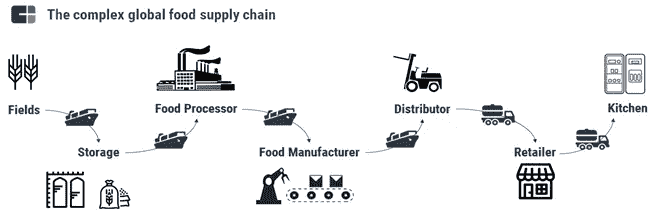
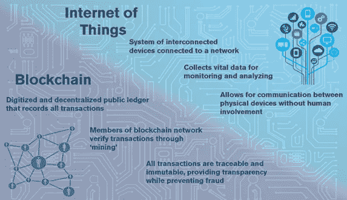
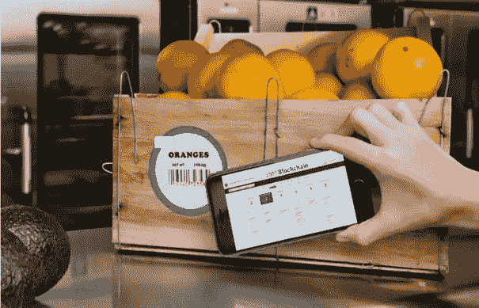
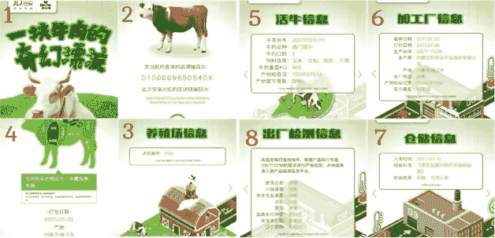
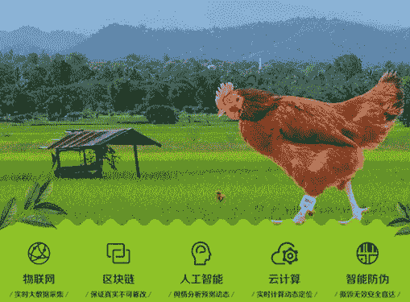

# 完善食品安全:中国如何利用物联网和区块链

> 原文：<https://medium.com/hackernoon/perfecting-food-safety-how-china-does-it-with-iot-and-blockchain-9948ceb7ce9c>

过去十年，食品安全一直困扰着中国，从 2008 年中国牛奶配方奶粉掺入三聚氰胺的丑闻，到 2014 年过期肉被供应给肯德基和麦当劳等快餐连锁店的毒肉丑闻。中国的规模和人口以及法规的缺乏使得假冒食品成为比其他国家更普遍的问题。尽管中国公民对此保持警惕，但许多人仍对解决方案持消极态度。

*An example of the food supply chain.* [*Source: CBINSIGHTS*](https://www.cbinsights.com/research/blockchain-grocery-supply-chain/)

食品行业的供应链异常复杂，涉及多次转手。许多领域都可能出错，但大多数问题主要出现在两个领域:食品加工和配送。在中国农村等不受监管的环境中，众所周知，肆无忌惮的供应商会走捷径，比如添加掺杂物，以提高成本竞争力，并创造更具吸引力的产品。食品分配过程中的不当处理是另一个令人关注的领域，包括运输过程中的温度差异和不良的卫生习惯。因此，中国食品生产商正在采用技术创新来证明其产品的价值，并重新赢得消费者的信心。

物联网和[区块链](https://hackernoon.com/tagged/blockchain)的出现将通过提供以下能力，使中国消费者能够跟踪和了解他们食物的来源:

1.  创建从农民和食品加工企业到消费者的交易审计跟踪
2.  在养殖、处理和配送过程中提供透明度和可见性
3.  收集以前未利用的数据进行分析，以改进耕作方法
4.  智能合同在相关方之间强制执行合同条款和责任。

积极宣传其产品来源的食品生产商给自己带来了竞争优势，并验证了相对于同类产品的价格溢价。通过将技术融入他们的产品，它增强了他们对有机或自由放养等社会元素的信任，并在消费者中建立了声誉和品牌忠诚度。

*A crate of oranges being scanned as part of a food safety blockchain pilot test.* [*Source: IBM*](http://www-03.ibm.com/press/us/en/pressrelease/53013.wss)

2016 年，沃尔玛与 IBM 和清华大学合作，在北京成立了食品安全合作中心，利用区块链技术改善食品跟踪。2017 年 5 月进行的一项[溯源测试](https://www.reuters.com/article/us-ibm-retailers-blockchain/nestle-unilever-tyson-and-others-team-with-ibm-on-blockchain-idUSKCN1B21B1)在 2.2 秒内追溯到一包芒果的原产地；使用传统方法需要 6 天 18 小时。2017 年底，合作范围扩大到 JD.com，成立了区块链食品安全联盟，旨在实现整个食品供应链的更大透明度。

沃尔玛负责食品安全和健康的副总裁 Yiannas 说:“通过记录向供应链输入数据的人的身份，这项技术消除了帮助食品欺诈猖獗的匿名性”。

*1\. “The wonderful journey of the beef.” 2\. The steak’s serial number and 64-digit alphanumeric code referring to the transaction. 3\. The farm that raised the cow was indexed as 1556\. 4\. The section of the cow, where it was processed, and its package date. 5\. The Simmental cow was three years old and fed a diet of corn, wheat, and straw. Na Qin was the vet that tended to it. 6\. It was slaughtered on July 2, and the steak was packaged on July 5 in Tongliao city in Inner Mongolia. 7\. It was put in the storage house on July 11\. 8\. The steak went through a series of tests to check whether it was contaminated with certain bacteria, and if the meat had good water content.* [*Source: Quartz*](https://qz.com/1031861/blockchain-could-fix-a-key-problem-in-chinas-food-industry-the-fear-of-food-made-in-china/)

中国第二大电商平台 JD.com(Alibaba)一直在探索区块链赋予食品生产商提供产品信息的能力。他们最近与内蒙古牛肉制造商 Kerchin 合作，让消费者能够跟踪冷冻牛肉的生产和交付。通过扫描包装上的二维码，可以检索区块链上记录的奶牛品种、体重和饮食以及农场位置等信息。自 2017 年 12 月以来，来自酒、茶和制药行业的 10 多个品牌加入了这个区块链项目。

*Left to Right: IoT, Blockchain, Artificial Intelligence, Cloud Computing and Anti-counterfeit Intelligence.* [*Source: iFeng News (凤凰网)*](http://news.ifeng.com/a/20170626/51323127_0.shtml)

中国保险科技巨头中安在线的科技子公司中安科技建立了一个以区块链为动力的平台来跟踪养鸡的整个过程。在与杭州物联网公司 Wopu 的合作中，物联网脚链被绑在鸡身上，它们生活的方方面面都被跟踪，从年龄和走到屠宰场的距离以及雇佣的物流提供商。所有数据都记录在区块链中，消费者可以通过移动应用程序查看。从脚链收集的数据还允许农民进行分析并改善他们的饲养方法；在物联网普及之前，农业技术不可能有重大突破。

阿里巴巴最近与普华永道(PricewaterhouseCoopers)以及澳大利亚和新西兰的食品供应商合作的区块链项目，旨在为其平台提供更高的产品完整性，这表明区块链在改善食品安全方面越来越受欢迎。

Another company that is worth mentioning is [KaoPu (Kao 铺)](https://yuedu.baidu.com/hybrid/column/5fc08b6e0812a21614791711cc7931b765ce7ba4), a food catering company that attempts to improve food safety through blockchain initiatives. By deploying a blockchain network into every point of its supply chain system (production, procurement, logistics) and incentivizing suppliers through the issuance of its own [cryptocurrency](https://hackernoon.com/tagged/cryptocurrency)- Sharecoin, KaoPu hopes to attract potential suppliers to join the network and form an ecosystem of trust and food safety.

## **向前移动**

麦肯锡公司预测，中国的中产阶级到 2022 年将达到 5 . 5 亿，其不断增长的消费阶层要求更高质量的产品和更好的食品安全。皮尤研究中心(Pew Research Center)2016 年的一项研究报告称，40%的中国公众认为食品安全是一个“非常大的问题”，[高于 2008 年的 12%](http://www.pewglobal.org/2016/10/05/chinese-public-sees-more-powerful-role-in-world-names-u-s-as-top-threat/10-4-2016-9-38-34-am-2/)。2015 年对江苏一家猪肉生产商的调查发现，自从实施[追溯系统](http://sd.china.com.cn/a/2015/spaq_0630/247323.html)以来，农民、肉类生产商和零售商的年收入分别增加了 38.2%、28.6%和 33.2%。随着中国走向“质量革命”，对价格不太敏感、更注重健康的消费者对有机农产品和“可追溯”食品的需求将会增加。

沃尔玛和 JD.com 等食品巨头由于其规模和研发投资，在部署区块链和物联网方面取得了显著的成功，但对于缺乏资源和能力的较小食品零售商来说，情况并非如此。尽管如此，中国一直在加强监管，并实施策略来帮助这些食品生产商和零售商。2015 年末修订的《食品安全法》对食品的生产和处理进行了更严格的控制和监督。2017 年 10 月，中国国务院发布了一系列促进创新的指导方针，以在 2020 年前建立覆盖主要行业的智能供应链。加上物联网和区块链在中国的快速商业化，毫无疑问，我们将在未来几年看到采用这些技术的成本降低。

区块链和物联网将颠覆全球主要行业，食品行业无疑将成为技术浪潮的一部分。随着中国在改善食品安全方面走在世界前列，世界各国应该采取一种学习或者“模仿”的心态，因为现在形势已经发生了变化。

…

> 大家好！我是一名交换生，目前在上海实习。作为一名科技爱好者，我对中国的科技进步感到震惊和兴奋。因此，我在写中国最新的科技事件。** **请评论并让我知道我可以在写作中改进的地方。谢谢！****