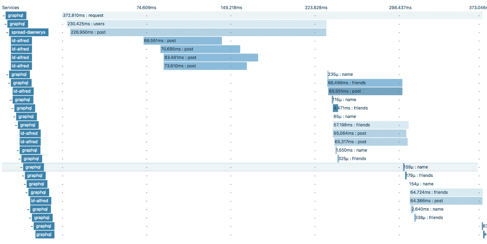

# 用 Apollo 及其朋友对 GraphQL 进行性能跟踪

> 原文：<https://medium.com/hackernoon/performance-tracing-for-graphql-with-apollo-and-its-friends-877adf733322>

通常，当您开发应用程序时，性能很重要。就感知性能而言，您拥有的最重要的资产是后端服务的响应时间。如果你使用 [GraphQL](https://hackernoon.com/tagged/graphql) 的话，它最有可能是在面向用户的应用程序之前出现的系统，所以当涉及到性能时，它应该是需要关注的核心部分。

如果你只使用一个 GraphQL 后端，并且没有其他后端系统，也没有前端在你的控制之下，请不要再往下读了。 [Apollo](https://hackernoon.com/tagged/apollo) GraphQL 为这个用例提供了内置的跟踪解决方案，他们的 [**性能分析**](https://www.apollographql.com/docs/engine/features/performance.html) 。它为您提供了许多关于 GraphQL 的见解，但只是关于 GraphQL，这就是为什么我想向您展示第二个选项，它允许您包括来自所有系统的性能数据:[**Apollo-opentracing**](https://github.com/DanielMSchmidt/apollo-opentracing)

# 入门指南

Apollo 提供了这个伟大的扩展概念，将横切功能引入到 GraphQL 服务器中。作为扩展的用户，您只需要将它作为返回扩展实例的函数添加到数组中。

在我们的例子中，我们用两个跟踪器启动了 [Opentracing](http://opentracing.io/) 扩展，一个用于 GraphQL 服务器内部跟踪，称为 local，另一个用于应用程序在其作为服务器的角色中接收的跟踪。

当 GraphQL 后端与 opentracing 兼容的跟踪器一起部署时，例如与 [Zipkin](https://zipkin.io/) 和[Zipkin-JavaScript-opentracing](https://github.com/DanielMSchmidt/zipkin-javascript-opentracing/)一起部署，您会得到一个开箱后的良好性能图，如下所示:

理想情况下，您还可以将您的前端添加为第一层，确切地看到哪个前端中的哪个动作花费了多长时间，并且进入了哪个系统。

有了这一点，组织中的每个人都可以很容易地对性能进行推理，新开发人员也可以通过探索软件系统来理解软件系统，同时还可以对每个服务的计时有所了解。

# 听起来不错，我还需要知道什么？

这里有一些小的见解，可以帮助你最大限度地利用这个扩展:

## 我可以使用哪些示踪剂？

据我所知，Javascript 有两个 Opentracing 跟踪器:

*   [**耶格**](https://github.com/jaegertracing/jaeger-client-node) 和[这是](https://blog.risingstack.com/distributed-tracing-opentracing-node-js/) [RisingStack](https://medium.com/u/558809ba0720?source=post_page-----877adf733322--------------------------------) 的一篇很棒的介绍文章
*   [**zipkin**](https://github.com/openzipkin/zipkin-js) 带 Opentracing 适配器[**zipkin-JavaScript-Opentracing**](https://github.com/DanielMSchmidt/zipkin-javascript-opentracing)**由我(所以如果文档不清楚，请告诉我！)**

## **费用是多少？**

**在性能跟踪中，您总是用实际性能来购买洞察力。不同的跟踪器可能有不同的性能特征，但是一般来说，它们需要发出 HTTP 请求来存储它们的跟踪数据，这至少会给系统带来一点压力。**

**追踪社区决定采用的方法是添加采样器的概念。采样器是决定是否应该真正跟踪跨度的函数。通过只跟踪一定比例的传入请求，您仍然可以获得足够的数据，使您可以轻松地对性能进行推理，而不会给所有客户带来压力。**

**在开发中，我总是以 100%的采样率工作，我想看看我的系统中发生了什么。**

## **在这里我能学到什么？**

*   **您可以了解性能跟踪(参见后续阅读)以及它为什么会对您有所帮助**
*   **通过查看 [apollo-opentracing](https://github.com/DanielMSchmidt/apollo-opentracing) 的非常简单的源代码，您可以了解 apollo 提供的所有 API，这些 API 用于挂钩解析 GraphQL 查询的不同生命周期事件**

## **进一步阅读**

**如果你对性能跟踪感兴趣，这里有一些我写的介绍性博文:**

*   **[前端性能监控—简介](/@dschmidt1992/performance-monitoring-for-the-frontend-an-introduction-e0ab422f131c)**
*   **[前端性能监控—使用 Zipkin](/@dschmidt1992/performance-monitoring-for-the-frontend-using-zipkin-bf3aa4a715e5)**