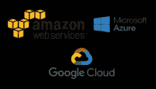
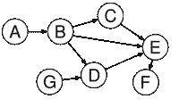
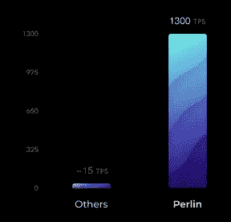
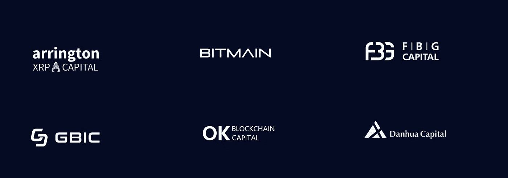

# 柏林——所有 FUD 背后的真正技术

> 原文：<https://medium.com/hackernoon/perlin-real-tech-behind-all-the-fud-567243cd373c>

[Perlin Network](http://perlin.net/) 是一个基于 DAG 的分布式分类帐，建立在 Avalanche consensus 协议之上。Perlin 的第一个应用是一个分散的计算层，它为任何需要计算能力的人提供计算资源。

在本文中，我们将忘记围绕该项目的所有 FUD，并分解[柏林](https://medium.com/perlin-network)，以更好地解释背后的技术和团队。

Perlin — a bleeding-fast ledger with a powerful compute layer.

# 为什么是柏林

目前的[区块链](https://hackernoon.com/tagged/blockchain)解决方案，如比特币、以太坊、Monero 等已经无法满足当前的需求，这对[加密](https://hackernoon.com/tagged/crypto)的大规模采用构成了巨大威胁。

除此之外，大多数货币使用的共识协议有许多负面影响。例如，比特币广泛使用的**工作证明**为了达成共识而浪费大量电力来执行复杂的计算。另一方面，以太坊正计划转向**利益证明**，尽管它很节能，但容易受到拒绝服务攻击。

这需要能够提供更好和更有效的共识协议的其他解决方案。

此外，许多初创公司、研究人员和小型企业面临的另一个主要问题是缺乏低成本的计算能力。各种行业中的许多关键参与者无法访问他们的项目或研究所需的计算资源。这可能会大大推迟许多生命关键的研究，如癌症的治疗。此外，有了传统的云计算，研究和技术的进步将只有那些足够富裕的人才能负担得起。

# 什么是柏林？

柏林试图解决共识和计算问题。它由两层组成

1.  **分布式分类帐** : *使用雪崩共识的高吞吐量 DAG*
2.  **分散式云计算市场:** *Perlin 是第一个实用的、不可信的分散式云计算市场，它利用日常智能设备中未得到充分利用的计算能力，使超级计算在全球范围内变得经济可行和可用*。

让我们更详细地了解分类账和市场。

# **柏林莱杰**

柏林的莱杰使用了最近由火箭队公布的 [**雪崩共识**](https://ipfs.io/ipfs/QmUy4jh5mGNZvLkjies1RWM4YuvJh5o2FYopNPVYwrRVGV) 协议。共识协议是基于[流言协议](https://en.wikipedia.org/wiki/Gossip_protocol)设计的。

为了简单地理解这一点，让我们以在工作场所传播谣言为例。如果我们随机挑选两个人，给他们一些信息，他们会把这些信息传播给其他几个人，而这些新人会把信息传播给其他几个人。这个循环继续下去，很快工作场所的所有人都知道了这个信息。

Avalanche consensus 使用相同的想法，通过随机选择节点集将信息传递给其他人来获得共识，经过几次循环投票过程后，整个网络达到共识点。这比传统共识机制快得多，且不浪费任何电力。

Directed Acyclic Graph (Credits : Wikipedia)

此外，分类账维护所有已知交易的动态只追加**有向非循环图** (DAG)。由于 DAG 是图形数据结构的实现，它允许将并行节点附加到分类帐。这使得 DAG 能够克服传统[区块链](https://hackernoon.com/tagged/blockchain)解决方案的许多限制。

这使得柏林拥有其他区块链的许多优势

1.  testnet 中约 1300 TPS
2.  能够在 Perlin 之上构建 dApps
3.  健壮且分散的一致性协议

# **分散式云计算市场**

Decentralized cloud computing.

构建在 Perlin 之上的第一个应用程序是分布式云计算市场。市场提供可用于执行大规模并行计算工作的计算资源。这个市场主要面向初创公司、小企业、研究人员、独立开发者等。

市场由三方组成

1.  **矿工**

矿工通过在柏林网络上注册他们的空闲计算资源来提供计算能力。矿工们根据他们出租计算资源的时间长短获得报酬

2.**客户**

客户是寻求租用计算能力的个人或组织。一旦客户根据他们对计算能力的要求找到了匹配，他们就可以 SSH 到 miner 的虚拟机，并在该虚拟机上执行他们的任务。

3.**验证器**

验证者达成共识，并通过分布式分类账记录矿工和客户之间的交易。验证者从他们验证和广播的交易的交易费中获得佣金形式的激励。

# 其他主要特征

**计算可用性证明:** Perlin 确保矿工在向客户出售计算资源之前证明他们拥有这些资源。它还使用矿工机器上的分散时钟来计算资源租出的准确时间。

**隐私:** Perlin 为客户提供 SDK，以保护运行在矿工虚拟机上的计算和数据的隐私和安全。

**成本:**由于客户大多使用商用智能设备，他们将能够以比谷歌、微软&亚马逊的传统云解决方案更便宜的价格获得资源。

性能: Perlin 可以通过使用更多的机器来执行一项任务，从而提供出色的速度、性能和效率。

# 代币

**PERL (ERC20)令牌**

**价格**

> 0.04 美元:种子销售(2017 年 12 月至 2018 年 1 月)——发行代币的 20%。
> 
> 0.12 美元:战略销售(2018 年 4 月至 2018 年 5 月)—已发行代币的 20%
> 
> 0.20 美元:私人销售(2018 年 6 月至 2018 年 7 月)——代币发行量的 7.5%。

*截至这篇评论发表之日，大规模销售的细节尚未公布。*

# 组

从论坛上的讨论和我个人的研究来看，这个项目似乎是由 [**Kenta Iwasaki**](https://www.linkedin.com/in/dranithix/) 提出的，他是一个非常强大和有才华的工程师，在分布式系统、密码学、信号处理、数学、统计和机器学习方面有着丰富的研究背景

在这一点上，还不清楚是否所有其他的工程师只是兼职的贡献者或者是全职的。

# 投资者

柏林已经设法得到了密码领域许多大投资者的关注和投资。这些是柏林的一些主要投资者。

# 摘要

尽管在过去的几个月里，围绕着这个项目，围绕着不同的投资轮次和提供给投资者的价格，出现了各种各样的 FUD，但技术似乎非常扎实。

Avalanche consensus 是许多许多年来出现的第一个共识协议，Perlin 勇敢的相信了它，更重要的是在他们的项目中使用了它。这也让他们面临使用未经测试的协议的风险。

柏林最近开源了他们的分散式 P2P 库 [Noise](https://github.com/perlin-network/noise) 证明了在幕后有严肃的开发工作在进行。

我对这个项目感到非常兴奋，并相信如果这个项目能够兑现承诺，它就能在这个已经拥挤的分散云计算市场中脱颖而出。

请告诉我你对这个项目的看法。

在 Twitter 上关注我 [@maverick_crypto](https://twitter.com/maverick_crypto)

*PS:听到你的反馈很重要。如果你喜欢这篇评论，请* ***评论*** *或* ***鼓掌*** *。还有，想聊就给我发邮件到****Sam(at)maverick crypto . com****！*

*免责声明:MaverickCrypto 不是注册投资顾问、经纪人/交易商、金融分析师、金融银行、证券经纪人或理财规划师。这些信息仅供参考。这些信息不是也不构成财务建议或任何其他建议，本质上是一般性的，并不针对您。*

在做出任何投资决定之前，请务必做好自己的研究。