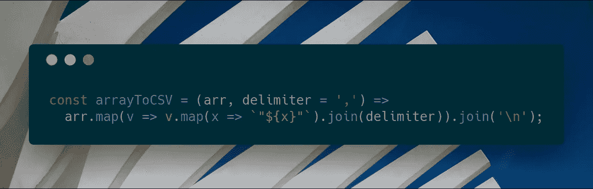
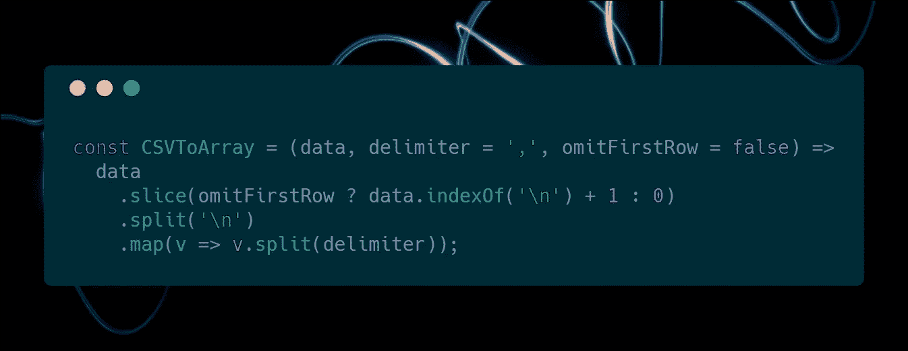
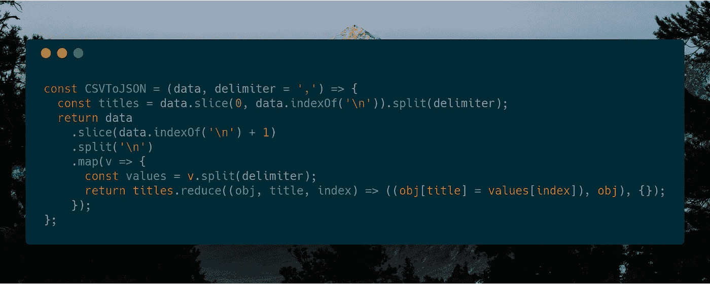
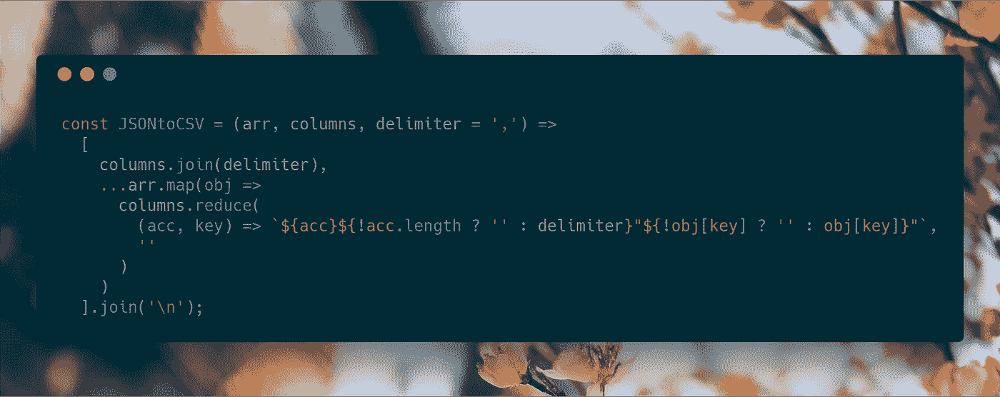

# CSV 的持久 JavaScript 存储

> 原文：<https://medium.com/hackernoon/persistent-javascript-storage-with-csv-accdf52512b0>

虽然大多数程序员认为 JSON 是持久存储 JavaScript 数据的首选文件格式，但使用其他格式存储数据仍然有价值。CSV 是已经存在很长时间的格式之一，在大多数情况下使用起来非常简单。然而，虽然 JavaScript 提供了原生方法来序列化和反序列化 JSON 对象(`[JSON.stringify()](https://developer.mozilla.org/en-US/docs/Web/JavaScript/Reference/Global_Objects/JSON/stringify)`和`[JSON.parse()](https://developer.mozilla.org/en-US/docs/Web/JavaScript/Reference/Global_Objects/JSON/parse)`)，但是 CSV 文件没有这种内置功能，因此在本文中，我将尝试在 ES6 中实现上述功能。

## 将数组转换为 CSV 格式

为了将 CSV 与 JavaScript 结合使用，我们需要编写的第一段也是最简单的一段代码是将 2D 数组转换为 CSV 文件的序列化程序:

Image by [Daniel Funes Fuentes](https://unsplash.com/@danifunes?utm_source=carbon&utm_medium=referral) on Unsplash

上面的代码非常简单。它使用`[Array.map()](https://developer.mozilla.org/en-US/docs/Web/JavaScript/Reference/Global_Objects/Array/map)`和`[Array.join()](https://developer.mozilla.org/en-US/docs/Web/JavaScript/Reference/Global_Objects/Array/join)`将每个子数组组合成一个字符串，根据提供的`delimiter`分离值，然后再次使用`[Array.map()](https://developer.mozilla.org/en-US/docs/Web/JavaScript/Reference/Global_Objects/Array/map)`和`[Array.join()](https://developer.mozilla.org/en-US/docs/Web/JavaScript/Reference/Global_Objects/Array/join)`创建一个多行字符串，我们的 CSV 输出，包含所有数组的数据。

## 将 CSV 转换为数组

序列化一个数组很容易，但是假设您有一个 CSV 文件，并希望将其转换回数组。在这种情况下，您需要一个反序列化器来反转上述过程:

Image by [Ronald Smeets](https://unsplash.com/@ronaldsmeets?utm_source=carbon&utm_medium=referral) on Unsplash

这里的程序基本上与前面的相同，但方向相反。使用`[String.split()](https://developer.mozilla.org/en-US/docs/Web/JavaScript/Reference/Global_Objects/String/split)`将文件分成行，然后根据提供的`delimiter`使用`[String.split()](https://developer.mozilla.org/en-US/docs/Web/JavaScript/Reference/Global_Objects/String/split)`第二次将文件转换成单独的值。最后一点是允许用户决定是否要省略第一行，因为有时 CSV 文件使用第一行来存储列名。

## 将 CSV 转换为对象数组

根据上面代码片段的最后一句话，我们可以很容易地找到一种方法，将 CSV 文件转换为对象数组，使用第一行作为属性名:

Image by [Jeremy Bishop](https://unsplash.com/@tentides?utm_source=carbon&utm_medium=referral) on Unsplash

现在事情变得越来越复杂了。显然，我们要做的第一件事是从第一行获取属性名称列表，类似于我们之前所做的，使用`[Array.slice()](https://developer.mozilla.org/en-US/docs/Web/JavaScript/Reference/Global_Objects/Array/slice)`。然后是对象创建部分，这是使用`[String.split()](https://developer.mozilla.org/en-US/docs/Web/JavaScript/Reference/Global_Objects/String/split)`和`[Array.map()](https://developer.mozilla.org/en-US/docs/Web/JavaScript/Reference/Global_Objects/Array/map)`完成的，就像我们之前做的一样。唯一的主要区别是，我们使用`[Array.reduce()](https://developer.mozilla.org/en-US/docs/Web/JavaScript/Reference/Global_Objects/Array/Reduce)`为 CSV 文件中的每一行值创建一个具有适当键值对的对象。瞧啊。我们有一个数组，里面装满了我们现在可以使用的 JavaScript 对象。

## 将对象数组转换为 CSV 格式

最棘手的部分来了——序列化对象数组。为什么这是棘手和复杂的？因为有时对象的属性数量不同，或者属性的顺序不同。这在试图序列化为 CSV 这样的统一结构时会产生一些问题。

有很多方法可以弥补这一点，比如对结构做出某些假设，确保对象具有相同数量的属性等等。，但我能编写的最通用的函数要求开发人员指定哪些属性需要序列化:

Image by [Leonardo Wong](https://unsplash.com/@nardoleo?utm_source=carbon&utm_medium=referral) on Unsplash

看起来可能不多，但这里发生了很多事情。首先，我们需要为 CSV 字符串创建一个行数组，并将第一行设置为我们希望从对象数组中序列化的属性列表。然后，我们使用`[Array.map()](https://developer.mozilla.org/en-US/docs/Web/JavaScript/Reference/Global_Objects/Array/map)`和`[Array.reduce()](https://developer.mozilla.org/en-US/docs/Web/JavaScript/Reference/Global_Objects/Array/Reduce)`来创建每一行，属性按正确的顺序排列，不存在的属性为空值。最后，我们使用扩展操作符(`[…](https://developer.mozilla.org/en-US/docs/Web/JavaScript/Reference/Operators/Spread_syntax)`)和`[Array.join()](https://developer.mozilla.org/en-US/docs/Web/JavaScript/Reference/Global_Objects/Array/join)`输出一个多行 CSV 字符串。

## 考虑和改进

虽然这是一个关于如何将 CSV 与 JavaScript 结合使用的快速指南，但是对于这种数据类型还可以做更多的事情。请注意，上面的所有代码片段都没有完全优化，可能无法处理边缘情况，因此可以从那里开始。另一个问题是序列化和反序列化之间有一点不一致，所以这也可以解决。最后，嵌套的对象或数组不能用这些代码片段序列化，CSV 本身不支持它们，所以可以创建用于嵌套的定制数据结构来处理这个问题。

*我希望你喜欢这个小指南。如果你看到了，请给我一个或五十个掌声！本文中的所有源代码都可以在 GitHub* *上的* [*30 秒代码库中找到，还有更多满足您日常需求的 JavaScript 代码片段。*](https://github.com/Chalarangelo/30-seconds-of-code)