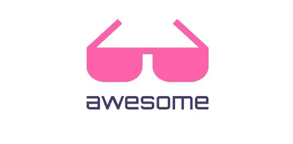
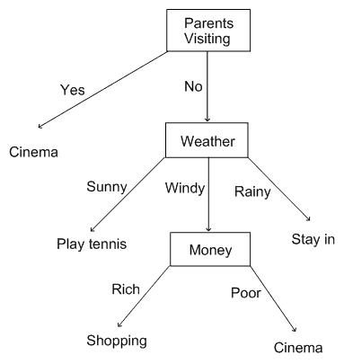
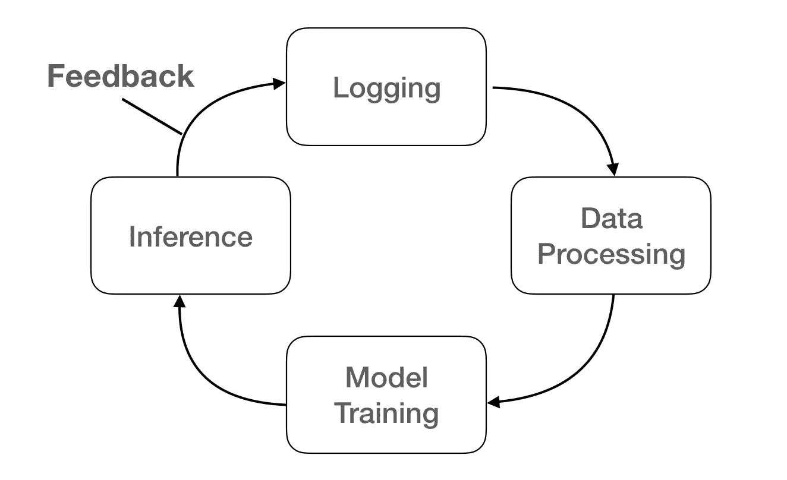

# 个人助理 Kino 第 4 部分—智能提要

> 原文：<https://medium.com/hackernoon/personal-assistant-kino-part-4-smart-feed-b9e4cab966>

> Kino 是一个通过量化的自我来了解自己的项目，将事情自动化以重复并提高生活质量。


From : [http://quantifiedself.com/](http://quantifiedself.com/)

Kino 系列列表

*   [个人助理 Kino 第 1 部分—概述](https://chatbotslife.com/personal-assistant-kino-part-1-overview-496b97de4afd)
*   [私人助理 Kino Part 2——技能&调度器](https://chatbotslife.com/personal-assistant-kino-part-2-skill-scheduler-3cf25070fe8e)
*   [个人助理 Kino 第 3 部分— T3](https://hackernoon.com/personal-assistant-kino-part-3-t3-d078b65462be)
*   [个人助理 Kino 第 4 部分—智能馈送](/@humanbrain.djlee/personal-assistant-kino-part-4-smart-feed-b9e4cab966)

在上一集，我们看了任务管理器的功能，它可以自动记录和报告任务。今天我要讲的是**智能饲料**。

# 简单讯息聚合订阅

rss 指的是使用许多网站提供的 RSS 发布新文章时要通知的网络提要。我将简单介绍一下 RSS。

> **RSS** ( **丰富的站点摘要**；原 [**RDF**](https://en.wikipedia.org/wiki/Resource_Description_Framework) **站点概要**；通常被称为**真正简单的聚合**)是一种[网络订阅源](https://en.wikipedia.org/wiki/Web_feed)[【2】](https://en.wikipedia.org/wiki/RSS#cite_note-Netsc99-2)允许用户以标准化的、计算机可读的格式访问[在线内容](https://en.wikipedia.org/wiki/Online_content)的更新。
> —来自维基

基本上很多网站都提供 RSS。有很多服务使用这个。其中一个是名为 [Feedly](https://feedly.com/) 的服务。如果你注册了经常看的网站，你就可以很容易地查看新文章。我很好地使用了这项服务，但它并不支持我想要的所有功能。

# 口袋

而我用的另一个服务是[口袋](https://getpocket.com/)。这个服务做的很简单。

> 当你找到你以后想看的东西时，把它放在口袋里。
> —口袋

如果你有一篇文章想以后看，你可以把它放在口袋里。我经常把看起来有趣的文章放在口袋里。然后我会阅读它，如果它真的很好，我会把它移到最喜欢的类别。

# 智能订阅源

我想自动化我的模式，检查新文章，把它们放在口袋里，仔细阅读，并转移到最喜欢的类别。这就是为什么创造了智能饲料功能。



首先，这个函数需要 RSS urls。因此，它可以读取 RSS 并获得一篇新文章，您会得到通知。所以我做了一个[牛逼-feeds](https://github.com/DongjunLee/awesome-feeds) 库。我以为用 Git 管理我喜欢的网站的 RSS 会很方便，我想用很多好的 RSS 做牛逼系列。

现在 RSS 已经准备好了，只要让我知道最新的文章什么时候发表就行了！
我在这里使用了 [feedparser](https://github.com/kurtmckee/feedparser) 。

```
f **=** feedparser**.**parse(feed_url)f**.**entries **=** sorted(
    f**.**entries, key**=lambda** x: x**.**get("updated_parsed", 0), reverse**=**True
)*# get Latest Feed*
noti_list **=** []
**if** feed_url **in** cache_data:
    previous_update_date **=** arrow**.**get(cache_data[feed_url])
    **for** e **in** f**.**entries:
        e_updated_date **=** arrow**.**get(e**.**updated_parsed)
        **if** e_updated_date **>** previous_update_date:
            noti_list**.**append(self**.**__make_entry_tuple(category, e, feed_name))
```

调度功能可以指定功能的调度，如[第二部分技能&调度器](https://chatbotslife.com/personal-assistant-kino-part-2-skill-scheduler-3cf25070fe8e)中所述。每分钟检查一次提要是很大的开销。我测试的时候觉得间隔 20 分钟就够了。

```
**def** **__excute_feed_schedule**(self, interval):
    schedule**.**every(interval)**.**minutes**.**do(
        self**.**__run_threaded,
        self**.**function_runner,
        {
            "repeat": True,
            "func_name": "feed_notify",
            "params": {},
            "day_of_week": [0],
            "not_holiday": False,
        },
    )
```

现在 Kino 可以通知最新的 RSS 提要了。它已经很有用了，但是有一个功能我想更进一步。自动保存我已经信任放在我的口袋里的文章！

它需要与 Pocket 连接，使用简单的分类算法可以使它更加智能。机器学习最重要的是**数据**。这些数据可以用原始日志创建。首先，您可以查看所有的文本通知您与饲料功能作为整个数据。如果只有存储在口袋中的文本被赋予值 1，则整个数据被分成*感兴趣的文本* /不感兴趣的文章*。此外，如果你给出文章的类别或网站名称作为信息，你可以创建一个简单而有用的**决策树**。*

**

*Decision Tree From [http://ccg.doc.gold.ac.uk/](http://ccg.doc.gold.ac.uk/)*

*例如，当一篇新文章发表在谷歌人工智能博客网站上时，如果我总共看到了五篇这样的文章，并且我已经将其中四篇保存在 Pocket 中，那么它也可以被视为感兴趣的内容。*

*您可以通过 [scikit-learn](http://scikit-learn.org/) 轻松使用决策树。*

```
***class** **FeedClassifier**:
    **def** **__init__**(self):
        train_X **=** FeedData()**.**train_X
        train_y **=** FeedData()**.**train_y

        model **=** tree**.**DecisionTreeClassifier()
        model**.**fit(train_X, train_y)  *# Training*
        self**.**clf **=** model **def** **predict**(self, link, category):
        result **=** self**.**clf**.**predict(category_id)[0]
        **if** result **==** FeedDataLoader**.**TRUE_LABEL:
            **...**
        **else**:
            **...***
```

# *在线学习*

*接下来重要的是**在线学习**。我放在口袋里的 rss 提要那时会改变。作为响应，模型还必须检测这些变化，并用最新的信息做出判断。使用的方法是在线学习。*

> *通过不断向模型应用新数据，使模型保持最新*

*Kino 的智能饲料通过这种方式变得越来越智能。通过创建如下循环，在线学习是可能的。*

**

1.  ***记录:**
    通知饲料的所有数据，其中饲料放入口袋*
2.  ***数据处理:**
    解析日志，用类别、标题、日期、链接等进行处理。
    并添加标签。(0:不放入口袋/ 1:放入口袋)*
3.  ***模型:**
    将准备好的数据拟合到模型中。(培训)*
4.  ***预测:**
    利用训练好的模型，确定新饲料是否放入口袋。然后，为模型的错误预测提供反馈，以便存储正确的标签。*

*如果实时学习是一个瓶颈，那么可以每天重新学习一次。*

# *结论*

*这是**智能进纸**功能。非常简单，但是非常有用的函数。现在，更复杂的预测，因为它仅仅基于放在口袋里的数。
在[未来](https://hackernoon.com/tagged/future)中，我将尝试预测是否是我感兴趣的提要，作为*文本分类*问题，按标题或简介。就*文本摘要*而言，它或许能很快为我创建一个提要。我认为智能饲料功能的发展潜力是开放的。让我们收集大量数据，用深度[学习](https://hackernoon.com/tagged/learning)模型代替！*

*所有代码都可以在这里找到[。任何帮助 Kino 变得更聪明的人总是受欢迎的:)](https://github.com/DongjunLee/kino-bot)*