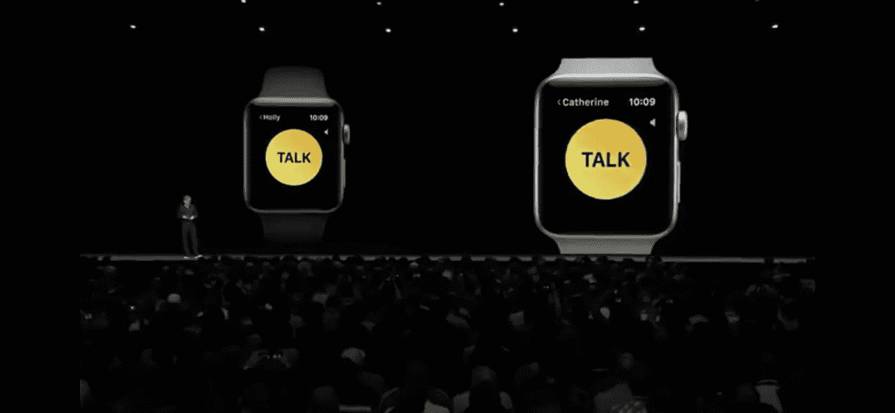

# 个人通信对苹果来说仍然至关重要

> 原文：<https://medium.com/hackernoon/personal-communications-are-still-critical-for-apple-73c3d1e8be04>

## 2018 年 WWDC 发布的公告强调了许多有望在苹果设备用户中创造网络效应的新功能。

上周，苹果公司举行了年度开发者大会，WWDC 2018。在其主题演讲期间，他们公布了新版本的操作系统(iOS、WatchOS、TV OS 和 macOS)。

媒体的总体看法是，这些都是小版本(iOS 12 甚至被一些人称为[“iOS 11.5”](http://bgr.com/2018/06/05/ios-12-beta-download-features-review-meh/))，没有太多新功能。

考虑到这一点，也由于我通常专注于个人通信，我发现为数不多的新功能中有多少是围绕着那个领域的，这真的很有趣。

# 信息发送

例如，主题演讲中最有趣的时刻之一是关于苹果对其信息应用的改进，这要归功于他们与相机的 Animoji/Memoji 集成。现在，iPhone 用户可以创建一个个性化的头像，可以实时跟随他们的表情，并使用它通过 iMessage 发送图像和视频。

有趣的是，这个功能并不真的需要与 iMessages 相关联。苹果本可以将这一点融入原生相机功能，并向开发者开放，这样任何现有的应用程序(从 WhatsApp 到 SnapChat、Instagram 或 HouseParty)都可以立即从中受益。

但通过将其保留在消息中，这种方法成为 iPhone 与 iPhone 通信的一种区分，尤其是仅适用于高端机型(Animoji 仅适用于 iPhone X，我猜今年秋天会有新设备发布)。我相信这是苹果用户内部的一种“拉动效应”,以升级他们的设备来访问这一新功能，创造网络效应。苹果将他们专有的[通信](https://hackernoon.com/tagged/communication)服务视为更新周期中的一个激励因素，这一事实也使得他们不太可能在任何时候冒险考虑 RCS 支持。

# 群组 Facetime

Group FaceTime 已经被期待了很久，w [甚至在 iOS 11](https://www.cultofmac.com/463640/ios-11-expected-to-bring-facetime-group-calls/) 中也被期待，所以这并不是一个大惊喜。真正有趣的是允许多达 32 人进行一次通话的决定(这是一项技术壮举，我希望在未来读到更多)，以及为此设计的特定用户体验。呼叫以浮动方块呈现，代表参与者，图像移动并调整大小，以突出显示在任何给定时间当前正在发言的人。

不仅如此，发言者还可以用实时动画代替他们的脸！(同样，将这一特性保留在苹果对苹果的通信围墙花园内)。

他们还评论了我认为至关重要的一点，那就是群组通话的体验将会从 iMessages 中自然产生。通过这种方式，群组聊天将能够转变为群组实时对话(音频或视频)，并且正在进行的对话的信息将被呈现，以便人们可以稍后加入。我认为这种流畅的交流方式，能够动态升级到更沉浸式的体验，或者回到不太专注的体验，是非常重要的。实际上，iOS 今天显示的拆分应用程序(消息、电话、FaceTime 甚至联系人)只是以相同体验结束的快捷方式。

一旦我可以让一些朋友进入 iOS 12，我将测试通知模式是什么，看看行为是否感觉更像是“房间”而不是电话。

但这里的要点是，群体中的网络效应比一对一的沟通更困难，因为在对话中每个人都希望成为 iPhone 用户，这更复杂。因此，我仍然认为这是为用户迁移到苹果创造社交压力的一种方式，但我也预计，一旦跨生态系统(iPhone 和 Android)应用程序可以提供类似的体验，group FaceTime 的使用将变得微不足道。所以我想**这将会是一段时间内的差异化，直到它成为 WhatsApp 的灵感来源，并且具有这种便利体验的群组视频通话可以在每种设备上使用。**

# 步话机

作为 WatchOS 5 演示的一部分，通信体验非常重要。事实上，Apple Watch 被描述为关注两个维度:

*   活动跟踪
*   与他人保持联系

对于第二个维度，到目前为止，Apple Watch 支持通话(通过连接的 iPhone 或使用其 LTE 连接进行蜂窝模式)，以及消息传递(即使是第三方应用程序)。

但在 Watch OS 5 中，苹果为设备增加了一个新的通信选项:对讲机。

实际上这个特性在很久以前就已经发布了，直到现在才发布。我的猜测是，在手机版手表问世之前，这可能是一个无法实现的对用户的承诺，而现在苹果可以利用它来增加手表的价值，作为一种独立的([无手机](https://hackernoon.com/the-lte-apple-watch-virtuous-cycle-for-a-new-ecosystem-a9211c608f54))体验。

我原本预计苹果会宣布 Apple Watch 的 CallKit 扩展，这样用户就可以从手腕上接听 WhatsApp 的电话，并最终在手表的蜂窝版本中实现 VoIP 通话。事实并非如此，可能是因为带有“一键通”功能的短录音是一种更友好的电池解决方案，而电池仍然是 Apple Watch 的主要限制。

除了推动独立 Apple Watch(无束缚)的价值，这种能力也可能是一个借口，可以通过运营商销售没有正常语音通话功能的蜂窝手表，[，我仍然认为由于其复杂性，这种功能正在放缓采用](https://hackernoon.com/why-most-apple-watch-users-will-not-get-lte-calls-on-it-and-why-some-will-2e7a39aad379)。

# 作为生态系统工具的通信

总的来说，很明显，对于苹果来说，个人通信是一种工具，可以让他们区分自己的设备，提供与朋友和亲人联系的社交和情感方面相关的酷因素(只要想想对讲机演示实际上是一位母亲与她的孩子交谈)，并通过将人群留在苹果生态系统中产生网络效应，并产生升级旧设备的激励。

因此，我们可以期待苹果在这一领域不断创新，不断推出只适用于苹果对苹果通信的功能。