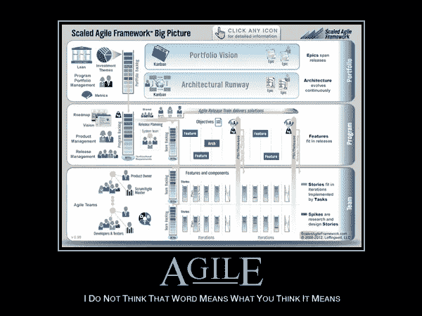

# 敏捷的个人经历:16 条评论、图片和一个关于实际应用敏捷的视频

> 原文：<https://medium.com/hackernoon/personal-experiences-with-agile-16-comments-pictures-and-a-video-about-practically-applying-agile-8bd710b0f6c3>

我收集了一些人们将敏捷付诸实践的个人经历。结构化的作品很棒。敏捷大师们的意见和指导绝对是有帮助的。但是，这些需要通过案例研究和前线人员将最佳实践付诸实践的个人故事来平衡。

这些来自前线的故事将真正帮助你推进你自己对敏捷意味着什么以及如何应用敏捷的观点。

当把这些引用、评论、图片和简短的总结放在一起时，我们从所有不同的角度寻找了关于敏捷的各种各样的经验。这里的想法是让人们真正了解敏捷是如何被应用的。我们并不试图提出任何特定的观点。

所以，开始了。16 条关于应用敏捷的评论，不分先后。

## 伊恩·米尔[提供了敏捷](https://zwischenzugs.com/2017/10/15/my-20-year-experience-of-software-development-methodologies/)的深刻哲学观点，引导了智人

*‘提出有用的软件方法论并不容易。困难不在于定义它们，而在于说服其他人遵循它们。软件开发的大部分历史都围绕着这个问题:如何说服工程师相信关于需求收集、故事点、燃尽图或积压整理的有效性的特定故事？然而，当它被采用时，它给了组织巨大的力量，因为它使分散的团队能够合作并为交付而努力。试着想象一下，如果我们只能谈论具体的技术挑战，创建微软、谷歌或 IBM 会有多困难。*

所以我没意见。精益，敏捷，瀑布，无论什么，事实是我们需要某种共同的意识形态来大量合作。他们中没有一个是邪恶的，所以这不像你选择种族主义而不是社会主义什么的。无论你选择哪一个都不能反映现实，但是如果你期待完美，你会失望的。注意你自己是否有未说出口或未表达清楚的集体虚构。你的生活充满了他们。你的意见很重要。忍不住引用智人关于我们和小麦关系的这段话:

> 智人的身体并没有进化成[种植小麦]。它适应了爬苹果树和追瞪羚，而不是清除岩石和提水桶。人类的脊椎、膝盖、脖子和拱门为此付出了代价。对古代骨骼的研究表明，向农业的过渡带来了过多的疾病，如椎间盘突出、关节炎和疝气。此外，新的农业任务需要太多的时间，人们被迫永久定居在他们的麦田旁边。这完全改变了他们的生活方式。我们没有驯化小麦。它驯化了我们。“驯化”一词来自拉丁语 domus，意思是“房子”。住在房子里的是谁？不是小麦。“是智人，”也许我们不在这里指导代码，但是代码在指导我们。谁在损害增长代码的理由和逻辑？不是代码。是智人。

## [“为什么很多开发人员不喜欢敏捷？”](https://news.ycombinator.com/item?id=12061192)关于黑客新闻:

我不会在这里重复整个思路，但这里有一些黄金评论，强调了人们应用和思考敏捷的不同方式。

**凯撒普罗**说:

> *敏捷的要点是“人而不是过程”,但是因为在我的公司，我们有专业的 scrum 大师，所以一切都必须非常敏捷。*
> 
> 这意味着我们必须每天站立。我们必须有复古，我们必须有规划。
> 
> 一周几乎有半天时间浪费在无意义的会议上。我只想继续我的工作。相信我使用票务系统来找出我在做什么，并提出阻塞问题。

**扎阿尔法**回复 KaiserPro:

> 这意味着我们必须每天站立。我们必须有复古，我们必须有规划。
> 
> 这些仪式中的每一个都有价值。
> 
> 仅仅因为你在一个关着门的黑暗房间里安静地、独自地、快乐地编写代码，并不意味着每个人都是如此。
> 
> *我还没有看到一个敏捷商店不受益于站立来保持团队的协调和正轨。追溯是自我管理和过程细化/迭代的论坛。*
> 
> *此外，为了完成工作，除了开发人员之外的利益相关者也需要其中的一些仪式(比如 sprint planning)。因为，信不信由你，编码员事实上并不是宇宙的中心。*
> 
> 一周几乎有半天时间浪费在无意义的会议上。我只想继续我的工作。
> 
> *哇，等等，瓦特？你 90%的时间显然都花在了编码上，这对你来说是个问题吗？你知道，从某种意义上来说，这开始听起来像是一种过度的权利感……*

**eldavido** 说:

> 我是开发经理。我们使用敏捷，它为我们工作，人们很高兴。你所要做的就是列出一个巨大的清单，列出所有要做的事情，确保人们在正确的事情上做得足够多，并使用适当的设计水平——有时一点点，有时更多。
> 
> 我认为最困难的事情是让商业利益相关者摆脱“固定项目”的思维定势:这是我们想要的，这是我们有多少钱，这需要多长时间/花费多少？真正的问题应该是，考虑到我们现有的预算，我们应该首先做什么，才能最大限度地帮助企业？
> 
> 此外，开发人员应该被视为成年人。没有“计划扑克”，每天被迫站立，或任何废话。只需在问题跟踪系统中保持你的故事更新，迭代交付，并继续发货。
> 
> 很多归咎于敏捷的事情让人感觉像是糟糕的组织政治/糟糕的利益相关者管理。

**兰德拉**说:

> 我认为这里的许多评论者都没有理解这个短篇故事的主旨。
> 敏捷有利于初创公司在他们还没有已知产品/市场适合度的情况下开发产品。在那种情况下是可以理解的。
> 
> 我的一个客户用它来减轻自己对第三代系统的前期设计负担，这是众所周知的，可以很容易地用瀑布来构建。已经有过两次(我称之为)错误的开始。我不明白为什么敏捷在这种情况下是有益的。

## 迪夫·托马斯做了一个题为“敏捷已死”的演讲

敏捷宣言的创始人之一戴维·托马斯做了一个题为“敏捷已死”的演讲。他提出了一个关键点“敏捷已经被吸收进了它从来没有打算成为的东西”。

## Toggl 关于敏捷和其他方法的信息图

## 来自一个[敏捷作者詹姆斯·肖](https://www.reddit.com/r/agile/comments/264sgx/i_am_james_shore_author_of_the_art_of_agile/)

一位从事大约 500 万行代码系统工作的评论者 **Joehunk** 说:

> 你提到了一些激起我兴趣的事情:“你需要能够运行你的测试……”(强调你的)。对于任何给定的组件或特性，定义什么样的测试是“你的”测试是一个很大的挑战，因为我们测试套件的很大一部分是覆盖系统大部分的集成测试。
> 
> 这一直是我们的主要挑战:对于这样一个大的产品，我们如何平衡你从单元测试中得到的杠杆作用和对整个集成产品处于良好状态的信心的需要？您是否有过这样的经验/例子:必须采取双管齐下的方法，单元测试允许开发人员快速测试单个组件，而系统测试确保集成产品的功能？

有一个来自 **jaybazuzi** 的有趣回复:

> 首先，从集成测试(速度慢、脆弱、难以诊断)转向优秀的单元测试(速度快、可靠、能马上指出问题所在)的想法有一些明显的局限性。
> 
> 当然，我可以独立地为每一部分编写单元测试，特别是如果我在测试期间引入模拟来分离组件的话。最终的测试将会更快(它们执行更少的代码)，它们将会更可靠(改变组件 A 不需要中断对组件 B 的测试)，并且它们将会更容易诊断(对 X 的失败测试表明了 X 中的问题，而不是其他地方的问题)。
> 
> 但是我不会像在集成测试中那样，对我的系统的正确性有同样的信心。我可能知道 A 通过了 A 的测试，B 通过了 B 的测试，但我不知道 A & B 完全同意他们的合同。(换句话说，如果我用 B 的一个 mock 来测试 A，我不知道 BMock 对 B 有保真度)。
> 
> 这听起来像是一个很难的测试问题。但是在 TDD 中，答案不是“更加努力地测试”。这是“重构以简化测试”。

稍后来自 **aaronbjork** 的真知灼见:

> 我认为关键是找到方法让你的团队做他们知道必要的事情…但仍然保持作为一个组织的“联系”。这不是关于状态更新和驱动燃尽图。而是关于积压工作的真正对话。我看到的大多数努力扩展敏捷的人都试图“管理”敏捷团队。这就是他们弄错的地方。让你的团队自己管理自己，然后围绕下一步做什么以及为什么重要与他们交谈。

在会议固定日期从 **cory_foy** 出发:

> 有一句谚语说“敏捷”中不能有固定的日期——但这是一种谬误。目标是从满足他们需求的最小的开始，然后从那里开始构建，不断地审查工作软件。
> 
> 此外，为了赶上日期，您仍然需要紧密的协作、频繁的检查和高可见性——所有这些都是具有良好敏捷性的项目的特征。我们有超级碗广告的项目，以及其他重要的营销日期——因为敏捷的原则，满足它们从来没有问题。
> 
> 现在，像“Scrum”这样的东西适合你正在做的事情吗？也许——这取决于你如何分解你的工作。如果你不想把事情分成一周一次的小块，看板可能更适合。但是不管使用什么方法——都有值得研究的好东西。

## [敏捷软件开发过程:90 个月的进化](https://www.targetprocess.com/articles/agile-software-development-process-90-months-of-evolution/)

软件公司 targetprocess 的创始人 Michael Dubakov 写了一篇文章，详细介绍了他们在敏捷方面的发展。它详细描述了敏捷如何在他们的公司中发展。

这篇文章绝对值得一读，但以下是关键要点:

*   他们自然地从迭代转移到看板
*   他们用产品委员会取代了产品负责人。
*   他们有评估，去掉评估，然后再买回来
*   他们发现越小的用户故事越好
*   随着时间的推移，他们放弃了 TDD 和结对编程。

## 如何让冲刺规划会议不那么乏味？

来自 **bongunk** :

> 你根本不应该在 sprint 计划会议上做评估！
> 
> 评估是深度积压的要素之一。深度代表足够详细、估计和优先排序。细节来自分析师，评估来自整个团队，优先级来自 PO。
> 
> 因此，您应该在待办事项细化/整理会议期间进行评估。在这里，您评估高优先级(接下来的 3 个冲刺)项目，这些项目足够详细，可以进行评估。
> 
> 只有深度问题才应该由采购订单提交到冲刺计划会议上。PO 的责任是让 backlog 进入这种深度状态(显然是在分析师和团队的帮助下)。没有细化的 backlog 的 Sprint 计划是一个非常令人沮丧的过程。
> 
> 我在新团队中看到的最大问题之一是低估了一个适当整理的 backlog 的重要性。这对于 scrum 的成功至关重要，它需要投入适当的时间来进入状态。
> 
> 在 2 周的冲刺中，我至少会花 4 个小时来梳理积压的工作。我发现最好分成 4 个半小时的时段，否则会让人筋疲力尽。

## 一年 scrum 经验后我的看法

从**扬·德波尔**那里拿了几件:

> 一年或 scrum 经验后我的看法并不积极。Scrum 几乎就像一个有着神圣规则的宗教。Scrum 对我来说似乎很吵。Scrum 在这里是对上层管理人员的市场销售论证。我不喜欢的另一件事是总是在适合 sprint 的故事中分割内容。有时我喜欢在我感兴趣的主题上多花点时间。但我做不到。为什么？这不是 scrum。scrum 是神圣的。

## 为什么敏捷尤其是 scrum 很糟糕

下面是摘自迈克尔·欧彻奇关于敏捷的帖子:

> 敏捷两周迭代(或“冲刺”)和用户故事的问题是没有退出策略。没有“一旦我们实现[X]”条款，我们就不必这样做了。它被设计成永远存在:业务驱动的工程和状态会议永远不会消失。架构、R&D 和产品开发不是程序员工作的一部分，因为这些东西不适合原子化的“用户故事”或两周冲刺。
> 
> 因此，一旦程序员掌握了技术的基础，他们想要承担的项目类型往往会被忽略，因为从短期商业价值的角度来证明它们是合理的，这很烦人。技术上的卓越很重要，但如果人们非常不愿意相信这一点，试图向他们推销这一事实是很痛苦的。
> 
> 我曾经在一家公司工作，那里的一位产品经理说，高级工程师和初级工程师的区别在于提供准确估算的能力。呃，不。实际上，这是侮辱。我讨厌估算，因为它们会产生政治，并且实际上不会使工作完成得更快或更好(事实上，通常情况相反)。
> 
> 关于评估最糟糕的事情是他们推动公司朝着可评估的方向工作。这导致程序员青睐低收益、简单的东西，这些东西企业实际上并不需要(即使笨手笨脚的中层管理者不这么认为)，但却是“安全的”。任何实际上值得做的事情都有非零的失败几率，并且有太多未知的未知因素使得评估变得无用。敏捷对短期商业价值的关注最终将人们从公司实际需要的工作中推开，转而支持每个程序员的实时声誉管理。

## 一张厚颜无耻的关于扩展敏捷的反动机海报

