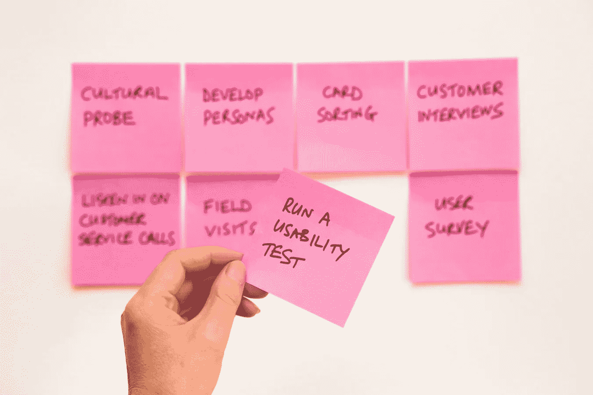

# 个人看板第 1 部分——为什么待办事项清单不起作用

> 原文：<https://medium.com/hackernoon/personal-kanban-part-1-why-todo-lists-don-t-work-3b5c6dc78708>

Photo by [David Travis](https://unsplash.com/photos/WC6MJ0kRzGw?utm_source=unsplash&utm_medium=referral&utm_content=creditCopyText) on [Unsplash](https://unsplash.com/search/photos/post-it?utm_source=unsplash&utm_medium=referral&utm_content=creditCopyText)

作为首席技术官，我每周都要处理几十项任务。有些任务很大，比如钻研一项新技术，有些很小，比如浏览新的候选人资料或检查最新的错误报告。但是所有这些任务*都有*要完成。更糟糕的是:每一次谈话、每一次会议和每一封邮件都会导致新的任务需要处理。因此，拥有一个任务跟踪系统是至关重要的，它可以确保我不会错过任何事情，并帮助我遵守最后期限。

作为一名超过 12 年的开发经理，我已经尝试了几种解决方案，直到我最终找到了一个在过去四年里对我很有用的方案。

在第一部分，我将告诉你为什么待办事项列表对我不起作用，但是个人看板却起作用。在第二部分，我将展示我如何在实践中使用个人看板，以及我正在使用哪些工具。

注意:生产力方法论是一个非常个人化的东西——对我来说很有效的方法对你来说可能是无效的。

## 为什么待办事项列表不起作用

可能没有其他领域有如此多的应用程序，比如待办事项列表。数百种——如果不是数千种——产品正在向我们示好。有像 [todoist](https://todoist.com/) 这样只关注清单的应用，也有像 [outlook](http://outlook.office.com) 这样提供清单作为支持领域的其他核心领域的应用。但是根据我的经验，大部分都不适合跟踪购物清单。

## 现在做什么*？*

*为什么我会这么想？好吧，清单并没有给我提供正确的工具来专注于当前重要的事情……至少除非你计划*什么时候*在非常早期的阶段做某事——例如在捕获一个任务时立即做。*

*为了理解这种说法，我们需要看一看典型应用程序为我们提供的缩小列表的工具。当然，我可以盯着我的完整列表，但这里我们遇到了看不到树的木头的问题(当我写这篇文章时，我的列表上有 65 个任务——不包括几个子任务)。因为我们不想一遍又一遍地检查整个列表，所以我们需要过滤列表。大多数工具至少提供了一些预定义的过滤器，如*

*   *“今天到期”或*
*   *“未来 7 天内到期”。*

*或者你甚至可以创建自己的过滤器，根据你可以添加到任务中的元数据来开发新的功能。听起来不错，不是吗？那么这里出了什么问题呢？*

*问题是截止日期:为了让任务出现在“今天截止”中，我需要为它指定一个截止日期。由于我不想周期性地完成所有的任务，我发现自己在创建任务的时候就给它添加了一个截止日期。*

*这与“敏捷”完全相反。在敏捷方法中，一个核心原则是将决策延迟到尽可能晚的时间点，仅仅是因为时间流逝得越多，我获得的知识就越多，可以做出持续的决策。*

*由于任务的大小不同，截止日期不是一个任务应该出现在我的雷达上的好指标。如果我只需要在某一天打一个电话，如果任务在到期日出现是完全没问题的。但是如果我需要写一个可能要花我两周时间的规范，如果任务提前七天出现就太晚了。*

*结果，我发现我为所有任务的*设定了“战术”截止日期。在任务需要完成之前，这些并不是真正的日期，而是我指定了我希望任务出现在我的过滤视图中的时间。因此，事实上我已经改变了到期日的预期用途，把它变成了“出现在我的列表日期上”。**

## *惊喜！*

*随着“出现日期”的临近，另一个副作用是任务会突然出现在你的清单上，就像盒子里的杰克一样。你以为你已经步入正轨，期待着周末的到来，然后——砰——周五早上，你半年前就计划好的怪物规格突然出现在你的待办事项列表上。*

*这真的会让人分心和失去动力。结果，过了一会儿，感觉好像待办事项清单是*在控制*你，而不是*在支持*你。*

## *基本完成了*

*检查 todos 是我们工作得到的奖励。勾掉一项任务，看着它消失，感觉很好。我发现自己经常处于这样一种情况:我花了一整天的时间来完成一项任务，它几乎完成了，但是需要其他人的一点点反馈。在这些情况下，我有不同的可能性:*

*   *不要检查任务，直到我收到反馈，沮丧地结束一天的工作，因为感觉我什么都没完成。*
*   *勾掉这个任务，创建一个新任务来征求反馈。这也不像是进步。*
*   *标记完成的任务，以获得一天辛苦工作的满足感，并等待同事的反馈，这将作为我真正完成任务的触发器。(只是希望我的同事不要忘记发送反馈，因为届时任务将在 nirvana 中停止。)*

## *TL；博士:对待办事项的总结*

*所以在使用待办事项列表八年后，这是我对它们的结论:*

***优点:***

*   *它们帮助我忘记一些事情。*
*   *他们给我很好的感觉，我不会错过任何事情。*

***缺点:***

*   *要使用过滤视图，我需要在创建任务时考虑何时可能是处理任务的最佳时间。*
*   *到期日正在变成战术性的“出现日期”,这在语义上是错误的，如果一项任务有一个*实际*到期日，则不可能指定该日期。*
*   *很久以前捕获的任务突然像过滤视图中的盒子里的杰克一样弹出。*
*   *我倾向于勾选大部分(但不是全部)完成的任务。*

## *拯救世界的个人看板*

*那么让我们看看什么是个人看板，以及它如何帮助我们。我可以告诉你为什么大野泰一在 1947 年发明并引入看板来优化丰田的生产链，David Anderson 在 2007 年将看板应用于软件行业，但这超出了本文的范围，因为个人看板不是真正的*看板。个人看板的想法是由 Jim Benson 和 Tonianne DeMaria Barry 提出的，并于 2011 年发表在他们的书《个人看板:绘制工作图|导航生活》中。**

## *可视化状态*

*看板的核心是可视化状态。这个想法是:如果我知道当前的状态，我就能做出深刻的决定。*

*可视化基于三个要素:*

1.  *一张**卡片**代表一个单一的任务。*
2.  ***看板**托管所有卡片。*
3.  *电路板被分成**列**，每一列代表一个任务可能处于的状态。*

*最左边的列表示初始状态，最右边的列表示最终状态。因此，默认情况下，新的卡片在左栏中创建，随着任务的进行，它被拉到右边。*

## *我们的第一块看板*

*让我们看看最简单的看板:*

**

*这些列具有以下含义:*

*   ***待办事项:**我们未完成的任务*
*   ***进行中:**我们目前正在进行的任务*
*   ***完成:**我们完成的任务*

*这看起来很老套。但是，即使是这种最简单的看板形式也能为我们提供简单任务列表的好处吗？是的，已经有了:*

1.  *在我们以前使用的清单中，我们只能区分未完成和已完成的任务。我们的看板还列出了我们目前正在进行的任务。*
2.  *“完成”栏概述了我们所取得的成就。再也不用离开办公室问自己一整天都做了什么。*

*现在您已经准备好了:如果您有白板和便利贴，您可以立即开始。如果你想随身携带你的“板”,只需在你的笔记本上预留一个双页，并使用小便利贴。*

## *阻止的任务*

*让我们更进一步。我们使用清单的一个问题是，我们不确定如何处理我们已经完成的任务，但是我们在等待别人的贡献。因此，让我们用一个新的状态**来增强看板板，等待**准确地指出这一点:*

**

*如果你已经完成了你的工作，并且需要从你的同事那里得到一些东西，简单地把任务拖到新的栏目中。这给了你向右移动的可能性——这感觉像是进步——但是你仍然清楚地提醒自己还有事情没有完成。*

*每当您的“进行中”栏为空时，您应该首先查看您的“等待”栏，并检查是否所有的任务*真的*仍在等待外部贡献。如果不喜欢从“待办事项”中提取新任务，完成一个任务比完成两个更好。*

## *行程安排*

*我们对清单的主要担心是，当涉及到安排任务时，它们不能很好地工作。我们当前的看板在这里也没有提供任何帮助:我们只有一个充满待办事项的 backlog 列，每次我们想要选择一个新任务时都需要浏览所有待办事项。*

*为了解决这个问题，让我们在我们的论坛上增加一个新的【今日 栏目:*

**

*现在，每天早上我们都可以浏览一下我们的待办事项栏，然后把我们计划今天处理的卡片放到“今天”栏。在一天中，我们不再需要关心整个“待办事项”栏，可以专注于我们今天的计划。*

*为了避免我们每天早上浏览完整的“待办事项”栏，我们可以进一步增强我们的公告板:*

**

*我们最终的拉动式工作流现在看起来像这样:*

*   ***每天早上**你将任务从“本周”拉到“今天”栏。*
*   *每周一你将任务从“本月”拉至“本周”栏。*
*   ***每个月的第一天**,你将任务从“今年”拉至“本月”栏。*
*   ***每年 1 月 1 日**你将任务从“待办事项”中提取到“今年”栏。*
*   *每个星期五，我都会清空我的“完成”栏。这给了我一个很好的概述，我已经完成了这一周。*

## *有创造力*

*个人看板是关于你和你的生产力的。所以调整板子，让它最适合你。以下是一些想法:*

*   *如果你没有固定的每月任务，你可能更喜欢“未来 4 周”栏，而不是“本月”栏。*
*   *如果您的“今年”和“待办事项”栏大部分是空的，则拒绝“年份”栏。*
*   *当有即将到来的假期时，我会在“本周”栏的左边创建一个“假期前”栏，在那里我收集需要在我离开前完成的事情。*
*   *在卡片上写下截止日期，表明需要在特定日期完成的任务。这将有助于您填写计划栏。*

## *结论*

*个人看板并不适合每个人，因为它需要你定期扫描你的看板。因此，如果你只有少量的任务需要跟踪，提醒工具可能会更适合你。但是如果你像我一样，每天必须处理大量的任务，那么个人看板可能适合你。它为你安排和跟踪所有任务提供了一个方便的工具。这有助于你把注意力集中在当前重要的事情上，尽管如此，你总是把所有的任务都放在眼前，以避免意外。作为奖励，你只需查看你的“完成”栏，就可以很好地了解你所取得的成就。*

*在下一部分，我将向您展示我在实践中使用哪些工具来处理个人看板，以及这些工具如何进一步增加收益。*