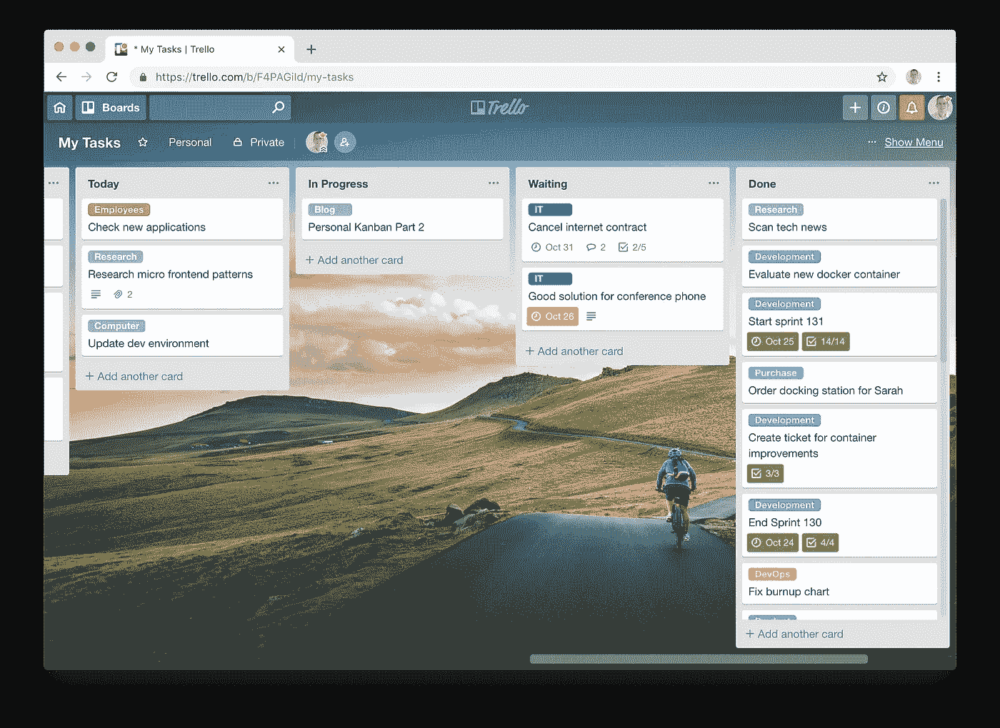

# 个人看板第 2 部分 Trello 的个人看板

> 原文：<https://medium.com/hackernoon/personal-kanban-part-2-personal-kanban-with-trello-a6bd6cdb0588>

Generated with MagicMockups

在我的第一篇文章中，我向你展示了为什么个人看板对我来说是完美的任务跟踪解决方案。在旁注中，我建议在白板上使用便利贴，让个人看板活起来。但这真的是我们想要的吗？难道我们不想把任务放在口袋里，而不随身携带一支笔吗？归根结底，我们是黑客——这就是我们阅读这份出版物的原因。所以对我们来说，寻找数字解决方案是很自然的一步。

## 寻找合适的工具

外面有不少自称看板解决方案的工具:[特雷罗](https://trello.com/)、[梅斯特任务](https://www.meistertask.com/)、 [Zenkit](https://zenkit.com/) 和 [JIRA](https://www.atlassian.com/software/jira) 只是其中的几个。

在选择工具之前，您应该考虑以下几点:

*   修改板子和柱子容易吗？你可以根据你不断增长的需求不时调整板子。这应该是几秒钟而不是几分钟的事情。
*   创建和编辑卡片容易吗？这就是你在看板板上永久做的事情。所以它不仅应该简单，而且应该非常有趣。
*   自己决定是否需要卡片标签、清单、截止日期、附件和评论，并检查该工具是否支持您。
*   有无限制的档案吗？看看下面这个有什么好处。
*   过滤和搜索功能怎么样？
*   有适用于您首选平台的移动应用程序吗？这些应用程序可以即时同步吗？如果你想随身携带冲浪板，这一点至关重要。
*   你是一名开发人员，所以键盘快捷键可能是你的专长——至少对我来说是这样。
*   工具感觉爽快吗？你真的会用很多，所以它应该是有趣的，不要妨碍你。

从上面提到的工具中，至少 Trello 勾选了所有的框。JIRA 可能看起来是一个自然的选择，因为你们许多人可能已经在自己的公司里有了它，但它本身不合格，因为应用程序太慢，创建卡片感觉太重，调整董事会需要太多步骤来感觉轻量级(尽管这可能会随着新吉拉的[而改变)。](https://www.atlassian.com/software/jira/whats-new)

特雷罗在过去的四年里为我服务得很好。所以这篇文章的其余部分将集中在使用 Trello 来管理你的任务。

我也检查了 [MeisterTask](https://www.meistertask.com/) 和 [Zenkit](https://zenkit.com/) ，但是总有至少一点缺失，比如对快捷方式的支持或者有限的存档能力。

另一个问题是定价。如果你的公司决定为整个团队选择这个工具，10 美元/用户/月的价格是可以接受的。但是对于一个我自己使用的工具来说，一年 120 美元或更多感觉太多了——特别是当我更喜欢为我自己的个人生产力付费的时候。Trello 通过他们的 [Trello Gold Plan](https://trello.com/gold) 提供了中间路线，该计划提供了更大的卡附件(改为高达 250 MB)和每块板多达三个电源(见下文)。

如果这些公司能够免费或以类似于 Trello 的黄金计划的价格为多达三个用户或至少个人提供全功能解决方案，他们中的大多数都会帮自己一个忙。通常，这些人会成为影响者，然后为整个团队引入付费解决方案。

## 入门指南

我不会*而不是*给你一步一步地介绍如何使用 Trello，因为它应该是不言自明的——相反，我只会给你指出正确的方向，以帮助你最大限度地利用它。一旦你注册了一个账户，用[我的第一篇文章](https://hackernoon.com/personal-kanban-part-1-why-todo-lists-don-t-work-3b5c6dc78708)中描述的结构建立你的第一个个人看板应该是几秒钟的事情。

Personal Kanban Board in Trello with empty columns

**温馨提示:**

*   您可以拖放列来重新排列它们。
*   您可以双击两列之间的空间来插入新列。

## 创建卡片

一旦你设置好栏目，你就可以开始制作代表任务的第一张卡片了。正如你会注意到的，创建卡片是一件轻而易举的事，因为你只需要键入标题并点击`enter`。之后，您可以立即输入下一张卡。

Our first cards

点击卡片查看其详细信息。您可以在此输入描述并编辑其所有属性。

**温馨提示:**

*   您可以在一个步骤中创建一堆卡片:确保您要创建的卡片的标题在剪贴板中用换行符分隔(例如，通过从编辑器或 excel 中复制它们)。然后简单的粘贴到一张新的卡片上。一旦你创建了它，Trello 将为每一行创建一张卡。
*   一旦你创建了一张卡片，你就可以编辑它的标题，而不需要打开它，只需聚焦它并点击键盘上的`e`。
*   Trello 中的 description 字段和许多其他地方，如检查列表项和注释，都支持 markdown 语法来格式化文本。

## 让它成为你自己的

现在你有一个有柱子和卡片的板子。这是个人看板的核心，但是看起来有点无聊。所以开始把这块板变成你的吧。

首先你应该设置一个吸引你的背景图片。你可以从菜单中完成，你可以用右边相应的按钮打开菜单。

**温馨提示:**

*   您可以随时用`w`键切换菜单。

接下来你应该在你的卡片上加标签。我用标签把我的卡片分类，像“职员”、“研究”、“开发”等等。这有助于我快速找到合适情绪的匹配任务。我确保在每张卡片上至少贴一个标签，因为这样看起来更一致，而且我给标签分配了不同的颜色，以便于识别。

Your final board might look like this

除了简单的分类，我还有特殊的标签，比如“战略”标签，我保证每周至少做一个。这有助于我确保自己不会迷失在日常工作中，同时也让“大事情”保持运转。

**温馨提示:**

*   您可以从纸板菜单以及用于为卡片分配标签的弹出菜单中创建、编辑和删除标签。
*   默认情况下，卡片上只显示彩色条。在 Trello 的网络应用程序中，你可以点击其中一个，所有标签的名称将永久显示。
*   在你创建自己的标签之前，你应该删除现有的标签，否则它们会弄乱你的列表。
*   您可以在创建标签时，通过在输入标题时键入`#`字符，立即将标签添加到卡片中。
*   无需打开卡片，只需聚焦并点击`l`键，即可在卡片上添加或删除标签。

## 清单

我最喜欢的 Trello 功能之一是清单。您可以在每张卡上创建任意数量的清单，并且每个清单可以包含任意数量的清单项目。

例如，如果我为写一封更长的邮件制作一张卡片，我会使用一个清单来记录我需要在邮件中涵盖的主题。

我喜欢复杂的重复性任务清单，比如创建月度报告、结束或开始冲刺。它们帮助我确保我不会忘记一个复杂过程中的任何事情——就像飞行员使用他的着陆清单来确保他在降落前拉出起落架。

对于周期性任务，我清单上的最后一项是提醒复制任务，以便在下一次出现时有新的实例。

A card with checklists

Trello 会在卡片上显示一个小指示器，上面有显示总数和检查项目数的清单。检查完所有项目后，指示灯会变成绿色。

## 到期日

Trello 允许你设置任务的截止日期。因为我们不再需要这些日期来控制任务的可见性(就像我们在清单中做的那样)，我们可以用它来记录真正的到期日。所以我只在卡片上设定到期日，在那里确实有任务必须完成的日期。因此，我的大多数任务都有截止日期。

Trello 为 24 小时内到期的卡提供通知，但这不是很有帮助，所以我忽略了它。但我喜欢的是，卡上的到期日在到期前 24 小时变成黄色，到期后变成红色。这提供了一个简洁的视觉指示器，有助于识别应做的事情。

当您将一张有到期日期的卡片移到“完成”栏时，您应该勾选到期日期旁边的复选框，将日期标记为绿色。

**温馨提示:**

*   您可以通过聚焦并点击`d`键来添加/编辑卡片的日期。

## 找东西

Trello 提供了两种查找卡片的功能:

1.  板过滤器和
2.  全球搜索。

如果你的电路板上有很多卡片，而你想找一张特定的，那么电路板过滤器是一个很好的工具。你可以在棋盘的菜单中激活它，它将允许你过滤标题和/或元数据，并将立即缩小棋盘范围，只匹配卡片。

相比之下，Trello 标题栏中的全局搜索框会搜索您的所有电路板，甚至包括存档的卡(见下文)。它提供了特殊的搜索语法来缩小结果列表。

**温馨提示:**

*   您可以使用`f`键快速激活过滤模式。
*   您可以使用`x`键清除激活的过滤器。
*   如果您没有号码块，您可以点击`/`或`⇧` + `7`来聚焦搜索框。

## 记录你的工作

让 Trello *真正比任何实体看板*强大和更好的是它能够永远保存你所有的信息*。这是因为通常情况下你不会删除 Trello 中的卡(尽管如果你想的话你可以这样做),但你只会把它们归档到 T21。存档的卡片从板上消失了，但它们仍然在那里。因此，到周末时，我不会删除任务，而是从“完成”栏的菜单中选择“存档所有卡片”操作。*

为什么这在个人看板中有帮助？你是否也知道这样一种情况，有人问你两个月前你处理过的事情，你能记得*你处理过*，但是你不记得*结果*——你做的决定？我经常这样安静，这让我发疯。但是自从使用 Trello 以来，我不再有这个问题(主要是),因为除了作为我的任务组织工具之外，它还是我的工作日志——我外包的长期记忆。

但是，要使存档功能有用，只有带有标题、描述和元数据(如日期)的卡片是不够的。如果你能在卡片上捕捉到中间和最终的结果，事情会变得非常有用。为此，我使用了评论功能。虽然我独自在我的看板上工作，但我确实经常使用注释。

A card’s history including comments

以下事件是向卡片添加注释的良好触发器:

*   将卡片从“进行中”栏移回计划栏时，说明暂停工作的原因可能会有所帮助。
*   将卡片移至“等待”栏时，有必要说明它在等待什么或谁。
*   解析卡片时，注释其结果可能是有意义的。

如何在需要的时候获取这些隐藏的知识？在“更多”部分的电路板菜单中，您可以找到“存档元素”操作，该操作显示所有存档元素并提供搜索框。但我更喜欢简单地使用全局搜索，因为它不仅搜索活动的，而且还搜索存档的卡片。

打开已归档的卡片会提供您在那里采集的所有信息，以及在栏之间移动卡片时的信息、卡片已归档的时间以及归档时它在哪个列表中的信息。

## 更大的

还有更多关于使用 Trello 做个人看板的内容。这里只是一些玩笑:

*   Trello 支持各种各样的电源。其中大多数增加了与其他工具的集成(如 Slack 或 Zendesk)，但其他一些增加了有用的内部功能。您可以在免费帐户中使用一次加电，在黄金帐户中最多使用三次。
*   我最喜欢的个人看板是“卡片中继器”。它允许您设置卡片的重复间隔。一旦设置，Trello 将在每次间隔过去时创建一个新的卡实例。
*   Trello 提供了与 IFTTT 的集成，这开启了有趣的新可能性。和 iOS 12 中对全新 Siri 快捷键的支持一样。
*   特雷罗的移动应用程序非常棒。

## 结论

特雷罗让我的工作生活变得轻松多了。它不仅帮助我使用[个人看板](https://hackernoon.com/personal-kanban-part-1-why-todo-lists-don-t-work-3b5c6dc78708)来组织我的工作，还帮助我*记录我的工作*，这样我就可以很容易地从我几个月前完成的任务中挖掘出结果。所有这些工作都是因为使用 Trello 真的很有趣。它感觉轻巧、流畅、快速，我几乎可以使用键盘快捷键做任何事情。

你可能会认为我在为特雷罗工作，或者从他们那里拿钱来写这篇文章，但事实并非如此。它只是一个我深信不疑的工具——叫我“特雷罗粉丝”吧。