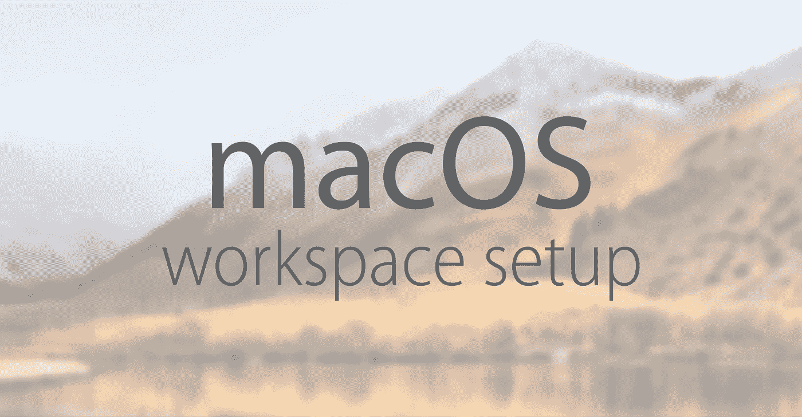

# 个人 macOS 工作区设置

> 原文：<https://medium.com/hackernoon/personal-macos-workspace-setup-adf61869cd79>



这是我个人用于网络开发的 macOS 工作空间设置。如果你想安装最新的技术并保持最新，遵循我的指南，你会比以往更喜欢使用你的 macOS 电脑。

这篇文章将保持更新，因为这个指南是基于个人喜好。

在 **macOS High Sierra 上测试和工作，版本 10.13.5** 。

# 介绍

我会假设你有一个干净的 macOS 安装。我们将一起经历每个步骤和安装过程。不会有错误的！如果您对学习不感兴趣，在阅读本文时，可以随意复制和粘贴这些命令。

# 装置

顺序非常重要，所以遵循每一步，除非你知道你在做什么。

# [Xcode](https://developer.apple.com/xcode/)

> Xcode 是一个用于 macOS 的集成开发环境，包含一套由 Apple 开发的软件开发工具，用于为 macOS、iOS、watchOS 和 tvOS 开发软件。
> 来源:[维基百科](https://en.wikipedia.org/wiki/Xcode)

我们必须从 Xcode 开始，但我们不需要完整的应用程序。
相反，我们将只安装命令行工具。

**安装**

```
xcode-select --install
```

**哒哒**

我们玩完了。这一个没有进一步的了。继续下一个…

# [自制](https://brew.sh/)

> Homebrew 是一个免费开源的软件包管理系统，简化了苹果 macOS 操作系统上的软件安装。
> 来源:[维基百科](https://en.wikipedia.org/wiki/Homebrew_(package_management_software))

**安装**

```
ruby -e "$(curl -fsSL https://raw.githubusercontent.com/Homebrew/install/master/install)"
```

储存库

```
declare -a taps=(
  'buo/cask-upgrade'
  'caskroom/cask'
  'caskroom/versions'
  'homebrew/bundle'
  'homebrew/core'
)

for tap in "${taps[@]}"; do
  brew tap "$tap"
done
```

**升级更新**

```
brew upgrade && brew update
```

**哒哒**

我们已经完成了，但是我将在下面添加一个精选的命令列表。它们非常有用，你可能需要记住它们中的一些以备日常使用。

**提示** —要了解每个命令及其用法的更多信息，请输入`brew help [COMMAND]`命令，它将显示特定命令及其每个标志的所有详细信息……如果您想了解更多信息，请参见[命令完整列表](https://docs.brew.sh/Manpage.html#commands)。

# [自制酒桶](https://caskroom.github.io/)

> 扩展了 Homebrew，并将其优雅、简单和快速引入 GUI macOS 应用程序的安装和管理。
> 来源: [GitHub 库](https://github.com/Homebrew/homebrew-cask)

**安装**

```
brew install cask
```

**应用和安装清单** 我强烈建议你自己列一份清单。这是我的…

```
declare -a cask_apps=(
  ‘1password’
  ‘adobe-creative-cloud’
  ‘alfred’
  ‘authy’
  ‘bartender’
  ‘droplr’
  ‘expressvpn’
  ‘flume’
  ‘gitkraken’
  ‘google-backup-and-sync’
  ‘google-chrome’
  ‘iterm2-nightly’
  ‘keepingyouawake’
  ‘postman’
  ‘screenflow’
  ‘sip’
  ‘skype’
  ‘slack’
  ‘sublime-text’
  ‘sequel-pro’
  ‘transmit’
)

for app in "${cask_apps[@]}"; do
  brew cask install "$app"
done
```

**哒哒**

我们已经完成了，但是我将在下面添加一个精选的命令列表。它们非常有用，你可能需要记住它们中的一些以备日常使用。

# Mas CLI

> Mac App Store 的简单命令行界面。专为脚本和自动化而设计。
> 来源: [GitHub 库](https://github.com/mas-cli/mas)

**安装**

```
brew install mas
```

**应用和安装清单** 强烈建议你自己做一个个人清单。这是我的…

```
declare -a mas_apps=(
  '824183456'   # Affinity Photo
  '824171161'   # Affinity Designer
  '918858936'   # Airmail 3
  '1091189122'  # Bear
  '736584830'   # Folx GO
  '775737590'   # iA Writer
  '441258766'   # Magnet
  '1063631769'  # Medis
  '967805235'   # Paste
  '583827028'   # WinZip
)

for app in "${mas_apps[@]}"; do
  mas install "$app"
done
```

**哒哒**

我们已经完成了，但是我将在下面添加一个精选的命令列表。它们非常有用，你可能需要记住它们中的一些以备日常使用。

# [Z 壳](http://zsh.sourceforge.net/)

> 一个 Unix shell，可用作交互式登录 shell 和 shell 脚本的强大命令解释器。
> 来源:[维基百科](https://en.wikipedia.org/wiki/Z_shell)

我们将安装几个扩展和一个外壳。

```
brew install zsh zsh-completions zsh-autosuggestions zsh-syntax-highlighting
```

既然我们还在安装阶段，安装[我的天啊](http://ohmyz.sh/)也是个好主意！

它捆绑了大量有用的功能、助手、插件、主题和一些让你大叫的东西…

```
sh -c "$(curl -fsSL https://raw.github.com/robbyrussell/oh-my-zsh/master/tools/install.sh)"
```

**配置** 

创建一个文件并在编辑器中打开它:

`touch ~/.my-zshrc && bash -c 'exec env ${EDITOR:=nano} ~/.my-zshrc'`

复制/粘贴以下内容:

```
# Load extensions
source /usr/local/share/zsh-autosuggestions/zsh-autosuggestions.zsh
source /usr/local/share/zsh-syntax-highlighting/zsh-syntax-highlighting.zsh# Activate plugins
plugins=(git zsh-completions)# Custom vars
SPARK=$HOME/.spark-installer
COMPOSER=$HOME/.composer/vendor/bin
LOCAL_NODE_BIN=node_modules/.bin# Custom paths
PATH=/usr/local/sbin:$PATH
PATH=$SPARK:$PATH
PATH=$COMPOSER:$PATH
PATH=$LOCAL_NODE_BIN:$PATH# Set default editor
export EDITOR='subl -w'# Load my aliases
if [ -f ~/.aliases ]; then
  . ~/.aliases
fi# Load my functions
if [ -f ~/.functions ]; then
  . ~/.functions
filocal ret_status="%(?:%{$fg_bold[green]%}△ :%{$fg_bold[red]%}▽ )"
PROMPT='${ret_status} %{$fg[cyan]%}%c%{$reset_color%} $(git_prompt_info)'
```

将我们的自定义配置文件的源代码附加到主 Z Shell 配置文件中:

```
echo ". ~/.my-zshrc" >> "$HOME/.zshrc"
```

**别名** 这是完全可选的。我个人使用许多化名，我发现它们非常有用。

创建一个文件并在编辑器中打开它:

```
touch ~/.aliases && bash -c 'exec env ${EDITOR:=nano} ~/.aliases'
```

复制/粘贴以下内容:

```
# Helpful
alias s='cd ~/Sites'
alias art='php artisan'
alias path='echo -e ${PATH//:/\\n}'
alias copy_ssh="pbcopy < $HOME/.ssh/id_rsa.pub"
alias reload="exec ${SHELL} -l"
alias afk="/System/Library/CoreServices/Menu\ Extras/User.menu/Contents/Resources/CGSession -suspend"
alias flush_dns="sudo killall -HUP mDNSResponder"
alias chdirs="find . -type d -exec chmod 755 {} \;"
alias chfiles="find . -type f -exec chmod 644 {} \;"# Common files for editing
alias edit_hosts='subl /etc/hosts'
alias edit_httpd='subl /usr/local/etc/httpd/httpd.conf'
alias edit_vhosts='subl /usr/local/etc/httpd/extra/httpd-vhosts.conf'
alias edit_php='subl /usr/local/etc/php/7.2/php.ini'# System
alias update='mas upgrade; brew cleanup; brew upgrade; brew update; brew cask cleanup; brew cu -a -y; composer global update; npm update -g; npm install npm@latest -g'
alias show_files='defaults write com.apple.finder AppleShowAllFiles -bool true && killall Finder'
alias hide_files='defaults write com.apple.finder AppleShowAllFiles -bool false && killall Finder'
alias show_desktop="defaults write com.apple.finder CreateDesktop -bool true && killall Finder"
alias hide_desktop="defaults write com.apple.finder CreateDesktop -bool false && killall Finder"
alias enable_gate="sudo spctl --master-enable"
alias disable_gate="sudo spctl --master-disable"# IP
alias ip='dig +short myip.opendns.com [@resolver1](http://twitter.com/resolver1).opendns.com'# NPM
alias nom='rm -rf node_modules/ && npm cache verify && npm install'# Github
alias wip="git add .;git commit -m 'wip'"
alias nah='git reset --hard;git clean -df'# Composer
alias dump='composer dump-autoload -o'# Chrome
alias kill_chrome="ps ux | grep '[C]hrome Helper --type=renderer' | grep -v extension-process | tr -s ' ' | cut -d ' ' -f2 | xargs kill"# Dummy
alias shrug="printf '¯\_(ツ)_/¯' | pbcopy"
alias flipt="printf '(╯°□°)╯︵ ┻━┻' | pbcopy"
alias fight="printf '(ง'̀-'́)ง' | pbcopy"
```

我不经常使用这些，但它们有时会派上用场。

创建一个文件并在编辑器中打开它:

```
touch ~/.functions && bash -c 'exec env ${EDITOR:=nano} ~/.functions'
```

复制/粘贴以下内容:

```
# Make directory and enter it
function mkd () {
  mkdir -p "$@" && cd "$_";
}

# Copy website and its contents
function copy_website () {
  wget -e robots=off -p -k "$1"
}

# Extract most know archives with one command
extract () {
  if [ -f $1 ] ; then
    case $1 in
      *.tar.bz2)   tar xjf $1     ;;
      *.tar.gz)    tar xzf $1     ;;
      *.bz2)       bunzip2 $1     ;;
      *.rar)       unrar e $1     ;;
      *.gz)        gunzip $1      ;;
      *.tar)       tar xf $1      ;;
      *.tbz2)      tar xjf $1     ;;
      *.tgz)       tar xzf $1     ;;
      *.zip)       unzip $1       ;;
      *.Z)         uncompress $1  ;;
      *.7z)        7z x $1        ;;
      *)     echo "'$1' cannot be extracted via extract()" ;;
    esac
  else
    echo "'$1' is not a valid file"
  fi
}

# Determine size of a file or total size of a directory
function fs () {
  if du -b /dev/null > /dev/null 2>&1; then
    local arg=-sbh
  else
    local arg=-sh
  fi

  if [[ -n "$@" ]]; then
    du $arg -- "$@"
  else
    du $arg .[^.]* *
  fi
}
```

**哒哒**

我们玩完了。这一个没有进一步的了。继续下一个…

# [崇高的文字](https://www.sublimetext.com/)

> 一个专有的跨平台源代码编辑器，具有 Python 应用程序编程接口。
> 来源:[维基百科](https://en.wikipedia.org/wiki/Sublime_Text)

**包控制** 这里是[安装代码](https://packagecontrol.io/installation)，但是我觉得已经不需要了。
相反，打开 Sublime Text，按`cmd + shift + p`并键入“安装”。它应该显示“安装包控制”。

**软件包** 我有自己的软件包列表，但当然我不想每次重装 macOS 时都手动安装它们。

要自动安装软件包列表，请遵循以下路径:

```
Preferences **>** Package Settings **>** Package Control **>** Settings — User
```

将打开用户设置…用以下内容替换现有内容:

```
{
    "bootstrapped": true,
    "in_process_packages": [],
    "installed_packages":
    [
        "A File Icon",
        "AdvancedNewFile",
        "ApacheConf",
        "AutoFileName",
        "Babel",
        "BracketHighlighter",
        "ColorPicker",
        "DA UI",
        "DocBlockr",
        "EditorConfig",
        "Emmet",
        "GitGutter",
        "HyperClick",
        "JavaScript Completions",
        "Laravel Blade Highlighter",
        "MarkdownPreview",
        "Package Control",
        "Sass",
        "SFTP",
        "SnippetMaker",
        "SublimeLinter",
        "SublimeLinter-stylelint",
        "Terminal",
        "Vue Syntax Highlight"
    ]
}
```

重新启动应用程序，给它一些时间来安装指定的软件包。

**配置** 要设置首选项，首先安装所需字体。我个人的偏好是以下其中一种:[操作员 Mono](https://www.typography.com/fonts/operator/styles/operatormono) 或者 [Fira 代码](https://github.com/tonsky/FiraCode)。

之后，打开`Preferences **>** Settings`或用快捷方式`cmd + ,`，用以下内容替换**右窗格**中的内容。确保用系统上安装的字体替换 **font_face** 。

```
{
    "bold_folder_labels": true,
    "color_scheme": "Packages/Color Scheme - Default/Mariana.sublime-color-scheme",
    "copy_with_empty_selection": false,
    "create_window_at_startup": false,
    "detect_indentation": false,
    "drag_text": false,
    "enable_tab_scrolling": false,
    "ensure_newline_at_eof_on_save": true,
    "find_selected_text": true,
    "folder_exclude_patterns":
    [
        ".svn",
        ".git",
        ".hg",
        "CVS",
        "vendor",
        "node_modules"
    ],
    "font_face": "Operator Mono",
    "font_size": 16,
    "highlight_line": true,
    "highlight_modified_tabs": true,
    "ignored_packages":
    [
        "Vintage"
    ],
    "indent_to_bracket": true,
    "line_padding_bottom": 6,
    "line_padding_top": 6,
    "margin": 8,
    "match_brackets_content": false,
    "match_selection": false,
    "match_tags": false,
    "open_files_in_new_window": false,
    "preview_on_click": false,
    "shift_tab_unindent": true,
    "show_full_path": false,
    "theme": "DA.sublime-theme",
    "translate_tabs_to_spaces": true,
    "trim_trailing_white_space_on_save": true
}
```

哒哒

我们玩完了。这一个没有进一步的了。继续下一个…

# [阿帕奇](https://www.apache.org/)

> 一个免费的开源跨平台 web 服务器，根据 Apache License 2.0 的条款发布。
> 来源:[维基百科](https://en.wikipedia.org/wiki/Apache_HTTP_Server)

Apache 已经捆绑在 macOS 中。然而，它不是最新的版本，最好是将我们所有的工作空间依赖项都放在自制软件中。

在整个配置中，您需要用您的系统用户名替换所有出现的`dvlden`。如果你不知道你的用户名，在终端中输入`whoami`来查看。

**停止并卸载系统捆绑版本**

```
sudo apachectl stop >/dev/null
sudo launchctl unload -w /System/Library/LaunchDaemons/org.apache.httpd.plist 2>/dev/null
```

**安装**

```
brew install httpd
```

**配置**

在编辑器中打开配置文件:

```
bash -c 'exec env ${EDITOR:=nano} /usr/local/etc/httpd/httpd.conf'
```

这是目录。我希望我说得够清楚了…

**动态虚拟主机的配置**

在编辑器中打开配置文件:

```
bash -c 'exec env ${EDITOR:=nano} /usr/local/etc/httpd/extra/httpd-vhosts.conf
```

用以下内容替换文件内容:

```
Define USER dvlden
Define PATH "/Users/${USER}/Sites"

<VirtualHost *:80>
    ServerName localhost
    DocumentRoot ${PATH}
</VirtualHost>

<VirtualHost *:80>
    ServerAlias *.test
    UseCanonicalName Off
    VirtualDocumentRoot "${PATH}/%1"
</VirtualHost>

<VirtualHost *:80>
    ServerAlias *.public
    UseCanonicalName Off
    VirtualDocumentRoot "${PATH}/%1/public"
</VirtualHost>
```

当我们在下面设置我们的 *DNSMasq* 时，我们将能够拥有自动动态虚拟主机。

为了可读性，我们在`~/Sites`目录中创建的每个文件夹都应该是小写的，并带有连字符。把文件夹名想象成没有 TLD 的域名。每个文件夹都可以自动访问。静态网站使用`.test`，动态网站使用`.public`。如果你使用的是像 [Laravel](https://laravel.com/) 这样的 PHP 框架，这将非常方便。就像[拉勒维尔代客](https://laravel.com/docs/5.6/valet)！

**重启**

```
sudo apachectl -e info -k restart
```

**启动守护进程**

```
sudo brew services start httpd
```

**哒哒**

我们已经完成了，但是我将在下面添加一个精选的命令列表。它们非常有用，你可能需要记住它们中的一些以备日常使用。

# [DNS Masq](http://thekelleys.org.uk/dnsmasq/doc.html)

> 它为小型计算机网络提供域名系统转发器、动态主机配置协议服务器、路由器广告和网络引导功能，作为自由软件创建。
> 来源:[维基百科](https://en.wikipedia.org/wiki/Dnsmasq)

我们将把它与我们的动态虚拟主机配置一起使用。这个包将把我们指定的 TLD 重定向到一个本地主机。

**安装**

```
brew install dnsmasq
```

**配置**

```
cat > "$(brew --prefix)/etc/dnsmasq.conf" <<EOF
address=/.test/127.0.0.1
address=/.public/127.0.0.1
EOF
```

**启动守护进程**

```
sudo brew services start dnsmasq
```

**添加解析器**

```
sudo mkdir -p /etc/resolver
sudo bash -c 'echo "nameserver 127.0.0.1" > /etc/resolver/test'
sudo bash -c 'echo "nameserver 127.0.0.1" > /etc/resolver/public'
```

**重启一个守护进程**

```
sudo brew services restart dnsmasq
```

**测试一下**

```
dig demo.test @127.0.0.1
```

您应该能够在输出中找到以下部分。

```
;; ANSWER SECTION:
demo.test.   0 IN  A 127.0.0.1
```

# [PHP](http://php.net/)

> 一种为 Web [开发](https://hackernoon.com/tagged/development)而设计的服务器端脚本语言，但也用作通用[编程](https://hackernoon.com/tagged/programming)语言。
> 来源:[维基百科](https://en.wikipedia.org/wiki/PHP)

PHP 已经捆绑在 macOS 中。然而，它不是最新的版本，最好是将我们所有的工作空间依赖项都放在自制软件中。

**安装**

```
brew install php
```

**安装作曲者**
既然我们使用 PHP，我们肯定会需要[作曲者](https://getcomposer.org/)。

```
brew install composer
```

**配置**

在编辑器中打开配置文件:

```
bash -c 'exec env ${EDITOR:=nano} /usr/local/etc/php/7.2/php.ini'
```

这是目录。我希望我说得够清楚了…

您可以根据需要随意调整帖子和上传的大小……
您可以在这里找到时区:[支持的时区列表](http://php.net/manual/en/timezones.php)

**哒哒**

我们玩完了。这一个没有进一步的了。继续下一个…

# [MySQL](https://www.mysql.com/)

> 一个开源的关系数据库管理系统。它的名字是由“My”和“SQL”组合而成，前者是联合创始人迈克尔·维德纽斯(Michael Widenius)女儿的名字，后者是结构化查询语言的缩写。
> 来源:[维基百科](https://en.wikipedia.org/wiki/MySQL)

**安装**

```
brew install mysql
```

**启动守护进程**

```
brew services start mysql
```

**配置(可选)**

默认情况下，MySQL 是用一个用户`root`安装的，没有密码。如果您想配置它，请继续。

```
mysql_secure_installation
```

# [节点 JS](https://nodejs.org/en/)

> 一个开源、跨平台的 JavaScript 运行时环境，在服务器端执行 JavaScript 代码。
> 来源:[维基百科](https://en.wikipedia.org/wiki/Node.js)

**安装**

```
brew install node
```

# [NPM](https://www.npmjs.com/)

> JavaScript 编程语言的包管理器。它是 JavaScript 运行时环境 Node.js 的默认包管理器
> 来源:[维基百科](https://en.wikipedia.org/wiki/Npm_(software))

Node JS 是和 NPM 捆绑在一起的，所以它会和它一起安装…除了有选择地安装一些全局包之外，我们在这里没有什么要做的。

**全局包安装** 如果你正在使用 [Vue JS](https://vuejs.org/) 并且也许想要使用一个 epic 包来保持你的项目依赖关系最新，检查 [NPM 检查更新](https://github.com/tjunnone/npm-check-updates)。

```
npm install -g npm-check @vue/cli
```

**哒哒**

我们已经完成了，但是我将在下面添加一个精选的命令列表。它们非常有用，你可能需要记住它们中的一些以备日常使用。

要了解每个命令及其用法的更多信息，请输入`npm help [COMMAND]`命令，它将显示特定命令及其每个标志的所有详细信息...如果你想了解更多，请看[完整的命令列表](https://docs.npmjs.com/#cli)。

# [Git](https://git-scm.com/)

> 一种版本控制系统，用于跟踪计算机文件的变化，并协调多人对这些文件的工作。
> 来源:[维基百科](https://en.wikipedia.org/wiki/Git)

**安装**

```
brew install git
```

**配置**

确保用您的个人详细信息替换姓名和电子邮件。

```
git config --global user.name "Nenad Novaković"
git config --global user.email "*.******@gmail.com"
git config --global core.editor "subl -n -w"
git config --global color.ui true
```

我使用`https`作为身份验证，所以我将在配置中添加以下额外的一行。

```
git config --global credential.helper osxkeychain
```

如果您使用的是`ssh`认证，您可以这样设置:

```
# Generate key
ssh-keygen -t rsa -C "*.******@gmail.com"

# Copy key
cat ~/.ssh/id_rsa.pub | pbcopy

# Add to Github
[Github SSH keys](https://github.com/settings/ssh)

# Test connection
ssh -T git@github.com

# > Hi dvlden! You've successfully authenticated, but GitHub does not provide shell access.
```

**哒哒**

我们已经完成了，但是我将在下面添加一个精选的命令列表。它们非常有用，你可能需要记住它们中的一些以备日常使用。

要了解每个命令及其用法的更多信息，请输入`*git help [COMMAND]*`命令，它将显示特定命令及其每个标志的所有详细信息...如果您想了解更多信息，请参见[命令的完整列表](https://git-scm.com/docs)。

# 最终注释

这可能是一个好地方，我扔在我的”。点文件”。如果你有兴趣编写自己的 Shell 来自动化我所写的所有过程，请随意查看这个 [GitHub 库](https://github.com/dvlden/mac-setup)。

如果你想试试(在干净的 macOS 安装上)，但是我强烈建议你先看一下所有的文件，然后也许写你自己的。

# 直到下次

如果你喜欢这个并且学到了新的东西，请分享一些爱。为此，点击拍手图标👏或者拿着它等待更多的掌声！👏👏👏

非常感谢。你是最棒的！

如果你正在考虑关注我:
[insta gram](https://www.instagram.com/dvlden/)[Twitter](https://twitter.com/dvlden)[Medium](/@dvlden)[GitHub](https://github.com/dvlden)