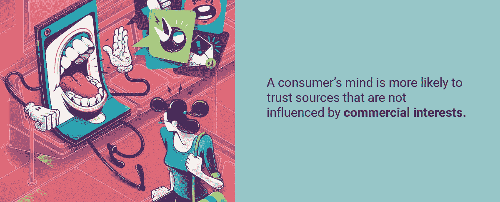

# 个人观点还是市场驱动？评论如何影响市场

> 原文：<https://medium.com/hackernoon/personal-opinion-or-market-driver-how-reviews-influence-markets-bd888f97b7cd>

抵制变革无疑是创新采用所面临的限制之一。但它不是石墙。似乎在尝试新事物时，即使在最不可动摇的信念面前，个人观点也能获胜，不管它有多么主观，因此难以证实。这就是区块链科技在与谣言和捏造观点的斗争中派上用场的地方，它通过跟踪每一个客户评论，根据第一手信息做出更好的决策。

# 口碑无国界

当涉及到新的经历时，人们会怀疑改变他们的习惯和日常生活是否会带来有价值的结果。这种效应被广泛地称为“变革阻力理论”,可以通过朋友或同事基于个人经验的建议来克服。

*如果社区中有人推荐了一项新服务，这个人将更有可能体验它。*

个人推荐被认为是独立的，因此个人倾向于将评论视为可信的来源，而不是来自关联方的信息，如广告消息或专家意见。为了尽快解决问题，口碑在社区中高速传播。对高风险资产的第一手投诉会让其他投资者免于损失金钱和信任。

西北大学凯洛格管理学院的营销学教授德里克·拉克在他的研究[中指出，给出建议的意图是由利他主义和移情作用形成的。](https://insight.kellogg.northwestern.edu/article/desire_to_acquire)

如果评论本身是真正独立的就好了…

# 推荐推荐

消费者市场已经在广告活动上投入了数十亿美元，以便触及他们的受众。根据麦肯锡的[研究](https://www.mckinsey.com/business-functions/marketing-and-sales/our-insights/a-new-way-to-measure-word-of-mouth-marketing)，20%到 50%的购买决策是基于评论和建议。当一个产品的价格很高或者它的技术被认为是创新的时候，口碑的作用就变得更加充分。

然而，消费者更容易相信不受商业利益影响的信息来源。根据这项研究，发展中国家的消费者在考虑是否购买产品时，更重视口碑而不是广告信息。

据当地消费者评论[调查](https://www.brightlocal.com/learn/local-consumer-review-survey/#Q14)显示，2017 年，85%的用户对在线评论的信任程度不亚于个人推荐。推荐服务很快变得流行起来，因为它们减少了花在决策上的时间，而关于使用案例的可用信息量却增加了。在数字经济中，推荐系统被设计成通过应用过滤器来构造选择的数量，以便更好地满足搜索标准。

因此，旅游用户评论服务猫途鹰每月拥有 1.85 亿[浏览量](https://www.similarweb.com/website/tripadvisor.com#overview)，其次是娱乐聚合网站 Yelp，拥有 1.65 亿[浏览量](https://www.similarweb.com/website/yelp.com)。目前，猫途鹰拥有超过 6.3 亿条评论和意见，以 2017 年 15.56 亿美元的[收入](http://ir.tripadvisor.com/static-files/840c6d1c-9c17-46c9-b52f-3586ead2515f)统治着推荐市场。平均访问持续约 3 分钟，在此期间，用户从最近的评论和总体排名中获得第一印象。

如果传统市场是由公平的意图而非贪婪所驱动的，那么推荐系统将完美运行。

随着小企业努力与拥有营销资金的大企业竞争，他们开始通过付费评论来操纵推荐。在自由职业网站上，搜索引擎优化专家准备以每小时 4 美元的价格审查产品。在俄罗斯，一篇大约 300-500 字的假评论的价格大约相当于 1.59 美元。虚假评论的预算是内容营销预算的一部分，预计 2020 年将达到 24.7 亿美元。

审查系统最终成为最不独立的信息源，其付费内容成本不高，因此任何质量产品的公司都负担得起。当猫途鹰[警告](https://abcnews.go.com/Technology/story?id=8094231&page=1)未经证实的评论时，第三方[已经开发出](https://reviewmeta.com/amazon-uk/B07FNPZ57G)算法来追踪虚假评论。

推荐系统引发的问题似乎比它们解决的问题更多，这就引出了这样一个问题:你如何核实评论？谁为虚假评论负责，如何做出决定？

# 区块链支持的透明评论#IMHO

秘密经济回答了传统市场提出的问题。推荐系统缺乏透明度，因为评论与支付账户没有关联，这使得验证过程几乎不可能。区块链技术通过一个简单的解决方案来应对这个问题，即**匿名跟踪购买数据，并鼓励消费者分享他们的第一手体验，同时获得加密货币**。

在推荐市场中，区块链充当数据聚合器和验证系统，同时保护消费者的隐私和匿名安全。传统的评论聚合器无法消除虚假推荐，而区块链开发的解决方案从一开始就被设计成永远不会让它们通过。

在短短的 18 年里，在传统市场的评论聚合器领导者的基础上，一个新的加密项目旨在彻底改变行业。Rateonium 使用一种新的技术方法来存储用户数据以供进一步分析。基于与支付交易相关联的评论，对产品和服务进行排名。Rateonium 正在开发的生态系统鼓励用户通过自动奖励他们的加密货币(RTO)来分享他们的个人观点。

加密技术基于地理位置和个人偏好存储用户数据，以帮助其成员做出明智的决策。这是在对评论进行分类和存储以便在区块链上进行进一步分析时完成的。

区块链系统支持在一个平台上连接消费者和公司的信任原则。在提交评论之后，用户被奖励与所添加的信息相关的一定数量的代币。虚假评论正在被过滤，算法只批准盖有“我的拙见”印章的经核实的意见，作为质量保证的一种手段。

秘密经济最终为不断改变传统市场的信息设定了价格。小道消息已经从口头传播转变为决策过程中有见地的来源。在今天的环境下，你的意见比以往任何时候都更有价值。那你为什么要免费赠送呢？

## 关于作者:

基里尔·希洛夫——geek forge . io 和 Howtotoken.com 的创始人[。采访全球 10，000 名顶尖专家，他们揭示了通往技术奇点的道路上最大的问题。加入我的**# 10k QA challenge:**](http://twitter.com/kirills4ilov)[geek forge 公式](https://formula.geekforge.io/)。