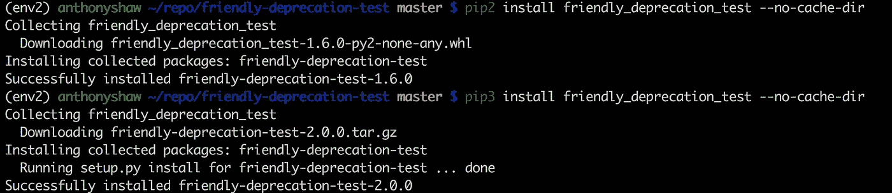

# 逐步淘汰 Python 运行时

> 原文：<https://medium.com/hackernoon/phasing-out-python-runtimes-gracefully-956f112f33c4>

对于任何包维护者来说，放弃对 Python 运行时的支持都是一项棘手的任务。

Python 2.6 不再维护，3.3 现在也不再维护，两者都与 2.7 和 3.4 中的公共子集有语法差距。当您可能希望以后只在一个包中提供 Python 3 支持时，您不希望完全冷落您的 Python 2 用户。


Python 打包权威机构一直致力于解决这个问题，结合了对 PyPi(打包服务)、打包 API、Pip(命令行安装程序)、setuptools(用于创建元数据的库)和元数据格式的更新。所有这些变化加在一起，允许包维护者向旧的 Python 运行时发布“维护版本”,向受支持的 Python 运行时发布新版本。

# 今天它是如何工作的

要将包发布到 PyPi，您需要遵循 3 个步骤:

1.  定义一个 setup.py 文件，其中包含 distutils 或 setuptools，并使用一些关于包的信息调用`setup(`
2.  如果您想包含一个车轮文件，请调用`python setup.py sdist`或`python setup.py sdist bdist_wheel`
3.  使用`twine upload dist/*`将包上传到 PyPi。

## 定义 PKG 信息

在 Python 源文件包(您下载的 zip 或 tar-gz 文件)中有一个名为 PKG 信息的文本文件。

这个文件是由 distutils 或 setuptools 在生成源文件包时生成的。该文件包含一组键和值，键列表是 PyPa 标准元数据格式的一部分。您可以看到生成文件的内容，如下所示:

`tar xvfz dist/my-package-1.0.0.tar.gz -O | cat */PKG-INFO`

在文件的顶部应该是头文件`Metadata-Version`，它**取决于**你安装的 setuptools 或 distutils 的版本。所以你要做的第一件事就是**升级 setuptools，停止使用 distutils。**

`pip install — upgrade setuptools`

Setuptools 是现在由 PyPa 维护的*包，所以确保在 setup.py 的顶部，您正在从 setuptools 模块导入设置方法。*

如果升级正确，元数据版本值应该是 1.2 或更高。元数据 1.2 [为这个包所需的 Python 版本](https://packaging.python.org/specifications/core-metadata/#requires-python)引入了一个新字段。

可以指定版本范围和排除规则，比如至少 Python 3。或者，Python 2.7 和 3.4 以后。

```
Requires-Python: >=3
Requires-Python: >2.7,!=3.0.*,!=3.1.*, !=3.2.*,!=3.3.*
```

设置这些值的方法是在 setup.py 脚本中调用`setup`。

现在，调用`python setup.py sdist`然后`twine upload dist/*`将发布这个包的版本 1，指定只支持 Python 2.7+。

## 发布前验证

因为几乎不可能在 PyPi 上编辑一个已发布的包，所以您真的想先检查一下，所以运行这个命令来验证元数据是否已经正确生成。

`tar xvfz dist/my-package-1.0.0.tar.gz -O | grep “Requires-Python”`

## 使用 Twine 发布

任何习惯于使用`setup.py`将包发布到 PyPi 的人，现在也可以停止这样做了。除了速度更快之外，Twine 还有许多优点，是目前支持的发布包的方法。

确保您使用的是最新版本的 twine(在撰写本文时是 1.9)。

# 删除 Python 版本

一旦发布了包含元数据的包，就可以进行进一步的更新，取消对 Python 运行时的支持。

必须按此顺序完成，自动回切才能正常工作。

这是一个非常典型的时间线

1.  在阅读本文之前，您发布了 1.0 版本的包
2.  在阅读了关于语义版本化的 PEP 之后，您发布了 1.1.0
3.  你看了这篇文章，在所有 2.7+版本的 setup.py 中添加了`python_requires`
4.  许多季节过去了，版本也过去了
5.  你发布了支持 Python 2.7+的 1.6.0
6.  您向您的用户宣布，您将在一个月后停止对 Python 2 的支持
7.  您将`python_requires`字段修改为> 3.3，并发布包的版本 2.0.0

> 现在，如果用户拥有 pip >9.0，并且他们从 Python 2 安装您的包而没有指定版本号，他们将获得最新版本的包来支持他们的 Python 发行版！

如果用户拥有您在`setup.py`中指定的受支持的 Python 发行版，那么他们将获得最新版本。

在我发布给 PyPi 的名为`friendly-deprecation-test`的包中尝试一下。



## 但是等等…

有人针对 v1.6.0 提出了一个严重的错误，而您不想让您的 Python 2 用户处于风险之中。你是做什么的？

1.  假设你在一个分支中有 1.6，应用这个补丁。将分支上的版本提升到 1.6.1，并用`requires_python >= 2.7`属性发布。把它释放给 PyPi。
2.  将补丁应用到主分支，并发布带有`requires_python >= 3.4`属性的 2.0.1 版本。

现在同样的过程适用，所有 Python 2 用户将获得 1.6.1，Python 3.4+将获得 2.0.1。