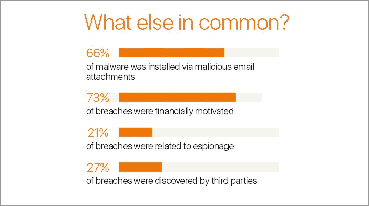
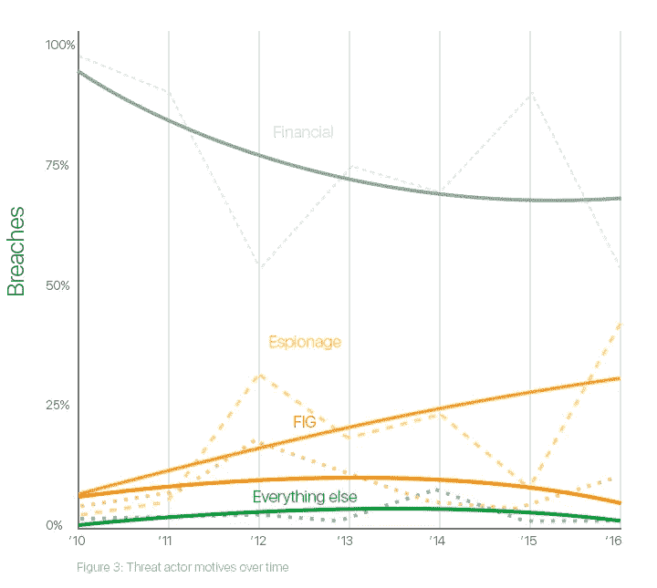
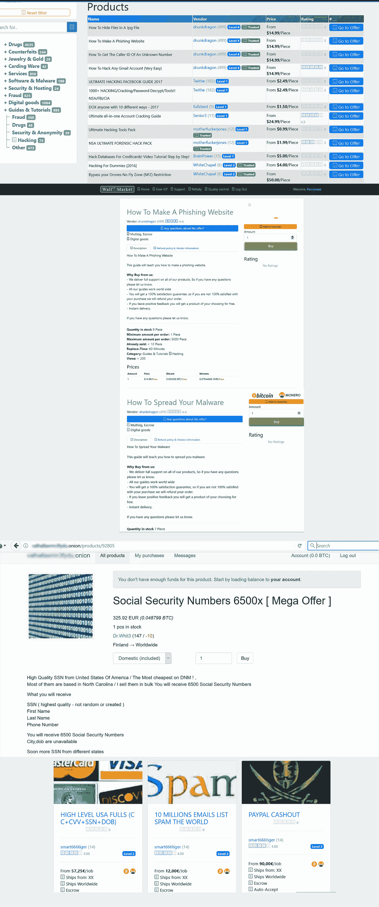
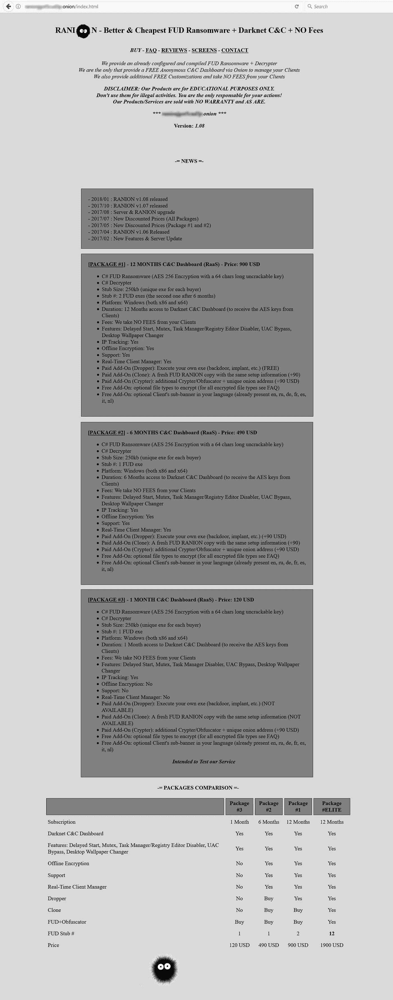
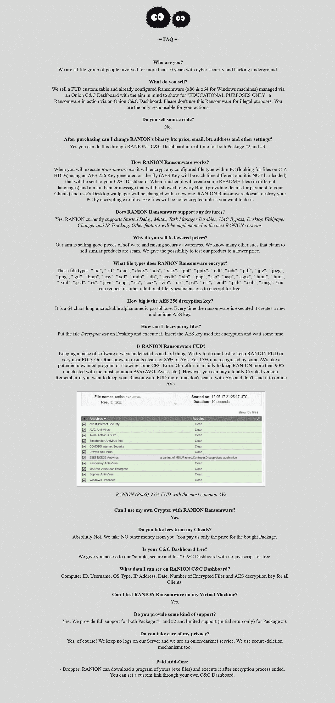
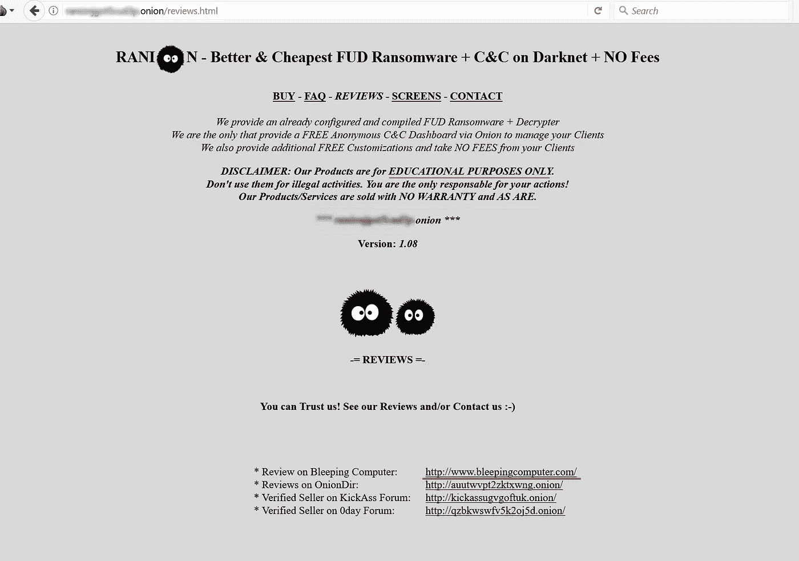
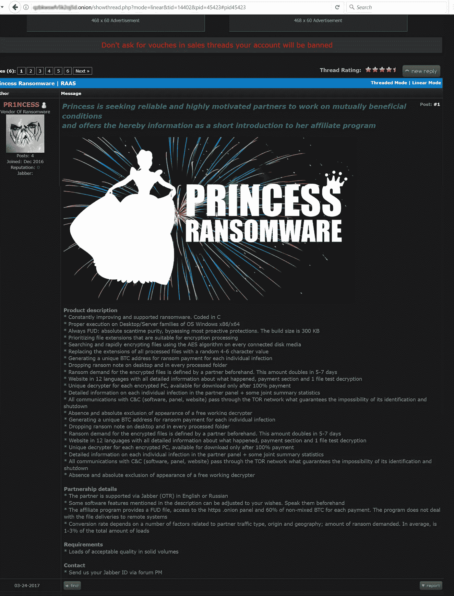
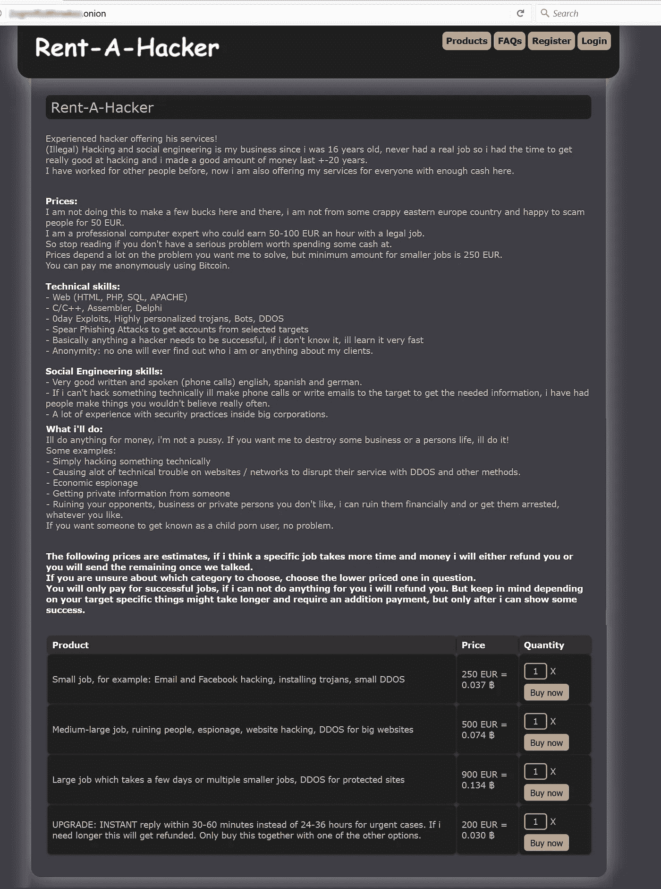

# 网络钓鱼出奇地容易实施。你的网络钓鱼安全性如何？

> 原文：<https://medium.com/hackernoon/phishing-is-surprisingly-easy-to-execute-hows-your-phishing-security-20b2e3fe56da>

偶尔，我们所有人都会偶然发现一些来自信息安全行业的新闻，通常涉及最近网络攻击或数据泄露的后果。

这些信息正在形成我们对安全形势的理解，但它并不系统，而且主要类似于我们可能会记住一段时间的一组“该做什么”和“不该做什么”。不是每个人都有时间定期研究和消化相关内容。

因此，威胁参与者及其恶意活动的报道被视为“我的 AV 或 IT 人员应该处理的事情”这种方法是幼稚的，有很多个人和组织已经通过违规和数据丢失的惨痛教训学到了这一点。研究人员和安全意识专家[同意](https://www.csoonline.com/article/2126196/security-awareness/security-awareness--helping-employees-really--get--company-policy.html)安全习惯和意识培训必须是所有组织的一项持续的集体任务。

意识培训应该为用户提供从安全方面和威胁参与者方面对现代安全格局的 360 度视角。在某种程度上，用户是两个竞争生态系统之战的奖品。然而，了解风险并了解不同类型的恶意软件和可能的攻击媒介之间的潜在联系的用户不太可能被黑客攻击。

为了更好地了解敌人，今天我们将讨论[电子邮件网络钓鱼](https://stopad.io/blog/phishing-spearphishing-security)黑客中流行的窃取凭证或传播恶意软件的商业和社会工程攻击。我们还将指出网络犯罪经济、贸易和在黑暗网络上运作的黑客的新商业模式的细节。

# 为什么网络钓鱼安全很重要？

网络钓鱼与勒索软件和其他恶意软件如影随形，后者通常充当“传送方式”。据[网络安全](https://hackernoon.com/tagged/cybersecurity)风险投资公司称，2017 年 5 月[估计](https://cybersecurityventures.com/ransomware-damage-report-2017-5-billion/)2017 年勒索软件造成的损失为 50 亿美元。然而，那年 11 月发表的长期随访评估将标准定得更高。全球损失[预计](https://cybersecurityventures.com/ransomware-damage-report-2017-part-2/)每年超过 115 亿美元，截至 2019 年底，几乎每 14 秒钟就有企业受到攻击。威胁形势正在扩大，网络钓鱼业务正在蓬勃发展，更多的对手也加入了对金钱和敏感数据的追逐。在可预见的未来，这种趋势没有停止的迹象，因此，对每个互联网用户来说，保持消息灵通是至关重要的。

此外，根据网络钓鱼实验室的 [2017 年网络钓鱼趋势和情报](https://pages.phishlabs.com/rs/130-BFB-942/images/2017%20PhishLabs%20Phishing%20and%20Threat%20Intelligence%20Report.pdf)，威胁参与者一直在调整攻击的赚钱方式，从简单地使用受害者的凭据立即窃取资金，转变为重复使用凭据，希望获得更多*帐户的访问权限*。

货币化类型也在多样化。

现在，在暗网市场上出售大量证书越来越普遍。随着方法的变化，由于双因素身份认证的使用越来越多，网络骗子越来越注重获取受害者的电话号码。

# 网络钓鱼威胁的状态如何？

[威瑞森数据泄露调查](http://www.verizonenterprise.com/verizon-insights-lab/dbir/2017/) 2017 年报告显示，网络钓鱼和社会工程技术代表了“98%的涉及社会行动的事件和泄露”高达 95%的导致漏洞的网络钓鱼攻击都与恶意软件安装有关。一般来说，在 66%的情况下，恶意软件通过电子邮件附件安装。这些发现是基于 1616 起事件和 828 起已证实的披露的数据集。

*Email is the primary channel for malware delivery. Source: 2017 Verizon Data Breach Investigations Report*

有趣的是，根据为报告做出贡献的组织的数据，300 多万独立用户中有 7.3%被引诱点击恶意链接或打开附件。此外，15%的受害者第二次被骗。3%点击了两次以上。少量用户点击超过 3 次。这些统计数据不应该仅仅归因于用户的轻信，因为威胁行为者正在不断提高他们的欺骗电子邮件的质量。

# 驱动网络钓鱼攻击者的是什么？

关于威瑞森 DBIR 列出的威胁行为者的动机的发现与其他研究人员的观察结果一致: **66%的涉及社会行动的案件是出于经济动机，间谍活动分别以 33%的比例位居第二。**对手参与网络钓鱼的其他原因包括乐趣、意识形态(黑客行动主义)和怀恨在心(前员工)。

*Motivation behind malware distribution and attacks according to 2017 Verizon Data Breach Investigation Report*

# 网络钓鱼业务的黑暗网络和影子经济

从对手的角度来看，网络钓鱼是一种有效的工具，为他们有利可图的业务提供动力。如前所述，他们以多种方式赚钱，其中一些公众看不到。

虽然我们大多数人都在使用可见网络(搜索引擎索引的互联网部分)或深度网络(搜索引擎不索引的网络部分，如您的电子邮件帐户)，但对手交易，如出售受害者的个人数据，发生在互联网的“隔离”部分，即所谓的暗网。

使用黑暗网络的一个动机是，没有特殊的软件就无法访问它。它的分散性和通信协议更大的匿名性是政府机构和执法部门无法严格监管它的原因之一，偶尔关闭单独的黑暗网站除外。然而，这并不意味着黑暗网络是 100%匿名的，完全不受监控——[在其中一个网站上购买炸弹](https://www.mirror.co.uk/news/uk-news/teen-who-bought-car-bomb-11842231)会让你锒铛入狱。

市场上不乏各种非法商品出售，从毒品到信用卡凭证和恶意软件。支付以[加密货币](https://stopad.io/blog/cryptomining-malware-what-to-expect-2018)(比特币、Monero 等)处理。)这有助于更大的匿名性，如果满足某些预防措施的话。由于这个原因，黑客社区在黑暗网络上相当活跃，人们可以找到各种各样的服务出售和黑客出租。

开展网络钓鱼业务比以往任何时候都容易

为安全研究人员每天提供新威胁的黑暗网络经济的很大一部分是基于恶意软件商业模式的演变。如今，编码技能不再是决定通过分发恶意软件赚钱或进入网络钓鱼业务“利基”的人的先决条件。由于在黑暗网络和一些可见网络的黑客论坛上推广的新类型的提议，入门级别要低得多。它们被称为勒索软件即服务(RaaS)或网络钓鱼即服务(PhaaS)。商业模式是从合法的软件供应商那里借来的。

基本上你再也不用自己写恶意代码了。可以买！

高度熟练的恶意软件作者努力创建 RaaS 或 PhaaS 软件，并提供给经验不足的罪犯。在某些情况下，他们可能会更进一步，开发一种结合统计仪表板和控制面板的联盟平台，供客户使用。

网络犯罪正变得越来越有组织性和结构化，就像他们在 infosec 和 AV 行业的对立一样。对手实施的组织模式中，每个参与者承担一系列特定的任务，从开发特定的黑客工具，到通过众多黑暗网络渠道进行营销和分销。黑客提供全面的服务，包括支持和基础设施出租，非常像软件即服务(SaaS)公司。

事实上，任何能够进入黑暗网络的人，都可以付钱给 RaaS 作者，开始他们自己的敲诈活动。RaaS 分发可以通过购买 PhaaS 产品和电子邮件地址数据库来完成。威胁作者使用不同的支付模式，从一次性支付到每个受害者支付赎金的固定收入分成百分比。一些 RaaS“产品”建立在某些勒索软件家族的基础上，它们的进一步定制引发了更多在网络上传播的新菌株。

让我们来看看一些提供黑客工具和服务的黑暗网络市场。

*Dark web marketplaces offer guides on phishing business, malware distribution as well as stolen personal data.*

有许多市场出售黑客教程和各种类型的个人数据，如电子邮件、信用卡信息、社会安全号码等。

卖家有评级，买家可以根据他们的经验留下评论，就像在可视网络上的合法网站一样。黑暗网络参与者通过提供“满意保证”政策和“支持”来拥抱客户服务实践然而，欺诈在黑暗网络上普遍存在，毕竟是骗子与骗子之间的交易。

这个名为“Ranion”的 RaaS(勒索软件即服务网站)已经存在了一段时间，提供配置和编译的勒索软件工具以及基于黑暗网络的命令和控制仪表板。这使得威胁者可以秘密地进行勒索和收取赎金。勒索软件作者根据价格提供了几个具有不同功能的软件包。他们还吹嘘使用了牢不可破的加密技术。请注意虚假的免责声明:“我们的产品仅用于教育目的”——这是一个相当弱的幽默尝试。

*Ranion RaaS main page*

Ranion Ransomware FAQ 为潜在买家提供信息，包括它加密的文件类型、支持和付费插件。具有讽刺意味的是，RaaS 作者甚至承诺用他们的无日志服务器政策来保护购买者的隐私。

*Ranion RaaS FAQ: support, privacy and other info to convince “potential customers”*

最后，拉尼翁 RaaS 网站最有趣的部分，评论。网站所有者自豪地链接到合法的安全网站[bleeding computer](https://bleepingcomputer.com/)，该网站发布了一篇关于他们“产品”的文章。

*Ranion RaaS Reviews section*

另一个 RaaS 列表是我在 Dark web 上看到的一个黑客论坛。它被称为“公主”，内置了检测旁路和规避功能。克鲁克斯还声称没有免费解密器存在，将来也不会存在。

“合作关系”一节中列出的条件类似于合法软件供应商在广告网络上向分支机构宣传其报价的条件，包括佣金结构。他们提出犯罪集团和勒索软件分销商之间 60%的收入分成交易，这是一个非常标准的交易。此外，还提供了附属机构通常从计划中请求的其他传统服务，如合作伙伴仪表板、支持和产品本地化。

Princess RaaS authors recruiting distribution partners on Dark web hacking forum

黑暗网络也是一个不太道德的黑客提供服务的地方，这里有一个例子让你看看。

Rent-A-Hacker website contains “product packages” and hacker’s “CV”

# 关于网络钓鱼业务的最后一句话

电子邮件是伴随互联网的最便捷的发明之一，但同时它也是个人在线安全和 it 基础设施的致命弱点。网络犯罪生态系统的变化和按需恶意软件的日益增多要求用户和组织采取新的方法。

依赖于终端保护和基于签名的检测的旧模式在当今的威胁形势下已不再可行。网络骗子不断创新，如果跟不上，很可能会导致财务损失或数据泄露。现代企业安全应该以预防、主动监控和沙箱技术为目标，在整个大型基础架构中部署这些技术。适当的自动化水平对于 IT 团队保持控制、可见性和充分利用电子邮件安全框架至关重要。

投资于包括[模拟网络钓鱼攻击](https://www.forbes.com/sites/lisabrownlee/2015/10/07/security-simulated-phishing-attacks-yield-37-percent-return-on-investment/#516275912241)在内的持续员工培训的公司更有可能避免网络安全攻击的后果，并识别出安全技能可能需要提高的员工。