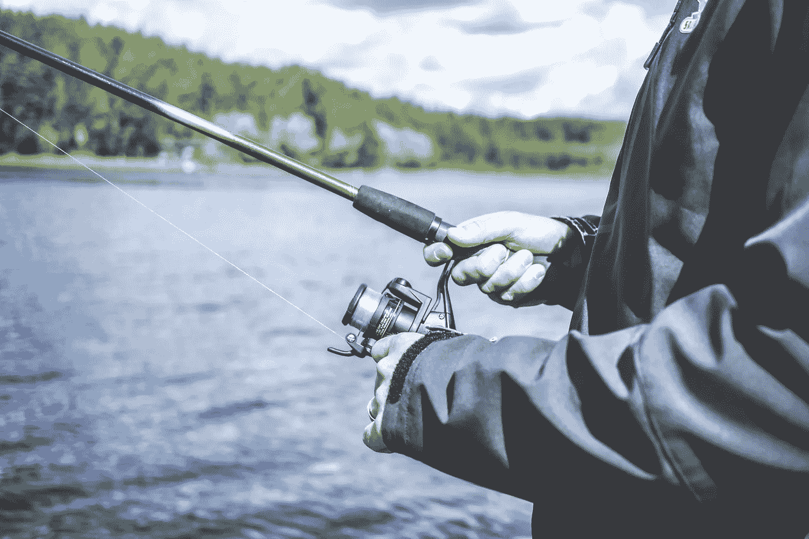
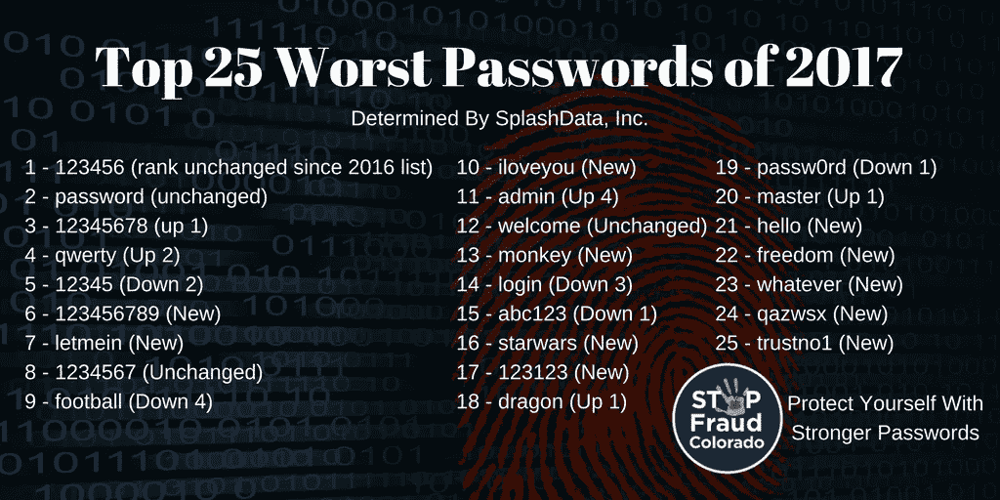
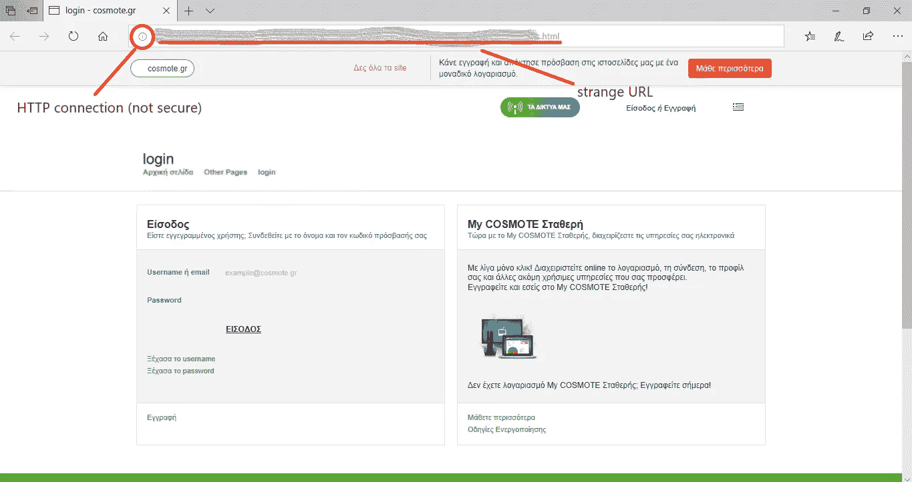
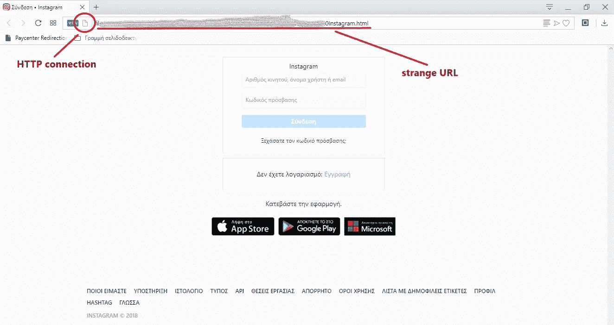
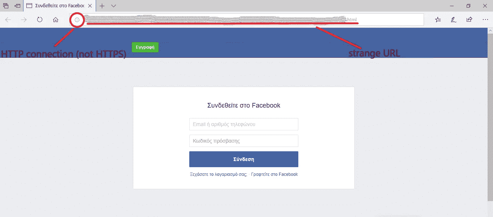

# 钓鱼…我的爸爸，哥哥和女朋友

> 原文：<https://medium.com/hackernoon/phishing-my-dad-brother-and-girlfriend-a-simple-social-engineering-experiment-1130d551c66f>

## **一个简单的社会工程实验**

今天很多人经常生活在网络安全和隐私的幻觉中。我们在家里或咖啡店的公共 WiFi 上查看电子邮件、登录账户、相互发信息、进行银行支付或只是浏览网页，认为我们的在线行为只有我们自己能看到。

对于技术专业人员或计算机科学学生来说，这种*幻觉*可能根本不存在，它可能看起来像是每个人都应该意识到的显而易见的事情。

不幸的是，尽管我们的技术发展迅速，应用广泛，但公众在这些问题上的相应知识却不成比例。

人们意识不到互联网带来的危险真的有那么奇怪吗？我会说不！！当一个人不知道事情如何运作的一些基本事实时，他怎么能理解事情有多危险呢？他们怎么能意识到侵犯隐私和黑客攻击会发生在他们身上，而这并不是我们只在新闻中听到的遥远的事情？

以下是一份关于现代技术教育的清单:

为了支持我的观点，我在我爸爸、哥哥和女朋友身上做了一个简单的**实验**。

在这个实验中，我使用了网络钓鱼，一种社会工程的形式。

*在信息安全的背景下，社会工程指的是对人们进行心理操纵，使其采取行动或泄露机密信息。*([https://en . Wikipedia . org/wiki/Social _ engineering _(security)](https://en.wikipedia.org/wiki/Social_engineering_(security)))

*网络钓鱼是一种欺诈行为，通常出于恶意目的，通过伪装成电子通信中值得信赖的实体来获取用户名、密码和信用卡详细信息(以及金钱)等敏感信息。*([https://en.wikipedia.org/wiki/Phishing](https://en.wikipedia.org/wiki/Phishing))

所以这个实验很简单:

我制作了三个不同的*假*网站，每一个都根据我的受害者的兴趣，并给他们发了一封电子邮件，试图说服他们跟随一个链接到编造的网站，并留下他们的凭据。

这个故事的目的不是展示钓鱼技术是如何实现的。相反，网络钓鱼实际上是可以用来实现我们目标的技术含量最低的方法之一。

我也已经更新了每个“受害者”的身份证明，所以我避免了任何误解。

*   **爸爸**

**年龄:** 50 岁

**目标站点:** ISP 服务账户

**结果:** *上钩了！*尽管他收到邮件的邮箱账户不是注册时 ISP 给他的，尽管发件人和给定的链接(网址缩写，不是 HTTPS)都很可疑，但他还是提供了所有的凭据。

*   **哥哥**

**年龄:** 12 岁

**目标站点:**社交网络账户

**结果:**上钩了！不幸的是，和我爸爸一样，我弟弟也没有看到所有的危险信号，没有反抗就放弃了他的用户名和密码。

*   **女朋友**

**年龄:** 20 岁

**目标站点:**社交网络账户

**结果:** *没上钩！！我的女朋友注意到她收到的提醒她更改密码的邮件不是她注册社交网络账户时使用的那个。她选择无视这封邮件。*

然而，她并不担心奇怪的链接，电子邮件的发件人或事实上，她应该是被要求以这样的方式，通过电子邮件给她的凭据。

她可能没有上钩，但也很险…

**结论:**

像学校这样的机构开始对年轻人进行技术教育是非常重要的。这应该在实践中进行，而不仅仅是在理论上。

年轻人似乎总是与新技术有更好的关系和更多的摩擦，重要的是这种接触是安全的。训练新一代发现并避免网络威胁也可能对老年人产生积极影响。

在过去，是我们的父母告诉我们在街上不要和陌生人说话，并与我们分享他们的经验和建议。也许现在是年轻人告诉他们的父母不要在网上和陌生人说话的时候了…

## 学到了什么？按住👏来支持和帮助别人找到这篇文章。感谢阅读！！

**在推特上关注我**[**@ konpap 1996**](https://twitter.com/konpap1996)