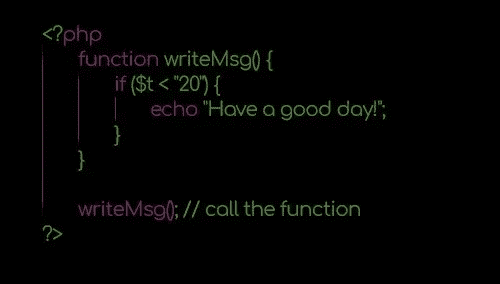
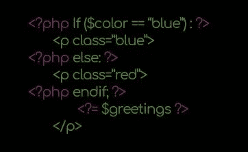

# 专家 web 开发人员的 PHP 基础知识(1 部分)

> 原文：<https://medium.com/hackernoon/php-basics-for-expert-web-developers-1-part-8a35d408d2ea>


在这个系列中，从这篇博客开始，我将向你解释为了开始你作为一名使用 PHP 的 web 开发人员的旅程，你必须学习什么。

事实上，

这将是一系列完整的教程和详细的解释，适合初学者和有经验的程序员。

这里的信息让我为我的第一份工作做好了准备，并提高了我的基本技能，这对理解这种语言更复杂的特性非常有用

…从今天起，你将能够做同样的事情。

# PHP 的复兴

# 起源

如果你现在在这个页面上，很可能你已经听说过 [PHP](https://hackernoon.com/tagged/php) 至少一次。

**PHP 是有史以来最著名、最持久的编程语言之一**。

PHP 是一种解释型的服务器端脚本语言。

这一长串单词意味着你写的代码是由解释器执行的。

PHP 通常与 Apache 和 Nginx 等 web 服务器一起使用，以便为 web 页面提供动态内容。

这只是它的特点之一。

事实上，

它还可以用来构建令人惊讶的强大命令行应用程序。

这是一个只有少数开发人员实践的特性，

我希望继续阅读这篇文章，你会成为他们中的一员。

老实说，

PHP 有一个问题重重的过去，

一开始，它是由[拉斯马斯·勒德尔夫](https://en.wikipedia.org/wiki/Rasmus_Lerdorf)编写的 CGI 脚本集合。

一个半丹麦半加拿大的程序员，1968 年冬天出生在格陵兰。

传说中，他想跟踪登陆他的在线简历的访客数量，所以他创建了一个 CGI 集合，并将其命名为个人年龄工具。

发现了吗？

当时，它与该语言的当前版本完全不同，它只提供了几个变量和一个 HTML 嵌入式语法。

旧石器时代！

从 1994 年到 1998 年，PHP 被重新访问、重置和重新启动了无数次。

将 PHP 从 CGI 集合转化为我们今天所知的语言的过程始于两位开发者，来自 Tel Haviv 的 Andi Gutmans 和 Zeev Suraski 决定加入 Rasmus 的项目。

如前所述，这是一个令人精疲力竭的工作，但是在几年后的 1998 年 6 月 6 日，最终的成果终于发布并命名为 PHP 3。

虽然仍然不同，但这是第一个具有稳定语法的版本，看起来像我们现在看到的代码。

在它最重要的特性中，有对各种数据库、协议和 API 的可扩展性。

这些以及代码的简单性是 PHP 吸引如此多开发人员的主要原因。

PHP 正式发布仅仅几个月后，就已经征服了世界上 10%的网络服务器。

当然，互联网并不像今天这样随处可用，但它仍然是一个相当令人敬畏的统计数据。

# 现今

在经历了近十年的炼狱之后，现在事情开始迅速加速。

多亏了十几个核心团队开发者，PHP 在其第 7 版中有了令人难以置信的提高。

[看看上一个版本中的特性列表。](http://php.net/releases/7_3_0.php)

不仅它的速度和受欢迎程度现在已经达到了像 Python 或 NodeJs 这样的时髦语言，而且实践也在不断改进，使得 PHP 的创建更加安全和易于管理。

**几年前，正常的部署流程是编写 PHP 文件，使用 FTP 将它们上传到生产环境，并在文件到达实时服务器后验证一切是否正常。**

除了耗时之外，我不需要解释为什么这是危险的。

现在，我们可以利用 Git 这样的版本控制软件来管理我们的所有版本，我们可以分支、分叉、合并等等。

同时，我们可以通过使用流浪者和码头工人来确保本地环境与生产环境完全一样。

此外，我们可以使用 Composer dependency manage 下载的包从项目外部获得我们需要的部分脚本。

我们有 PSR，它定义了我们真正想要遵守标准。

我们自动化了代码测试，PHPUnit 在整个开发阶段扮演着重要角色。

最终，我们通过操作码缓存提高了应用程序的性能。

在接下来的几年里，我们将会采用几十种，也许几百种新的实践。

这看起来势不可挡，确实如此，但同时对语言的未来和 web 开发人员的职业生涯都是有益的。

…

在本文接下来的部分中，您将了解 PHP 7.0 及更高版本的基础知识，

当有这种情况时，我会链接到我做过的其他帖子的某个特定部分。

例如，关于全新的 [PHP 7.3](http://anastasionico.uk/blog/php-73) 和[面向对象编程](http://www.anastasionico.uk/blog/the-complete-guide-to-object-oriented-programming)的主题。

未来将会有关于 PHP 框架或 MVC 架构模式的信息。

很好。
现在，
让我们切入正题。

# 最基本的

# PHP 101

正如我在上面所写的，PHP 是一种解释型语言，

解释器获取命令(也称为语句)，并将其代码“翻译”成任务，

一个 PHP 脚本由几个不同的语句组成，解释器知道一个命令什么时候结束，另一个命令什么时候开始，它们之间用分号隔开。

尽管实际上可以在一行中编写应用程序的所有 PHP 代码，并且不包含空格，但是建议(尤其是如果您关心自己的心理健康)大量使用缩进。

您可以编写由大括号{}表示的单个语句或代码块



语言结构不区分大小写，但常量和变量名区分大小写。

这意味着$var、$Var 和$VAR 是三个不同的变量，有三个不同的值；

不要忘记查看[官方手册](http://php.net/manual/en/language.variables.php)

创建和调用变量时要小心

在大多数情况下，您最终会将 PHP 作为一种服务器端语言，用它来构建网页。

PHP 在早期变得如此流行的原因之一是它非常容易在 HTML 页面上实现，PHP 解析器只解析特定标记内部的代码，甚至不检查外部的代码行。

在一个页面中包含 PHP 有不同的方法，其中一些现在被弃用，一些不再被使用。

目前推荐的唯一分隔符标签是。

第一个是最常见的，用于指示代码块的开始和结束。

第二个只是一个捷径

```
<?php doStuff(){} ?><?= $var ?>
<?php echo $var ?>
```

使用 echo 标签有助于保持语法简短和代码整洁。

我坚信应该创建聪明整洁的代码，

无论[网站开发](https://hackernoon.com/tagged/web-development)是你的职业、你的激情还是你很幸运两者兼而有之，你都会花大量时间在电脑屏幕前阅读和编写代码。

不得不处理到处都是标签和语句的混乱代码会让你的眼睛很快疲劳，这种感觉会很快转移到大脑，结果将是错误和在屏幕前花费更多的时间。

这两个标签在代码的某些部分的变体足以解决这个问题，并使代码更容易阅读。



看看上面的图片，

这是正在发生的事情:

PHP 解析器将评估第一个条件语句，因为它在 PHP 标签中

然后，根据变量$color 的值，代码将使用类 blue 或 red 创建一个“p”标记。

echo 标记最终将回显变量$greetings 的值，HTML 将关闭该段落。

(这段代码也适用于 if 语句中的花括号)

我可以给你一个小提示，不要在 PHP 文件中使用结束标签。

"?>"将创建一个新行，发送给 PHP 解释器，可能会干扰页面的 HTTP 头，或者导致其他一些副作用。

不关是好的做法吗？

# 结论

“千里之行始于足下。”老子

你在这篇文章中看到的是 PHP 的历史和一些非常简单的例子，以及它应该如何在你的网页上实现。

把这篇文章看作是掌握这种服务器端语言的漫长旅程中的第一小步。

在接下来的几周里，我们将关注不同的基本方面，比如语言的构造，变量的类型等等。

虽然这个系列对于一个专业的 web 开发人员来说可能看起来很简单，但是你会看到几个细节，而且我可以保证很少有人会知道这些页面上将要写的所有内容。

所以，

请继续关注并订阅，以便在新帖子发布时收到通知。


*如果你喜欢这个内容并且你渴望更多的* [*加入脸书的社区*](https://www.facebook.com/anastasionico.uk/) *，在这里我们分享信息和新闻就像这个一样！*