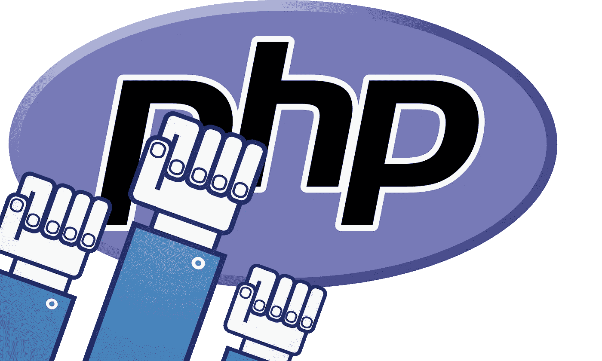
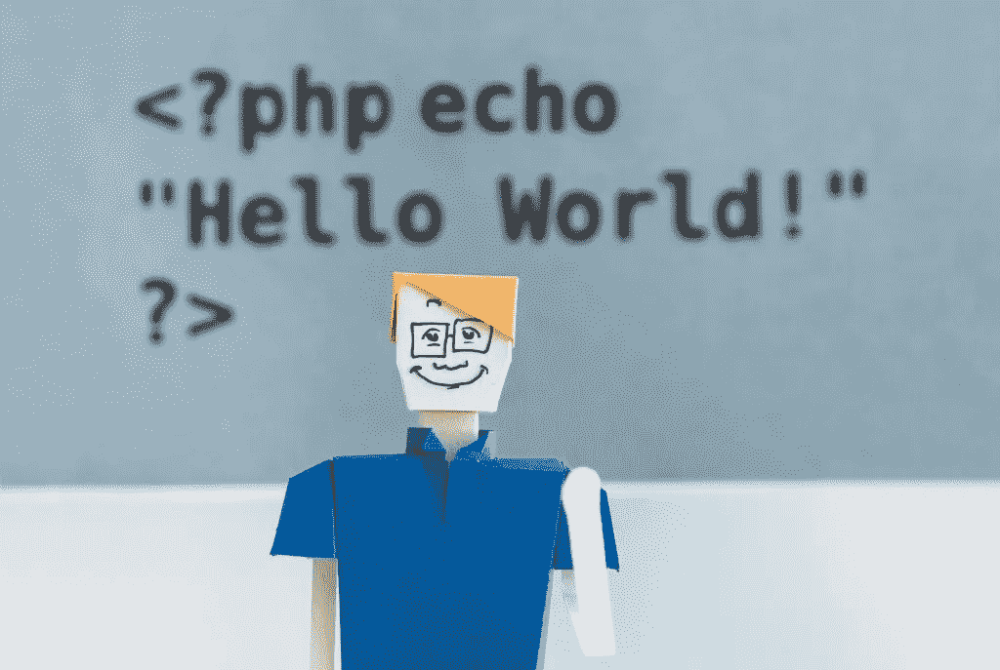

# PHP 死了…PHP 万岁！

> 原文：<https://medium.com/hackernoon/php-is-dead-viva-le-php-f5dc5eb5c9c4>

关于 Gutenberg 和 WordPress 的争论是 PHP 死亡的最新一幕。大家深呼吸一下。让我们忽略巨魔，看看马克·吐温、菲德尔·卡斯特罗和 PHP 有什么共同点——更重要的是，为什么 PHP 仍然是初创公司和小企业的合理选择。

# PHP 是什么时候开始消亡的？

看起来“PHP 已死”的博客帖子在 2011 年开始出现(如果你发现旧的，请告诉我)。如果你搜索一下 Medium 和像蘑菇一样冒出来的编码训练营，唯一的共同点是每个人都讨厌 PHP 或者干脆忽略它。显然，不可能一边喝着高价咖啡，一边留着涂油的胡子，穿着讽刺的 t 恤，用 PHP 编程。

扯淡。

适可而止。我经常和那些因为反 PHP 的回声室而准备做出可疑商业决策的创业者交谈。

现实是这样的:[截至 2018 年](https://w3techs.com/technologies/details/pl-php/all/all)，近 80%的互联网都在 PHP 上运行。

我猜 PHP 还没死。

# 神话

PHP 没有伸缩性。尾灯。维基百科完全运行在 PHP 上，是互联网上访问量第五大的网站。还有一个叫脸书的使用 PHP 的小网站，听说过吗？

PHP 很慢。当然，旧的 PHP 可能会很慢。争论就像声音说 OS X 是一个糟糕的操作系统，因为我的第一个苹果 IIe 很慢。PHP 7 非常快，甚至比 Python 快三倍。

# PHP 大放异彩的项目

当我与需要网站的企业主交谈时，我的第一个建议是考虑基于 PHP 的 CMS，比如 Drupal。甚至用 PHP 构建一个定制的 CMS 也在大多数小企业的预算之内。我经常得到喃喃的回应，“但是[超级昂贵的小众技术 X]呢？”

不要误解我，我管理过机器学习、高负载系统和前沿 JS 的项目。我不是勒德分子。我是一名商人，这就是为什么我执着于为我合作的每家公司找到完全正确的技术。

PHP 非常适合整合内容驱动的网站。我接触的大多数企业都需要易于更新、更改内容、添加博客文章和使用模板管理的网站。对于非技术人员来说，所有这些都很容易做到，不会损坏任何东西。

电子商务也是如此。需要专注于销售而不是编码的企业主使用 Magento 这样的开箱即用平台。别担心，你仍然可以在后台运行 PHP 的电子商务网站上销售胡子油。我不会告诉任何人。

没必要就此打住。像 Symfony 这样的高级框架可以处理各种应用程序的复杂业务逻辑。PHP 是构建 API 的绝佳语言，可以很好地与 React、Vue 和 Angular 等现代前端框架兼容。

# PHP 的商业意识

让我们回到 80%的 web 运行在 PHP 上。翻译成经济学，这意味着有大量的 PHP 开发人员。对你有利的一面是:

1.  雇佣开发人员要容易得多。祝你好运，为你决定用某个模糊框架做的项目找到一个新的开发者。
2.  开发成本更低，因为市场上有大量的开发人员，而且不需要重新发明轮子——有大量的开源项目可供借鉴。

不管出于什么原因，初创企业缺乏基本的商业头脑。下一次，当你听到有人用一些关于区块链和机器学习的语言描述他们简单的 web 应用程序时，只要点头并平静地解释为什么 Laravel 或 Symfony 在 99%的时间里都能正常工作。总之不要相信自己市场部的炒作。

对于创业公司来说，我怎么强调这一点都不为过。看看 PHP 生态系统中的解决方案。通常，通过使用 PHP，您可以用很少的成本和开发时间来执行您的业务逻辑。

# 高级开发人员带来的视角

真正的高级工程师会带来清醒和广阔的视角，这是你在与有两年互联网经验的“高级开发人员”交谈时所没有的。当你使用像 PHP 这样可靠的技术时，很容易找到有 10 年经验的专家。

对于企业家来说，和有经验的工程师一起去可以省钱。从一开始就更快、更高质量地打造你的 MVP，而不是试图通过雇佣一个初级团队来“节省”资金。Finder 高级开发者在使用 PHP 和 Symfony、Laravel 等框架时要现实得多。

# PHP 的九个生命

我们可以一直希望 2019 年将最终结束关于 PHP 死亡的博客帖子。话又说回来，也许没有人知道我的秘密会更好。正是因为像 PHP 和 Ruby 这样的令人敬畏的语言，我可以使用高级开发人员以不到 15k 的价格制作出[MVP。](https://hackernoon.com/idea-to-app-for-under-15k-reality-or-not-399fcd21507e)

PHP 是编程语言的菲德尔·卡斯特罗；毕竟卡斯特罗比五位下令暗杀他的美国总统都要长寿。当然，就像关于马克·吐温去世的报道被夸大了一样，称一种为 80%的网络提供动力的语言已死显然是荒谬的。

PHP 万岁！

最初发布在 [eTeam 的博客](https://eteam.io/blog/php-is-dead-viva-php/)。