# 深度学习计算机视觉专家的物理学

> 原文：<https://medium.com/hackernoon/physics-for-the-deep-learning-computer-vision-expert-bb1fe996352e>

*作者:* [*朱迪·吉乔亚*](https://medium.com/u/53ba2bb84284?source=post_page-----bb1fe996352e--------------------------------) *和* [*亚历山大·卡德林-奇涅维特*](https://medium.com/u/1aa50203b071?source=post_page-----bb1fe996352e--------------------------------)

[杰瑞米·霍华德](https://medium.com/u/34ab754f8c5e?source=post_page-----bb1fe996352e--------------------------------)最近，fast.ai 的一名学生给我们发了一个帖子，询问 MRI 的 housefield 单位转换。

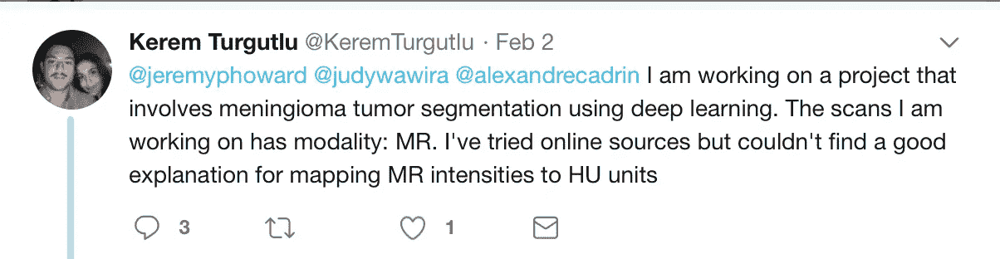

Question

这篇文章总结了 MRI 和 CT 扫描图像形成的物理学概述，以帮助理解强度和映射的概念

对于不耐烦的读者来说，亚历山大·卡德林-夏内韦尔回答了这个问题

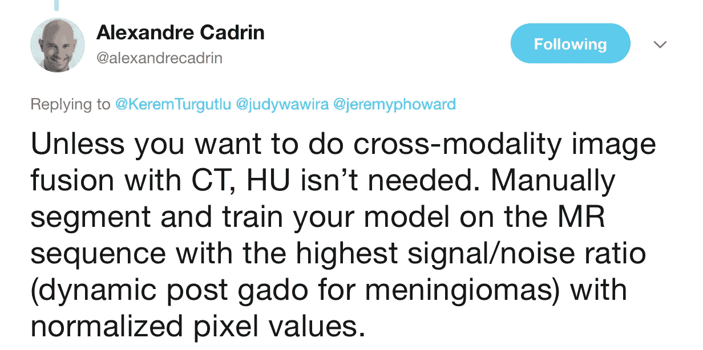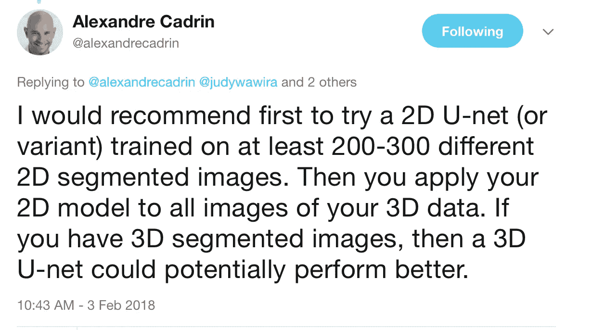

如果对此感兴趣，请继续阅读。

## 什么是情态？

放射学依赖于各种类型的相机(或**模态**)——它们以不同的方式从患者那里捕捉图像。这些技术包括超声波、计算机断层扫描(CT 扫描)、磁共振成像(MRI)、PET/CT 和普通 x 射线。是的，想想用于医学成像的不同相机类型的各种形式。在下图中，您可以通过不同的摄像机(设备)看到肝脏的外观

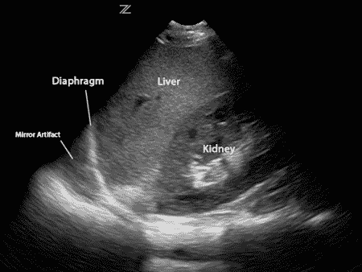

Liver images aquired through ultrasound

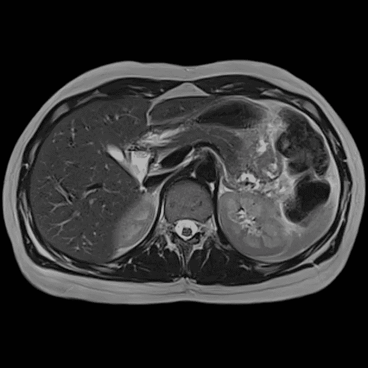

Images of the liver / upper abdomen acquired from an MRI

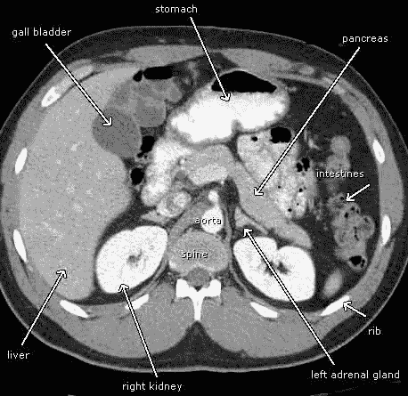

CT scan images of the upper abdomen including liver

## 磁共振图像是如何形成的？

> 磁共振成像的物理过程可以概括为**信号产生、图像形成和序列**。

## 答:信号生成

我们的身体大部分是由水组成的(我们身体的 72%是由水组成的)。水由两个氢分子和一个氧分子(H2O)组成。这转化为我们体内大量的氢分子。氢是一种原子序数为 1 (H+)的化学元素。

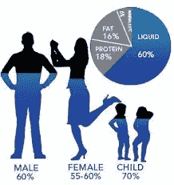

Water composition in the human body

MRI 机器是一个大而强的磁体(单位特斯拉用于表示主磁体的强度)。当你坐在核磁共振成像机的核心位置时，例如头部核磁共振成像，那么你体内的大部分氢原子都与主磁体(b0)的方向一致。这称为**纵向磁化。**

静止时，你所有的氢原子都在轴上旋转——观看下面标记的视频，了解[进动](https://youtu.be/ty9QSiVC2g0)

既然我们知道了主磁体的强度(B0)，那么我们就可以计算出 Lamor 频率，它可以用来对进动的氢原子产生信号。

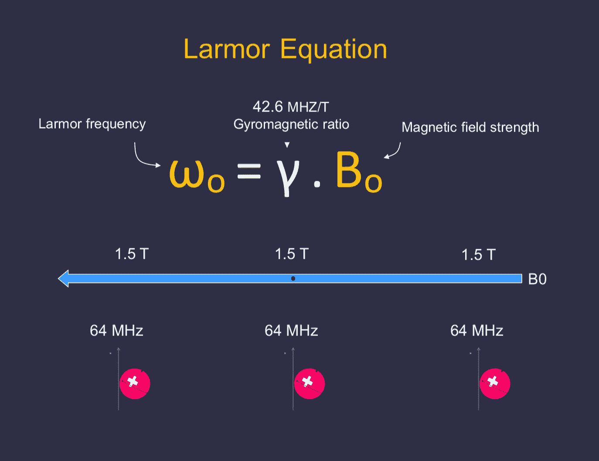

lamor frequency

在上图中，H+以 64 MHz 的进动频率均匀分布在磁场中。进动频率的知识允许我们通过移动磁场来聚焦于身体的一部分，例如腹部，这样我们就可以将信号应用于以预定频率旋转的特定原子组。

除了主磁场之外，MR 机器还具有射频(RF)信号，该信号垂直(90 度)施加到主磁体，并将氢原子相对于主磁体翻转 90 度。我喜欢把这看作是调谐到收音机的过程，你总是在寻找一个特定的频率。这叫做**横向磁化**。氢原子继续它们的进动，但也失去能量去一个较低的能量状态(在主磁体的方向)。

以上步骤总结如下…

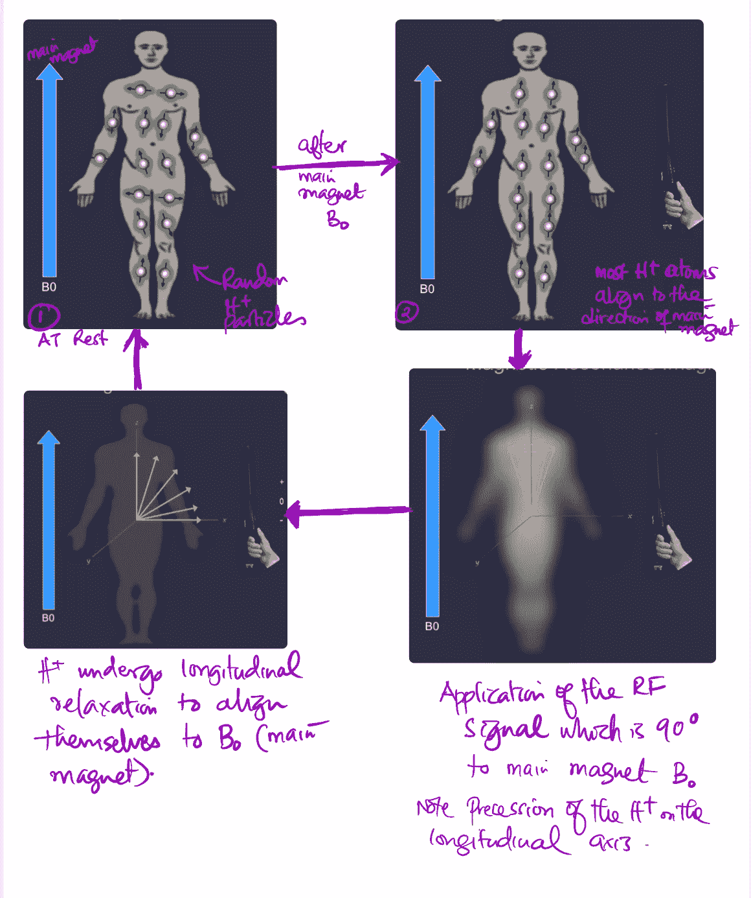

Recap of signal generation

当氢原子失去能量使它们自己对准主磁体的方向时(**纵向弛豫**，它们产生的信号可以被捕获并绘制成如下所示的曲线。该曲线用于确定 **T1 时间** —

T **T1 时间** — *质子恢复 63%纵向磁化所需的时间。*

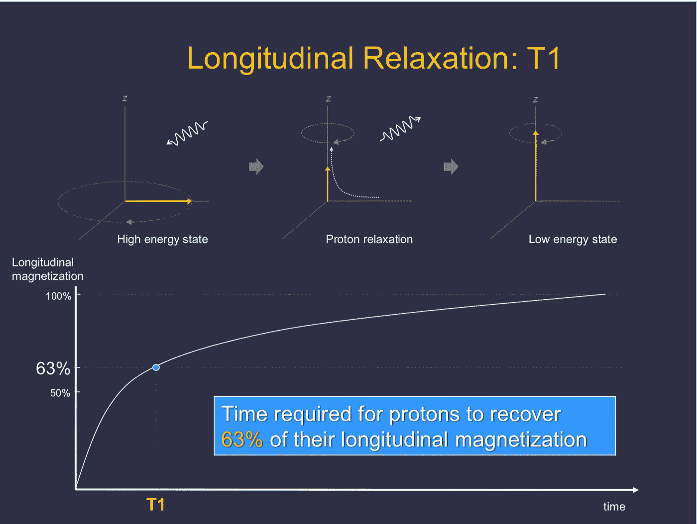

T1 — time required for protons to recover 63% of their longitudinal magnetization

不同的身体组织会有不同的 T1 时间，因此当你看磁共振成像时，你可以识别脂肪(短 T1)和脑脊液。

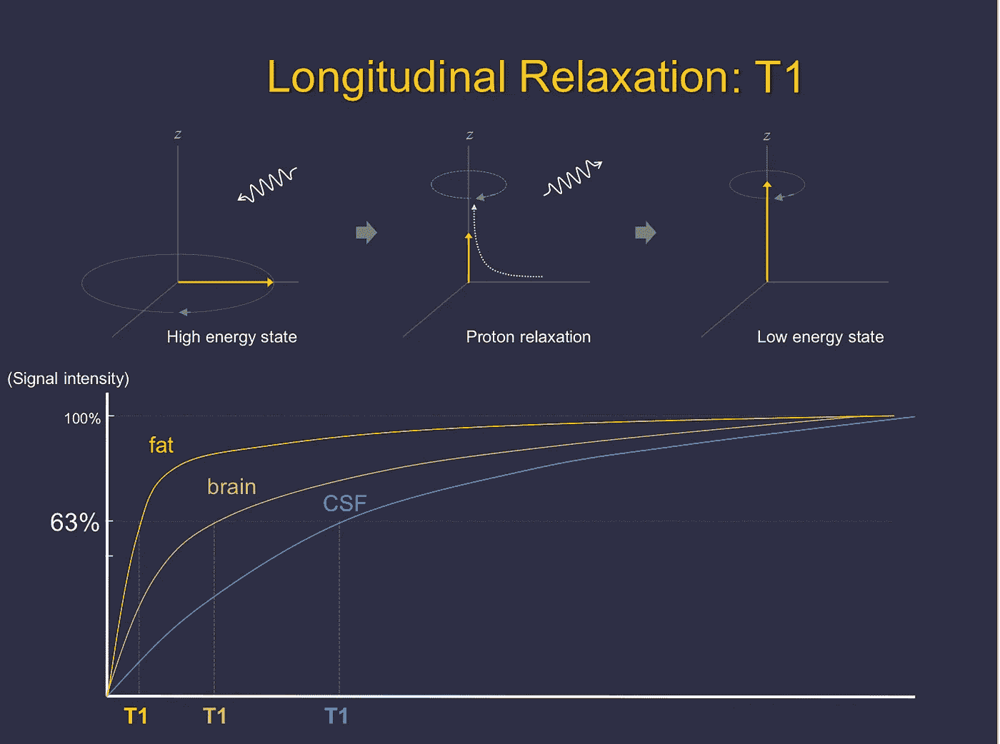

Difference in T1 curves across various tissues

90 度射频之后出现的另一个现象总结如下。氢原子在 90 度 RF 脉冲开始时是同相的，但是它们经历自旋-晶格相互作用并变得异相。如果你画出这条**自由感应衰变**的曲线，那么你会得到一条 **T2*曲线。**

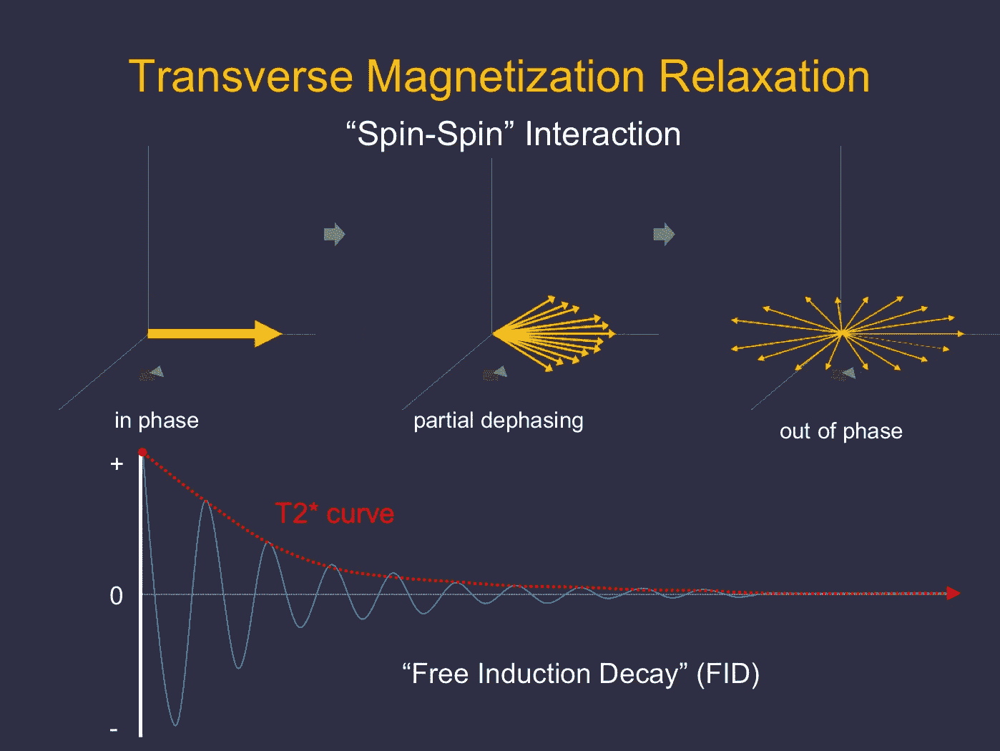

T2 * curve

T **T2 时间** *—质子失去 63%横向磁化所需的时间。*

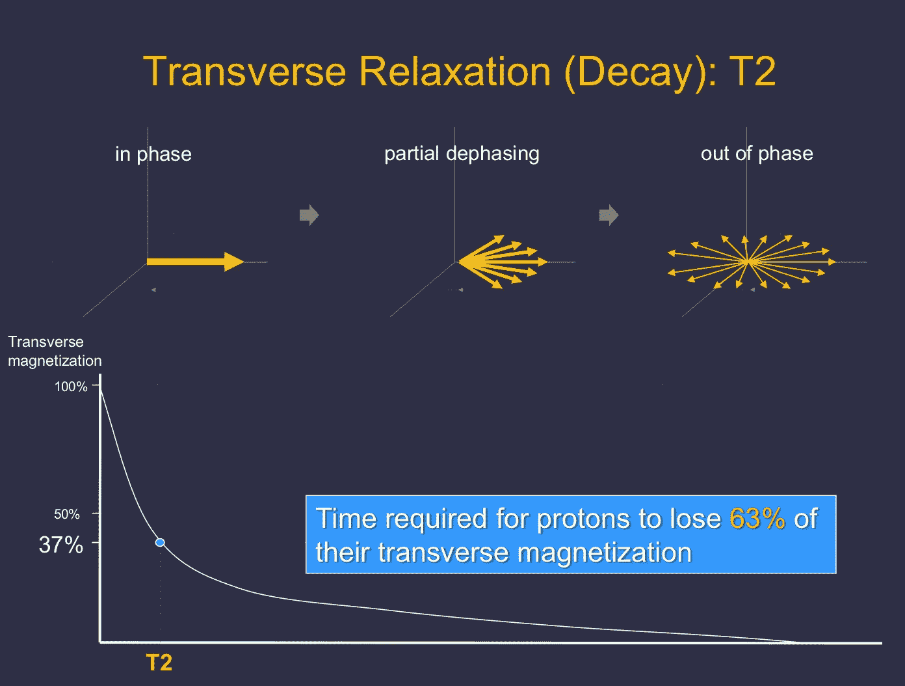

既然我们已经解释了 T1 和 T2 信号，我们将继续以脑膜瘤为例来帮助理解 MR 信号。请注意，物理磁共振是一个广泛的主题，我们没有描述像扩散，回声，梯度和 TOF 序列的概念，以及伪影。**对比度**的工作原理是将 T1 曲线向左移动(缩短 T1 曲线)。

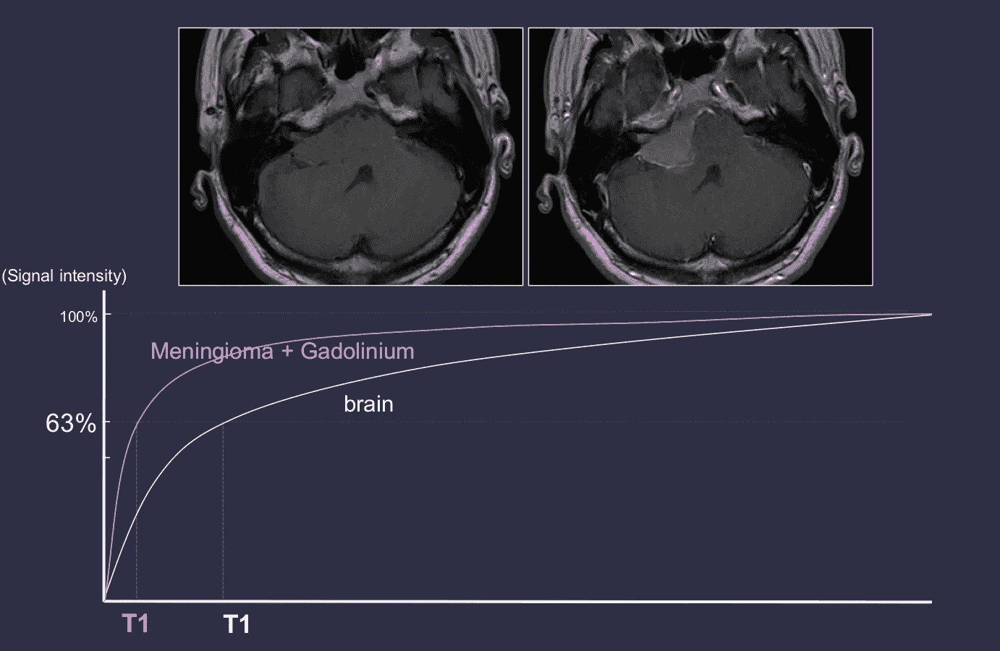

Meningioma on MR

上图中，左图为 **T1 加权像，**脑膜瘤难以识别。静脉注射造影剂(钆)后，脑膜瘤的 T1 曲线向左移动，在右图中显示为增强病变。

**CT 物理— Hounsfield 单位(HU)**

CT 图像不是基于 MR 的氢魔法开发的，而是使用 x 射线，一种聚焦在被成像身体部分的辐射形式。身体的不同部位以不同的速度减弱 x 射线。因此，为了标准化不同的衰减值，使用**衰减系数**来测量光束穿透材料的难易程度。因为我们知道水的衰减为零，所以 HU 是相对于水计算的。

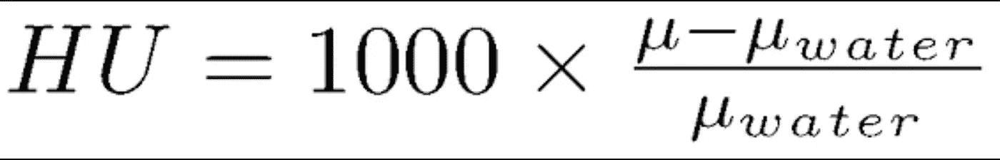

HU calculation

因此，通过测量感兴趣区域，您可以计算病变的 HU 并确定它是什么——例如含有脂肪的病变或含有液体的病变(如囊肿)。

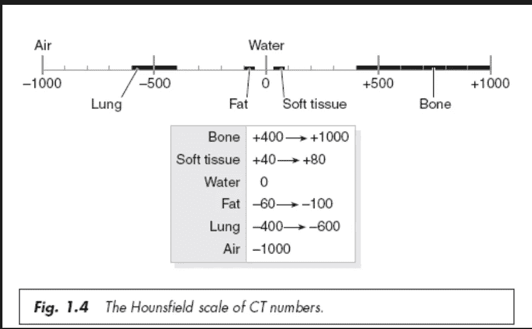

[http://www.odec.ca/projects/2007/kimj7j2/index_files/Page1674.htm](http://www.odec.ca/projects/2007/kimj7j2/index_files/Page1674.htm)

# 结合在一起(深度学习)

图像分割是绘制对象轮廓以描绘其边界的过程。在医学成像中，分割允许病变或解剖结构的表面或体积量化。 **U-Net 是一个专门的** [**深度学习**](https://hackernoon.com/tagged/deep-learning) **模型架构，允许自动分段。**为了训练这种类型的模型，您需要迭代地向模型显示多个图像以及相关的分割区域，通常由放射科医生手动绘制。

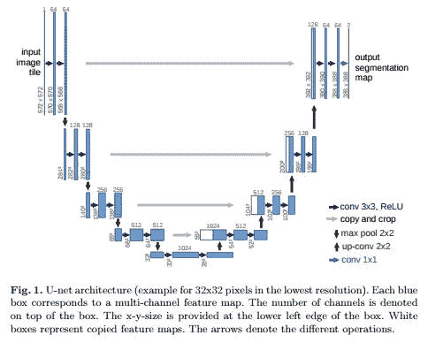

U-Net: Convolutional Networks for Biomedical Image Segmentation

来自:U-Net:生物医学图像分割的卷积网络([https://arxiv.org/pdf/1505.04597.pdf](https://arxiv.org/pdf/1505.04597.pdf))

U-net 的设计本质上是为了在少量的训练案例中表现良好。该架构在数字压缩表示中渐进地编码初始图像，字面上在 u 的底部。然后，对称地解码该底部表示，以生成自动分割区域，也定义为遮罩，作为最终输出。训练被优化以最小化建议的分割区域与手动分割的实际区域之间的差异。这种允许用非常少的病例进行有效训练的特性在医学成像中特别有用，在医学成像中专家手动分割是非常昂贵的。对于脑膜瘤分割，这种技术可以直观地在钆后 MRI 序列上进行尝试，根据这种病理学，该序列具有**最高信噪比**(即脑膜瘤相对于背景通常表现出强烈的增强和明亮的信号)。

希望这澄清了跨 CT 和 MR 的信号的概念，并在你的深度学习道路上帮助你。考虑加入我们的社区，这个社区将放射学和成像科学与深度学习科学家结合在一起:[https://tribe . radai . club](https://tribe.radai.club)。

我们在存档于此的月刊俱乐部上讨论深度学习:[https://youtu.be/xoUpKjxbeC0](https://youtu.be/xoUpKjxbeC0)。我们的下一个期刊俱乐部将于美国东部时间 2 月 22 日晚上 8 点举行，由[的 Timnit Gebru](https://medium.com/u/2e2b7ed6c4f5?source=post_page-----bb1fe996352e--------------------------------) 主讲**“使用深度学习和谷歌街景估计美国各地社区的人口构成”**—[https://register . gotowebinar . com/register/8696551324404512003](https://register.gotowebinar.com/register/8696551324404512003)

**表示感谢和推荐**

1.  在印第安纳大学放射科[我最好的老师之一](https://medicine.iu.edu/departments/radiology/) — [艾萨克·吴博士](https://medicine.iu.edu/faculty/7171/wu-isaac/)给我拍了很多物理讲座的照片
2.  在这里阅读更多关于磁共振物理学的内容— [磁共振成像变得简单](http://www.stat.columbia.edu/~martin/Tools/MRI_Made_Easy.pdf)