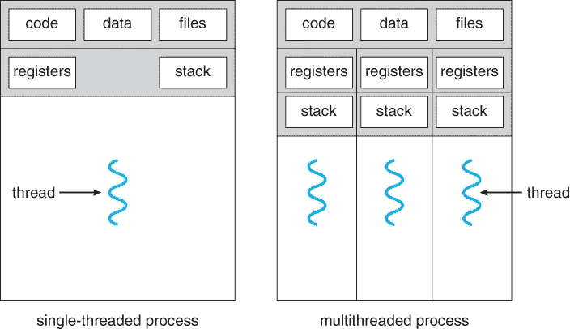

# 选择你的战斗:选择和学习“正确的”编程语言

> 原文：<https://medium.com/hackernoon/pick-your-battles-choosing-and-learning-the-right-programming-language-731973698385>

## 寻找差异和相似之处，以及学习编程语言的技巧和窍门

无论是在工作中(你可能是一名软件工程师)还是作为一种爱好，总有一天你会挣扎着选择“正确的”编程语言。

虽然没有快速简单的答案(当然，也不是“一种语言胜过一切”)，但我们可以研究一些关键指标，帮助我们进行思考。在这个过程中，我们还将介绍跨编程语言的概念，以及一些你可以发现自己比你想象的更快地[学习编程语言的方法——无论你只是对什么是编程感兴趣，还是已经编程多年的经验丰富的老手。](https://hackernoon.com/tagged/learning)

Let’s not get too excited! (Credits to toggl.com)

# 比较指标

*   **抽象层次**

从 3 个不同的层面审视当今的编程语言可能会有所帮助——用于尽快构建应用原型的“快速构建”编程语言，有助于应用中以性能为中心/用例特定部分的“基础设施”编程语言，以及适用于嵌入式硬件和需要绝对控制内存使用的用例的“系统”编程语言。当然，在现实中，这些层次的界线往往会更加模糊和混乱，但它有助于我们形成如何解决问题的思维地图！推荐:如果你刚开始开发应用程序，强烈推荐使用“构建快速”的编程语言。它们让你更快地看到你想要构建的任何东西的最终结果。

*“快速构建”编程语言*——你可以将 PHP、Javascript、Ruby 和 Python 等语言归入这个阵营。很快，他们会让你在不妨碍你的情况下做更多的事情，进入的门槛很低，而且他们的开发者社区往往是最大的。他们的标准库打包了针对高级问题的默认语言实现(从联网和多线程/多处理，以及跨线程和进程的同步，到包括与文件系统交互在内的典型操作系统操作)，也提供了很多现成的东西——允许您完成事情，而不必四处查看或自己实现它们。这个阵营的编程语言通常倾向于被解释。

Implementing a multi-threaded HTTP requests in Python with static typing. Multi-threading takes advantage of interleaving the 3 task executions (let’s call them A, B and C tasks). While 1 task (say Task A) is doing some I/O-bound operation (and thus, is not doing any computation-bound work) other tasks (Tasks B and C) execute (yielding of course, when they themselves also hit some I/O-bound operation). All of the above imports are standard library offerings in Python 3 — no external dependencies/libraries!

“基础设施”编程语言——你可以将基于 JVM 的语言(Java、Kotlin、Scala、Clojure 等)以及 GoLang、Swift 和 Haskell 等二进制语言归入这个阵营。这些语言倾向于以性能为目标来换取便利性(强类型、标准库中现成的组件更少、“更重”的冗长等)，而不会损失太多，并且强加规则以使出错更困难。基于您的执行环境，它们更易于手动调整(通过允许您传递可能影响运行时代码性能的参数)。如果您的应用程序有一部分需要性能提升——尤其是在 web 上运行时，可以考虑使用其中的一个。

The same multithreaded request problem implemented above in Python, implemented in Swift. As opposed to Python, Swift is compiled and will throw compile-time arguments if types don’t match as desired (allowing you to catch more mistakes during the code-writing process). DispatchGroup is what you might think of as a “barrier” synchronization — the completion handlers are placed on a queue for thread-based execution. We are simply waiting for all request executions to finish.

“系统”编程语言——你可以把 C、C++和 Rust 归入这个阵营。这些语言为您的应用程序提供了最大的控制，并在需要时提供了显式的内存处理。它们还倾向于与嵌入式设备(可编程微控制器、具有非标准处理器架构的计算机)和没有太多软件支持的硬件(例如，通过 OBD 端口访问汽车信息)一起工作。随着 WebAssembly 的兴起，这种“低级”语言对于执行支持 web 应用程序的计算密集型工作也证明是有用的。

*   **特性和成熟度**

*语法和数据结构—* 语言是计算机和程序员之间的交流工具。利用语言的语法。了解一种语言中最常用的数据结构，以及插入/删除/修改的底层实现的时间复杂性。

Haskell is a strict functional programming language that presents a ton of “pattern matching” features. It can inspect incoming data structures and act upon them if they fit the “demands”.

*运行时环境—* 熟悉你的应用程序如何在你的计算机上“工作”。它需要语言解释器吗(比如 Python，NodeJS，PHP)？它会产生特定于架构的二进制文件吗(比如 Swift 和 GoLang)？它是否混合使用了两者——在某个虚拟机上编译和运行(比如 Java、Scala、Clojure)？由于这样的需求，学习和使用 [Docker](https://www.docker.com) 也是非常值得推荐的——在这个过程中，你会学到很多关于 Linux 管理的知识。

*库和成熟度—* 每种语言都非常适合某些用例，这些用例主要基于它们周围的社区所支持的项目类型。Java 在许多基于编排和网络物流的需求方面表现出色——通过 JDBC 接口标准化的数据库支持和 Apache 基金会的项目帮助 Java 实现了这一目的。Python 和数据分析和统计也是如此，Haskell 在语法、正则表达式和编译器方面也是如此。一种语言的采用率和社区规模也是一个很好的指标，表明一个人是否应该在这种语言下支持一个项目——较小的语言社区意味着当出现问题时来自外部世界的帮助较少。

**垃圾收集**

*垃圾收集*是程序自己回收内存空间的行为，不需要开发者明确地这么做(就像你在 C 和 Rust 这样的“系统语言”中所做的那样)。在 Python、PHP 和 Swift 等编程语言中，决定是否释放对象是基于引用的计数——引用计数的思想。然而，即使有这种相似性，它们在各自的实现上也有所不同——具体来说，它们处理经典内存泄漏的方式不同(对象没有来自外部世界的有用引用，但仍然阻止垃圾收集器清理它们！).

Python 与“停止世界”分代垃圾收集器一起实现了引用计数，当垃圾收集器暂停程序执行、启动并继续进行垃圾收集时，“停止世界”，然后恢复程序执行，当垃圾收集器包含 3 个独立的“代”，即 3 组堆时，“分代”。第 0 代堆检查次数最多，包含最“新鲜”的对象，其次是第 1 代和第 2 代。

Playing around with garbage collection in Python. Historically, Python has only had reference counting to determine whether to deallocate the memory used by an object or not.

Results of executing the above program with Python 2.7.12

PHP(从 PHP5.3 开始)在引用计数的同时实现了一个并发的垃圾收集器，如果需要的话，它在程序执行的同时运行，并且是本地化的——不需要遍历整个内存空间来通过构造引用图来搜索循环引用的对象。不能从根到达的子图可以被安全地消除。

Swift 也使用引用计数，但没有其他垃圾收集机制，让开发人员来确保通过语言原语清除循环引用的对象。下面，我们演示弱指针的使用——当对象的“强”引用计数一直下降到 0 时，`Person`将被清除(因为它仅被`Apartment`弱引用)。这允许 Swift 添加关于何时何地对代码进行垃圾收集的编译时决策，允许它为拥有一个实际的运行时垃圾收集器而保存自己。

Credits to [https://docs.swift.org/swift-book/LanguageGuide/AutomaticReferenceCounting.html](https://docs.swift.org/swift-book/LanguageGuide/AutomaticReferenceCounting.html)

其他编程语言实现了许多其他垃圾收集机制。根据不同的用例，它们会广泛地影响应用程序的性能，所以要理解你的用例所选择的编程语言的内存模型！

# 重复出现的概念

*   **构建/包管理**

习惯于保持/跟踪依赖关系的机制以及维护“构建”信息的方法(包描述、如何运行单元测试、设置/环境准备等)。Python 使用 [pip 和 requirements.txt 文件](https://docs.python.org/3/installing/index.html)来管理依赖关系，使用 [setup.py 来管理环境设置](https://docs.python.org/3/distutils/setupscript.html)，Haskell 对两者都使用 [Cabal](https://www.haskell.org/cabal/users-guide/developing-packages.html#) ，Java 有 [Maven](https://maven.apache.org) 和 [Gradle](https://docs.gradle.org/current/userguide/userguide.html) ，Scala 有 [SBT](https://www.scala-sbt.org/1.x/docs/index.html) ，PHP 有 [Composer](https://getcomposer.org) ，NodeJS 有[NPM](https://docs.npmjs.com/getting-started/what-is-npm)——等等。

找到本地化开发环境的方法也是必须的——您可能希望根据项目运行不同版本的编程语言。像 PHP 的 [phpbrew](https://github.com/phpbrew/phpbrew) 、Python 的 [pyenv](https://github.com/pyenv/pyenv) 和 NodeJS 的 [nvm](https://github.com/creationix/nvm) 这样的项目给了你这样做的能力。

pyenv lets you enjoy different versions of Python on your system!

当您安装一个在一个项目中使用的库时，您可能也不希望将它安装在另一个项目中(对于像 Python 和 Haskell 这样倾向于全局安装与当前解释器/工具相关的依赖项的语言来说，这更是一个问题)。习惯 Python 的 [virtualenv/venv](https://docs.python.org/3/library/venv.html) ，PHP 的 [virtphp](http://virtphp.org) 和 Haskell 的 [Cabal Sandboxes](https://www.haskell.org/cabal/users-guide/installing-packages.html#developing-with-sandboxes) 这样的工具。

virtphp allows you to localize PHP to your specific project — allowing you to lock down language extensions as well as a language version specific to your PHP-centric application.

*   **异步输入/输出**

异步 I/O 允许我们从应用程序中获得更多 I/O 绑定性能。与线程非常相似，异步 I/O 使我们能够让程序的另一部分“运行”,同时我们正在进行 I/O 密集型操作——无论是发出 HTTP 请求、访问数据库还是任何涉及外部世界(处理器进行的纯计算领域之外)的事情，这些都需要相当长的时间。与线程不同，异步 I/O 允许恒定的内存空间使用，这取决于它们的实现，因为创建线程在保存大量元数据方面仍然有一些内存开销。

每个线程都有自己独立的一组寄存器(主要用于跟踪我们在当前线程中的执行情况)和堆栈信息(主要用于函数执行——传递的参数、局部变量等)。

Credits to [https://www.cs.uic.edu/~jbell/CourseNotes/OperatingSystems/4_Threads.html](https://www.cs.uic.edu/~jbell/CourseNotes/OperatingSystems/4_Threads.html)

Implementing an async I/O bound function in Javascript. I/O bound tasks — like making an https.get request, are placed on the “side”, allowing for other parts of your application to run.

*   **功能编程**

函数式编程是在高层次上告诉你的计算机你想让它做什么的能力。考虑到当今大多数应用程序处理某种类型的数据提取、转换和加载——特别是以多线程/多处理的方式(以便从计算机中获得更高的性能),遵循函数式编程可以确保很多保证。虽然它们是只属于函数式编程(Haskell)的语言，但大多数语言都把这种坚持留给了程序员。今天大多数语言都有函数式编程最基本的原语——通过 map、filter、reduce for lists，允许函数像其他值一样传递(函数作为值),允许函数像其他值一样接受其他函数或返回函数(高阶函数)。

Even languages you wouldn’t expect to have functional programming primitives, comes with a bunch of functional programming features off the box!

# 学习计算

*   **第一关**——浏览简短的资源，建立一个能激起你兴趣的小型项目

在这个阶段，像[在 Y 分钟内学会 X](https://learnxinyminutes.com)这样的资源可以让你快速浏览在给定语言中会遇到的各种语言原语。此外，对于任何给定的编程语言，通常都有“游览”和“[x]示例”页面以及交互式练习——一些示例是[GoLang 之旅](https://tour.golang.org/welcome/1)和 [GoLang 示例](https://gobyexample.com)(对于 GoLang)、 [NodeSchool 命令行练习](https://nodeschool.io/#workshoppers)(对于 Javascript —特别是 NodeJS)、 [Scala 练习](https://www.scala-exercises.org)(对于 Scala)、 [Python Koans(对于 Python)](https://github.com/gregmalcolm/python_koans) 等等。

构建像命令行应用程序这样的小应用程序，像下载网站的 HTML 内容、解析它并寻找有趣的东西甚至像“游乐场”一样的实验代码这样的“脚本工作”也是必须的。写一些很小很小的应用程序，通常只有 300-400 行代码。

这一阶段的诀窍是快速掌握你将在 70-80%的时间里使用的编程语言机制，并让你对这种语言本身感到舒适(同时给你信心，你可以学习一种新的语言)，能够完成一些事情，同时让你体会到这种语言如何或在哪里适用。

因为我们的大脑是为满足而生的，所以我们希望能够尽快给大脑提供奖励，让我们保持高度的动力！

Writing and playing a playground-like script like this and running it to see how things would work helps you get up and running quickly and confidently with a language. It doesn’t have to be a full-blown application — just something that serves to answer some of your “small” questions.

*   **第二步**——浏览更大的特定于语言的资源，构建一个完整的项目，给你更大的语言洞察力

在这个阶段，您必须查阅编程语言的“官方”文档，以便对事物的工作方式有一个内省的了解。对于 Javascript，有 [Mozilla 开发者文档](https://developer.mozilla.org/en-US/docs/Web/JavaScript)，对于 Swift，有 [Swift 官方文档](https://docs.swift.org/swift-book/LanguageGuide/TheBasics.html)，对于 Java，有 [Java 学习路径](https://docs.oracle.com/javase/tutorial/java/index.html)，对于 Python，有 [Python 官方文档](https://docs.python.org)——你明白其中的意思。也有很棒的线上课程网页，里面充满了课堂讲稿、幻灯片和作业。例如，宾夕法尼亚大学有一门[伟大的哈斯克尔课程(CIS 194)](http://www.seas.upenn.edu/~cis194/fall16/) ，而 Scala 的诞生地 EPFL 有一门[棒极了的 Scala 入门课程](https://www.coursera.org/learn/progfun1)。

调查其他项目——开源代码库就是一个很好的例子。像[带注释的 jQuery 源代码](https://robflaherty.github.io/jquery-annotated-source/docs/01-core.html)或[带注释的 BackboneJS 源代码](http://backbonejs.org/docs/backbone.html)(用于基于 Javascript 的启发，并了解 Javascript 如何在新语法添加的混乱背后真正工作)到 [Python Redis 客户端](https://github.com/andymccurdy/redis-py)(了解单元测试和一般适当大小的代码库在 Python 中是如何构造的)这样的东西可以让您深入了解代码库是如何在给定的编程语言上维护的。

这将有助于编写成熟的应用程序——例如，编写完整的 RESTful 后端 API、桌面应用程序、web 应用程序或移动应用程序。需要时尝试使用外部库(由其他开发人员编写),并对您的语言工具有信心(它如何管理依赖性，它如何被部署到生产环境中——无论是在虚拟机上运行，作为独立的二进制文件，还是在给定的语言解释器上运行，如何编写测试，等等)。您应该努力使用非语言依赖性——如数据库(如 Postgres 或 MySQL)以及联系外部 HTTP APIs。

My Scala-based internship project, which gave me confidence in Scala and using Java libraries in tandem with Scala-based libraries (Scala is a JVM language, giving it full Java-based interop). It used the Scala Build Tool (for building JAR files executed on the JVM), had a decent-sized codebase, used Postgres and Redis and containerized with Docker!

*   **三倍魅力** —抽象出概念，锚定在抽象的学习资源上

祝贺你——你学会了一门编程语言，并且对自己的能力充满信心！

这是进行反思和抽象思考的时候了，把你能从代码库中重构出来的东西转化成一条通用的思路。考虑你的应用程序的性能(同样，接触多线程/多处理以及数据结构和时间/空间复杂性)。看看你给定的应用程序的核心算法工作的有趣方式，看看你可以如何改进它(并深入研究图论、组合学、计算和优化理论等)。强烈推荐像卡耐基梅隆大学的并行编程课程、斯坦福大学的机器学习入门课程和/或 T4 开源软件大学的课程。

它还可以帮助查看过去或当前的工作——例如，web 浏览器和相应的 HTML/CSS 渲染和动画是如何在引擎盖下执行的，或者查看阿波罗制导计算机的机制。可能性是无穷无尽的——所有这一切都是为了让你认识到所有编程语言都有自己的用例，没有一种语言胜过一切，并提高你的技能组合，以便你的下一个项目(也许，你的下一次编程语言体验)更加精炼。

You did it! You reached to the end! Whether you’re happy because you learned something new or simply because you got through this article without your attention span waivering, you did awesome!

这是一个总结！我们讨论了编程语言之间的差异，以及如何根据您的用例进行分类和选择。然后我们讨论了贯穿编程语言的概念，随着我们学习越来越多的语言，我们可以移植这些概念。最后但同样重要的是，我们学会了在学习一门新语言时如何学习！

不要犹豫，告诉其他读者你正在做什么。另外，如果你在 GitHub 上， [psst -我也在 GitHub 上(github.com/alastairparagas)](https://github.com/alastairparagas)！如果你喜欢这篇文章，请不要忘记给它一个掌声👏(如果你真的喜欢它，请击碎那个按钮，给它一堆掌声👏👏👏👏👏)!如果你不喜欢这篇文章或关于它的一些东西，请不要犹豫在下面评论！