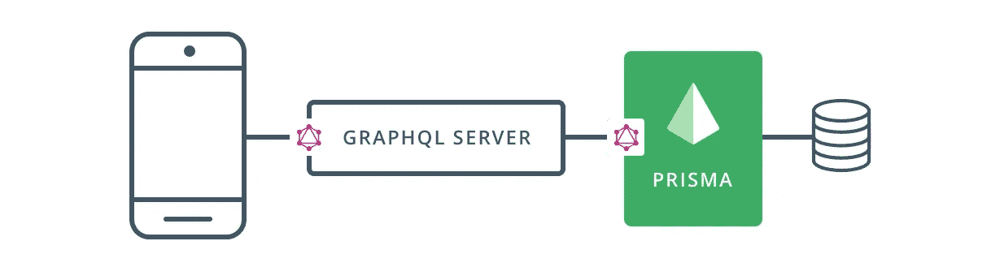
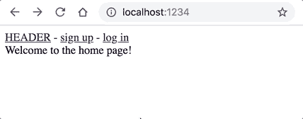
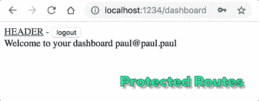
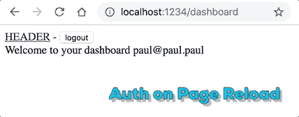
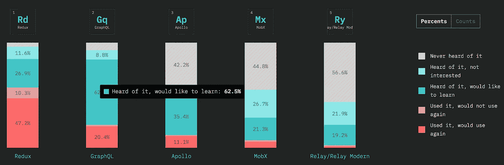

# 拼凑图表

> 原文：<https://medium.com/hackernoon/piecing-together-graphql-ca6739cd8205>


Photo by [simon peel](https://unsplash.com/photos/hbhKpR12KaE?utm_source=unsplash&utm_medium=referral&utm_content=creditCopyText) on [Unsplash](https://unsplash.com/t/experimental?utm_source=unsplash&utm_medium=referral&utm_content=creditCopyText)

GraphQL 的概念从数据存储跨越到客户端。一路上发生了什么？ [GraphQL](https://hackernoon.com/tagged/graphql) 世界中的工具已经走过了漫长的道路，构建应用程序比以往任何时候都更容易。通过逐步完成每个组件，您将从整体上对 GraphQL 有更好的理解。

按照这个教程，克隆这个[全栈例子](https://github.com/captDaylight/fullstack-prisma-apollo)。这是一个使用会话来认证用户的基本应用程序，是一个久经考验的持久用户认证的安全选项。

# 我们的堆栈



Image from [https://www.howtographql.com](https://www.howtographql.com)

从左到右看上面的图像，第一个表示我们的客户端应用程序构建在[**【Apollo】**](https://github.com/apollographql/apollo-client)(我们的 GraphQL 数据缓存)和 [**React**](https://github.com/facebook/react) 上。我正在使用 [**包**](https://github.com/parcel-bundler/parcel) 来构建客户端包。

接下来，“GraphQL 服务器”将是 [**graphql-yoga**](https://github.com/prisma/graphql-yoga) ，一个基于 [Express](https://github.com/expressjs/express) 的服务器，它与 Apollo 接口，并为我们提供了许多明智的默认设置。

[**Prisma**](https://github.com/prisma/prisma) 将站在服务器和数据库之间作为我们的数据层，类似于一个 ORM，用于向我们的数据库写入数据和从我们的数据库访问数据。Prisma 是开源的，支持所有主要的[数据库](https://www.prisma.io/features/databases/)(图片右侧的 pancake 堆栈)。

## 设置

从安装一些全局包开始。

```
yarn global add prisma graphql-cli nodemon
```

在我们的项目文件夹中创建一个`.env`文件，我们将在部署 Prisma 后填充 DB_URL 变量:

```
APP_SECRET=mysecret123
DB_URL=
```

接下来，创建一个 [Prisma 帐户](https://app.prisma.io/signup)，然后使用`prisma login`登录 Prisma CLI，这样您就可以为您的项目启动免费的开发服务器。别担心，Prisma 可以随时移动到你选择的硬件上，不会把你锁在里面。

我们将生成我们的用户模型，并将它们部署到我们的测试数据库中。在`/database`中，您会看到我们有一个型号，`User`。当我们部署时，Prisma 将基于这个模式创建绑定。我们项目根中的`.graphqlconfig.yml`将向 Prisma 解释我们希望如何部署我们的设置。现在，运行:

```
prisma deploy database
```

选择“*演示服务器”*，选择有意义的区域，输入类似“*full stack”*的名称，并将 stage 设置为“*dev”*。Prisma 会生成一个类似`[https://us1.prisma.sh/*myusername-12345*/fullstack/dev](https://us1.prisma.sh/myusername-2acca9a/my-project/dev.)`的端点，放入你的`.env`。

最后一件事，Prisma 会把你的`database/prisma.yml`注释掉:

```
*#endpoint: ${env:DB_URL}*
endpoint: [https://us1.prisma.sh/myusername-12345/fullstack/dev](https://us1.prisma.sh/myusername-2acca9a/my-project/dev.)...
```

所以切换回:

```
endpoint: ${env:DB_URL}...
```

# 它将如何工作

用`yarn install`或`npm install`安装完依赖项后，用`npm run dev`启动本地服务器，并导航到`localhost:1234`。`dev`命令将同时运行我们的服务器和前端构建。

## 试验

注册并登录！成功创建用户后，它会将您带到仪表板。



一旦您登录，受保护的路由将不允许认证用户访问`/signup`或`/login`路由。一旦注销，就不能去`/dashboard`。



登录时尝试刷新。在页面加载时，应用程序将请求检查用户的身份验证状态。如果通过身份验证，该页面将获取用户的数据。



# 后端

打开`/src/index.js`你会看到用`GraphQLServer`实例化的`graphql-yoga`服务器。这需要一些论据:

这是我们的 GraphQL 模式。在该文件中，您会看到我们已经列出了将由解析器处理的查询和变异。

**解析器**:这些是完成登录、获取用户等工作的方法。它们的输入和返回值必须与我们的 typeDef 的`schema.graphql`中定义的相匹配。

**上下文:**这需要一个函数，我们将使用它来设置数据库，使其指向我们的 Prisma 设置。从`prisma deploy`传入生成的 typeDefs，从`.env`传入端点和秘密。

如上所述，`graphql-yoga`是基于 Express 的，所以我们可以使用像`express-session`这样的通用包来处理我们的会话。

在我们定义了我们的会话实现之后，我们用 CORS 设置启动服务器，允许我们在`localhost:1234`(通过包)上的前端获取我们的会话 cookies。

# 客户端

我们的前端是一个与包裹捆绑在一起的准系统 React 应用程序。从`client/index.jsx`开始，我们设置`ApolloClient`连接到运行在端口`4000`上的服务器，并将客户端分配给我们的`ApolloProvider`。

在`Header`组件中，您会看到我们正在调用`GET_AUTH_STATUS`查询，该查询检查后端是否有会话。它将决定是否显示*登录/注册*链接或*注销*。

在`index.jsx`中，您将看到我们的`Dashboard`和授权路由的受保护路由。我创建了一个特殊的 route 组件，`ProtectedRoute`，它调用`GET_AUTH_STATUS`来决定是否显示相应的组件。即使我们在几个不同的地方调用我们的身份验证状态查询，当你在开发者工具中打开“[网络](https://hackernoon.com/tagged/network)”时，你会看到它只被请求一次。这是因为 Apollo Cache 自动处理不同组件[之间的数据](https://www.apollographql.com/docs/react/advanced/caching.html#automatic-updates)。

`Auth`组件处理我们的注册和登录变化。成功登录或注册后，我们需要更新我们的`GET_AUTH_STATUS`,因为`LOGIN`和`SIGNUP`突变只返回用户对象。我们将只手动更新状态，而不是再次请求身份验证状态:

```
<Mutation
  mutation={isSignup ? SIGNUP : LOGIN}
  variables={isSignup ? { email, name, password } : { email, password }}
 **update={(cache) => {
    cache.writeQuery({
      query: GET_AUTH_STATUS,
      data: {
        isLoggedIn: {
          status: true,
          __typename: 'AuthStatus',
        },
      },
    });
  }}**
>
```

# 包裹

如果您一直是旁观者，现在是深入 GraphQL 的好时机。GraphQL 生态系统在出现的几年里已经走过了漫长的道路。堆栈中的每一层都已经足够成熟，从上到下构建一个应用程序相对简单。

此外，人们的兴趣也在增加。Javascript 最近的“[状态”反映了这种情绪，我们只会在未来看到更多。](https://2018.stateofjs.com/data-layer/overview/)



*为什么不将 jwt 存储在本地存储或 cookies 中？*嗯，[这些](https://www.rdegges.com/2018/please-stop-using-local-storage/) [文章](http://cryto.net/~joepie91/blog/2016/06/13/stop-using-jwt-for-sessions/)能比我解释得更好，但足以说使用服务器端会话来保存敏感数据更安全(也更容易)。

同样，这里有一个到示例[存储库](https://github.com/captDaylight/fullstack-prisma-apollo)的链接。