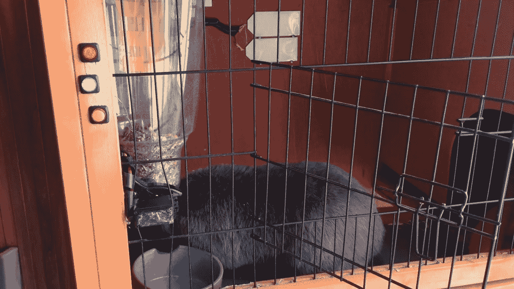
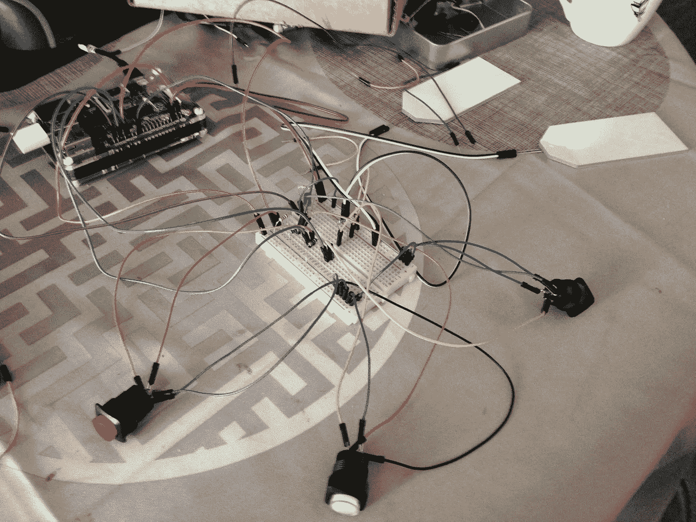
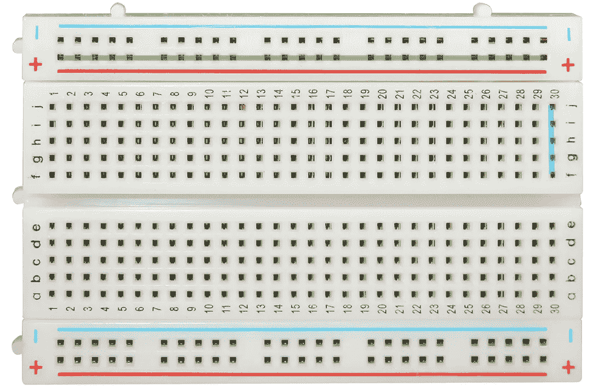
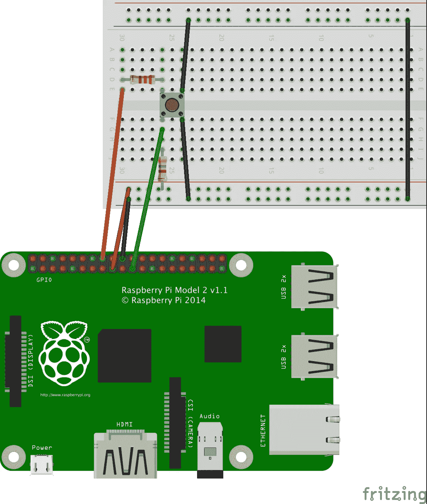
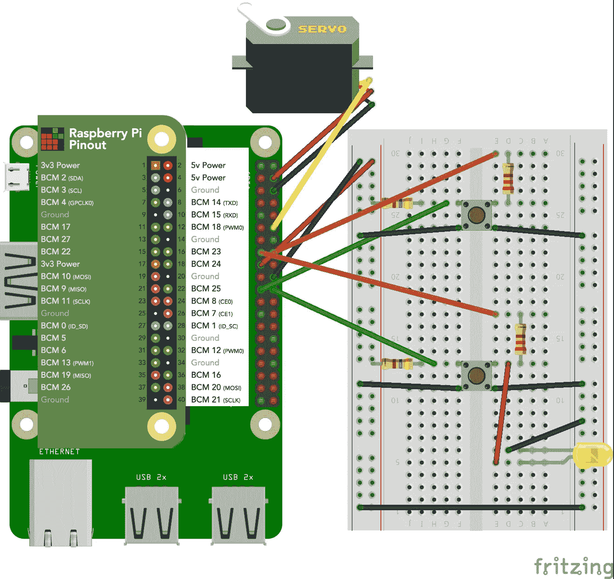
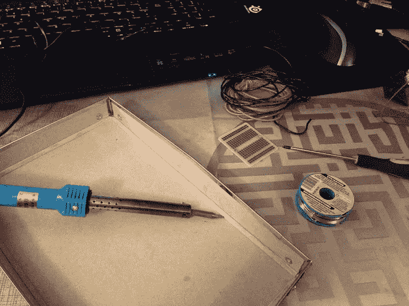
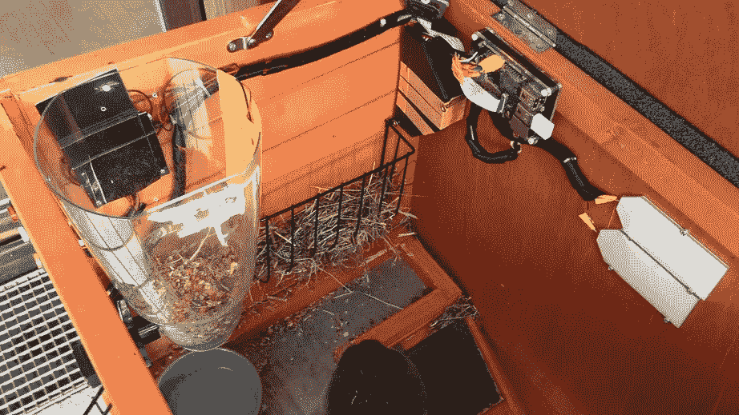
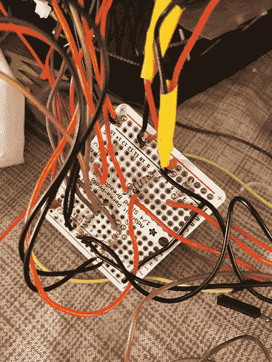
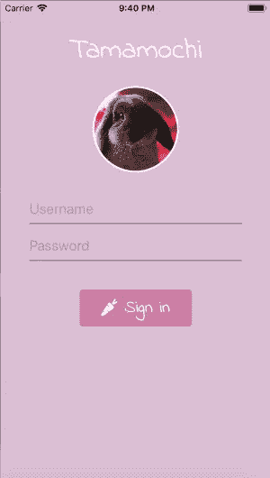

# 用树莓酱给你的宠物笼拉皮条！

> 原文：<https://medium.com/hackernoon/pimp-your-pet-cage-with-raspberry-pi-716945e3f9a4>



这篇文章是关于如何用树莓派来侦察和喂养你的宠物的系列文章的一部分，不要错过第一步！

*   [**用树莓派相机服务器窥探你的宠物**](https://hackernoon.com/spy-your-pet-with-a-raspberry-pi-camera-server-e71bb74f79ea) 我在这里描述如何设置树莓派和相机流服务器！
*   [**如何从任何地方访问您的 Raspberry Pi 相机**](/@michelparreno/how-to-access-your-raspberry-pi-camera-from-anywhere-544ab9e5bacc) 在这里，您将学习如何配置一切以进行远程控制。
*   [**用树莓 Pi**](/@michelparreno/build-a-connected-food-dispenser-with-raspberry-pi-19f5cdcc1541) 搭建一个连接的食物分配器，在这里我们设置一个伺服电机来触发食物分配器。

在前面的文章中，我们已经学习了如何构建一个摄像机服务器和一个自动售货机。现在是时候给我们相连的笼子添加最后一笔了。**当然是前面的纽扣啦！一个是当我们在家时关闭摄像头，另一个是手动触发食物分配器。**

# 要求

1.  第一和第三个教程应该已经完成(从互联网访问是可选的)
2.  如果你是初学者，我强烈建议你花一两个小时，向 [CamJam](http://camjam.me/?page_id=236) 学习。这会让一切变得更容易理解。
3.  当然，树莓派和配置好的无线加密狗
4.  一个树莓派的面包板。这将有助于你通过树莓派电子密码系统和插件的一切。
5.  您选择的按钮。不过要小心，对于相机我们需要一个 [**开关**](https://thepihut.com/products/adafruit-16mm-illuminated-pushbutton-red-latching-on-off-switch) ，对于食物分配器需要一个 [**瞬间**](https://thepihut.com/products/adafruit-16mm-illuminated-pushbutton-yellow-momentary) 。
6.  至少 [3 个(100 或 220 欧姆)](https://thepihut.com/products/adafruit-through-hole-resistors-220-ohm-5-1-4w-pack-of-25)电阻， [3 个(470 欧姆)电阻](https://thepihut.com/products/adafruit-through-hole-resistors-470-ohm-5-1-4w-pack-of-25)
7.  用于原型制作的电线[公/公](https://thepihut.com/products/adafruit-premium-male-male-jumper-wires-20-x-12-300mm)和[公/母](https://thepihut.com/products/adafruit-premium-female-male-extension-jumper-wires-20-x-12)。你也可以选择[的全挡](https://thepihut.com/products/prototyping-wire-spool-set)。
8.  (可选)对于最终的构建而不仅仅是原型制作:一个 [perma-proto](https://thepihut.com/products/adafruit-perma-proto-quarter-sized-breadboard-pcb-single) ，一个烙铁和一些锡焊料。

# 预防措施

*   当 Pi 打开时，不要操纵电线，这对你来说仍然是危险的，并且也可能永远破坏 Pi。
*   当心短路，仔细检查你的理论插头。虽然在我身上发生过很多次，但是对你的 Pi 来说还是有风险的。
*   不要忘记电阻。我不放电阻烧坏了几个 led，但更重要的是，它也会烧坏圆周率。
*   与电线颜色一致，电源为红色，接地为黑色，输出为橙色，输入为绿色等。这肯定会有很大帮助。

# 先决知识

## 电学基础

如果你有兴趣深入了解我将要做的事情，我建议你快速浏览一下[电力基础概念](https://www.electronics-notes.com/articles/basic_concepts/)。**免责声明:**我在这个项目中学到了很多，但请随时给我反馈，我可以改进我的设置！

## 树莓派

*   电压:所有树莓派 BCM 引脚都是 3.3V 逻辑引脚。
*   输出引脚上的源电流或吸电流不得超过 16 mA。
*   您可以同时从所有 GPIO 输出获得的最大强度约为 50 mA

## 发光二极管

它们只有在接线正确的情况下才能工作。负极引线(阴极)是较短的引线。根据制造商的规格，我们有:

*   电压:1.8–2.2V(基本红色、绿色、黄色)，2.4–2.7V(白色、蓝色)
*   **建议使用电流:16–18mA |**最大电流:20mA

## 电阻

电阻器是限制通过电路的电量的一种方式。如您所见，当我们的微型 led 最多可处理 20mA 时，Pi 引脚可提供高达 50mA 的电流。您可以[计算](http://ledcalc.com/)所需的准确电阻(大约 60 欧姆)，但由于可用电阻有限，220 欧姆仍是一个不错的选择。然而，你绝对可以达到 100 欧姆！

# 让我们建立相机按钮！



Couldn’t get enough wires.. bye bye consistency 😆

## 试验板是如何工作的？



试验板是一个非常棒的原型和测试工具！你只需要在上面连接你的元件，或者直接插上电源。

面包板背后的魔力很简单。在边缘，你可以看到红色和蓝色的线，所有的点都是垂直连接的*(我用绿色突出显示了顶部的+)*。当一个信号进入一个点时，它被传播到整条线上。这基本上是我们将要放置 Pi **3V 引脚**的地方，它将使一切和**接地引脚**闭合电路。

在试验板的中心，情况正好相反。所有东西都是水平连接的，并被中间的空间分成两部分。示例:您在 J30 中放置一个 3V 发电机+(以蓝色突出显示)，信号将在 F G H I 30 中流动，但不会在 B C D E 中流动，因为它位于中间空间的另一侧。

## 上拉电阻原理

那么我们需要什么呢？首先，我们需要在电路上插上一个按钮，并能够判断它是“开”还是“关”。如果我们检测到按钮是“开”的，我们启动摄像机服务器，并点亮按钮的 led。如果它是关闭的，我们关闭服务器和 led。如果你在家，就不需要整天开着摄像机了，对吗？

Raspberry Pi GPIO 引脚有两种不同的模式。

*   中的**，用于检测输入信号**
*   **OUT** ，可用于通过引脚发送 3.3V 信号

完美！我们将使用 pin on IN 模式来监听我们的按钮状态，并使用 pin on OUT 模式来点亮我们的按钮 led！

为了能够监听按钮状态，我们需要构建一个所谓的“上拉电阻”。我强烈推荐做这个教程[来自 CamJam](https://github.com/CamJam-EduKit/EduKit1/raw/master/CamJam%20Edukit%201%20-%20RPI.GPIO/CamJam%20EduKit%201%20%20-%20Worksheet%205%20(RPI.GPIO)%20-%20Button.pdf) (PDF 下载)。让我们按照下面的方案来分析电流。

*因为我购买了 led 按键，所以有四个引脚。2 个引脚构成开关(大)，2 个引脚构成 led(小)。* ***如果不买 led 按键，可以去掉步骤 4 和 4bis。***



**Red : 3V | Black : Ground | Green : BCM 9| Orange : BCM 23**

**1:****红线**将 3V 引脚连接到试验板垂直线。

**2 :** 功率在 470 欧姆电阻内部流动。

**3(按钮关闭):**电源通过**绿线流回树莓派。**Pi 能够检测到该电源，并在代码分析时返回“真”。

**3Bis(按钮 on) :** 电源流入按钮，**然后接地，**导致返回**绿线**的电源太少。代码测试时返回“false”。

> 所以基本上，当按下时，它返回**为“假”，当关闭**时，它返回**为“真”。我知道，我知道…一开始很容易让人误解，对吗？**

**4(代码检测按钮打开):**我们向**橙色电线发送信号。**这将通过一个 100 或 220 欧姆的电阻，并点亮按钮 led。

**4bis(代码检测按钮关闭):**我们切断了来自**橙线**的信号，并通过这样做关闭了按钮 led。

我们的算法好吗？完美！

## 创建相机按钮脚本

就像 [**中用树莓 Pi**](/@michelparreno/build-a-connected-food-dispenser-with-raspberry-pi-19f5cdcc1541) **，**搭建一个连接的食物分发器，我们准备用 Python 和 Rpi。GPIO 库来创建我们的脚本。转到您的 Pi 并执行以下操作:

```
# If you have followed previous tutorial
cd /var/www/html/pet-feeder# Create the file with execution rights
touch camera_button.py
chmod +x camera_button.py
```

现在用您选择的编辑器编辑该文件，让我们通过导入我们令人敬畏的 GPIO 库开始编写脚本吧！

```
##!/usr/bin/env python
import RPi.GPIO as GPIO# set the mode to BCM to match BCM number and not physical slots
GPIO.setmode(GPIO.BCM)
```

然后，让我们把我们在以前的方案中使用的 BCM 钉放入一些变量中。

```
CAMERA_BTN_LED_OUTPUT = 23
CAMERA_BTN_INPUT = 9
```

现在，我们需要能够不断地监听按钮状态，并在它改变时获取代码。为此，我们将使用一个无限循环。当然，为了摆脱这个循环，我们添加了一个键盘监听器，所以我们可以通过按住 CTRL + C 几秒钟来停止脚本。

```
try:    
  while True:
    if GPIO.input(CAMERA_BTN_INPUT) == False:
      print("CAMERA Pressed - button led ON")
      GPIO.output(CAMERA_BTN_LED_OUTPUT, GPIO.HIGH)
      # START the camera server
    else
      print("CAMERA OFF - button led OFF")
      GPIO.output(CAMERA_BTN_LED_OUTPUT, GPIO.HIGH)
      # STOP the camera server     
except KeyboardInterrupt:
  print 'interrupted!'
  GPIO.cleanup()
```

**如何启动或停止摄像机服务器？**

还记得我们在 [**用树莓摄像头服务器**](https://hackernoon.com/spy-your-pet-with-a-raspberry-pi-camera-server-e71bb74f79ea) 刺探我们的宠物吗？我们使用 Motion 作为流媒体服务器。还记得启用或禁用服务器是多么简单吗？*须藤服务动作(开始|停止)。我们如何在脚本中使用这个命令？轻松点。让我们导入 **os** 库。*

```
# at the top of the script
import os
```

然后使用该库来启动我们的命令行！

```
command = 'sudo service motion stop'
p = os.system(command)
```

## 脚本摘要

来测试一下吧！

```
# in your script folder
python camera_button.py
```

Everything should be working for you too !

# 让我们来制作食物分发器按钮！



**Feed Green wire : BCM 25 | Feed Orange wire : BCM 22**

注意，你可以在 [**上找到整个方案熔块**](http://fritzing.org/projects/raspberry-pi-connected-pet-cage) 。

你想听最精彩的部分吗？这里没有额外的困难！和以前一样而已。可以看到，我们在方案中增加了第二个上拉电阻。然而，也有一个黄色的 led，因为我认为这是一个好主意，增加一个食品分配器的 led。当你远程触发喂食时，你会看到一个小 led 灯亮起！

**这里的电阻是可选的**，因为我们将有两个串联的发光二极管(一个在按钮内，一个在食物分配器上)，3.3V 引脚就足够了。

## 创建食品分发器按钮脚本

首先，让我们改变脚本的名字，因为我们要处理相机和分配器。

```
# in your script folder
mv camera_button.py buttons_action.py
```

现在，打开文件，让我们添加新的 BCM 数变量

```
FEED_BTN_LED_OUTPUT = 22
FEED_BTN_INPUT = 25# Set INPUT to analyse incoming signal 
GPIO.setup(FEED_BTN_INPUT, GPIO.IN)
# Set OUPUT as a conditional 3V power pin
GPIO.setup(FEED_BTN_LED_OUTPUT, GPIO.OUT)
```

现在呢？看看这个！我们只需要在代码中添加一个 if/else 语句来处理所有事情。

```
try:    
  while True:
    # ... if/else camera code ... # our brand new feed button listener
    if GPIO.input(FEED_BTN_INPUT) == False:
      print("FEED Pressed - button led ON")
      GPIO.output(CAMERA_BTN_LED_OUTPUT, GPIO.HIGH)
      # Launch the feed script
    else
      print("FEED OFF - button led OFF")
      GPIO.output(FEED_BTN_LED_OUTPUT, GPIO.LOW)
except KeyboardInterrupt:
  print 'interrupted!'
  GPIO.cleanup()
```

好的，但是我们如何启动提要脚本呢？我们使用 **os** 库，就像以前一样！

```
# Please find the detail of feed.py on the previous tutorial.
command = 'python /var/www/html/pet-feeder/feed.py'
p = os.system(command)
```

## 脚本摘要

现在测试一下！

```
python buttons_action.py
```

我们的剧本准备好了！但是我们还没有完全倒下。我们必须解决两个问题:

*   让我们的脚本在一个**根**上下文中执行，这样“sudo”命令才能工作
*   让我们的脚本在 Raspberry Pi 启动时运行，这样我们就不必每次都重新启动它。

## 创建可引导的守护程序脚本

正确的方法是使用“初始化脚本”。这些文件存储在 Pi 的/etc/init.d/文件夹中。为了帮助您从头开始构建，该文件夹中有一个名为“skeleton”的模板文件。让我们复制粘贴它，并创建我们自己的脚本。

```
# Let's create the script
cd /etc/init.d
cp skeleton petfeederbuttons
sudo chmod +x petfeederbuttons# Now, let's edit the file
sudo vi petfeederbuttons
```

现在，为了使本教程简短易懂，我不打算详细介绍文件中的每一行。您所需要知道的是，我们必须在 INFO 头中声明我们的脚本信息。然后，我们必须定义脚本位置和基本命令:**开始，停止，重启**！

太好了！现在，您应该能够执行这些命令了:

```
sudo service petfeederbuttons start
sudo service petfeederbuttons stop
```

最后一步！添加自动启动脚本:

```
# This creates a link to raspbian list of boot commands
sudo update-rc.d petfeederbuttons defaults
```

重启你的 Pi 并直接测试你的按钮来看看结果！

## 守护进程监听器和 feeding 脚本之间的兼容性。

> 食物分发器的额外 led 在按下按钮时工作正常，但在我运行 feed.py 时不工作，为什么？？？

我们的守护程序正在运行按钮监听器脚本，该脚本正在等待按下 feed 按钮以触发 feed.py。但是，当按钮未被按下时，守护程序会不断将 GPIO 输出设置为低

```
else
      print("FEED OFF - button led OFF")
      GPIO.output(FEED_BTN_LED_OUTPUT, GPIO.LOW)
```

也就是说关掉电源。那么，当我们手动或通过浏览器运行 feed.py 时会发生什么呢？我们额外的 led 将不会被点亮，因为守护进程👺会在几分之一秒内重新关闭它。这里有两种可能的解决方案:

1.  拿另一个 BCM 引脚来只控制 led，并在 feed.py 中使用该引脚(而不是在 buttons.py 上)。这意味着只为 feed.py 启用 led。
2.  当 feed.py 被触发时，强制守护进程停止

选择您喜欢的解决方案！对我来说，我选择了第二条路(如果你想听我的意见，这是一条艰难的路)。这是解决方案，在您的 feed.py 脚本中。

```
import subprocess# add this just before manipulating GPIO'ssubprocess.Popen(['sudo /etc/init.d/petfeederbuttons stop'], shell=True, stdout=FNULL, stderr=subprocess.STDOUT)# add this before cleaning upsubprocess.Popen(['sudo /etc/init.d/petfeederbuttons start'], shell=True, stdout=FNULL, stderr=subprocess.STDOUT)
```

但是，我们的 Apache 服务器是在 linux 用户“www-data”下运行的。我们守护进程上的命令 sudo 需要 root 权限。那现在怎么办？

```
# let's give the rights to Apache to run start/stop commands on our daemon
sudo visudo# Add this line under the root line
www-data ALL=(root) NOPASSWD: /etc/init.d/mochibuttons
```

瞧啊。现在你有了你的原型！！你只需要把它从试验板上拆下来，用 perma-proto 把它变成现实！



# 后续步骤



现在下一步是什么？只看你的想象力了！我个人决定创建一个 react-native 应用程序，并使用第二个教程[中的 URL 从我的智能手机上远程控制相机和自动售货机！看一看！](/@michelparreno/how-to-access-your-raspberry-pi-camera-from-anywhere-544ab9e5bacc)

如果你想让我做最后一个关于我的 react-native 应用的教程，请在评论中告诉我！

**感谢大家阅读这个系列文章！**