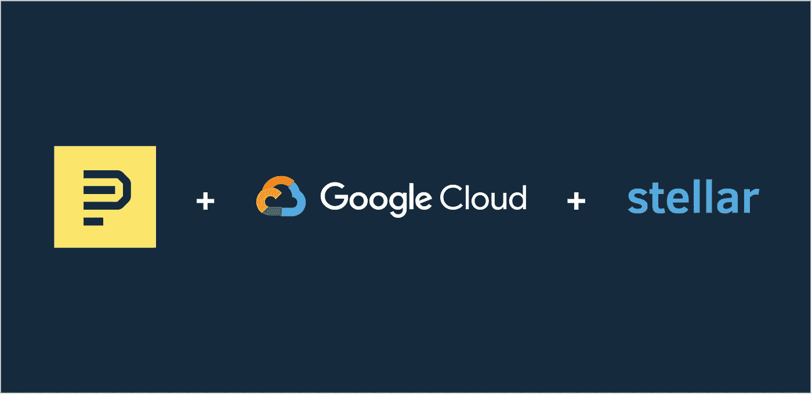

# 先锋假日锦标赛

> 原文：<https://medium.com/hackernoon/pioneers-holiday-tournament-eec1389a343e>

我叫丹尼尔。我是先锋的创始人。我们的使命是大规模地识别和培养世界上有创造力的局外人。

像常春藤联盟这样的传统机构试图通过依靠一小部分人来筛选成千上万的申请来解决这个问题。这不成比例。它让许多天才(尤其是非传统背景的)未被发现。

我们正在尝试一些完全不同的东西。我们试图通过建立一个在线游戏来寻找这些“丢失的爱因斯坦”。堡垒之夜，代表生产力。玩家根据他们在项目上取得的进展获得奖励。每个月，我们都会向最优秀的公司提供 1000 美元的资助和高达 10 万美元的后续投资。

就在几天前，我们[宣布了首届先锋锦标赛的获胜者](https://pioneer.app/blog/meet-the-pioneers/)。今天，我们激动地宣布第三届十二月锦标赛现在开始！

**最新消息**

在我们的第二次锦标赛中，我们增加了更多的排行榜，改进了我们的同行投票流程，并改进了我们的选择算法。我们还提高了奖金额度:除了 1000 美元的现金奖励外，获胜的先锋还将获得 6000 美元的恒星流明奖金。

像 iPhone 一样，我们希望每个版本都能有所改进。12 月的锦标赛有一个*史诗*特色:通过谷歌云向获胜的申请人提供 10 万美元的[谷歌](https://hackernoon.com/tagged/google)云积分。这是一件大事。并非我们所有的申请人都需要云积分，但很多人都需要。恒星也将重新加入我们的比赛。获胜的申请人将获得:

*   1000 美元现金(查看我们的[常见问题解答](https://pioneer.app/faq/)了解更多相关信息)。
*   10 万美元的谷歌云积分。
*   6000 美元的恒星流明。
*   潜在的 10 万美元后续投资。
*   一张去硅谷的票。
*   专家指导。

这是启动天才的完美组合。

我们相信世界上有成千上万——也许是数百万——雄心勃勃的人，他们有天赋和创造力，只需要一点点支持来释放他们的潜力。如果你认识符合这个条件的人(可能是你！)，告诉他们申请！

申请周日晚上截止。从这里开始: [https://pioneer.app](https://pioneer.app/) 。