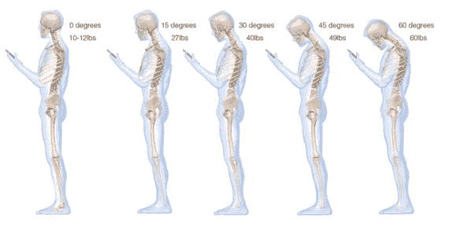
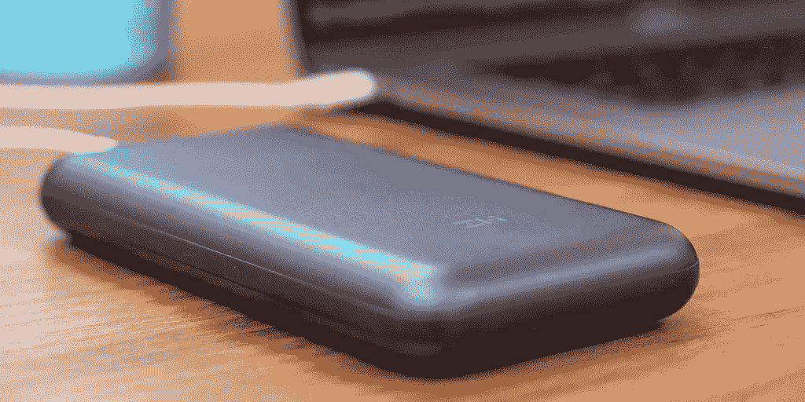

# Pixel Slate 对开发者来说(几乎)很棒

> 原文：<https://medium.com/hackernoon/pixel-slate-is-almost-great-for-developers-c5339c4b6bc>

上周 [Pixel Slate 开始向客户发货](https://chromeunboxed.com/news/pixel-slate-release-date-amazon-shipping-soon)。谷歌多年来一直将 Chromebook 设备作为生产力机器进行推广，但直到在 2018 年 Android 开发者峰会上宣布[支持 Android Studio](https://developer.android.com/topic/arc/studio) 之前，像我这样的 Android 开发者并不是这样。当我在 2014 年开始编写代码时，我期待能够通过强大的便携式 Chromebook 在我的手机和电脑上编写和使用相同的应用程序。像素板是 Chrome Os 设备。

# Pixel Slate 非常适合 Android 和 Web 开发人员

在软件灵活性、功能和设计的平衡下，如果我知道我只是为 Android 和后端开发，我会从我现在的 Macbook Pro 跳到 [Pixel Slate](https://store.google.com/us/product/pixel_slate?gclid=Cj0KCQiA8_PfBRC3ARIsAOzJ2uopBNNvS662YOGSju8M9zyV79ASgyCzNdGvuN89857-ZbUczJ1jpPAaAlV2EALw_wcB&gclsrc=aw.ds) 。

# 【Pixel Slate 有什么吸引人的地方

## **面向开发者**

*   [**通过原生 Linux 支持运行几乎任何开发软件**](https://www.blog.google/products/chromebooks/linux-on-chromebooks/) 。
*   随着高端 Chromebook 变得越来越常见，如 [Pixel Slate](https://store.google.com/us/product/pixel_slate?gclid=CjwKCAiAiuTfBRAaEiwA4itUqE9WNzHoC07FK9AvxzrUexlByiV6Ocx3USLov1YLORa5bQdVRhwRRBoCt0cQAvD_BwE&gclsrc=aw.ds) 、 [Pixelbook](https://store.google.com/us/product/google_pixelbook?gclid=CjwKCAiAiuTfBRAaEiwA4itUqEBy0raSG3U3nAw0XZ2E2YaQjvgyg7-0yMtBqizzBs0HnCxUzFojqRoCkzoQAvD_BwE&gclsrc=aw.ds) 和 [Acer Chromebook Spin 13](https://www.amazon.com/Acer-Chromebook-CP713-1WN-53NF-Convertible-Touchscreen/dp/B07GD4CMDH/ref=sr_1_3?ie=UTF8&qid=1543125197&sr=8-3&keywords=acer+chromebook+spin+13) 。尽管 Pixel Slate 无法与一款全面装饰的 Macbook Pro 相提并论，但 Slate 似乎有足够的火力来编译和运行应用程序。作为背景，根据下面的 [Geekbench 4](https://browser.geekbench.com/v4/cpu/search?utf8=%E2%9C%93&q=) 的处理器基准测试分数，Pixel Slate 的能力几乎是我 10 岁的**Macbook Pro 的**3 倍，我仍然在开发 Android 应用程序，没有问题。

[Geekbench 4](https://browser.geekbench.com/v4/cpu/search?utf8=%E2%9C%93&q=) Processor Scores

*   **与使用仿真器相比，直接在设备上测试 Android 应用**。
*   **在不使用物理设备的情况下，使用触摸屏**测试实际使用情况。
*   **保住脖子**不用占一整张桌子。没有人会想成为咖啡馆里的傻瓜，用一整张桌子搭配笔记本电脑支架和蓝牙键盘。抬高屏幕很好，因为它减轻了颈部的压力。[《大西洋月刊》重点报道了](https://www.theatlantic.com/health/archive/2014/11/what-texting-does-to-the-spine/382890/)向下凝视会给颈部和脊柱增加额外的重量，这是不健康的。随着 Pixel Slate 平板电脑外形尺寸的提升，屏幕仅占用传统笔记本电脑一半的空间。笔记本电脑有两个键盘的空间，键盘连接到笔记本电脑和一个单独的键盘打字。流行的 iPads 键盘 Brydge 生产了一款[像素平板键盘](https://www.brydge.com/pages/gtype-keyboard-for-google-pixel-slate?gclid=Cj0KCQiA8_PfBRC3ARIsAOzJ2uomuZvgo2x_I5U6YlNu5ctlSNP4dIlPJLAAYPCD5rblPQ13L-l8sioaAh1uEALw_wcB)，它比[谷歌键盘](https://store.google.com/us/product/pixel_slate_keyboard?hl=en-US)更好，因为它在连接时提供了一个牢固的铰链。

The Atlantic, What Texting Does to the Spine by [OLGA KHAZAN](https://www.theatlantic.com/author/olga-khazan/)

## 对于所有用户

【Android 应用的更多功能是 web 应用所不具备的。

列举几个特征:

*   [Gmail](https://play.google.com/store/apps/details?id=com.google.android.gm) 和[谷歌日历](https://play.google.com/store/apps/details?id=com.google.android.calendar):一次查看所有账户的收件箱。
*   [谷歌任务](https://play.google.com/store/apps/details?id=com.google.android.apps.tasks):没有独立的网络应用。
*   [Instagram](https://play.google.com/store/apps/details?id=com.instagram.android) :消息传递。
*   [口袋](https://play.google.com/store/apps/details?id=com.ideashower.readitlater.pro):听转换成音频内容的文本。
*   [口袋演播](https://play.google.com/store/apps/details?id=au.com.shiftyjelly.pocketcasts)、 [YouTube](https://play.google.com/store/apps/details?id=com.google.android.youtube) 、[网飞](https://play.google.com/store/apps/details?id=com.netflix.mediaclient):线下内容。

**用**做笔记**用**谷歌的[压感笔](https://store.google.com/us/product/google_pixelbook_pen)对于那些喜欢在旅途中做手写笔记的人来说，似乎是一个很好的解决方案。

**指纹传感器**用于解锁设备以及潜在的密码和支付。

**使用 [USB-C 电池组](https://thewirecutter.com/reviews/best-usb-c-battery-packs-and-power-banks/)随时随地为**充电。

**快充其他设备**，再次感谢 USB-C。

[Wirecutter: The Best USB-C Battery Packs and Power Banks](https://thewirecutter.com/reviews/best-usb-c-battery-packs-and-power-banks/)

# **为什么我不买一台**

## **最大存储选项低**

这不是一个交易破坏者。考虑到类似设备的规格以及全规格像素板的价格为 **$1，599** ，我希望有 500 GB。去年的 Pixelbook 提供 500 GBs，新的 iPad pro 提供 1 TB 选项。

我仍然可以让最大 250 GB 像素的石板工作。根据我对当前手机和 Macbook 使用情况的估计，我会使用 146 GB，这样我就有 58%的容量。据 CNet 报道，存储容量不足会导致性能问题[，因此以 58%的容量开始是可行的，但如果你打算在未来几年使用该设备，这并不理想。](https://www.cnet.com/how-to/5-reasons-why-your-laptop-is-slow/)

Minimum estimated required storage needed for computer.

## **“Hacky”iOS 开发解决方案**

这是一个交易破坏者。我认为购买技术是一项长期投资。正如我上面所说，我仍然在使用我的 2009 年 Macbook Pro，许多组件都进行了更新。目前，我正在编写 Android 应用程序，这将与 Pixel Slate 配合使用。然而，如果未来有任何进入 iOS 开发的可能性，也没有办法在 Chrome Os 设备上干净利落地完成。 [**Xcode**](https://developer.apple.com/xcode/) **仅限 macOs】。**

Chromebook 上的 iOS 开发选项有:

1.  在虚拟机上运行 macOs，从而违反了苹果的最终用户许可协议。
2.  使用云解决方案，如 [*macInCloud*](https://www.macincloud.com/) ，即使它没有性能问题，如果您使用跨平台解决方案，如 [Flutter](https://flutter.io/?gclid=Cj0KCQiA8_PfBRC3ARIsAOzJ2upl61gPcToRhnMIT9tobEEYjpkpblzTS6oRJ9BEGwCrJt-Jc1yzT0IaAjoZEALw_wcB) 或 [ReactNative](https://facebook.github.io/react-native/) ，您将不得不在云环境中同时运行 Android 和 iOS。

因此我必须向苹果屈膝。

[prettywhiskey.com](https://www.prettywhiskey.com/)

## **潜在的 iOS 开发解决方案(短期内不太可能)**

1.  无论是谷歌的 Flutter 还是脸书的 ReactNative 都创建了一个提交 iOS 应用程序的流程，而不需要在本地机器上安装 Xcode。
2.  库克国王为非 macOs 设备开放 Xcode。

*我是亚当·赫维茨——点击拍手图标，看看我剩下的* [*写作*](/@AdamHurwitz) *如果你喜欢以上内容。感谢阅读！*

