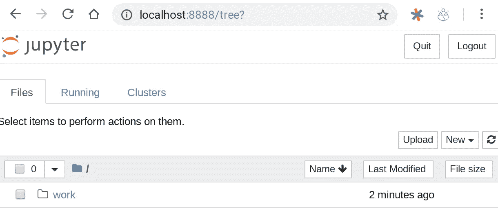
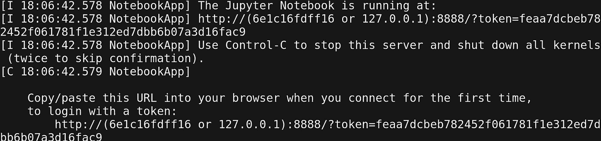
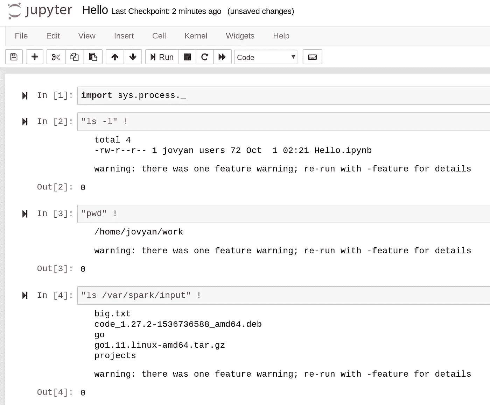
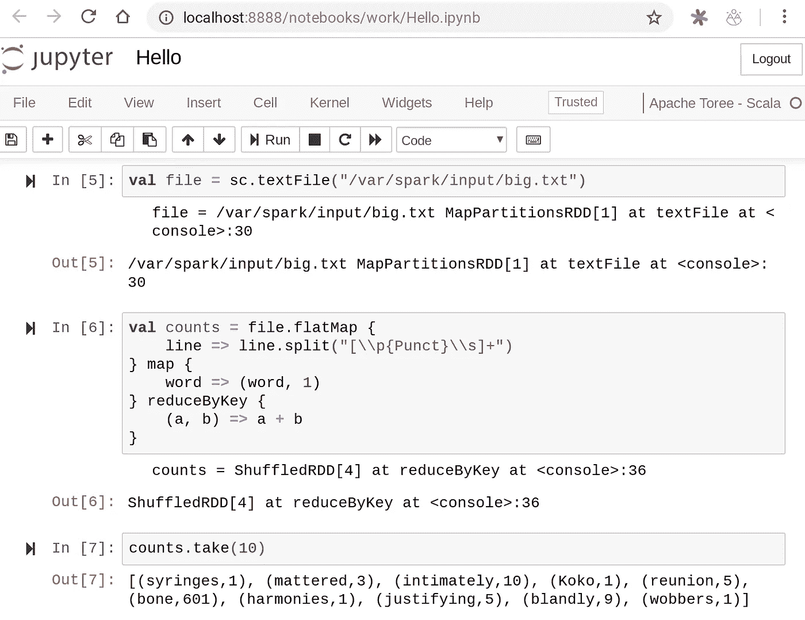
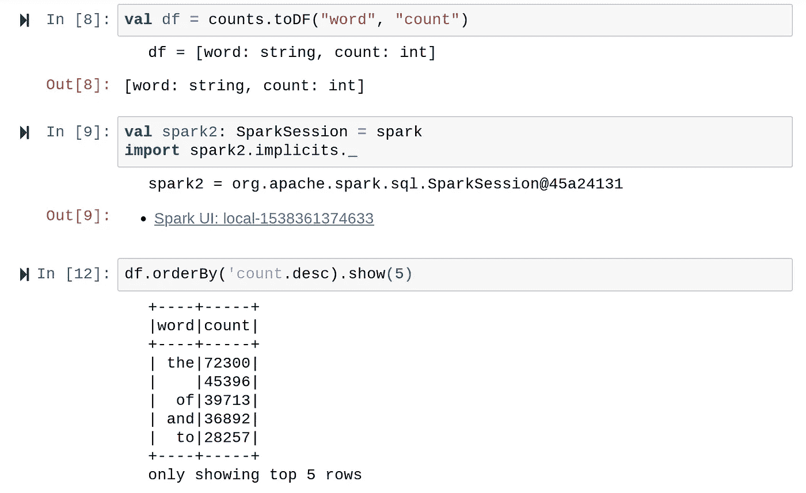

# Pixelbook 重访:运行 Docker 容器

> 原文：<https://medium.com/hackernoon/pixelbook-revisited-running-docker-containers-aa7c742a7dec>


Go and docker is a really nice combo. I’m not using any Go in this article but it’s a cute image :)

几个月前，我在 [Google](https://hackernoon.com/tagged/google) Pixelbook 中写了我建立开发环境的经历。那时 Linux (beta)特性只在开发频道上可用，但是现在这个特性也已经在稳定频道上发布了。

虽然我确实在 Pixel 上写了一些不错的代码，但是一些系统更新破坏了我的 VS 代码安装。我能够启动应用程序，但窗口就是不呈现…看日志，应用程序似乎在工作，但处于“无头”状态。

我没有技能进一步调试，所以差点放弃了。但是因为我需要的特性是在稳定分支中发布的，所以我决定清洗设备并重新开始，这次是在稳定频道上。

顺便提一下:在这之前，我也尝试过在开发者模式下运行 Pixelbook，但是我一点也不喜欢这种用户体验。每次我启动 XFCE 时，它都会完全打乱我在 Chrome 操作系统上的分辨率和颜色，让我无法在两个世界之间切换。如果你对此有不同的体验，请告诉我。

在强力清洗之后，我已经设置了 VS 代码并再次运行二进制程序。我不会在这里重复步骤，但你可以参考我以前的文章或官方网站的步骤:

*   VS 代码:[https://code.visualstudio.com/docs/setup/linux](https://code.visualstudio.com/docs/setup/linux)
*   去:[https://golang.org/doc/install?download](https://golang.org/doc/install?download)

这次我走得更远，还安装了 [Docker](https://hackernoon.com/tagged/docker) 。在这里我记录了我的经历。

首先，您需要安装一些先决条件:

```
$ sudo apt-get update$ sudo apt-get install \
    apt-transport-https \
    ca-certificates \
    curl \
    software-properties-common
```

然后添加 Docker 存储库(为简洁起见，省略了输出):

```
$ curl -fsSL https://download.docker.com/linux/ubuntu/gpg | sudo apt-key add -$ sudo add-apt-repository \
   "deb [arch=amd64] https://download.docker.com/linux/ubuntu \
   $(lsb_release -cs) \
   stable"
```

**更新:**这篇文章发表后，一些人报告说使用 Debian 的库比使用 Ubuntu 的有更好的体验:

```
$ curl -fsSL https://download.docker.com/linux/debian/gpg | sudo apt-key add -$ sudo add-apt-repository \
   "deb [arch=amd64] https://download.docker.com/linux/debian \
   $(lsb_release -cs) \
   stable"
```

然后安装 Docker:

```
$ sudo apt-get update
$ sudo apt-get install docker-ce
```

现在一切都应该正常工作了，所以我们发出一个`docker run hello-world`来测试安装:

```
$ sudo docker run hello-world
docker: Error response from daemon: OCI runtime create failed: container_linux.go:348: starting container process caused "process_linux.go:402: container init caused \"could not create session key: function not implemented\"": unknown.
ERRO[0000] error waiting for container: context canceled 
$
```

不对不对！看来我们可能有问题了！

***更新*** *:这个问题似乎已经被 ChromeOS 71.0.3578.98 解决了。如果这是你的情况，请跳到下一部分。*

这在 ChromeOS 的最新版本中有所改变…上次我尝试运行 docker 时，它运行得很好。经过一番调查，我发现了这个问题:[https://bugs.chromium.org/p/chromium/issues/detail?id=860565](https://bugs.chromium.org/p/chromium/issues/detail?id=860565)

而这篇 reddit 的帖子总结了解决方案:[https://www . Reddit . com/r/cros TiNi/comments/99 jdeh/70035242 _ rolling _ out _ to _ dev/E4 revli/](https://www.reddit.com/r/Crostini/comments/99jdeh/70035242_rolling_out_to_dev/e4revli/)

我甚至没有背景知识来假装我真的明白这是怎么回事，但基本上，我们在这里扰乱一些系统特权。

解决方法是启动 Chromium Shell (Ctrl+Alt+T)并取消设置黑名单中的 syscall。在按下 Ctrl+Alt+T 之后，你应该会在一个新的 Chrome 标签上看到`crosh>`提示。键入以下命令:

```
crosh> vmc start termina
(termina) chronos@localhost ~ $ lxc profile unset default security.syscalls.blacklist
(termina) chronos@localhost ~ $ lxc profile apply penguin default
Profiles default applied to penguin
(termina) chronos@localhost ~ $ lxc restart penguin
```

如果重启似乎挂起，只需按 Ctrl+C 并再次运行它。对我很有效。:)

之后您可以关闭终端。有了这些改变，你应该可以很好地运行 docker。

在 Linux(企鹅)终端:

```
danielapetruzalek@penguin:~$ sudo docker run hello-worldHello from Docker!
This message shows that your installation appears to be working correctly.To generate this message, Docker took the following steps:
 1\. The Docker client contacted the Docker daemon.
 2\. The Docker daemon pulled the "hello-world" image from the Docker Hub.
    (amd64)
 3\. The Docker daemon created a new container from that image which runs the
    executable that produces the output you are currently reading.
 4\. The Docker daemon streamed that output to the Docker client, which sent it
    to your terminal.To try something more ambitious, you can run an Ubuntu container with:
 $ docker run -it ubuntu bashShare images, automate workflows, and more with a free Docker ID:
 [https://hub.docker.com/](https://hub.docker.com/)For more examples and ideas, visit:
 [https://docs.docker.com/get-started/](https://docs.docker.com/get-started/)danielapetruzalek@penguin:~$
```

有用！

**更新:**如果您想删除 sudo，您可以执行 Linux 安装后步骤来创建 docker 组，并将您的用户添加到其中:

```
$ sudo groupadd docker
$ sudo usermod -aG docker $USER
```

感谢所有在评论中指出这一点的人。

## 尝试更严肃的东西

因此，我们有了`hello-world`工作，但是这对于更复杂的 docker 环境意味着什么呢？幸运的是，我们有大量的预构建容器图像可供选择。

摆弄 Apache Spark 是我经常喜欢做的事情，所以我决定尝试一下`jupyter/all-spark-notebook`图像。您可以像往常一样使用`docker pull`:

```
$ docker pull jupyter/all-spark-notebook
(output omitted for brevity) 
```

然后运行图像，如下所示:

```
$ sudo docker run -p 8888:8888 jupyter/all-spark-notebook
```

对于那些不熟悉 docker 的人来说，`-p`参数会将容器的端口映射到主机中的某个端口。在这种情况下，我只是暴露 8888 端口。

所以棘手的部分来了。我正在 Chrome OS 上运行的 Linux 容器上运行 Jupyter 笔记本的 docker 映像，该映像支持 Spark。正因为如此，我没有想到在浏览器上点击 [http://localhost:8888](http://localhost:8888) 会访问 Jupyter 笔记本，但是我错了:



请注意，首次访问`localhost:8888`界面时，您需要传递一个令牌。您可以在`docker run`命令的日志输出的第一行找到它。我的情况是:



关于实际指向容器的`localhost`,我有一个轻微的印象，在几个版本之前这不是那样工作的，但是我不是 100%确定。然而，这是一个很大的惊喜。

注意:在随后的运行中，本地主机映射似乎不知何故丢失了，所以现在它似乎不稳定。一个技巧是在容器中运行`ip a`,计算出`eth0`的 ip 地址，并用它代替 localhost。我只能通过重启来恢复本地主机映射。

下一步是在容器中做一些工作。我要下载一个大的文本文件，并在上面运行一个经典的字数统计算法。我选择了这个文件来测试:[http://norvig.com/big.txt](http://norvig.com/big.txt)

我使用`wget`将它下载到容器中，但是你可以将它保存到 Chrome OS 中的“Linux 文件”中，因为它最终会在容器中的用户家中。`wget`不是默认安装的，所以我们必须先安装它，然后获取文件:

```
$ sudo apt-get install wget
(...)
Setting up wget (1.18-5+deb9u2) ...
$ wget [http://norvig.com/big.txt](http://norvig.com/big.txt)
--2018-09-30 21:50:34--  http://norvig.com/big.txt
Resolving norvig.com (norvig.com)... 66.96.146.129
Connecting to norvig.com (norvig.com)|66.96.146.129|:80... connected.
HTTP request sent, awaiting response... 200 OK
Length: 6488666 (6.2M) [text/plain]
Saving to: ‘big.txt’

big.txt               100%[=========================>]   6.19M   140KB/s    in 41s     

2018-09-30 21:51:15 (156 KB/s) - ‘big.txt’ saved [6488666/6488666]
```

让我们重新启动容器，将 Linux 主目录映射到容器中的一个目录:

```
sudo docker run -p 8888:8888 -p 4040:4040 -v ~:/var/spark/input jupyter/all-spark-notebook
```

在上面的命令中，为了以防万一，我还添加了公开 Spark UI 的端口 4040 的映射。

为了运行我们的工作负载，我创建了一个带有 Apache Toree (Scala)内核的笔记本。我使用`sys.process`包来帮助我们在容器内部导航。



所以`big.txt`文件就在那里。现在让我们试试经典的字数统计算法:



在这里，我使用一个正则表达式[通过空格和标点符号来拆分单词。现在让我们打印最常用的:](https://xkcd.com/208/)



Since I haven’t filtered any stop words I guess that’s expected.

我首先将其转换为数据帧以获得更好的界面，然后在 cell nine 上，我使用一个技巧在 Jupyter 笔记本上导入`spark.implicits._`。

最后，我使用隐式列操作符(单引号)打印结果，以降序排序。

## 结论

是的，在 Pixelbook(或任何现代 Chromebook)上运行复杂的 docker 图像是完全可行的，但你仍然可能会面临一些不稳定的问题，你必须做好准备。

我不知道为什么绑定到 localhost 有时有效，有时无效，但是诊断需要一些我目前缺乏的系统和网络知识。一种解决方法是忽略`localhost`并计算 Linux `penguin`容器的 IP 地址，然后直接使用它。如果到了这一步，这个 Reddit 可能会派上用场:[https://www . Reddit . com/r/cros TiNi/comments/89x 69 f/is _ there _ a _ way _ to _ open _ ports/](https://www.reddit.com/r/Crostini/comments/89x69f/is_there_a_way_to_open_ports/)

在撰写本文期间，我不得不重启 Pixelbook 至少一次，并几次(从`crosh`中)杀死`termina`容器，因为启动终端快捷方式变得不负责任。请注意，如果您重新启动 Chromebook，您需要再次运行删除黑名单步骤。

我仍在努力理解这种架构以及如何诊断平台问题。此刻我正在用`crosh`调试`termina`和`termina`调试`penguin`，但是这两者之间的关系我并不十分清楚。我想这将随着时间的推移而到来，然而，探索这一切是一次有趣的经历。

你有任何问题或意见吗？请随意使用下面的评论栏。