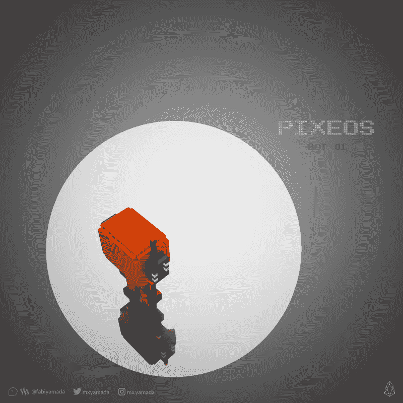
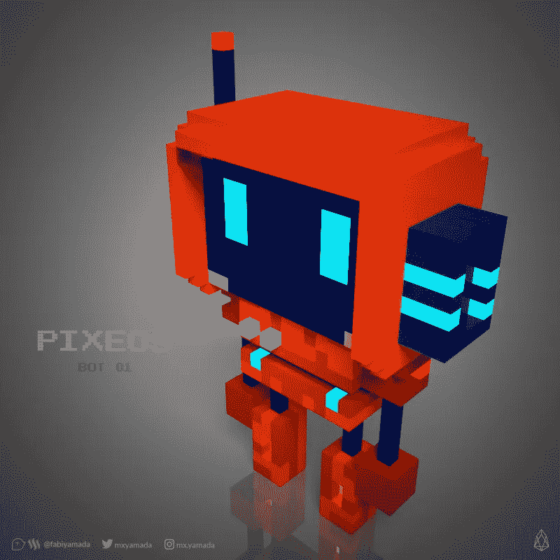

# pixEOS:特色艺术家常见问题

> 原文：<https://medium.com/hackernoon/pixeos-featured-artists-faq-71fa696ad5e2>

art by [yusaymon](https://medium.com/u/91e50344f201?source=post_page-----71fa696ad5e2--------------------------------)

谁是 pixEOS 的特色艺术家？

[pixEOS](https://www.pixeos.io) 的核心是一个合作项目。pixEOS 是 EOS 区块链上的一家初创公司，正在用无数组件构建一个艺术游戏化基础设施。

特色艺术家是 pixEOS 艺术家集体的一部分。他们通力合作，让 pixEOS 项目尽可能地棒。他们制作贴纸、艺术、图形、设计、卡通头像、3D 艺术、绘画和其他互动创意发明。他们发明新概念。

他们一起帮助建立了 [pixEOS](https://www.pixeos.io) 平台，并在不久的将来通过 NFTs(不可替代的代币)将他们自己的作品货币化。如果你不知道 NFT 氏症是什么，[阅读这篇文章](https://cointelegraph.com/explained/non-fungible-tokens-explained)。他们也明白 pixEOS 有一个长期的路线图，并正在建立一个基于 EOS 区块链的创造性的、可持续的智能经济。

**特色艺人都是做什么的？**

bot by Fabiyamada

特色艺术家创作、分享他们的艺术并与其他艺术家合作。他们不仅推广 pixEOS 项目并为社区带来更多艺术家，而且在时间允许的情况下尽可能多地参与社区并与社区互动。

他们帮助制作 pixEOS 项目所需的东西，并且在方法上完全灵活。作为 pixEOS 货币化阶段不可或缺的一部分，他们将很快用 NFT 的作品来标记他们的艺术，并在 pixEOS 平台上出售。

**你应该期待什么？**

pixEOS 是一个蓬勃发展的艺术家集体，你可以期待遇到鼓舞人心的艺术家，结交新朋友，并成为一个开创性和破坏性的新区块链艺术项目的一部分。pixEOS 采用精英制度。如果你了解燃烧的人是如何工作的，你可能会非常了解 pixEOS。

**你不该期待什么？**

pixEOS 本质上是一个艺术家集体。如果你不喜欢与其他艺术家合作，并以有益于整个艺术家集体的方式贡献你的创造力，你可能不应该加入 pixEOS。如果你加入了 pixEOS，你就不要指望拥有一辆兰博。此外，当你为 pixEOS 制作艺术品时，你可以签上你的名字，并在底部放上你在线作品集的链接，但你不允许要求捐款或在上面放上你的 EOS 或其他加密账户。为什么？因为看起来很俗气。如果你非常自负，pixEOS 可能不适合你。

**关于协同工作**

pixEOS 非常注重协作，没有艺术家和 EOS 社区的协作，它就无法存在。

例如，我们目前正在制作一个大型协作数字画布，它将用于 t 恤和其他 pixEOS 商品。

它是这样工作的:pixEOS 艺术家独立创作艺术元素，并将他们的作品通过电子邮件发送给一位艺术家，然后他将这些元素添加到一幅大型数字画布上。所有提交作品的艺术家都将在官方文章和网站上获得荣誉，但他们的签名不会附在他们提交的作品上。这使得一件干净的作品由许多不同艺术家的许多元素组成。

**pixEOS 合作艺术与 NFT 艺术家个人作品**

pixEOS 有两个不同的艺术方面，所以你必须了解它们之间的区别。

这些是为 pixEOS 项目和 NFT(不可替代的代币)制作的合作艺术/媒体，由艺术家发行，目的是通过区块链出售他们的艺术品。NFT 完全属于艺术家，艺术家保留所有权利，出售这些作品产生的代币直接归艺术家所有。

为 pixEOS 项目制作的协作艺术和媒体(营销、推广、社区参与、伙伴关系、品牌、商品)属于 pixEOS 社区，不受单个艺术家版权的约束。艺术家为 pixEOS 项目制作的 pixEOS 艺术作品将归属于该特定艺术家(艺术家签名)，但其版权不归该艺术家所有。这种艺术将受到[知识共享署名 4.0 国际(CC BY 4.0)许可](https:// creativecommons.org/licenses/by/4.0/)的保护。

您可以自由地:

*   共享—以任何媒体或格式复制和重新分发材料
*   改编——出于任何目的，甚至是商业目的，对材料进行重新混合、转换和构建。
*   只要您遵守许可条款，许可方就不能取消这些自由。
*   归属——您必须给出适当的说明，提供许可证的链接，并指出是否进行了更改。您可以以任何合理的方式这样做，但不得以任何方式暗示许可方认可您或您的使用。

重要的是，你要完全理解这种区别，并同意这些条款。当您为 pixEOS 项目制作艺术或媒体(供整个社区使用)时，它拥有知识共享许可。而艺术家制作的 NFT 包含艺术家保留的所有权利。

如果你是一个只想使用 pixEOS 的 NFT 系统的艺术家，并且对合作或帮助 pixEOS 项目整体发展不感兴趣，你就不应该加入 pixEOS。从本质上讲，pixEOS 是一个协作项目，如果每个人都各自为政，它就无法蓬勃发展。

**如何成为 pixEOS 的特色艺人？**

bot by Fabiyamada

首先，你热爱 pixEOS 项目，并希望帮助它变得更加出色。你应该已经掌握了加密的工作知识，并且渴望学习 EOS 生态系统。你应该已经有一个 EOS 账户了。如果您没有 EOS 帐户，这是您的第一步。我们可以帮你。**将你的艺术家组合网站、社交媒体账户的链接和介绍邮件发送至:artists@pixeos.io**

**pixEOS 官方链接**

[https://www . pixEOS . io](https://www.pixeos.io)https://twitter.com/eos_pix
https://instagram.com/pixeos.io
pixEOS 官方电报组:[https://t.me/PIXEOSpixEOS](https://t.me/PIXEOSpixEOS)
官方公告渠道:[https://t.me/pixeosiopixEOS](https://t.me/pixeosiopixEOS)
中国组:[https://t.me/pixEOSChina](https://t.me/pixEOSChina)
pixEOS 韩国组:[https://t.me/pixEOSKorea](https://t.me/pixEOSKorea)
白皮书英文:[https://pixeos.io/pdf/pixeos_1_25_12a_en.pdfWhitepaper](https://pixeos.io/pdf/pixeos_1_25_12a_en.pdfWhitepaper)中文:[https://pixeos.io/pdf/pixeos_1_25_12a_cn.pdf](https://pixeos.io/pdf/pixeos_1_25_12a_cn.pdf)
电子邮件

这篇文章最初发表在 Trybe 上。一:[https://trybe.one/pixeos-featured-artists-faq/](https://trybe.one/pixeos-featured-artists-faq/)皮克斯已经授权在这里发表。