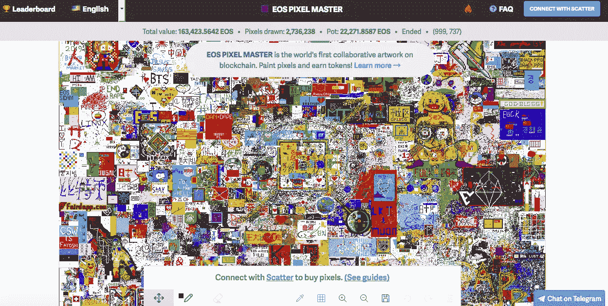

# PixEOS:EOS 上新的符号化艺术和游戏平台

> 原文：<https://medium.com/hackernoon/pixeos-new-tokenized-art-and-game-platform-on-eos-2d9d47bcfb81>

# 什么是 [pixEOS？](https://www.pixeos.io/)

据我所知，pixEOS 就像是一个由[R . a . R . e . Art](https://www.rareart.io/)、 [EOS Pixel Master](https://pixelmaster.io/) 和 [BetDice](https://betdice.one/) 组成的混合体。

## 不知道什么是像素大师？

还记得那个创建了百万美元主页并通过让人们为网站上的广告空间付费而筹集了一百万美元的少年吗？Pixel Master 就像是未来区块链艺术版的百万美元主页。

## 这是百万美元主页的样子:

[https://iowaadguy.files.wordpress.com/2010/09/million-dollar-homepage.jpg](https://iowaadguy.files.wordpress.com/2010/09/million-dollar-homepage.jpg)

## 下面是 EOS 像素大师的样子:

[https://pixelmaster.io/](https://pixelmaster.io/)

EOS Pixel Master 是一个非常成功的符号化艺术项目，现在已经结束。早期采用者获得了大量的 EOS，人们很快就沉迷于通过画像素赢得 EOS 奖金的想法，这些像素在整点收集。

## PixEOS 的目标是从 Pixel Master 留下的地方开始，但建立一个可持续的 tokenomic 系统，远远超过一个 Pixel Master 式的游戏。

以下是《白兔》的 Dmitriy Perelstein 最近对 PixEOS 的评论:

> “我对此感到兴奋，因为, [PixEOS](https://www.pixeos.io/) 是一个项目，它是类固醇 Pixel Master、可乐 BetDice 和红牛 Super Rare 的疯狂组合。PixEOS 从这些其他加密项目中吸取了最好的令牌组学概念，对它们进行了增强，并将其包装在一个创新产品中。”[——白兔](https://www.whiterabbiticos.com/blog/pixeos-art-gamification-project-on-eos-platform)

PixEOS 将于 2019 年 1 月推出其首款游戏。PixEOS 昨天刚推出网站，所以来看看:[https://www.pixeos.io/](https://www.pixeos.io/)

## 这是一个非常性感的网站:

[https://www.pixeos.io/](https://www.pixeos.io/)

# PixEOS 是给谁的？

## 所有人。

pixEOS 将为每个人提供一些东西，因为人们可以通过下注、玩游戏和参加竞赛来赚取 PixEOS 令牌。所以，即使你不是一个有创造力的人，也有很多方法可以赚到 pixEOS。

pixEOS 团队研究了 EOS 上最成功的两个项目 Pixel Master 和 BetDice，从这两个项目中汲取灵感并改进了他们的游戏模型。PixEOS 由社区驱动，以艺术家为中心，专注于创造一个非常可持续的智能经济。可持续的 tokenomic 模型为每个人制定了激励措施，从而完成了经济循环。艺术家、创意人员和游戏玩家将定期获得 pixEOS 代币，而临时用户和投资者将能够通过下注获得 pixEOS。

艺术家将拥有画廊，在那里他们可以使用 [NFT(不可替代的代币)](https://hackernoon.com/an-overview-of-non-fungible-tokens-5f140c32a70a)出售他们的作品，这将推动该平台的发展。此外，还会有一个区域，人们可以从 pixEOS 社区的艺术家那里获得艺术和设计服务。

将于 2019 年 1 月上线的第一款游戏名为 pixEOS Paint Dapp。早点进去因为要炸了，至少现在大家都是这么想的。

## PixEOS 令牌呢？

[https://www.pixeos.io/](https://www.pixeos.io/)

10 亿像素是预售的供应量。我们将于 2018 年 12 月推出快闪预售，先到先得。如果您想参与预售，请加入 pixEOS Telegram，您将在那里获得帮助:【https://t.me/PIXEOS

## 白皮书在哪里？

您可以在 pixEOS 网站上下载白皮书，只需向下滚动到底部。它是用英语和汉语写的。【https://www.pixeos.io/ 

## 谁与 Pixeos 合作？

## Pixeos 是谁创立的？

Fred Nogueira 和 Jorge Alcario 是 Pixeos 的最初创始人。

## 如何参与 Pixeos

皮克斯电报组是很多活动的地方。已经有两次艺术比赛，获胜者可以获得 2000 到 8000 pixEOS 代币。加入这里:[https://t.me/PIXEOS](https://t.me/PIXEOS)

pixEOS Telegram 竞赛的部分获奖作品:

Julia K. Ponsford

[yusaymon](https://medium.com/u/91e50344f201?source=post_page-----2d9d47bcfb81--------------------------------)

Twitter 是另一个你可以参与 pixEOS 的地方，因为投票是在投票中进行的:[https://twitter.com/eos_pix](https://twitter.com/eos_pix)

像所有奇怪和奇妙的事情一样，我不知道当只有我们 4 个人的时候，我是如何偶然进入 pixEOS 电报频道的。从 4 到 274……..去月球！

collage by Stellabelle

对我来说，pixEOS 感觉像是 EOS 的燃烧人。[https://www.pixeos.io/](https://www.pixeos.io/)

# PixEOS 官方链接:

网址:[https://www . pixeos . io](https://www.pixeos.io)推特:[https://twitter.com/eos_pix](https://twitter.com/eos_pix)
insta gram:[https://instagram.com/pixeos.io](https://instagram.com/pixeos.io)
YouTube:[https://www.youtube.com/channel/UCgT-kxHdHnLO3pSFotzHDqw](https://www.youtube.com/channel/UCgT-kxHdHnLO3pSFotzHDqw)
吉菲:[https://giphy.com/channel/pixeos](https://giphy.com/channel/pixeos)
斯蒂姆:[https://steemit.com/@pixeos](https://steemit.com/@pixeos)
特里贝:[https://trybe.one/members/pixeos/blog/](https://trybe.one/members/pixeos/blog/)

pixEOS Telegram group: [https://t.me/PIXEOS](https://t.me/PIXEOS)
pixEOS announcement channel: [https://t.me/pixeosio](https://t.me/pixeosio)
pixEOS China group: 中国社区: [https://t.me/pixEOSChina](https://t.me/pixEOSChina)
pixEOS Korea group: [https://t.me/pixEOSKorea](https://t.me/pixEOSKorea)
Whitepaper English: [https://pixeos.io/pdf/pixeos_1_25_12a_en.pdf](https://pixeos.io/pdf/pixeos_1_25_12a_en.pdf) Whitepaper Chinese: [https://pixeos.io/pdf/pixeos_1_25_12a_cn.pdf](https://pixeos.io/pdf/pixeos_1_25_12a_cn.pdf)

电子邮件:team@pixeos.io