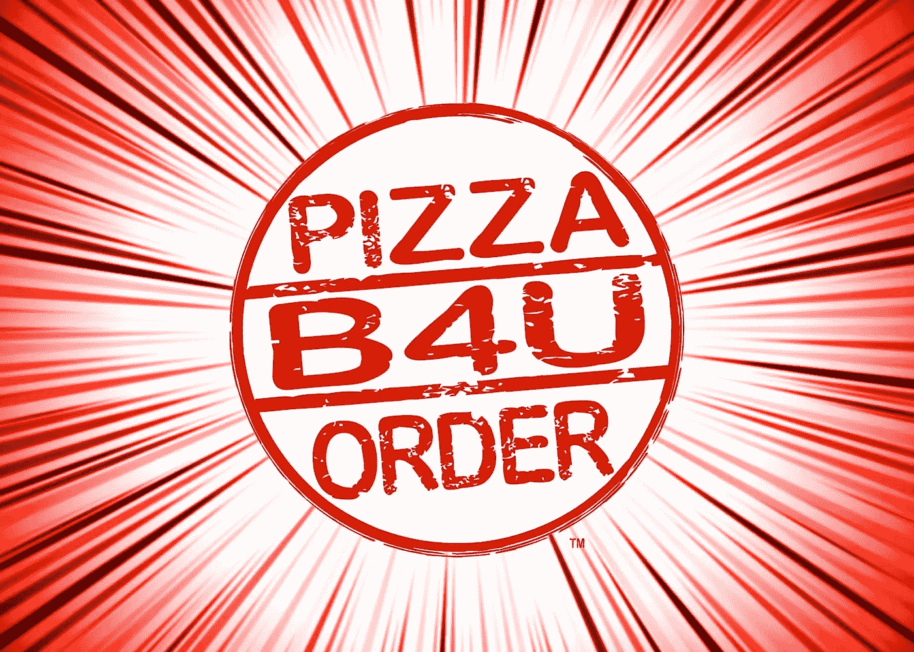

# 比萨 B4U 订单正在寻找一个网络开发商

> 原文：<https://medium.com/hackernoon/pizza-b4u-order-is-seeking-a-web-developer-241fff63ca63>

[披萨 B4U 订单](https://www.facebook.com/PizzaB4UOrder/)很高兴地宣布，我们目前正在寻找一名网络开发人员！这对合适的人来说是一个令人兴奋的机会。我们是凤凰城地铁区首屈一指的基于预知的披萨外卖服务。为食品服务行业最激动人心的公司之一工作！激动人心！

# 工作描述:

在 B4U 比萨店，我们致力于在顾客点餐前将美味的比萨带给他们。我们希望您在保持我们的客户门户、企业级移动应用和其他相关技术的同时分享这种激情。每周 60 小时，弹性工作制，周日和圣诞节休息*！

# 要求的资格:

15 年以上 PHP 开发经验
WordPress 专家，包括创建和编辑插件和主题
10 年以上 React.js/Vue/Ember/Angular
扎实理解星体投射
电子商务经验
Ruby on Rails
ASP.net
扎实理解使用 MySQL 和 HTML5 进行 dowsing
jQuery 的物理原理

# 首选:

SEO 知识
整合亚马逊网络服务的经验
某种程度的精神能力或资质**
电子邮件营销经验
精神摄影

比萨 B4U 秩序是一个伟大的地方工作！我们的休息室里有一张乒乓球桌***还有一台冰箱，里面除了嘿什么都没有！高纤维柑橘能量饮料！我们年轻时尚，希望你也一样。我们想要刺激和活力，所以没有老人！将特别考虑前[通灵 Taco](https://www.facebook.com/psychictaco/) 员工。

*未付

* *我们将免费让专业灵媒对您进行评估。

* * *乒乓球桌的可用性各不相同。有时人们想在餐桌上吃午饭。这是唯一的桌子。

薪资具有竞争力(起薪 35，000 美元/年！)并且基于经验。

仅限本地候选人。

请不要招聘人员。

要申请，请访问[blacksuitofdeath.com/pizza-b4u-order-jobs](http://blacksuitofdeath.com/pizza-b4u-order-jobs)

*原载于 blacksuitofdeath.com***。**

*如果你有 75 年的普通 JS 经验，请鼓掌。*