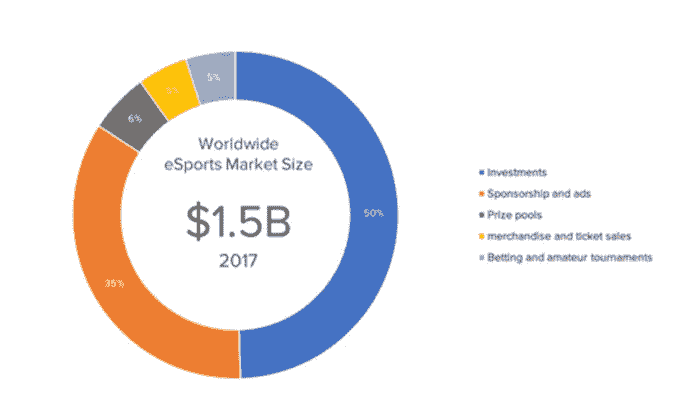

# Plair life (PLA):向游戏玩家分配财富

> 原文：<https://medium.com/hackernoon/plair-pla-distributing-wealth-to-gamers-f878f569276c>

你知道很多加密投资者实际上是游戏玩家吗？游戏和加密社区有很大的重叠。在过去，世界上第一批加密矿工中有许多是游戏玩家，他们拥有最强大的游戏显卡，他们使用游戏显卡上的额外功能来挖掘比特币。

因此，加密和游戏的数字化社区肯定是重叠的。难怪在过去的几年里，我们看到了许多与区块链项目相关的视频游戏，如金恩、蜡像等..到空间里来。

Plair 是一个专注于视频游戏的公共区块链平台，旨在为普通玩家建立社区、内容和奖励。如果你想学习如何从玩你最喜欢的游戏中赚取加密货币，请继续阅读这篇文章！

博彩业在 2017 年创造了 1160 亿美元的收入。这比前一年增长了 10%以上。目前全球有超过 2 亿名业余电子竞技玩家，预计到 2025 年这一数字将增长到 10 亿。

许多像 LOL 这样的在线游戏都是免费的。游戏公司从游戏中的附加组件如皮肤中赚钱。一旦 Riot，LOL 背后的公司开始组织团队比赛，他们的年收入在一年内从 8530 万美元增长到 12 亿美元。这是一年 1500%的增长。难怪大型游戏公司正在转向电子竞技和锦标赛。

但是，尽管去年电子竞技市场规模达到 15 亿美元，但只有 6%的市场份额以奖金的形式奖励了游戏玩家，而且几乎所有的份额都流向了职业游戏玩家，这使得像你我这样的普通游戏玩家没有机会在一个利润丰厚的行业中赚钱。

除了游戏内容，流媒体内容也是一项非常有利可图的业务，游戏流媒体在 2015 年创造了 38 亿美元的收入，Twitch 和 Youtube 垄断了 43%和 36%的市场份额。因此，在 38 亿美元的市场中，大约 80%的份额只流向了两家公司。同样，很少一部分利润流向内容创作者，大部分利润被大公司占有。

这就是普莱尔的用武之地。Plair 是区块链的一个项目，它通过为普通玩家(比如你和我)创造赚钱的渠道来分散游戏和流动利润。这不仅通过玩游戏和与其他玩家竞争来实现，还通过社区建设功能来实现，例如视频流或视频、文章、论坛等的内容管理。它们也是一个平台，这意味着未来可以添加越来越多的 Dapps 和功能。

因为我们正处于项目的开始阶段，或者他们称之为阶段 1，所以我将在这篇评论中讨论的大多数功能都只是阶段 1 的功能，所以这只是这个项目的冰山一角。第 2 阶段和第 3 阶段的详细信息将在未来发布，并将有自己的白皮书。

事不宜迟，现在让我们来看看其中的一些特性。

第一个特点当然是与其他玩家竞争。比赛可以在标准游戏中进行，例如 MOBA 的 5v5，甚至可以是新的游戏模式，例如 MOBA 游戏如 LOL 的 1v1 mid laner 比赛。玩家必须在比赛前下注 PLA 代币，获胜者将获得 PLA 代币和声望点数。

声誉点是系统中的一个功能，允许玩家升级，不仅会有一个人工智能系统根据他们的声誉将他们与适当的对手匹配，而且在达到一定的声誉分数后，玩家会成为一名资深玩家，并可以申请成为经验较少的玩家的导师或教练。当然，教练将为此服务获得代币报酬，并且该特征允许有经验的玩家获得代币，也允许经验较少的玩家容易地评估教练并提高他们的技能。这在当前的游戏场景中是非常缺乏的。教练可以在每节课后由球员进行评估，以帮助未来的球员选择最适合他们的教练。

除了非正式比赛，还有锦标赛。

玩家甚至可以组织自己的锦标赛，设置自己的奖励。

牵线搭桥和支付的整个过程是自动化的。这是一台进行匹配的人工智能机器，智能合约持有初始存款作为托管，并在匹配结束后释放它。

因为它是区块链和分散驱动的，所以结果验证系统对欺诈、虚假报告或其他干扰具有弹性。

然而，如果一名球员对结果不满意，他可以对结果提出质疑。这场比赛将由一个独立的机构进行裁判。

除了玩游戏，另一种赚取 PLA 代币的方法是 mine it。挖掘是通过在您的桌面上安装一个软件来完成的，该软件提供处理能力来帮助处理池节点的游戏数据。运行这样一个池节点的人将获得 PLA 奖励。

任何拥有 PLA 令牌和池节点的人都可以自愿成为法庭池的一部分，并因其努力而获得奖励。在比赛有争议的情况下，将从法庭人才库中随机选出至少 2 名用户来审查比赛。可以有 2 个以上的用户，甚至可以有 20 个用户。所有法庭评审人员必须投票赞成结果生效。

白皮书中没有说对被发现有错误的人的惩罚是什么，但我们可以预计会有严重的惩罚，因为白皮书明确表示，该团队认真对待对生态系统造成的损害。因此，这将强烈阻止负面的游戏行为，如钓鱼或 AFK。

业余游戏的另一个常见问题是 smurfing。任何玩家都知道什么是蓝精灵。游戏中的蓝精灵不是蓝色生物。Smurfing 是一种职业游戏玩家建立第二个帐户并假装成初学者玩家，然后进入初学者游戏并欺负经验较少的游戏玩家的行为。Smurfing 是当今在线游戏中的一个大问题，因为它使初学者难以享受和学习游戏，并且在 Plair 平台上，代币是游戏输赢的赌注，其后果可能会严重得多。

Plair 将尽最大努力保护用户免受 smurfing 攻击，但是

跟踪用户的 IP 地址。如果用户被发现使用相同的 IP 地址创建多个帐户，他们将收到警告，并可能被禁止。

二。为新帐户设置池的大小限制。因此，用户需要在每个账户上玩一定数量的游戏，才能获准参加自己的台球锦标赛。这阻碍了 smurf，因为 smurf 将不得不浪费大量时间来平衡每个新帐户。

三。允许玩家互相监督。因此，如果败诉方认为对手在作弊，他可以向法庭报告，法庭将调查此案并做出相应处罚。也将会有适当的算法来捕捉和惩罚偷窥的玩家。

一些游戏玩家可能不想参与锦标赛风格的游戏。对于这些玩家，普莱尔将提供任务。这些都是你不需要与他人互动就能完成的活动。一个任务的例子可以是例如在 PUBG 的 q 天获得 5 顿鸡肉晚餐。成功完成奖励将获得 PLA 代币和信誉点数。

Plair 将使用 VeChain 的 VeVID 系统进行 KYC 并设置用户身份。它不仅可以保护和隐藏用户的真实身份，还可以简化任何游戏或内容的支付处理和奖励分配。

作为代币投资者，我们总是想知道代币的使用，因为这是我们加密货币需求和价值的来源。

整个系统运行在令牌上，从玩比赛到部落投票到教练、电子商务产品、任务等..因此，有很多代币的使用，此外，尚未发布的未来功能包括向内容提供商支付捐款，向 VeThor 支付费用以通过数字财产服务保护您的 steam 和内容，支付租金以租用云计算机器，广告空间等…

未来赚取 PLA 的其他方式还将包括出租 CPU 或 GPU 或带宽、流式内容/收视率，或将该平台用作 CND 的里程碑。

象征性投资者要考虑的另一个因素是项目的通货膨胀。整个 Plair 项目是一个有利可图的努力吗？

Plair 对潜在收入进行了非常保守的估计，这是基于一个游戏玩家每月会参与 10 个游戏的假设(这根本不算多，我们中的一些人一天会玩 10 个游戏)，仅基于上面列出的 4 个游戏，这将带来 9700 万美元的年收入。这也是一个非常保守的估计，基于一个月只有 4 场比赛和 10 场比赛的参与。

他们象征性出售的上限(我们马上就会看到)只设定为 3000 万美元。9700 万美元是这个数字的三倍多。因此，仅仅从数字来看，作为象征性投资者，这似乎是有利可图的。

这是项目背后的团队。和往常一样，我会看几本，剩下的就交给你了。

邓健泓是他们的首席执行官。他创办了几家初创公司和硬件公司，拥有强大的技术背景，为戴尔和 EMC 等公司工作。他也是一个狂热的玩 CS:GO 的游戏玩家。

文建峰是他们的联合创始人之一。他也是全球电子竞技的创始人，管理着香港排名第一的女子职业电子竞技队。他是亚洲最大的业余体育赛事之一亚洲城市联盟(ACL)的组织者。他还是领先游戏发行商 Memoriki Limited 的前联合创始人。

你可以在自己的时间里浏览其余的团队简历。他们中的许多人都是游戏玩家，其中一位女士，鹿晗是香港顶级 LOL 团队的领导者，她也将在 Plair 平台上玩和指导。他们的高级项目经理也有相当多的技术经验，有区块链的经验。所以总的来说，这是一个小而稳固的团队。

这是顾问名单。列出的顾问比团队成员多，这很有趣。

他们的战略顾问之一不是别人，正是 VeChain 的首席执行官 Sunny Lu。所以这很重要。

还有另一个战略投资者叫做 Cream，他是一家加密商业银行。我试着用谷歌搜索他们，但是没有找到太多关于他们的信息。

在总顾问的领导下，他们有 Boxmining。Boxmining 是一个为这个领域带来巨大价值的加密 youtuber，他将成为他们的第一个公共顾问。

他们还有前腾讯移动游戏部门经理关志远，他推出了几款热门游戏。他还成立了一家新的电子竞技公司，并在首轮融资中筹集了超过 700 万美元。

他们还邀请了北美最大的内容提供商之一下一代电子竞技的首席执行官和首席战略官。

你可以在自己的时间里浏览导师的简历，非常坚实的团队，绝对能激发信心。

这是路线图。这是一个很好的例子，有清晰的里程碑，不要太详细，也不要太稀疏。并且一直持续到 2021 年底。

需要强调的主要内容是，公开销售的白名单正在出现。第三季度将发布基本的锦标赛功能，并发布 CS:GO 的 Alpha 版本。

2018 年第四季度将是私人测试版和匹配验证系统，2019 年的 Q1 将是公共测试版。这只是 2019 年的 Q2，因此一年后我们将在北美公开发布，亚洲和欧洲将分别在第 3 季度和第 4 季度发布。

我想知道他们为什么在北美开始，因为其他类似的游戏项目往往在亚洲开始，因为亚洲占全球所有在线游戏收入的 50%左右，比北美多得多。

在 2020 年和 2021 年，我们将看到 Plair 转而开发自己的平台，目标是在 2021 年底之前全面推出自己的 mainnet 和侧链。因此，这将是令人兴奋的，这将使该项目达到一个全新的水平和市场价值。

在这一点上，我可能应该简单地提到一些我们在项目的第二阶段和第三阶段可以期待的事情。正如我在开始时解释的那样，当前的白皮书和我概述的所有特性实际上只是 Plair 项目的第一阶段。第 2 阶段和第 3 阶段的详细信息将在未来发布，他们将有自己的白皮书，但这些阶段的简要描述如下:

-第二阶段是利用区块链技术，让 Plair 创建一个分散的流媒体网络。通过观看、参与和向流和视频出借资源，将会有更多有益的功能。所以那就是他们将挑战 Twitch 和 Youtube 的时候。

-第 3 阶段相当令人兴奋，在这一阶段，游戏玩家可以利用云计算资源，通过参与者的组合计算能力来租赁、玩和流式传输视频游戏。因此，你可以通过在分散的网络上分享/出售你多余的计算能力来赚钱。想想底层，但专门为游戏。这将从根本上解决游戏中的滞后、延迟差或 ping 问题，这绝对是个大问题。在第三阶段，Plair 还将开发 SDK 和资源，以允许在 Plair 平台上构建更多的游戏 Dapps。

因此，从投资者的角度来看，这确实是一个规模巨大的项目，它看起来像一个漫长的过程，但具有巨大回报的潜力。

最后，让我们看看 ICO 筹款的令牌机制。

筹款将分三轮进行，私人轮已经结束，社区轮正在进行中，公共轮在社区轮结束后进行。

总共将有 1000 亿个代币，这是一个很大的数字，其中 25%将用于 ICO，上限为 3000 万美元。另外 2.5%将在特别 MainNet 发布会上销售。总共占售出代币的 27.5%。ico 的通常范围是售出令牌的 30–40%左右，因此这一比例略低，但不太重要。

ICO 的代币价格是 0.12 美分。3000 万美元是一个非常平均的数字，Telegram 试图为他们的 ICO 筹集 20 亿美元，所以相比之下，3000 万美元是非常合理的，我相信他们会很快达到上限。此外，良好平台的第一批 ico，如 NEO、ICON 等..倾向于非常受欢迎，并有很多社区宣传，我希望 Plair 也是如此，他们将在 Vechain 社区中有很多宣传和认知。

KYC 和白名单是必需的，所以如果你有兴趣，请确保你现在注册。

在 VeChain 社区回合中，所有社区成员都可以参加，但 X 节点持有者将有折扣，从 5%- 20%不等。如果你想了解更多关于 X-nodes 的知识，请参考我们的帖子“Vechain:你需要知道的一切”。

Plair 宣布他们将使用兽医代币完成 85%的销售。

对于 VeChain 社区轮，最少投资 300 个 VET 代币，在公共轮中，最少投资 100 个 VET 代币。

该团队将获得总供应量的 10%作为报酬，但他们的份额将被锁定 24 个月。这总是一个好的迹象，表明他们有信心项目会成功，因为如果在此之前失败了，团队基本上得不到任何好处。

顾问和合作伙伴池将获得 15%,而他们的企业和头衔合作伙伴池将获得 20%。这听起来很大，但如果我仔细想想，这包括他们必须合作的游戏，这些都是大型游戏，所以他们需要足够的金额来激励这些合作关系。

总供应量的 15%也将用于奖励对项目做出各种贡献的社区成员，因此可能会有某种形式的奖金或推荐计划，我们将拭目以待。但这是一笔慷慨的拨款，也是我们可以期待的。

总之，目前没有像 Plair 这样的项目。他们的目标是像 Bountie(奖励普通玩家的区块链项目)、Twitch 和 Youtube(流媒体游戏内容)、金恩和 Wax(游戏内物品市场)、锦标赛主办以及提供其他独特功能，如教练、代币挖掘等..这将是一个拥有单一货币的单一平台，所有比赛和所有游戏都将使用这个平台。从长远来看，他们将成为一个拥有自己的 Dapps 和生态系统的主网。

作为 Vechain 的第一个 ICO，这个项目肯定会有很高的市场认知度和宣传力度，并且有很大的增长空间。所以我个人认为 Plair 是一个值得关注的项目。

我不是专业人士，这也不是专业建议，所以你要自己做研究，自己做决定。

非常感谢您阅读这篇文章。如果你喜欢它，一定要鼓掌，这样其他人也能发现它。祝你有美好的一天，我很快会给你们带来另一篇文章！