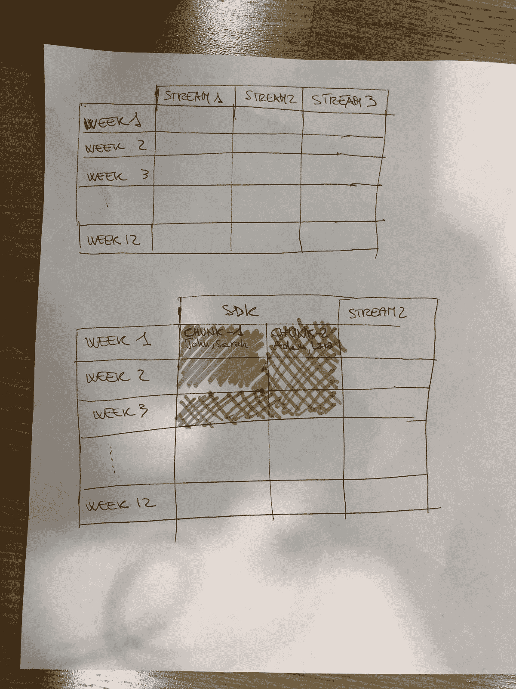
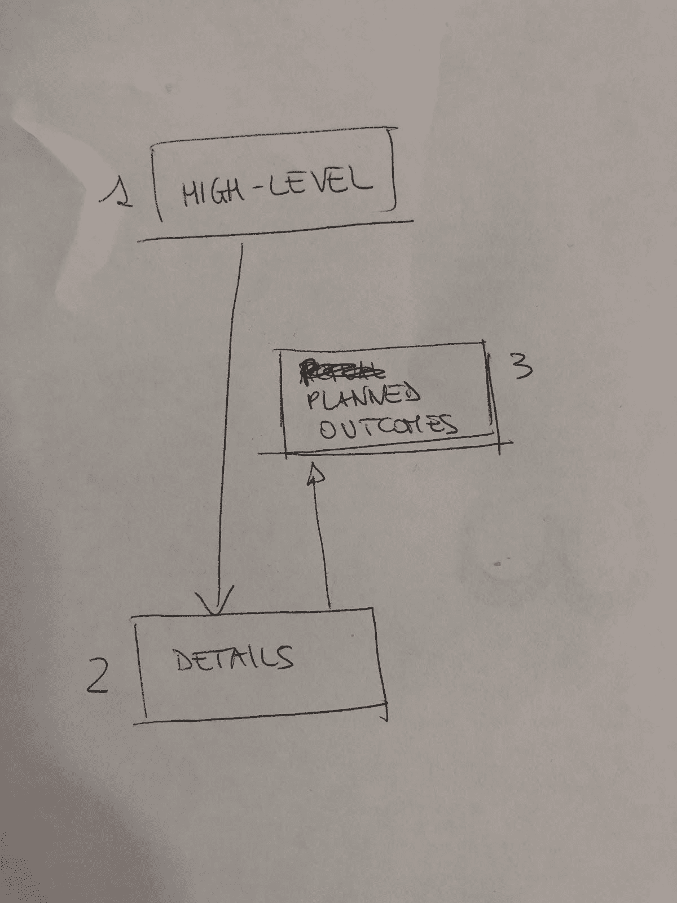

# 用 Tetromino 计划不可预知的事情:面对高度不确定性的创新方法

> 原文：<https://medium.com/hackernoon/plan-the-unplannable-with-tetromino-a-way-to-deliver-innovation-in-the-face-of-high-uncertainty-b68618f280f3>

实现创新是每个科技公司的首要任务。但他们往往不敢尽可能地大胆尝试，因为他们被永无止境的 R&D 风险所拖累，导致失败或缺乏切实的成果。但是创新就一定是不可规划和难以实现的吗？在 Hadean，我们迭代了一种方法，Tetromino planning，它展示了相反的情况:我们授权一个由六名非常有才华的工程师组成的团队，在不到一年的时间里，交付了一个突破性操作系统的第一个迭代，三个击败了现有库的分布式计算库的概念验证，以及一个处于原型阶段的游戏框架，该框架已经在市场上无可匹敌。从技术和商业角度来看，这都是在高度不确定的背景下实现的非凡创新，而且这一切都经过了深思熟虑的过程。

事实证明，敏捷和其他方法在支持需求和用户需求的不确定性方面非常出色。但是在实质性创新方面，敏捷显示出了它的局限性。我们的方法利用了团队的技术本能:通过非正统计划的练习，软件工程师被引导将他们的直觉转化为可以交付的有形成果，即使在“知识”最初非常少的环境中。俄罗斯方块计划也允许估计和创建一个实际的计划，看起来像一个俄罗斯方块(因此得名！)并不断更新，以整合进步过程中出现的新“知识”。

让我们看看这种交付创新的新方法是如何工作的。

# 河豚计划背后的原则

这种方法基于三个基本原则:最大化开发者的影响力，拥抱开发者的流动，从最后开始。

让我们从**最大化开发者的影响力**开始。作为第一近似值，众所周知的*项目约束*的经验模型告诉我们，给定一个项目的期望质量，有三个约束我们必须处理:资源、时间和范围；你只能“强加”三个中的两个，第三个就是结果。

考虑到这些限制，我们想让开发人员决定哪一个，以便他们能产生最大的影响？我们可以选择资源，在软件开发中，主要是指人。但这方面有很大的局限性，尤其是在初创公司:人才短缺，雇佣合适的人需要很长时间，而且通常董事会对预算有限制。还有，开发者要不要涉足这方面？听到这个我会很惊讶的！

第二个选项，时间，是开发人员通常以评估的形式影响的一个方面。给定需要实现的某些功能，实现需要多长时间？这通常是开发人员有机会影响评估的地方。就是这样。当然，规划扑克和类似的技术已经被证明是有效的，但是，尤其是当涉及到实质性的创新时，这是最有影响力的方面吗？我相信不是。我相信在决定工作范围方面有实质性的发言权是开发人员最有影响力的地方。稍后我们将展示我们是如何做到这一点的。

第二个方面是拥抱**开发者的自然流程**。如果你试图与软件工程师讨论一个高层次的创新目标，比如交付一个全新 SDK 的 alpha 版本，你可能很难进行有效的对话。未知数太多，摆在桌面上的选择太多，试图将高水平的目标分解成较小的结果似乎极其复杂。但是如果你问一个更直接的问题，比如“不做什么是愚蠢的？”或者“你肯定需要实现什么？”—突然，你得到了大量准确的答案。因此，我们决定采用拥抱自然开发人员流程的计划练习:细节第一，而不是与双方都感到沮丧的高层讨论斗争。稍后我们会看到这在实践中是如何转化的。

我们认为重要的最后一个因素是确保我们已经很好地定义了**期望的结果**，并且在最开始就做了**。这种运作方式受到了亚马逊广泛使用的“[从客户](https://www.quora.com/What-is-Amazons-approach-to-product-development-and-product-management)逆向工作”方法的启发:他们的产品经理从撰写新闻稿宣布成品开始。新闻稿面向最终客户，包含有关客户问题的信息、当前解决方案的失败原因以及新产品为何能解决此问题。我们发现，让我们的软件工程师为他们自己的工作写一份新闻稿的想法非常有力量，因为这可以让我们对我们试图解决的实际问题有一个清晰的认识。但这也会激发关于我们的解决方案看起来如何的讨论，因为在新闻稿中我们应该介绍我们的解决方案。这也是从客户的角度看到和强调我们所提供的价值的机会。**

逆向工作、不要太担心细节第一的方法和授权团队影响范围的结合是我们成功的关键。让我们看看这些在实践中是如何翻译的。

# 规划

有两个主要阶段:计划和实际工作(我们称之为“流”)。

规划阶段似乎不合时宜。我们不是已经远离了敏捷，远离了整个计划吗？创建路线图并花时间讨论未来可以做什么，然后在两周内意识到许多事情已经改变，这难道不是一种浪费吗？也许吧。但是我们发现计划的*练习*才是价值所在，不一定要坚持。我们将计划作为一个有效的*工具*，它允许我们从高层次的目标到我们非常有信心能够实现的一系列具体的可交付成果。事实上，我们已经持续交付了整整一年。

规划阶段的输入是两个明确的元素:高级目标和时间表。一个高层次的目标可能是“发布 SDK 的 alpha 版本”或“创建一个用于大数据集实时分析的库的概念证明”。它们听起来可能含糊不清，事实上也确实如此——是故意的。即使它们非常模糊，每个人都很清楚——尤其是公司的非技术部门。还记得我们上面说的工程师的影响吗？事实上，结果并没有被精确地指定，这为这种影响留下了空间。当你不得不处理来自不确定性的挫折时，记住这一点！

第二个方面，时间盒，也很关键。它可以是外部截止日期强加的(比如你正在参加的会议)，也可以是自我强加的，比如每季度的 okr。我们发现一整季度是最适合我们的时间盒。

一旦定义了高级目标，规划就发展为一系列四个独立的步骤:

*   结果定义
*   构思和大概估计
*   《俄罗斯方块》策划
*   利益相关者回放

# 结果定义

在过程开始时详细定义结果实际上是加入 Hadean 的新工程师发现更具挑战性和潜在的挫败感，特别是因为这很耗时(并且主要发生在会议中——哎哟)。但是这个重要阶段的目的是以精益的方式将范围内的浪费最小化。将结果定义作为一个小组练习，我们让每个人都有发言权，并围绕我们如何解释目标来调整团队。

我们从高层次目标开始，每个人都有机会提出“它的实际含义”。该小组在产品人员的指导下，汇聚到符合高层目标的成果的共享定义。对于产品人员来说，调整结果定义是非常重要的，因为这是业务视角更加深入的地方。考虑我们之前做的例子，“发布 SDK 的 alpha 版本”，它将阐明 alpha 版本的预期“安装”体验。还有丰富的调试体验和交付机制。诸如此类。

你不应该在这个阶段限制太多，我们正处于这个过程的分歧阶段。这一步的目的是**阐明**旅程的终点可能是什么样子，而不是决定(还)哪个方面将会或不会被实现。在这个阶段，结果不应该包含实现的细节。这就是下一步的目的。

# 构思和大概估计

构思阶段是指邀请每个人提出建议，哪些事情需要**实施**，以实现上一步定义的结果。功能/要做的工作应该用简单的要点来表达，足以进行讨论，但不要太详细，以至于不能代表可以实施的规范。人们可以在他们自己的时间里异步地做出贡献，你应该邀请他们“疯狂”，在这个意义上，在这个阶段不应该施加限制，欢迎考虑每一个想法。这是我们的工程师最喜欢的一步，也表达了我们拥抱他们自然流动的意图:细节第一！

在可以实现的事情列表完成后，我们要求工程师对一个人实现这些事情所需的时间做一个大概的估计。我们决定将选项限制为 4 个:半天、一天、两天、一周。如果某件事需要一周以上的时间，应该进一步细分。请记住，这种估计并不是我们要求他们承诺的事情，而是一种大致估计相关工作的方法。

在这一阶段结束时，你会更清楚地知道我们有哪些选择来实现你的目标。你现在可以开始决定什么是值得关注的。

# 《俄罗斯方块》策划

此时，你会有一个杂乱无章的“洗衣”清单，上面列有你*可以*做的事情，以及每件事情可能需要多长时间的想法。这是流程的聚合阶段，目的是决定哪些事情应该实现，哪些事情不应该实现，找出关键的依赖关系，并将事情分组到连贯的工作块中。

为了指导我们决定哪些事情应该执行，我们使用了一种用于优先级排序的技术，即[莫斯科方法](https://en.wikipedia.org/wiki/MoSCoW_method)。这是一种非常简单但有效的方法，将需求分成四类:必须拥有、应该拥有、可能拥有和不会拥有(这次)。找出依赖关系可以用你更熟悉的任何机制来完成，只是注意不要以复杂的甘特图结束——它对你所需要的东西来说太详细了。最后，在连贯的工作块中进行分组，是简单地利用我们大脑的能力将事情分组在一起完成的——非常复杂，不是吗？

现在有趣的部分，玩俄罗斯方块和创建实际的计划！

你的配料是:

*   一组可变长度的工作块(取决于实际范围)
*   可以为他们工作的人
*   一张按周排列的桌子，你可以在上面摆放你的俄罗斯骨牌(即一件由一个或多个人完成的作品)

你的游戏包括找到合适的人/工作/时间的组合——你将致力于实现你的目标。

通过试错法，您将迭代如下内容:

现在最后一点是定义每个工作块的结果。怎么会？逆向工程来自构思阶段的事物的详细列表。基本上，你在这里要做的是问这样一个问题:“我们从实施我们所说的事情中得到的实际结果是什么？”。从高级结果开始，然后直接跳到细节，然后回到中级结果，这似乎是一个荒谬的过程。我们将在后面看到这个中级结果如何在实际工作阶段发挥作用，但是我们已经可以观察到，由于流程的设计方式，这个计划有一些有趣的特性:

*   它是高层次目标在实践中的转化；
*   它捕捉到了你短期内要交付的东西的整体视图，而不仅仅是通常分配给个人的两周的任务；
*   它是最小的，从某种意义上说，它只包含成功所必需的最重要的东西；
*   它包含了你整个团队的所有智慧、资历和知识；
*   你很有信心它能被送到。

从技术和商业的角度来看，这些特性是实质性创新的区分因素，我们已经证明，尽管存在极端的不确定性，但它们始终支持我们取得令人难以置信的进展。最终，如果你想达到的目标至少在纸上是可行的，那么在现实中就更有可能实现！

# 利益相关者回放

一旦我们就 tetromino 计划达成一致，就该向利益相关者播放我们的结果了。应该与所有其他部门进行讨论，以便他们可以看到可能会发生什么。他们也可以输入你可能已经忘记的重要事情或者完全偏离轨道的事情。意识到某些事情与预期相差甚远可能会令人失望，但你应该感到非常高兴，因为它们在很早的时候就被发现了，你有足够的时间来调整(而且几乎什么都没有实施！).

现在应该更清楚了，tetromino 计划如何让你从一个高层次的目标走向一系列你非常有信心可以实现的结果(事实上你会实现)。在开始描述实际工作是如何完成的之前，需要强调的是，我们在这里描述的整个计划过程应该在不超过几天的时间内完成。我们通常将它分散在三天中，每个计划阶段有 90 分钟的会议，外加几个小时的异步工作。这也应该让我们放心，我们正在做的不是像瀑布中那样繁重的前期详细规划，而是轻量级的小组练习。

现在让我们看看实际工作是如何进行的。

# 实际工作，也称为“流”

当一个“tetromino”开始工作时，也就是说，当一个“大块工作”进入交付时，你有一个团队拥有一个结果，并有一个专用的时间盒来实现它。

这个团队的任务是向结果设定的方向交付代表**最有影响力的进展。**

这可能是我们的方法与更严格的“完成的定义”的区别。有了“完成”的定义，你的目标是围绕用户故事(或类似的)和“质量符合产品和组织的目的”来调整你的团队。完成的定义意味着你接受失败和延迟，将它们视为你必须满足特定用户需求的代价。

我们认为我们的结果更像是一个**【成功的定义】**。它必须使我们的开发人员能够将他们的工作视为实现成功的机会，而不是简单地遵守一些规范。这意味着我们**不会规定如何获得成功**。我们希望利用这样一个事实，即我们的开发人员**是专家**，我们信任他们。领导层有责任尽可能清楚地说明成功是什么。这是开发者找到最聪明的方法来实现它的机会。

但是在日常实践中，我们的开发过程是什么样的呢？实际上，它看起来和看板没什么不同。它甚至可能更轻。这是可能的，因为开发人员可以自由决定什么是实现结果的最佳方式——只要他们对此负责。

我们有一个非常轻量级的方法，在开始时对结果进行细化，每天站立，每周演示。

# 结果细化

在写一行代码之前，我们会开一个简短的会议，做一些简单的事情。首先，我们重申商定的结果，这很重要，刷新我们的记忆。其次，我们改进结果本身，增加细节，澄清可能仍然不清楚的方面。第三，我们为要做的工作起草任务。终于可以开始编码了！

# 每日站立

我们有通常的每日站立，有轻微的变化。我们要求每个人不要告诉我们他们前一天做了什么活动，而是要明确他们在取得的**进展。“昨天我参加了很多会议”是一种不太交流的说法。就表现力而言，在描述软件开发时，它堪比“昨天我在键盘上敲了一整天”。令人感兴趣的是在那次会议上决定或同意了什么。如果你很难以这种方式参与单口相声，一种方法是回答这个问题“你今天知道什么是你昨天不知道的？”。这应该更容易让已经取得的进展显现出来。**

# 每周演示

周一上午，我们将召开一个长达一小时的全体会议，要求每个人快速演示上周取得的进展。它可以是展示他们实现的功能的视频，或者现场部署，或者任何可以让你展示你工作的**效果**的东西，而不是讨论你所做的活动。这在原则上类似于我们如何运行每日站立，并且它一直证明是开发团队保持同步并为所取得的进展感到自豪的一个很好的机会。有些星期没什么可展示的。在这种情况下，我们仍然要求向我们介绍正在创建或修改的代码，借此机会解释某些决定。但这不应该是默认的，它应该是一个备份，以防没有其他东西可以显示。

如您所见，这并没有什么特别之处，但这是可能的，因为我们投入了极大的关注和努力，以确保每个人都非常清楚我们作为一家公司在努力做什么。因为我们让我们的工程师对成功负责，然后我们信任他们！

# 重新规划

在这一点上，你可能会有这样的错觉，一旦你在开始的时候就计划好了，并且开始了开发，那么这个计划在整个交付期间都不会改变。与计划相关的通常含义是你实际去做。

如前所述，我们认为计划是帮助我们的工具，而不是我们承诺要实现的东西。所以我们经常重新计划，如果有必要，我们重新计划一切。

重新规划可能因多种原因而触发:

*   新的“知识”出现了。这是最常见的情况，而且非常欢迎！这就是清晰性被带到桌面上的地方。
*   新的“未知”出现了。由于原型或测试，当我们真正意识到我们知道的比我们期望的少时，就会发生这种情况。
*   未能实现目标。这也是可能发生的，众所周知，当你在评估上变得很好时，你总会有出错的时候！这绝对没问题。
*   目标的改变。市场可以变，公司的战术方向可以变，团队可以变。任何事情都可能改变。目标可能会相应地改变。

当这些事情中的一个或多个发生时，重新规划被触发。我们不一定要经历从无到有的全过程，也不一定要和所有人一起。这真的取决于计划工作中受影响的部分。重要的是与所有受你正在讨论的变化影响的人一起重新计划，并在完成后向每个人播放重新计划的结果。

不要试图最小化计划的变化，这不是练习的目的。你实际上是在试图最大限度地吸收新信息到你的计划中，如果这意味着你必须完全改变它，那绝对没问题。

我们记录计划是如何变化的，当这个时期结束时回头看是很有趣的。有趣的是，通常实际交付的计划看起来与开始时完全不同，但高层次的目标已经实现，这是交付创新的关键所在！

# 它是如何进化的

指导这种方法的迭代是令人着迷的，看到有才华的工程师做着出色的工作并在复杂的高科技问题上取得实质性进展是非常值得的。

我们知道，这种方法在多大程度上可以扩展以及在客户要求更加严格的世界中有多大程度的有效性方面存在局限性。我们的工程团队现在有 12 名开发人员，我们相信这是能够与这种方法充分合作的最大规模的团队。

我们还处于有利地位，在我们为自己设定的领域取得了重大进展，正因为如此，我们对我们的产品有着强烈的兴趣和吸引力。因此，我们现在对客户期望的细节有了更清晰的了解。由于我们近三年的漫长旅程，我们也对我们正在处理的所有技术领域有了更多的了解。

出于这些原因，我们将很快将我们的软件开发过程演变成更类似于[六周敏捷小组](https://hackernoon.com/a-way-to-be-agile-without-micromanagement-e12476e8e4f1)的东西，这被证明在我们作为一个公司进入的阶段以及我们提供的产品种类中是有效的。

但是，每当我们在一个有待探索基本创新的领域工作时，我们将继续使用 tetromino 计划。例如，我们肯定会继续以这种方式与负责我们操作系统某些领域的团队合作。

让我知道你对我们的方法有什么看法，并请分享你是如何处理自己计划中的不确定性的。

—

这篇文章最初发表在 [Hadean 博客](https://www.hadean.com/blog/plan-the-unplannable)