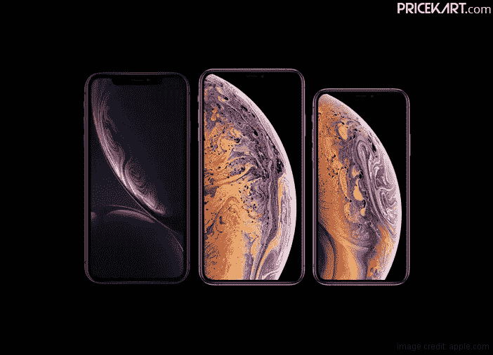
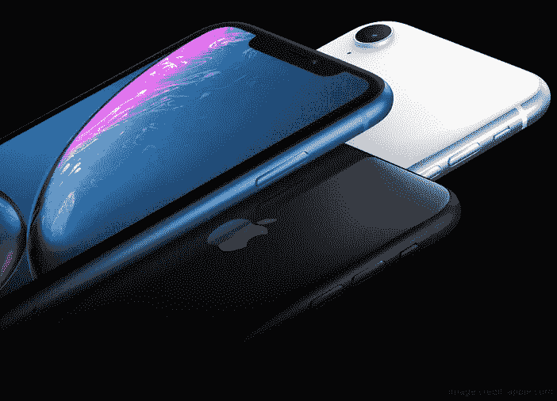
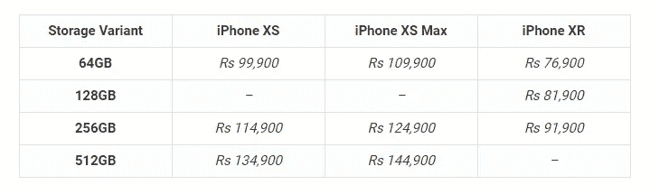
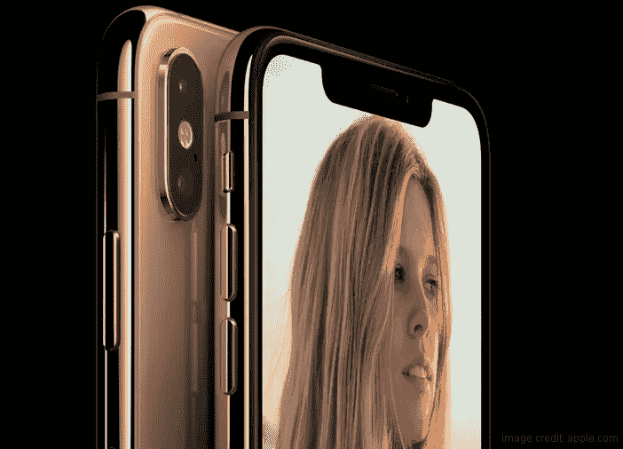
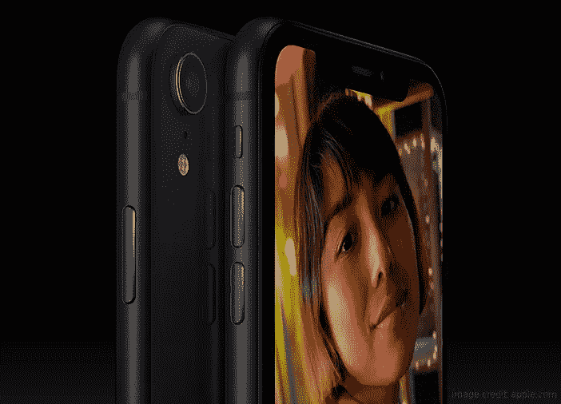
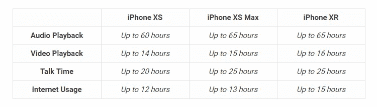

# 打算买新 iPhone？这就是为什么你应该更喜欢 iPhone XR 而不是 iPhone XS

> 原文：<https://medium.com/hackernoon/planning-to-buy-a-new-iphone-heres-why-you-should-prefer-iphone-xr-over-iphone-xs-c85b62e19d04>

如果你最近几天一直活跃在社交媒体或互联网上，那么你肯定已经看到了关于苹果宣布三款新 iPhones 的新闻。如果你是苹果的忠实用户，你一定已经在计划升级了。但是，现在有三种新的选择——苹果 iPhone XR、iPhone XS 和 iPhone XS Max，你应该选择哪一种呢？虽然苹果因设计高端昂贵的产品而闻名，但新款 iPhones 的价格似乎令人惊讶。

但是，如果说苹果推出了迄今为止最贵的 iPhone，那么它也推出了一款低价 iPhone 到 [**苹果移动价格表**](https://www.pricekart.com/mobile/apple-mobiles-price-list-in-india) 。iPhone XS 和 XS Max 已经开始接受预购，并将于 9 月 28 日开始销售。另一方面，iPhone XR 将在 10 月份的某个时候上市销售。所有这些都归结为一件事——你应该等待 iPhone XR 还是抓住 iPhone XS 或 iPhone XS Max？嗯，以下是我们认为苹果 iPhone XR 是更好选择的一些原因。

## 苹果 iPhone XR 不算太贵

如上所述，苹果推出了一款迄今为止最贵的 iPhone。同样，苹果今年也推出了一款低价 iPhone。以下是三款新 iPhone 的定价情况:

看上面的表格，很明显 [**iPhone XR**](https://www.pricekart.com/mobile/apple-iphone-xr) 相对来说更实惠。事实上，高端变型比基础变型的 [**iPhone XS**](https://www.pricekart.com/mobile/apple-iphone-xs) 或 [**iPhone XS Max**](https://www.pricekart.com/mobile/apple-iphone-xs-max) 花费更少。所以，如果你打算买一部新的 iPhone，但又想买一部更容易放在口袋里的手机，那么 iPhone XR 应该是你的选择。

## 屏幕空间

如果你没有看到所有三部 iPhones 并排放置，那么这可能会有点令人震惊。有趣的是，与 iPhone XS 相比，iPhone XR 的显示屏更大。顾名思义，iPhone XS Max 配备了一个巨大的 6.5 英寸有机发光二极管显示屏。然而，iPhone XS 只配备了 5.8 英寸的有机发光二极管显示屏。另一方面，iPhone XR 采用了 6.1 英寸的液晶显示屏。总而言之，iPhone XR 提供了一个更大的显示屏，而价格却低得多。

## A12 仿生处理器

今年所有的新 iPhones 都采用了最新的 A12 仿生处理器和 7 纳米芯片组。因此，当谈到性能时，苹果 iPhone XR 将能够提供与 iPhone XS 和 XS Max 一样多的性能。A12 仿生处理器采用 6 核 CPU 和 4 核 GPU 设计。此外，该芯片组将有助于更快地启动应用程序，改善弱光摄影，增强 AR 应用程序，并将具有机器学习功能。就性能而言，这三款新 iPhones 都不相上下。此外，除了强大的处理器，新款 iphone 还被添加到了 4G 手机价格表中。有了 4G VoLTE，三款 iPhones 都将提供快速无缝的互联网浏览。

## 可供选择的颜色

说到颜色变化，iPhone XS 和 XS Max 有黑色、金色和太空色。除了 iPhone 5C，苹果没有提供不同的颜色可供选择。然而，苹果为 iPhone XR 带来了新的颜色可供选择。iPhone XR 有六种颜色可供选择。选项包括黑色、白色、红色、蓝色、黄色和珊瑚色。如果你想给你的手机增加一点色彩或个性，iPhone XR 有很多选项可供选择。

## 更长的电池寿命

电池寿命是 iPhone 用户一直抱怨的一件事。通过 2018 年的 iPhones，苹果一直在努力克服这一缺点。当看的时候

*   iPhone XS 可以比 iPhone X 多坚持 30 分钟
*   iPhone XS Max 可以比 iPhone X 多坚持 90 分钟
*   最后，iPhone XR 可以比 iPhone 8 Plus 多坚持 90 分钟

下面是 2018 年 iPhones 电池规格的样子:

如果你正在寻找一部健康长寿的 iPhone，iPhone XR 拥有今年最好的电池规格。

**结论**

不言而喻，iPhone XR 是更经济的选择。然而，不要忽视 iPhone XS 或 XS 最大。即使是 iPhone XS 和 XS 马克斯都有一些功能，使他们成为理想的选择。iPhone XS 和 XS Max 都配备了双后置摄像头，IP68 防护等级和 512GB 存储版本，这使它们与 iPhone XR 相比有了一个前脚。总的来说，苹果 iPhone XR 与 iPhone XS 和 XS Max 具有相同的生态系统和功能，只是有一些变化。它的优势在于合理的价格区间和尺寸。