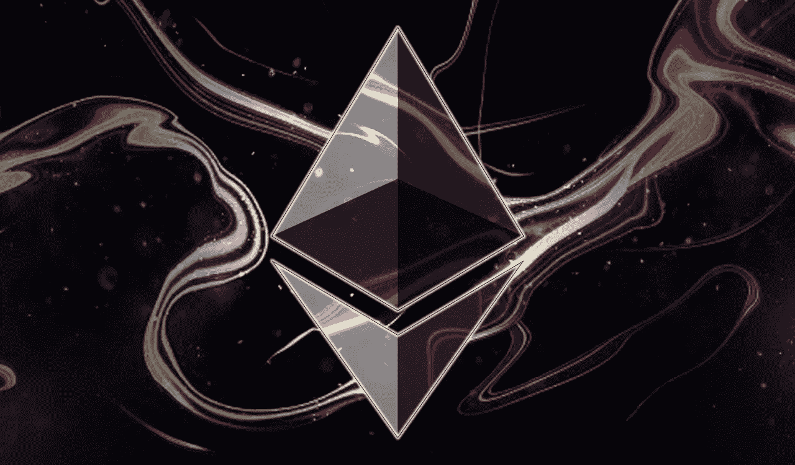

# 等离子体导论

> 原文：<https://medium.com/hackernoon/plasma-8bba7e1b1d0f>

## 以太坊第 2 层解决方案之一的高级概述

*本文是对不同的***的特性、协议和发展的一系列高级概述中的第一篇。在这些概述中，我将试图提供该主题的相对简单的概述，以及关于它们的内部工作和实际应用的一些细节。**

# *TL；速度三角形定位法(dead reckoning)*

**赶时间？没问题，这里概括一下:**

*以太坊等公共区块链需要能够扩展，以实现其被公认为传统系统的可行替代方案的雄心，这反过来将使它们获得广泛的采用和应用。*

*这些扩展解决方案可以“内置于”区块链本身(第 1 层解决方案)或“构建于其上”，以减轻基本链的压力(第 2 层解决方案)。这两个解决方案类别可能会相互补充。*

*Plasma 是以太坊的第 2 层解决方案，为构建安全、可伸缩和快速的“非链”分散应用程序提供了一个框架。等离子体有多种实现方式，包括:*

***最小可行等离子体(MVP)** —一个基于 UTXO 的链，拥有基本的安全原则，能够为以太坊提供更高的交易吞吐量。*

***更有活力的血浆(MoreVP)** —通过减少交易所需的操作数量来改善 MVP 的用户体验。*

***Plasma Snapp** —旨在降低 Plasma 复杂性的概念验证，为更复杂的协议铺平道路，而不仅仅是令牌传输。*

***血浆现金** —利用不可替代代币作为固定数量可替代代币代表的一种实施方式。例如，如果我将 5 ETH 存入血浆现金链，我会收到一个价值 5 ETH 的单个令牌，不能合并或分割。实际应用包括基于收藏品的游戏和供应链管理和物流。*

***Plasma Debit** —一种与 Plasma Cash 非常相似的实现方式，但允许部分付款。最实际的应用是任何规模的支付，尤其是小额支付。*

*等离子桥——很快将有一个概念验证，这将允许两个不同的第 1 层区块链通过共享的等离子链相互作用，实现原子交换。例如，等离子体链可以充当以太坊和以太坊经典区块链之间的连接。*

*等离子体并不是以太坊唯一提出的第 2 层解决方案，可以合理地预期它将与其他第 2 层解决方案共存，并作为第 1 层解决方案的补充。*

*阅读全文。*

# ***区块链可扩展性简介***

*虽然人们开始意识到区块链技术的巨大潜力和许多应用，但在实现这些雄心壮志之前，公共区块链的道路上还有许多障碍。最突出的问题是区块链的可扩展性。*

*可扩展性被定义为[系统、网络或流程处理不断增长的工作量的能力，或其被扩大以适应这种增长的潜力](https://dl.acm.org/citation.cfm?doid=350391.350432)。尽管可伸缩性在区块链环境中是一种挑战，但讨论主要围绕网络的事务吞吐量。这一点从最近对以太坊的关注中显而易见，这些关注集中在网络拥塞期间的速度上——主要是由最初的硬币发行和围绕不可替代代币的[游戏](https://www.cryptokitties.co/)等事件引起的。*

## **第 1 层解决方案**

*扩展这些平台的方法之一是通过修改其基本协议，或“第 1 层”。由于它们的直接性质，这些变化通常通过一个[硬分支](https://en.wikipedia.org/wiki/Fork_(blockchain)#Hard_fork)来实现。*

*以太坊第 1 层解决方案的一个例子是[“分片”](https://github.com/ethereum/wiki/wiki/Sharding-FAQs)，它解决了网络瓶颈的“单行道”问题。目前，*每个*节点必须依次处理*每个*事务，将网络的事务吞吐量限制到每个节点可以处理的最大值。通过将链分成段或“碎片”,这一限制被解除，因为每个节点可以并行处理不同的事务。*

*分片的研发工作正由 Prysmatic Labs 和整个社区全力进行，但是升级版还没有发布。*

> *从技术上讲，每个碎片都是自己独立的区块链，每个碎片通过信标链共享相同的共识机制，并且每个碎片都能够与其他碎片通信。*
> 
> *此外，一旦分片上线，分片计划在现有的 [EVM](http://ethdocs.org/en/latest/contracts-and-transactions/developer-tools.html#the-evm) 上使用 [eWASM](https://github.com/ewasm/design) ，这本身将通过更快的智能合同处理速度来提高交易吞吐量。这套指令集还有一个额外的好处，那就是让智能合约更加标准化和安全。*

## **第二层解决方案**

*由于协议的完整性和安全性对协议的成功至关重要，因此对区块链基础层的更改非常难以执行。由于这种敏感性，第 2 层解决方案也正在开发中，它将补充第 1 层方法，提供可扩展的高效区块链。*

*第 2 层解决方案不是对基础协议的更改，而是在基础协议之上构建的结构，以允许操作在“链外”进行，同时仍然保留主链提供的好处，即安全性和终结性。第 2 层解决方案的一个明显的好处是，它们的实现不一定需要硬分叉，但是它们的范围远远大于集成问题；与第 1 层解决方案一起，它们可以显著提高“基础”区块链的实际应用和可用性。*

*自从第二层解决方案的最初概念[国家通道](https://www.jeffcoleman.ca/state-channels/)以来，已经有了广泛的研究——包括[雷电](https://raiden.network/)、 [TrueBit](https://truebit.io/) 和比特币的[闪电网络](https://lightning.network/)——但也许以太坊正在开发的最有前景的第二层解决方案是“等离子体”。*

> *请注意，不同的解决方案没有理由不能共存；例如，信道[可能](https://www.reddit.com/r/ethereum/comments/7jzx51/scaling_ethereum_hundreds_to_thousands_of/drb930m/?context=1&st=jnlz04b9&sh=e1e154a5)由于它们的互补属性而在将来建立在等离子体实现上。然而，我相信等离子将会成为最广泛使用的第二层解决方案。*

# ***什么是血浆？***

*[Plasma](https://plasma.io/plasma.pdf) 是一个框架，用于构建安全、可扩展和快速的分散式应用程序(“dApps”)。*

*等离子体允许 dApps 通过创建“子”区块链来实现这一目标，这些子通过智能合同连接到“母”区块链。然后，dApp 可以完全在各自的子链上执行，大大降低了父链的压力，使 dApp 更加高效和经济。*

*这些子链完全是区块链，有它们自己的共识机制——可能是权威的[证明](https://en.wikipedia.org/wiki/Proof-of-authority)(“PoA”)或利益的[证明](https://en.wikipedia.org/wiki/Proof-of-stake)(“PoS”)——但是，像孩子一样，它们并不完全独立于父母。子链依赖于父链的安全性，因此必须定期向连接它们的智能契约提交承诺。这些承诺是来自子链的最新更新的细节，并且由于它们通过母链(即整个以太坊网络)广播，所以它们是至关重要的。*

*为了确保所有这些链外更改是最终的和有约束力的，它们需要服从一个密码原语——一个“[承诺方案](https://en.wikipedia.org/wiki/Commitment_scheme)”。然而，由于它们的规模，将应用程序整体提交给母链会使血浆的使用过时。出于这个原因，与其他区块链应用程序一样，使用了“ [Merkle 树](https://en.wikipedia.org/wiki/Merkle_tree)”，从而允许使用“Merkle 证明”。*

*简而言之，Merkle proof 允许对少量数据(如哈希)进行认证，这种认证可以扩展到对更大的数据库进行认证。[比特币](https://hackernoon.com/tagged/bitcoin)对每个区块的交易存储应用了 Merkle 证明，方便了 Satoshi 的“[简化支付验证](https://en.bitcoinwiki.org/wiki/Simplified_Payment_Verification)”概念。在 Plasma 中，承诺是每个块的 Merkle 树的“根”,因此允许将 Merkle 证明用于框架的定义安全特性之一——用户“退出”子链的能力。*

*退出子链意味着用户将他们的资金撤回到母链，并且通过应用 Merkle 证明，可以向智能合约证明他们有资金可以撤回。Plasma 安全性的一个关键部分是用户有权随时撤回到母链。*

> *请注意，使用“父”链是为了简化/可视化。正确的术语是“根”链，因为一个子链可以无限地拥有自己的子链(从技术上讲，使这些子链成为“父链”，而不是“根链”)。每个子链都将是根链的主题，而不是层次结构中位于它们之上的子链。*

# *血浆安全吗？*

*第 2 层解决方案依靠基础层来提供安全性，但是它们也需要适当的机制来保护自己链上的操作。*

*简而言之，Plasma 具有许多理论上的安全元素，其核心围绕着用户能够在任何时候退出子链，即，将他们的资金撤回到主以太坊链。这意味着，即使这个子链是完全集中的——并且该中心方决定采取恶意行动——用户的资金也不会有永久损失的风险。*

*这种安全性来自于用户能够依赖主链作为事实的来源，也来自于任何用户可以挑战从子链中的任何撤销。当用户想要退出子链时，他们需要在主链上提交一个“退出”交易——一个“退出债券”——并且，在一些实现中，他们还需要包括一个 Merkle 证明来证明他们对资金的所有权。*

*从儿童链中撤出不是即时的。相反，他们有一个挑战期——一个“退出挑战游戏”——任何用户都可以向主链提交“欺诈证明”。欺诈证明包含来自前一个块的数据，该数据证明退出是无效的，因为用户试图提取的资金已经被该用户在不同的块中“花费”了。那些成功证明交易是欺诈性的人被称为“赏金猎人”，因为他们不仅阻止了退出的发生，而且还获得了坏人退出债券的价值。*

*正如你可能想象的那样，链外安全是一个非常复杂的问题，有许多理论上的问题和 T2 问题。[一个在 MVP 中似乎显而易见的](https://ethresear.ch/t/does-a-production-level-plasma-spec-exist/3577/16)(*以下*)是挑战的责任和赏金猎人的范围。例如，如果我将 1000 英镑存入子链—给我 1000[UTXO](https://bitcoin.org/en/glossary/unspent-transaction-output)的起点—并将十万(100，000)笔 1p 的交易发送到我 T10 控制下的其他地址，那么唯一关心这些交易的欺诈性退出的各方—即，如果我试图欺诈性退出那些“花掉的”UTXO—将是我自己(坏人)以及间接的赏金猎人。*

*这些欺诈性退出可能发生在链上的任何一点，并且由于交易的数量，整个链的副本对于普通的 PC 来说可能太大而无法处理，这严重限制了可以挑战我的退出的赏金猎人的池。*

*从数据存储的角度来看，答案可能在于 MVP 中的[安全检查点](https://ethresear.ch/t/plasma-xt-plasma-cash-with-much-less-per-user-data-checking/1926)机制，支持广泛参与所有挑战，因为周期(即数据)将被限制在合理的数量内。接下来的问题是如何激励用户去观察其他人的交易。*

*由于安全性的重要性，关于如何在保持最高级别的分散化的同时管理保护，存在很多争论。*

> *关于 Plasma 安全性的细节和问题将在以后的文章中详细探讨。*
> 
> *请注意，这个理论问题不一定适用于等离子现金，因为实现需要历史所有权证明和令牌唯一性机制。*
> 
> *围绕这个问题还有更多问题，本文不会讨论，但作为一个例子:如果用户必须为每个出口建立一个保证金，那么所有出口都可能被质疑——但是这些保证金的价值是什么呢？它们是一个固定的值，还是动态的，与被转移的金额成比例？这些债券的价值对于确保良好的用户体验和激励赏金猎人之间的平衡至关重要。*

# ***等离子体的实现***

*作为一个框架，等离子体几乎有无限的应用——其中大部分仍处于研究阶段。下面是一些最新提出的等离子体实现的简要概述，将在以后的文章中对其进行更详细的技术探讨。*

## ***最小存活血浆(MVP)***

*顾名思义， [Plasma MVP](https://ethresear.ch/t/minimal-viable-plasma/426) 是一个基于 UTXO 的链，它拥有基本的安全原则并支持高交易吞吐量，但依赖于用户能够自愿地与链交互、验证和退出链。在这些早期阶段，用户还必须对运营商有一定程度的信任，因为 MVP 使用 PoA 机制。*

## ***更有活力的血浆(MoreVP)***

*[更有活力的血浆](https://ethresear.ch/t/more-viable-plasma/2160)通过改善用户体验建立在 MVP 的基础上。要在 MVP 中传输 UTXOs，用户需要将它们发送到另一个用户的地址，等待块中的交易被确认，然后*发送确认签名。这种“双重签名”系统不仅对用户来说很麻烦，还会减少其他交易可用的块空间。由于对退出优先级的调整，MoreVP 实质上消除了对这些确认签名的需要。**

*[MoreVP 规范](https://github.com/omisego/elixir-omg/blob/develop/docs/morevp.md)目前正在由 [OmiseGo](https://omisego.network/) 的团队进行扩展。*

## ****血浆 Snapp****

*目前处于概念验证阶段， [Plasma Snapp](https://ethresear.ch/t/plasma-snapp-fully-verified-plasma-chain/3391) 旨在通过使用“[零知识简洁的非交互式知识论证](https://z.cash/technology/zksnarks)”(“ZK-SNARKS”)来有效地消除等离子集成的大部分复杂性，消除确认签名甚至退出挑战游戏的需要。*

*Vitalik 最近还详细阐述了 zk-SNARKS 在扩展中的使用，提供了一个不要求交易方总是“在线”的提议。这在解决当前等离子体实施中存在的数据可用性问题方面取得了进展，这些问题是由他们关于最终共识的[活性](/@jonchoi/ethereum-casper-101-7a851a4f1eb0)假设引起的。*

> *更简单地说，[工作证明](https://en.wikipedia.org/wiki/Proof-of-work_system)(‘PoW’)本质上可以保证活性，而像 PoA 这样的其他共识机制由于‘监控’的要求而不能保证活性。*

## ***血浆现金***

*[Plasma Cash](https://ethresear.ch/t/plasma-cash-plasma-with-much-less-per-user-data-checking/1298) 是一种利用不可替代代币来表示固定数量的可替代代币的实现方式。例如，如果我在血浆现金链的合同中存入 25 ETH，我将在链上收到一个价值 25 ETH 的代币。Plasma Cash 上的每个代币在创建时都有一个唯一的 ID，不能与其他代币分开或合并。*

*血浆现金块也不同于那些在 MVP 中看到的。等离子现金块为链上存在的每个代币保存一个“槽”，这意味着用户不仅可以看到每个块中已发送的内容，还可以看到未发送的内容。这允许形成[稀疏 Merkle 树](/@kelvinfichter/whats-a-sparse-merkle-tree-acda70aeb837)，它可以作为一个事务*不是某个特定块的*的一部分的证明。*

*因为每个块中的槽对于每个令牌是唯一的，所以不能将其他令牌放入该槽中。这意味着用户只需要跟踪他们自己的令牌，因为没有其他令牌可以进入他们的插槽。这减少了需要传输到客户端的数据量，因为客户端只需要下载他们所知道的数据，即他们的令牌历史证明。*

*等离子现金的一个问题是它的灵活性——链上的代币必须总是有固定的面额，防止代币碎片的转移。*

## ***血浆借记***

*[血浆借方](https://ethresear.ch/t/plasma-debit-arbitrary-denomination-payments-in-plasma-cash/2198)和血浆现金很像。一个关键的区别是，它允许进行部分支付，从而允许任意命名的支付，因此，小额支付。*

*Plasma Debit 就像一个[闪电枢纽](https://lightning.network/lightning-network-paper.pdf)，每个代币代表一个双向支付通道(相对于存款本身)。与[闪电网络](https://en.wikipedia.org/wiki/Lightning_Network)不同，通道的状态定期向主链公证，这意味着这些代币可以从一个所有者转移到另一个所有者(就像等离子现金代币一样)。由于这些代币是支付渠道，这意味着新的一方可以加入等离子体借记支付网络，而不必自己执行链上交易。*

*血浆借记最适合支付，因为所有的交易将是快速和廉价的。正在研究[等离子借记实现](https://github.com/loomnetwork/plasma-cash/tree/plasma-debit)(和他们的[等离子现金工作](/loom-network/plasma-cash-initial-release-plasma-backed-nfts-now-available-on-loom-network-sidechains-37976d0cfccd))的项目之一是[织机网络](https://loomx.io/)。*

## ****等离子桥****

*一个理论上的项目应该很快会有一个概念证明，[等离子体桥](https://ethresear.ch/t/plasma-bridge-connecting-two-layer-1-chains-with-a-plasma-chain/2890)将是一种通过共享等离子体子链将两个第 1 层区块链连接在一起的方法。这将允许将不同的区块链资产转换为子链上的标准本地令牌，从而实现链之间的价值自由转移，即[原子互换](https://en.wikipedia.org/wiki/Atomic_swap)。*

****互通区块链****

*区块链的互操作性是该技术未来的另一个主要讨论点。许多人对他们选择的链非常忠诚，这可能不利于开发进度，因为支持者没有认识到他们自己的链的客观弱点或其他链的相对优势。*

*Polkadot 正致力于解决这个问题，许多基于等离子体的项目也是如此。后者的一个例子是 OmiseGo，他们正在建立一个 Plasma DEX 其中包括——最初将使用[清算所清算不能建立 Plasma 子链的资产](https://cdn.omise.co/omg/whitepaper.pdf),如比特币。*

*可伸缩性对于公共区块链的广泛采用至关重要，而 Plasma 框架是以太坊 2.0 的一个主要发展。*

# ***其他来源/延伸阅读***

*https://plasma.io/*

*【https://ethresear.ch/ *

*[https://www.learnplasma.org](https://www.learnplasma.org)*

**我将撰写一系列关于众多区块链和整个行业发展的文章，涵盖一系列主题，包括但不限于:分片和信标链、PoS 和 Casper/Tendermint、区块链和 Polkadot 的互操作性、oracles、不可替代的令牌、stablecoins、分散式交换和 Plasma 的众多实现和安全特性。**