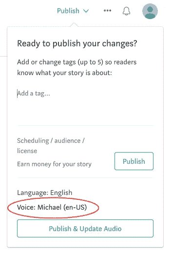
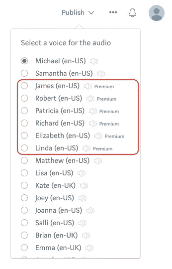
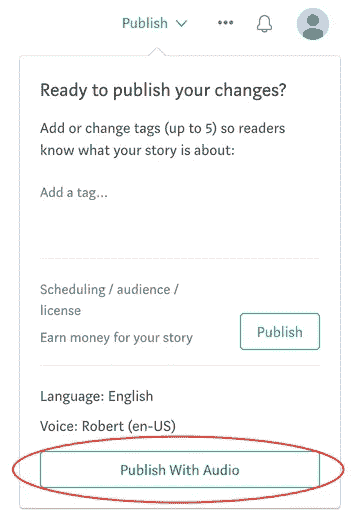
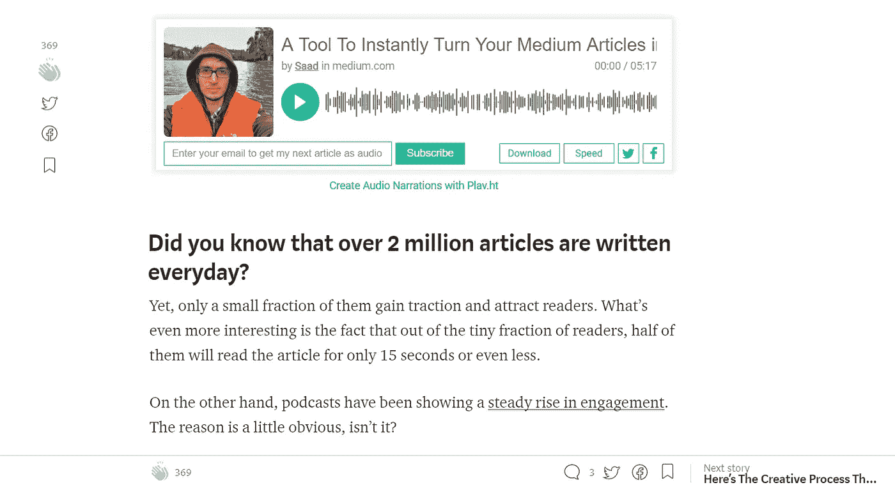

# Play.ht 与谷歌 WaveNet 的整合

> 原文：<https://medium.com/hackernoon/play-hts-integration-with-google-s-wavenet-f776080ac8d9>

## 让您的媒体故事由最好的文本到语音技术叙述

# Google WaveNet 是什么？

由[谷歌](https://hackernoon.com/tagged/google)提供的高级文本到语音[技术](https://hackernoon.com/tagged/technology)可以说是我们听过的最自然的计算机声音。

另一个最好的声音来自他们名为 [Tacotron](https://google.github.io/tacotron/) 的深度思维项目，它与人类语言难以区分，以至于谷歌质疑它是人类还是机器。

自从谷歌展示了他们的早期演示，我们一直在急切地等待谷歌 WaveNet 的发布。

> 今天，我们非常兴奋地宣布，我们已经将 Google WaveNet 的所有声音集成到 Play.ht 中，并让任何在介质上写作的人都可以使用它们！

这意味着，如果你在媒介上写作，你现在可以使用这种先进的技术来创建你的媒介故事的最自然的声音叙述，并使它们可供你的读者收听。

使用 Play.ht 的一键“发布音频”，您可以在几秒钟内创建音频旁白并嵌入到您的媒体故事中！

# 听起来像什么？

你可能已经看到我们的嵌入式播放器被许多作家在媒体上使用，这里有一些整合后的谷歌 WaveNet 的声音样本。

## 帕特丽夏

## 罗伯特

## 理查德

## 詹姆斯

## 伊丽莎白一世

## 琳达

# 免费开始

Play.ht 是一个必备的工具，可以将你的文章转换成音频叙述，从而为你的博客带来商机。此外，随着谷歌 WaveNet 的集成，音频叙述现在比以往任何时候都更自然。

在你的第一篇文章中添加音频旁白，你需要做的是

1.  **下载安装** [**免费播放 Chrome 扩展**](https://play.ht/extension/?utm_source=medium&utm_medium=steps&utm_campaign=get-your-stories-narrated-by-wavenet) **。**
2.  **报名**
3.  **注册后，您将被重定向至您的 Medium Stories 页面。只需选择要添加音频旁白的文章，然后单击“发布”即可看到下拉菜单。**
4.  默认的声音是迈克尔的。只需点击它，如下图所示，就可以看到所有可供选择的声音列表。

**5。选择任何谷歌 WaveNet 的声音。这些声音旁边都贴着高级标签。**

**6。单击“发布音频”按钮将为您的文章创建音频旁白。**

瞧啊。使用 play.ht 嵌入式播放器，您的文章现在嵌入了音频旁白。和下面截图里的一模一样。

Article with Audio Narration using Play.ht

你的读者现在可以听，分享，订阅和下载你的文章音频！

# 如果你在媒体上写作——[用 Play 给你的文章免费提供 Google WaveNet 的声音。](https://play.ht/extension/?utm_source=medium&utm_medium=play_intro&utm_campaign=get-your-stories-narrated-by-wavenet)

[***想要 Play.ht 为你的 WordPress 博客？在这里下载 Play WordPress 插件！***](https://play.ht/wordpress/?utm_source=article-play-integration-google-wavenet&utm_campaign=medium)

[*(很难理解如何入门？这里有一个更直截了当的‘how-to’教程)*](https://hackernoon.com/publish-your-medium-articles-with-audio-2d956671296c)