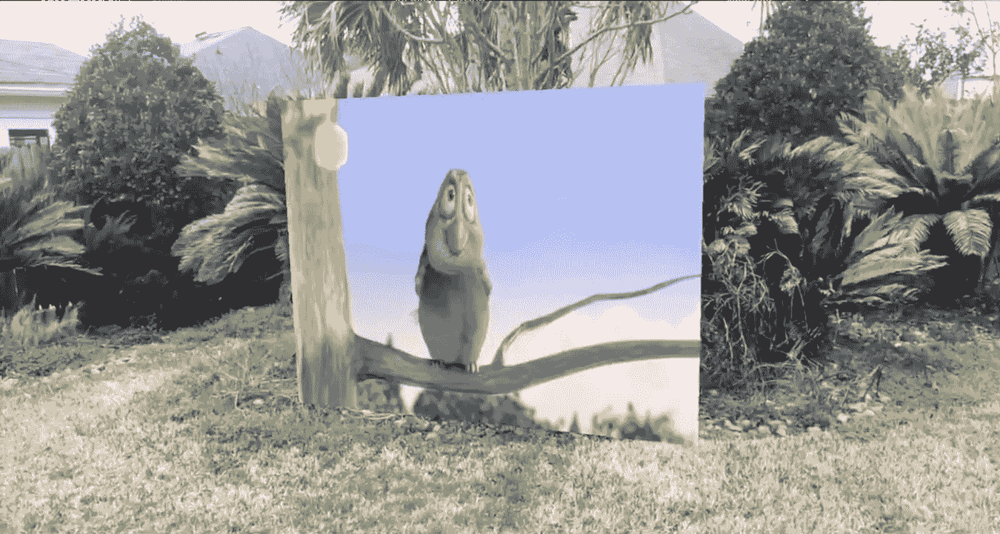

# 使用 ARKit 在增强现实中播放视频

> 原文：<https://medium.com/hackernoon/playing-videos-in-augmented-reality-using-arkit-7df3db3795b7>

Augmented Reality TV

我真正感到兴奋的事情之一是在 AR 平板电视上观看视频的想法。显然，要创建无缝体验，你需要戴上智能眼镜，但知道在 AR 世界中观看视频是可能的，这很好。

在 Xcode 中创建一个增强现实项目，并注册点击手势，如下所示:

注册轻击手势的意义在于，我们希望在用户触摸屏幕的位置添加一台平板 AR 电视。

点击功能的完整实现如下所示:

这里有很多代码，所以让我们一步一步来看。

首先，我们从场景视图会话实例中获取当前帧。当前帧保存了与我们从相机中体验到的捕获图像相关的信息。这也包括图像的方向、比例和位置。

接下来，我们创建能够显示视频的 SKVideoNode 实例。SKVideoNode 是 SpriteKit 框架的一部分，因此有 SK 前缀。文件名“ **big_buck_bunny.mp4** ”是项目的一部分。您也可以使用 URL 指向视频文件，而不是将其作为项目的一部分。视频节点上的播放功能将确保视频在屏幕上呈现时自动播放。

接下来，我们创建 SpriteKit 场景，因为 SKVideoNode 只能添加到 SpriteKit 场景中。我们将视频节点调整为与 SpriteKit 场景相同的大小。

之后，我们创建 SCNPlane 对象，它是场景中的一个 2D 平面。神奇的事情发生在我们指定场景的平面的*漫反射内容*属性的帮助下。这意味着包含视频节点的 SceneKit 场景成为平面材质的内容。

之后，我们只需调整，并确保我们的平面方向是正确的，就是这样！

现场演示如下所示:

## 使用 ARKit 显示 WebView

您还可以显示 WebView 而不是 SKScene，如下面的代码所示:

这是结果:

我希望你喜欢这篇文章。如果你想了解更多关于 ARKit 编程的知识，请查看我下面的 8 小时课程:

 [## 掌握 ARKit for iOS | Udemy

### 为 iOS 构建令人惊叹的增强现实应用

www.udemy.com](https://www.udemy.com/mastering-arkit-for-ios-using-swift/?couponCode=ARTVMEDIUM) 

编码快乐！