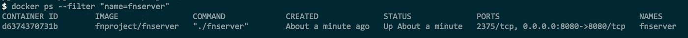
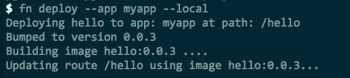
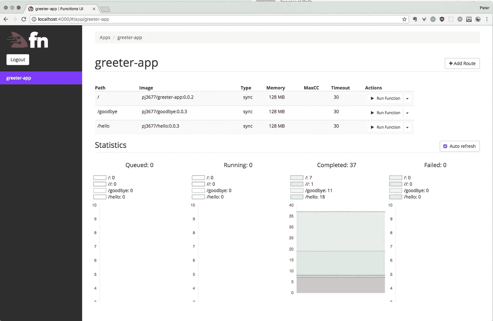
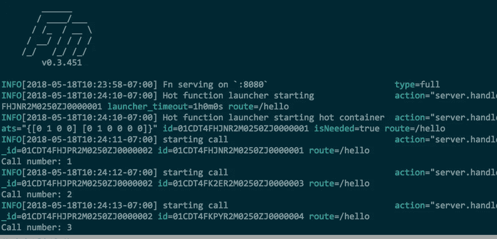
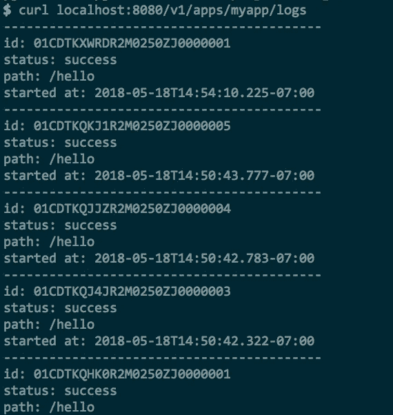

# 第一部分:Fn 入门

> 原文：<https://medium.com/hackernoon/playing-with-the-fn-project-8c6939cfe5cc>


“A massive white cloud over a snow-capped mountain ridge” by [Benjamin Child](https://unsplash.com/@bchild311?utm_source=medium&utm_medium=referral) on [Unsplash](https://unsplash.com?utm_source=medium&utm_medium=referral)

**目录**

*   **第一部分:Fn 项目入门(本帖)**
*   [第二部分:Fn 负载均衡器(本岗位)](/@pjausovec/part-ii-fn-load-balancer-585babd90456)

我不是那种可以简单地阅读白皮书/代码/文档，不需要在实践中尝试就能快速弄清楚事情是如何工作的幸运儿。我需要安装一些东西，运行一些东西，玩一些东西，来感受一下这些东西是如何工作的。如果我卡住了，那就是我要阅读文档和代码来看看我错过了什么的时候。

在这个版本中，我决定弄清楚 [Fn 项目](https://fnproject.io)是如何工作的，如何运行它，使用它，甚至扩展它。 [Fn 项目](http://fnproject.io)是容器原生的、云不可知的无服务器平台。

作为本文的一部分，我为 Fn 服务器创建了三个不同的示例扩展——你可以在 [GitHub](https://github.com/peterj/fn-extensions) 上获得它们。

# 基础知识—安装和运行

本节将介绍如何安装 Fn 服务器，启动它，然后创建一个简单的函数并调用它。

你需要在你的机器上安装 Docker 来运行 Fn，一旦你有了 Docker，你就可以用 [brew](https://brew.sh) 来安装 Fn:

```
brew install fn
```

> 显然，我以前安装过 Fn，而我机器上的 Docker 镜像是陈旧的，导致启动时 Fn 失败——运行`fn update server`将确保你的机器上有最新的 Fn 服务器镜像。

最后，安装 Fn 并更新映像后，您可以使用以下命令运行 Fn 服务器:

```
fn start
```

以上命令在单服务器模式下运行 Fn，并嵌入数据库和队列。在后台，`fn start`命令以特权模式运行一个名为`fnproject/fnserver`的 Docker 映像。它还将 Docker 套接字装入容器以及当前工作目录中的`/data`文件夹(这是存储数据库和队列信息的地方)。最后，它将端口`8080`暴露给主机，因此您可以在该端口上调用它。



fnserver image running locally

现在您已经运行了 Fn 服务器，您可以创建一个新的函数。

# 第一功能

Fn CLI 带有一个用于创建新功能的`init`命令。

> 在撰写本文时，这些是支持的函数运行时:dotnet、go、java8、java9、java、lambda-nodejs4.3、lambda-node-4、node、php、python、python3.6、ruby、rust、kotlin

开始之前，先简单解释一下 Fn 使用的不同概念:

**应用**
应用是一种将您的功能以相同的名称进行逻辑分组的方式(例如`greeter-app`

**触发器**
每个函数都有一个触发器，触发器有一个源(如`/greeter-app/hello`或`/greeter-app/goodbye`)和一个目标，目标是函数所在的端点(如`http://localhost:8080/greeter-app/hello`)

这是你正在编写并被执行的实际代码

**图片**
打包你的函数的 Docker 图片；所使用的图像取决于功能的语言(例如`fnproject/go`、`fnproject/ruby`、`fnproject/node`、…)，这里的目标是图像尽可能小，以便更有表现力

**Calls**
Call 保存关于对该函数的调用的信息。它包括有关应用程序的信息、通话的创建、开始和完成时间以及通话的状态。

至此，让我们通过提供运行时(例如 Go、Node 或其他支持的语言)和函数名来创建一个新函数:

```
fn init --runtime go --trigger http hello
```

上述命令在`hello`子文件夹中创建一个 Go 功能。函数结构如下所示:

```
hello
├── Gopkg.toml
├── func.go
├── func.yaml
└── test.json
```

您的函数的源代码位于`func.go`文件中，并且有一个函数处理程序以“Hello World”消息作为响应。`func.yaml`文件包含诸如版本运行时、名称和函数入口点的信息。

另一个有趣的文件是`test.json`——这个文件包含一组测试(输入值和预期输出值)，您可以通过运行`fn test`用它来测试您的函数。

要运行该功能，您可以使用`fn run`命令。在运行该命令之前，确保将`FN_REGISTRY`环境变量设置到 Docker 存储库中。

然后，当您运行该命令时，Fn 将使用该函数构建 Docker 映像，并像这样运行该函数:

```
$ fn run
Building image hello:0.0.1 ...........
{"message":"Hello World"}
```

这一切都很好，但我们有本地运行的 Fn 服务器，所以让我们将我们的功能部署到服务器上，而不只是运行它。

要部署该功能，您可以使用`fn deploy`命令，指定应用程序名称并添加`--local`，因为 Fn 服务器正在本地运行:

```
fn deploy --app myapp --local
```

命令将应用程序(名为`myapp`)部署到本地 Fn 服务器，并创建一个名为`/hello`(我们的函数名)的路径。



Deploying the app to local Fn server

这意味着在 Fn 服务器上，可以在`/myapp/hello`路径下访问该函数。应用程序名称用于对功能进行逻辑分组。要查看 Fn 服务器上定义的触发器的完整列表，请运行以下命令:

```
# List all triggers for 'myapp'
$ fn list triggers myapp
FUNCTION        NAME            TYPE    SOURCE          ENDPOINT
hello           hello-trigger   http    /hello-trigger  [http://localhost:8080/t/myapp/hello-trigger](http://localhost:8080/t/myapp/hello-trigger)
```

最后，如果您访问端点，您将得到如下“Hello World”消息:

```
$ curl [http://localhost:8080/t/myapp/hello-trigger](http://localhost:8080/t/myapp/hello-trigger)
{"message":"Hello World"}
```

## 分组功能

要将这些功能组合在一起，您可以使用应用程序名称结构——这允许您将不同的路由逻辑地组合在一起(例如，`greeter-app`可能有被称为`/hello`和`/goodbye`的路由)。

在这种情况下，`greeter-app`也可以是你的函数所在的文件夹名，子文件夹`/hello`和`/goodbye`将包含实际的函数。您还可以在应用程序根文件夹中定义`app.yaml`文件，以便能够用一个命令部署所有功能。

按照下面的步骤创建一个带有你好和再见功能的欢迎应用程序:

```
# Create the greeter-app folder
mkdir greeter-app && cd greeter-app# Create app.yaml that defines the app name
echo "name: greeter-app" > app.yaml# Create a hello function in /hello subfolder
fn init --runtime go --trigger http hello# Create a goodbye function in /goodbye subfolder
fn init --runtime go --trigger http goodbye
```

完成所有这些设置并将`app.yaml`放在根文件夹中后，您可以使用这个命令将所有功能部署到本地 Fn 服务器:

```
fn deploy --all --local
```

上述命令创建以下应用程序和端点:

```
$ fn list routes greeter-app
path     image         endpoint
/goodbye goodbye:0.0.2 localhost:8080/r/greeter-app/goodbye
/hello   hello:0.0.2   localhost:8080/r/greeter-app/hello
```

您还可以通过从应用程序的根文件夹运行`fn init`命令来创建一个位于应用程序根目录下的函数:

```
fn init --runtime node --trigger http
```

然后再次部署它:

```
fn deploy --all --local
```

现在我们在/greeter-app 逻辑组下有三个函数:

```
$ fn list routes greeter-app
path     image             endpoint
/        greeter-app:0.0.2 localhost:8080/r/greeter-app
/goodbye goodbye:0.0.3     localhost:8080/r/greeter-app/goodbye
/hello   hello:0.0.3       localhost:8080/r/greeter-app/hello
```

# 启用用户界面

如果你更喜欢 UI 与 Fn 交互——这里也有适合你的。假设您在本地运行 Fn 服务器，您可以像这样启动 UI:

```
docker run --rm -it --link fnserver:api -p 4000:4000 -e "FN_API_URL=[http://api:8080](http://api:8080)" fnproject/ui
```

当图像被下载并且容器执行时，您将能够在`[http://localhost:4000](http://localhost:4000)`上访问 UI。



Fn server UI

# 扩展 Fn

有几个不同的选项可供您扩展 Fn 服务器。所有选项都要求您重新构建 Fn 服务器，因为您必须导入您的扩展—您可以使用`build-server` CLI 命令和`ext.yaml`文件来构建带有您的扩展的 Fn 服务器的新映像，或者您可以派生&克隆 Fn repo 并在`cmd/fnserver/main.go`文件中引用您的扩展，然后重新构建代码并运行它。

对于开发，最快的方法是克隆 Fn repo 并在那里创建和注册您的扩展。如果您使用的是`build-server`命令，这可能需要更长的时间，因为该命令将在每次调用时重新构建 Fn 服务器映像。注意，在这两种情况下，每次都必须构建 Fn 服务器，但是直接构建要比重建 Docker 映像快得多。

Fn 服务器上有三个扩展点:监听器、中间件、自定义 API 端点。请继续阅读，以获得对每个扩展点的更详细的描述，并查看本文后面的一些示例。

## 听众

您可以监听各种 API 事件并对它们做出响应。目前有两种类型的监听器:应用程序和呼叫。我想路线听众应该很快也会来…

在应用程序监听器中，您可以响应以下事件:

*   BeforeAppCreate
*   AfterAppCreate
*   在 AppUpdate 之前
*   AfterAppUpdate
*   BeforeAppDelete
*   AfterAppDelete

这些事件在呼叫监听器中可用:

*   通话前
*   通话后

## 中间件

使用中间件，您可以为每个到达服务器的 API 请求添加所需的功能。在这个中间件中，您可以决定是取消请求还是调用链中的下一个中间件。中间件的一个简单例子是检查令牌头的认证中间件，或者为每个请求记录某些事情的中间件。

## 自定义 API 端点

自定义 API 端点允许您向 Fn 服务器添加新端点。例如，您可以添加一个自定义 API 端点来处理对自定义路由(如`/mycustomroute`)的请求，或者用路由`/v1/apps/:app_name/mycustomhandler`或`/v1/apps/:app_name/routes/:route_name/mycustomhandler`定义一个端点。

例如，可以在应用和路线上实现一个名为`stats` (so，`/v1/apps/:app_name/stats`和`/v1/app:app_name/routes/:route_name/stats`)的自定义端点，当调用这些端点时，可以返回应用或路线的一些基本统计数据。

# 示例:使用呼叫监听器的呼叫计数器扩展

我写了一个简单的扩展，计算一个应用程序被调用的次数，并把这个数字输出到 stdout。您可以在这里获得扩展[的源代码。](https://github.com/peterj/fn-extensions/tree/master/callcount)

扩展实现分为两个文件:`callcount.go`和`calllistener.go`。

在第一个文件(`callcount.go`)中，我注册了扩展并像这样设置了调用监听器:

在`init`函数中，我创建了一个名为`callCountMap`的映射，我将使用它来增加对特定应用程序的调用，然后我通过调用`RegisterExtension`函数并传入实现`Name`和`Setup`函数的扩展结构来注册扩展。在 name 函数中，我只是简单地返回扩展名所在的导入名称，在 Setup 函数中，我实际上添加了调用监听器，告诉 Fn 我将监听调用事件(这些事件在`calllistener.go`文件中实现):

在`BeforeCall`函数中，我们检查地图中是否有带有`AppID`的条目，如果没有，我们将调用次数设置为 0。类似地，在`AfterCall`函数中，我们增加了对`AppID`的调用次数，并打印出这个数字。

扩展就绪后，我们可以修改 Fn 服务器来包含我们的扩展。在 cmd/fnserver/main.go 文件中，我们需要做两件事:

1.  像这样导入扩展(粗体行):

```
import (
    "context"
    "github.com/fnproject/fn/api/server"
  **  _ "github.com/peterj/fn-extensions/callcount"**
)
```

2.调用`main`函数中的`AddExtensionByName`:

```
func main() {
    ctx := context.Background()
    funcServer := server.NewFromEnv(ctx)
 **funcServer.AddExtensionByName("github.com/peterj/fn-    extensions/callcount")**
    funcServer.Start(ctx)
}
```

最后，我们可以构建 fnserver 并运行它来测试扩展。

## 尝试扩展

让我们运行下面的命令来重建`fnserver`:

```
go build -o fnserver ./cmd/fnserver
```

最后，运行`./fnserver`，当它启动时，尝试调用您之前部署的函数。您应该在 Fn 服务器输出中看到“Call number: X ”:



Extension in action!

就像我们实现调用监听器一样，我们可以类似地添加应用监听器、中间件或自定义 API 端点。添加应用程序监听器类似于添加调用监听器——我们需要在我们的扩展结构上创建方法来满足应用程序监听器接口，然后调用`AddAppListener`函数。

# 示例:取消呼叫中间件

让我们展示如何实现一个中间件功能，它检查某个报头是否存在(`fn-cancel-call`)并取消调用链——也就是说，它不执行该功能。

有两种不同的方法来注入定制中间件。一个是使用`AddAPIMiddleware`——这个函数将中间件注入到所有 API 端点，例如:

*   /v1/应用程序
*   /v1/apps/:app
*   /v1/apps/:应用程序/路线
*   …

另一个函数——`AddRootMiddleware`——将中间件注入 API 和您的应用程序调用。

为了创建一个定制的中间件，我们需要在我们的扩展结构上实现一个`Handle(next http.Handler) http.Handler`函数。和以前一样，扩展的源代码可以在[这里](https://github.com/peterj/fn-extensions/tree/master/cancelmiddleware)获得。

扩展注册和设置部分与之前相同，唯一的区别是中间件的实现，以及我们调用了`AddRootMiddleware`函数，而不是`AddCallListener`函数:

中间件的逻辑在第 30–40 行。我们得到名为`fn-cancel-call`的头，如果该头的值被设置为 1，我们输出一条消息并从函数返回，取消剩余的中间件链。如果没有设置 cancel 头，我们调用下一个要执行的处理程序(`next.ServeHTTP`)并继续执行。

# 示例:使用自定义 API 端点的呼叫日志

在最后一个示例中，我们将实现一个自定义 API 应用程序端点`/v1/apps/:app/logs`，它连接到 Fn 服务器数据库，并返回对应用程序的调用列表。我们将把数组中的几个字段返回给用户。

如果您浏览了其他示例，那么上面的代码应该看起来很熟悉。只有几处不同——在我们设置扩展的第 23 行，我们添加了对扩展结构的`Datastore`引用，这样我们可以稍后在`ServeHTTP` func 中使用它，并获得关于调用的信息。我们还调用`AddAppEndpoint`在/logs 路径上设置我们的自定义 API 端点，并指定`GET` HTTP 方法。

扩展的功能在第 35 行的`ServerHTTP` func 中。这里，我们首先设置一个`CallFilter`，然后将它传递给数据存储上的`GetCalls` func，以检索对应用程序的调用。

在第 43 行，我们使用来自 Fn 服务器包的 func 来发送错误响应，以防我们无法检索调用。

一旦我们收到呼叫，我们就仔细检查每一个呼叫，并将呼叫 ID、状态、路径和呼叫开始时间写入响应编写器。

重新构建并运行 Fn 服务器，然后调用例如`localhost:8080/v1/apps/myapp/logs` —您将得到类似下图的输出(假设您调用了该应用程序)。



Sample output from the call to the /logs custom API endpoint

# 结论

这篇文章应该为你提供一个很好的介绍和入门文档。它给了你在本地机器上开始玩无服务器游戏所需要的基础知识，并让你思考可以扩展它的不同方法。

我可能会写一篇后续文章，在那里我会谈到 [Fn 流服务器](https://github.com/fnproject/flow)、 [Fn 负载平衡器](https://github.com/fnproject/lb)以及如何让 Fn 在 Kubernetes 上运行。

# 感谢阅读！

欢迎对本文的任何反馈！你也可以在 [Twitter](http://twitter.com/pjausovec) 和 [GitHub](http://github.com/peterj) 上关注我。如果你喜欢这个并且想在我写更多东西的时候得到通知，你应该订阅[我的简讯](https://tinyletter.com/pjausovec)！