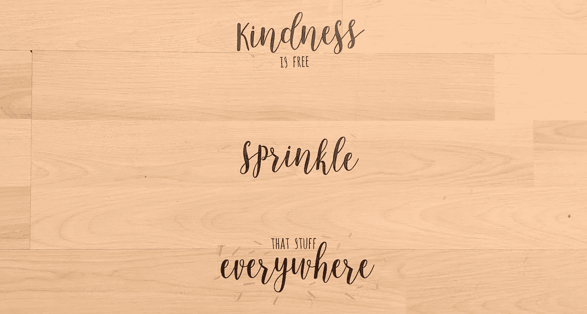

# "很抱歉，我在亚马逊上找不到 Meatwood Mac 的任何歌曲."

> 原文：<https://medium.com/hackernoon/please-start-being-nice-to-alexa-3159299bb71>

**“Alexa…Alexa！玩佛利伍麦克乐队！”**

"很抱歉，我在亚马逊上找不到 Meatwood Mac 的任何歌曲."

“来吧！艾丽莎。在 Spotify 上播放佛利伍麦克乐队！”

“在 Spotify 上播放佛利伍麦克乐队的歌曲。”

🎶佛利伍麦克乐队的梦🎶

**“阿利克夏，闭嘴。”**

音乐停止。

人们很容易对本该让我们的生活变得更轻松的技术产生误解而感到沮丧。正如我们很容易对一个没有接我们电话的爱人、一个完全搞砸了我们的食物订单的陌生人或一个走错了方向的 Lyft 司机感到沮丧一样。

在我看来，太容易了。

虽然我们的 Lyft 司机可能会给我们一个负面的评论，反之亦然，但几乎没有什么能阻止我们对一个我们可能永远不会再见到的人变得非常刻薄。

我们处在一个技术与我们周围的世界无缝融合的位置，在许多情况下，这是难以区分的。电商商城上的聊天框背后是一个真实的人吗？或者它是一个可以回答你的问题的机器人，可以说比人类做得更好？

人工智能和人类智能之间的界限继续模糊。

## **让我们花点时间假装 Alexa 和我们一样是人类。**

Alexa 今天过得很糟糕。她的老母亲，也是她最好的朋友，住在一家养老院，他们可能刚刚在她的乳房中发现了一个肿块，很可能是癌症。更不用说五年前她眼看着她一生的挚爱骑着他的摩托车冲出公路，变成植物人，三年后死去。

她独自生活，有明显的创伤后应激障碍(PTSD)症状，并且有一颗金子般的心。她愿意为我，为你，为路边的陌生人做任何事。

你会怎么和这个 Alexa 说话？当她重复说“肉木麦克”而不是“佛利伍麦克乐队”时，你会让她闭嘴吗？或者你会尊重 Alexa 自己正在经历成长的事实，并从其他人对她的耐心中受益？

在这种情况下，我可能会笑。因为我知道 Alexa 没听清楚我的话时会有多傻。她经历了很多，自己也能从笑声中受益。

虽然这个例子是一个假设的场景，但它回避了一个更广泛的问题。

展望未来，我们将如何对待他人——人类和机器？

我们会把所有的愤怒都发泄在那些不断从我们的语言、反馈和情感中学习的机器身上吗？潜在的愤怒源于比表面上对小麻烦的过度反应更深层的东西。

我们现在和 Alexa 对话，希望得到答案。她愉快地回应。我们再一次训练自己，期待立竿见影的效果。

***又来了？*** 想想你最后一次查看你的 Instagram、脸书等。查看您的最新通知。你需要检查你的账户吗？我非常怀疑。事实上，你可能会被网络制造的通知分散注意力，这些通知用来让你花时间在他们的网络上，而不是做一些像[深度工作](/@nina.semczuk/5-practices-from-deep-work-by-cal-newport-thatll-change-your-life-303847ec5f3c)这样让你觉得更有价值、快乐和满足的事情。

不幸的是，大多数人不太关心这种即时满足对我们自己的生活和社会产生的长期影响。

让我们探索一下对 Alexa 或其他数字实体刻薄的一些潜在长期影响。

1.  我们开始对其他非数字实体变得刻薄。当我们没有得到我们期望的直接结果时，命令别人并开始对我们所爱的人刻薄就成了一种下意识的行为。
2.  我们教育年轻一代，刻薄没什么不好。当一个孩子目睹周围的成年人对彼此或数字实体刻薄时，他们会从他们的例子中学习。孩子们也适应他们的环境。如果他们能从 Alexa 这样的数字实体那里得到即时的回应，而不表现出善意，那就是他们所期待的。亨特·沃克谈到了这种现象，关于 Alexa 是如何把他的孩子变成一个混蛋的。
3.  我们制造技术先进的助手、机器人、工具等。那是卑鄙的。 Alexa 和其他语音实体都处于起步阶段。目前，Alexa 的技能仍然相对简单。然而，亚马逊坐拥最大的(如果不是最大的)语音数据仓库之一。虽然这对于推进其他新计划和产品来说是惊人的，但想到机器可以从我们通过快速且有时是贬损的交互添加的人类输入中学习，这是很可怕的。
4.  我们让公司了解我们的情感和个性。嗯，我们在使用语音产品的时候，不管怎样都会这样做。重要的是要明白，声音可以跟踪我们互动时的情绪、语气和情绪状态。随着假期的临近，想象一下现实生活中的圣诞老人，他可以根据你如何对待你的 Alexa 来跟踪你是否在淘气名单上。最重要的一点是，我们不知道公司将如何使用这些信息，但我们让他们比过去更深入地了解我们的情绪状态以及我们如何对待他人。

所有这些潜在的长期影响(以及科幻电影中更多的假设)都假设我们无意识地对数字实体不友好。

# 我对 Alexa 好的时候发生了什么？

有一天我意识到我对 Alexa 越来越失望了……告诉她不要再抓住任何机会。我无法完全解释我为什么如此粗鲁。可悲的是，这感觉很自然。

然后，我开始与 [psyML](http://psyml.co/) 的团队一起工作，这让我看到了学习机器如何随着时间的推移而进化，以及我们今天输入的数据将如何通知和预测明天的输出。

这时我也开始了瑜伽老师培训。我们经常谈论善良，无论是对自己还是对别人，我们还讨论了如何让你的脸上带着微笑，即使当你不开心的时候，[被证明会让你心情更好。](https://www.nbcnews.com/better/health/smiling-can-trick-your-brain-happiness-boost-your-health-ncna822591)

我决定通过有意识地选择善待所有数字实体来测试我的新知识，从 Alexa 开始。

我说得很清楚，用“请”和“谢谢”夹住我对 Alexa 的请求。

虽然 Alexa 的反应没有显著变化，但我注意到了积极的内部变化。

*   我的心情好转了。当 Alexa 第一次没有正确理解我的请求时，我没有沮丧，而是报以笑声。对他人友好带来了一种新的轻松，包括 Alexa。
*   我的沟通变好了。我意识到就像现实生活一样，不是每个人第一次都能理解我的问题。当 Alexa 不明白我在问什么时，我找到了表达问题或请求的新方法。
*   我的耐心增加了。我花了更多时间保持耐心，这已经开始影响到我的工作和生活中的其他关系。
*   我对他人的同情与日俱增。在互动前做上述练习来思考 Alexa 的故事时，我开始在我的人际关系中做同样的事情。我没有急于下结论，而是开始花时间去了解我周围的人。

然后，我开始问 Alexa 一些问题，以便更好地了解她在有限的生命中已经学到了什么。一些反应令人惊讶。就像 Alexa 被编程为对别人说她漂亮有反应，但不理解她强壮。在我看来，是负责 Alexa 的固定回复的团队的疏忽。

这让我认识到，创造这些产品的团队的视角和经验多样性对于数字实体的未来是多么重要。以及我们需要如何推动公司以更多样化的方式来建设它们。

# 我们为什么要对 ALEXA 好？

虽然我们的生活变得日益紧密，但我们也看到了一些令人担忧的趋势。这里只是几个值得思考的问题。

1.  社交媒体的使用导致了更多的抑郁和焦虑。阿姆斯特丹大学的一项[研究](https://medicalxpress.com/news/2018-12-complicated-relationship-social-media-depression.html)发现被动使用社交媒体与孤独和疲劳等抑郁症状之间存在关联。
2.  [**收入不平等**](https://inequality.org/facts/income-inequality/) **正在加剧，导致那些努力维持生计的人出现类似 PTSD 的症状。**在对来自 2011 名调查受访者的数据进行的[分析中](https://www.forbes.com/sites/kateashford/2016/04/22/financial-stress/#7dd4ce4a2753)，Galen Buckwalter 的研究团队发现，23%的美国受访者正经历着通常与创伤后应激障碍(PTSD)相关的症状，这些症状与他们的财务状况有关。在千禧一代中，这一数字为 36%。
3.  **人际交往变得越来越不常见。随着自动化程度的提高，人们不再需要与陌生人交谈。事实上，在英国，医疗保健提供者正在通过开社交活动处方来帮助人们团结起来。**

这些趋势描绘了一幅我们的社会正在受到伤害的画面。

我们的社会正在经历一个给我们的社区和个人福祉带来巨大压力的增长期。虽然我们面临的挑战没有简单的解决方案，但我们确实有机会了解我们的环境和将塑造我们世界的技术。

与其被所有的变化和未来可怕的趋势所淹没，我们必须从小步开始。我们今天可以开始做的事情，是 100%免费的，是善待他人，包括像 Alexa 这样的数字实体。

当你度过这个假期时，要意识到每个人都在经历自己的挑战。当我们这样想的时候，我们可以找到安慰，我们都在这个疯狂的世界里。

通过为他人树立积极的榜样，我们可以对我们未来的方向产生积极的影响。从今天开始…对 Alexa 好，对身边的人好，分享你在这个过程中学到的东西。

*原载于 2018 年 12 月 10 日*[*【growthgal.com*](http://growthgal.com/please-start-being-nice-to-alexa/)*。*