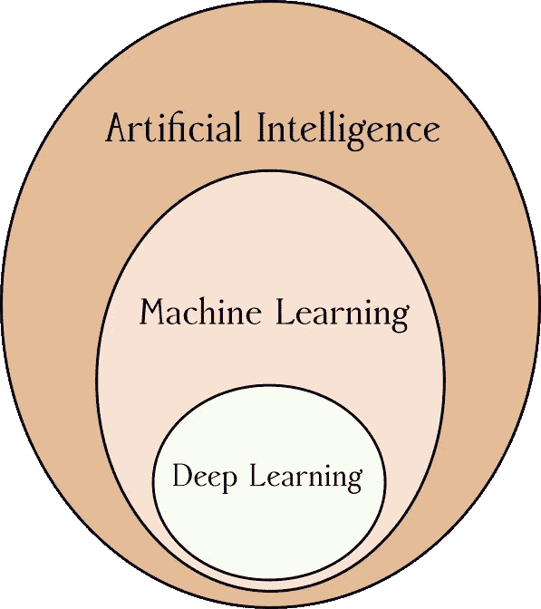

# 请不要再说深度学习不同于机器学习

> 原文：<https://medium.com/hackernoon/please-stop-saying-deep-learning-is-something-different-from-machine-learning-5fb2cad09b5f>

近年来，[人工智能](https://towardsdatascience.com/what-is-artificial-intelligence-part-1-75a6de110141)、[机器学习](https://hackernoon.com/tagged/machine-learning)、[深度学习](https://hackernoon.com/tagged/deep-learning)成为流行语。对于那些已经在这些领域工作了一段时间的人来说，这有些有趣，有时甚至令人满意。我当然不认为这些技术领域受到更广泛的关注是一件坏事。随着这种关注的增加，也需要向大众解释这些概念，这是一个需要解决的崇高挑战。

尽管如此，最近有一个趋势对我产生了类似于指甲刮黑板的影响:

> 快来学习机器学习和深度学习的区别吧！

啊啊啊！！！！！！！我脊背发凉！！！

以这条推文为例:

或者这个:

或者是我一直以来的“最爱”之一:

人们可能会认为 IBM 人工智能和深度学习副总裁 Sumit Gupta 是这个问题的可靠来源，但遗憾的是，他正在将他的观众引入歧途。

深度学习与机器学习并没有本质上的不同；事实上，这是机器学习领域的最新创新之一，它让我们更加接近机器学习先驱们为之奋斗的最初目标。让我们简要回顾一下这些目标。

# 机器学习根源

正如我在之前的文章中所述，机器学习并不是一个特别新的想法。艾伦·图灵早在 1947 年就已经阐明了这个基本思想:

> 我们想要的是一台能从经验中学习的机器。

几代机器学习研究人员多年来一直在重申这一基本愿望，比如亚瑟·塞缪尔、克劳德·香农、尼尔斯·尼尔森和汤姆·米切尔。想想阿瑟·塞缪尔在 1959 年发表的这段话:

> 一开始，最好能清楚地区分机器学习问题的两种通用方法。一种方法，可能被称为神经网络方法，处理将习得的行为诱导到随机连接的开关网络(或其在数字计算机上的模拟)中的可能性，作为奖惩程序的结果。

对于那些熟悉深度学习的人来说，这听起来应该非常熟悉。事实上，人工神经网络的基本思想早在 20 世纪 40 年代就已经确立了。几十年来，这些想法在机器学习社区得到了广泛的讨论和研究，但在某些时候它们已经过时了。

# 特征工程

大约在 20 世纪 80 年代的某个时候，机器学习领域发生了一件奇怪的事情。我无法准确指出它是何时发生的，但随着时间的推移，研究人员在提出聪明的“特征”作为机器学习算法的输入方面付出了越来越多的努力。例如，不是将图像的原始像素值输入图像识别算法，而是设计出花哨的“预处理”算法来检测图像的边缘、拐角、纹理和其他高级特征。这些将作为识别算法的输入特征。这个有些费力的过程实质上就是 Gupta 先生在标题为“机器学习”的幻灯片中所描述的，如上图所示。

这一过程通常被称为*特征工程，*也倾向于特定应用。也就是说，在计算机视觉任务中工作良好的功能在其他任务中通常完全无用，例如运动传感器的活动识别。

在许多情况下，可用功能的数量甚至会变得庞大而笨拙。出现了*特征选择的想法。*新的算法必须被设计出来，以找出对于给定的机器学习任务来说哪些是最好的特征。

然而，这种对特征工程和特征选择的强调并不是*对*机器学习的定义。如果有什么不同的话，对这些领域的过度关注会分散对机器学习最终目标的注意力，即开发能够从经验中自动学习的计算机系统。这是因为在特征工程中，研究人员或工程师将自己插入到等式中，试图用关于特征的聪明的新想法来优化学习过程(或决定特征集)。

# 深度学习拯救世界

我不会深入研究什么是深度学习以及它如何详细工作的本质；关于这个话题有很多好的资源，比如迈克尔·尼尔森的优秀在线书籍《神经网络和深度学习》。相反，我只想指出深度学习如何在许多方面纠正上述问题，并使机器学习更接近其最初的目标。

深度学习主要使用高维“原始数据”(例如，图像中的像素)，而不是提出复杂的特征集。当然，深度学习仍然采用特定应用的技巧，例如主要用于图像识别的*卷积神经网络*的想法。事实上，人们可以认为以这种方式限制神经网络是特征工程的一种形式。但即便如此，这些技术也比*特别的*功能更加通用，比如来自图像的边缘检测器，或者来自加速度计数据的“水平面内动态加速度的变化”。基本思想是将你拥有的任何数据吸入一个庞大而深度的神经网络，并让学习算法完成艰巨的工作。丰富的数据和网络中的多个隐藏层可以自动学习最佳功能，从而弥补了功能缺乏表现力的问题。

然而，无论如何，这仍然是我们所说的机器学习。把“深度学习”作为不同于“机器学习”的东西放在一边，只是糟糕的教育学。它揭示了自从机器学习的概念首次形成以来，对它的目标缺乏理解。下图最好地表达了两者之间的关系。深度学习属于机器学习的总范畴，而机器学习本身是更广泛的人工智能的一部分。

Deep learning is best understood as a subset of techniques in the realm of machine learning, which itself is a subset of techniques used to build artificial intelligence. ([CC BY-SA 4.0](https://creativecommons.org/licenses/by-sa/4.0/) Robert Guinness)

总之，当你通过描述深度学习是什么来给你的约会对象留下深刻印象时，尽量不要错误地说这是一种全新的东西，比旧的学校机器学习东西更酷。无论如何，停止转发那些无意义的推文，让机器学习*对抗*深度学习。因为在现实中，深度学习是机器学习失去已久的朋友之一。