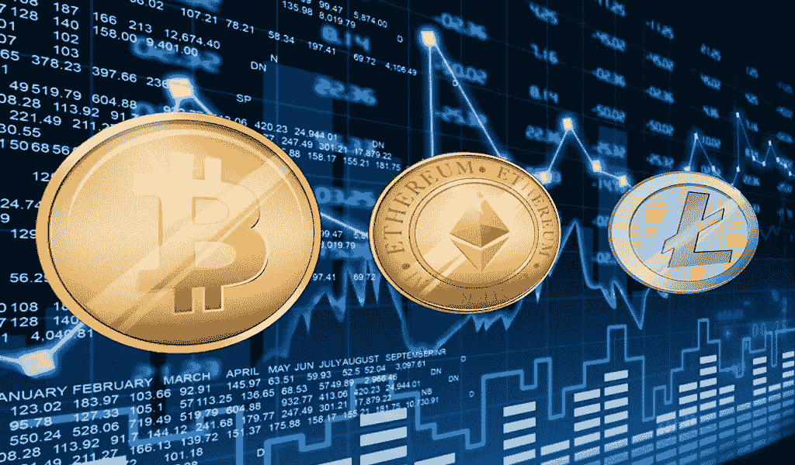

# 请不要再相信你对加密货币的直觉

> 原文：<https://medium.com/hackernoon/please-stop-trusting-your-gut-on-cryptocurrencies-cabcf46b5f3b>

我知道这很诱人…

尤其是现在——几乎每种加密货币都在崩溃，相对较低的价格极具吸引力……但请听我说完。

我不是告诉你不要交易。

相反，我鼓励你！加密货币的波动性正是让这项工作如此有利可图的原因。

然而，加密货币就像任何其他市场一样，你必须在考虑进入之前意识到这一点。

加密货币与股票、外汇、债券等唯一的主要区别。是广泛传播的炒作和歇斯底里。各种加密货币的大量新闻和可获得性为数百万人打开了一扇大门，否则他们永远不会进入交易。

因此，有数以百万计的新交易者真的不知道市场是如何运作的，不知道如何分析市场变化，也不知道牛市和熊市的区别。

这些“交易者”中的许多人甚至从未听说过 **MACD** 或**布林线**。他们对**平衡容积**或**累积/分配线**的概念完全陌生。

然而，他们还是买了又卖。

然后，他们开始赚快钱，并立即认为自己是下一个华尔街之狼。然而，就像他们之前的许多“狼”一样，他们没有意识到的是，他们只是在乘着一个非常牛市的浪潮。

当一切都不可避免地崩溃时，这种令人崩溃的现实往往会被回应为“搞什么鬼？”美国和其他各种怀疑的咒骂和这些“交易者”——在否认——确信只是有一个市场问题。

> 这个国家通过了某某立法。

或者

> 新硬币上发现了一个漏洞。

不，我的朋友。

问题在于，你开始交易时，不知道市场是如何运作的。如果我在前面几段提到的粗体术语对你来说是新的，我不想打断你，但你是这些人中的一员，我鼓励你花一些时间学习和痴迷地学习如何阅读和理解两个绝对重要的概念:

1.  **市场情绪**
2.  **技术指标**

不幸的是，对于阅读这篇文章的交易者来说，我不是来教你如何交易的。我在这里大声疾呼，鲁莽的投资只是知识渊博、经验丰富、通常富有的交易者从中低经济阶层吸走更多钱的另一种途径，他们落入了这些陷阱。

如果你还没有错误地认为我只是在这里居高临下地告诉你你很愚蠢，我将借此机会列举我对加密货币交易的一些想法。

其中一些与上述内容相关，一些只是我与朋友和家人分享的想法，当他们就投资哪种加密货币征求我的技术建议时。

我真诚地希望你能从这些想法中提取一些价值，而不是指责我是一个反向投资者。

# 技术交易和波动

加密货币市场——正如你们许多人正在积极见证的那样——极其不稳定。对于本能驱动的交易者或投资者来说，这可能是可怕的。

**不应该！**

技术交易是出于从波动中获利的愿望，与市场趋势无关。能够准确评估何时买入和卖出，可以让你比所有愚蠢的、直觉驱动的交易者拥有更大的优势。

利用这种差异，在你向任何加密货币投入一分钱之前，学习一些技术交易。

*如果你对风险的容忍度很低，这绝对是一个不错的选择。*

除了再次强调我在上面提出的关于在投入加密货币之前了解自己的观点之外，你可能会问，从这一点来看，主要的收获是什么:

嗯，有了可靠的技术交易，加密货币市场的短期投资很容易成为最有利可图的投资。鉴于这些市场经常经历的不可思议的波动，对我来说，长期风险太大了。

不要指望比特币的价值会翻倍，让你的钱远离经常发生的 5-10%的波动 *g* ！

当然，我也强烈建议你退一步，在确定理想的交易频率之前，评估一下你的风险承受能力。

# 比特币&口袋妖怪范式

对于我的朋友和家人，我经常把加密货币的爆炸比作口袋妖怪。

我生长在#1-151 时代，我绝对拒绝接受和承认从小到大新增的 651 个口袋妖怪。说我固执；称我为纯粹主义者；随便你怎么称呼我；但是加密货币对我来说都一样。

无论你是在争论投资于瑞士联邦理工学院、BCH、XRP，还是其他任何现存的 1504 种加密货币，你都需要明白一件事:

**比特币驱动着所有这些市场。**

它是众所周知的 800 磅重的大猩猩，并且在可预见的未来仍将如此。

**是口袋妖怪红&蓝。**

虽然随着市场的变化，其他每种加密货币有时看起来都很有吸引力，但它们的价值都与比特币的成功相关。与比特币对加密货币市场情绪的影响相比，你在每个市场看到的波动完全可以忽略不计。

如果你注意了上面的内容，市场情绪是我鼓励你在投资加密货币之前了解的两个基本原则之一。

理解比特币在这里的重要性是至关重要的。

# 波纹，Shmipple

我绝对厌恶涟漪的想法，你也应该如此！这与加密货币背后的整个动机完全相反。

首先，它是“预先开采的”，这完全消除了在没有前期投资的情况下进入市场的可能性。

此外，更重要的是，它正被银行大量投资和采用。在我看来，这是 ***而不是*** 加密货币的意义。**请不要支持这个！**

这是一条危险的道路。

它非常有可能通过将经济控制权交还给在过去 100 年中完全主导整个全球经济、现在对财政市场拥有绝对控制权和影响力的同一家企业集团来抹杀加密货币美妙、分布式和以人为中心的本质。

* **咳嗽** * [美联储](https://en.wikipedia.org/wiki/Federal_Reserve_System) …

# 做市商&无知的羊群

这可能是我在整篇文章中提出的最令人反感的观点，我提前道歉，但这是一个残酷的现实，在你认为自己对这一切是如何运作的有任何线索之前，你必须明白这一点。

**免责声明:**我没有……我只是假装。

不过，我知道一件事:

当今存在的每一个经济财政市场都容易受到做市商的影响。

这些是在这些市场上进行买卖的人，*实际上有钱，不像你。*

> *老实说，如果你知道，你就不会读到这些了。*

*我说的是那些可以毫不畏惧地向一种加密货币投入 100 万美元的人，他们欺骗了所有无知的人，让他们认为自己进入了看涨趋势。*

*我说的是那些可以承受以低于市场价值 10%或 20%的价格抛售所有投资的风险的人，他们会引发大规模的歇斯底里，引发熊市趋势，然后坐以待毙，等待以甚至低于最初卖价的价格实现每个人的疯狂抛售。*

*知道如何用可靠的技术指标交易可以为你提供一个非常有价值的防御这些虚假趋势。*

*对市场的巨大变化保持警惕和怀疑。它们不会像真正的市场变化那样持续很长时间，但如果你能在正确的时间足够快地进出，你就可以轻松地搭上这些百万富翁做市商的肩膀。*

# *要记住的四件事(和/或 TL；博士)*

1.  *不要做绵羊；做一只披着羊皮的狼。*
2.  *不要害怕公牛或熊；更多的时候，它们是一种幻觉。*
3.  *你是人；食物链的顶端。*
4.  *你有工具、火和武器；使用它们！*

# *结论*

*加密货币可以说是当代最具经济意义的创新。然而，我们现在很可能正处于最关键的时刻，亿万富翁、银行、甚至国家最终都会买入它们。*

*不要被愚弄，不顾后果地支持已经富裕的投资者接管这些市场。*

*做好你的研究，聪明地交易。*

*这是 ***而不是*** 的一种新范式。利用从几个世纪的市场交易中获得的知识财富，不要让炒作和/或歇斯底里左右你的投资。*

***免责声明:**我不是一个全职交易者，只是一个充满热情，但持怀疑态度的未来主义者，非常擅长预测趋势和结果。除了在业余时间开发市场分析自动交易器之外，我还密切关注、学习和研究市场交易&加密货币超过五年。*

*我叫 Jonny Asmar，我真诚地感谢您花时间阅读我的帖子！*

**15 年前，我开始在记事本上写代码，从未停止过。虽然我主要在 React/Redux & Node 工作，但我对技术的热情远远超出了 UI 开发——这是我一直在努力与您分享的热情。**

**您可以* [*在 JonnyAsmar.com*](http://JonnyAsmar.com)*了解我，在 GitHub* *上查看* [*我的一些代码，或者在*](https://github.com/jonnyasmar)[*【jonnyasmar@me.com*](mailto:jonnyasmar@me.com)*联系我。**