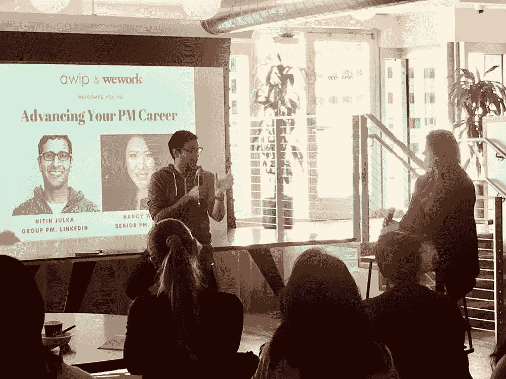
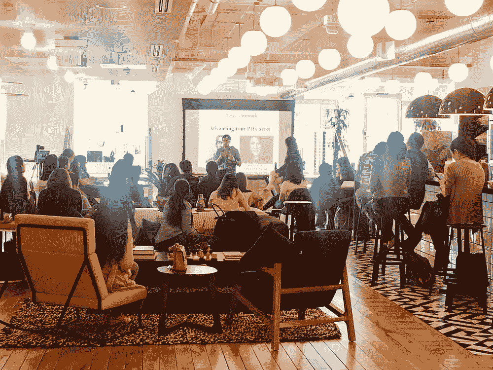
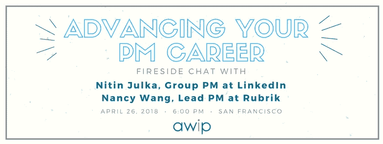

# PM 职业建议 w/ Nitin Julka，Group PM @ LinkedIn

> 原文：<https://medium.com/hackernoon/pm-career-tips-w-nitin-julka-group-pm-linkedin-40ca0de188da>

AWIP fireside chat with Nitin Julka, co-hosted by WeWork SF

*4 月 26 日，星期四，***【AWIP】与领英团队项目经理 Nitin Julka* *进行了一次炉边谈话，我们讨论了他对即将成为项目经理的有抱负的项目经理的建议，以及如何爬上项目经理职业成功阶梯的具体建议。**

# ***针对有抱负的项目经理***

***有条不紊——列出感兴趣的公司名单***

*按照你想要满足的标准列出一份公司清单(通常我会按照行业、融资阶段、对创始人的兴趣来划分公司),这是一个有条不紊地进行面试的好方法。这将有助于解决很多早期的问题，例如，“我喜欢什么样的创业公司？哪些行业？”当你想知道你应该和谁联系/见面来推荐工作时，这甚至会派上用场。*

*不要害羞——向你认识的人伸出援手，即使是通过相互联系*

*我和尼廷都是旧金山的移民……因此对创业领域来说是陌生的。虽然我们都有在大型科技公司工作的熟人(想想谷歌、脸书、LinkedIn)，但对于初创公司来说，我们必须依靠第二层关系和朋友的朋友，我们可以通过电子邮件获得介绍，或者在 LinkedIn 上回复我们。首先，确保你的 LinkedIn 信息是针对你试图联系的联系人的个性化信息……下面是一个例子:*

*亲爱的尼廷，*

*我很想知道你是如何从一家初创公司跳槽到像 LinkedIn 这样的大公司，同时保持你正在开发的产品的影响力的。这是我正在做的与竞选经理有关的事情…你有时间聊聊吗？*

**-南希**

*不要过分规定，不要试图强迫一个不适合情况的框架*

*Nitin 和我所见过的典型的成功候选人是那些真正理解案例面试中给他们的问题，并运用逻辑和理性解决问题的人。他们从:框定问题>>就解决问题所需的输入提出问题>>以简洁的方式提供他们的建议。但是，如果你想让一个框架强行适应一个案例问题，以我的经验来看，这不会有好的结果……它不会让你看起来自信和有经验，而是会让你看起来僵硬和不灵活，因为你应用了不太适合的原则/框架，以便让自己听起来“更像一个项目经理”*

# ***对于当前的 PMs***

***提前为晋升做好计划——记录下你的成就***

*(这可能不适用于较小的创业公司。)根据 Nitin 在 LinkedIn 的经验，作为活动经理的主管，他显然成功地经历了几次晋升。他成功的秘诀是什么？保持一个有详细记录的主要影响项目的列表(记住，度量是很重要的！).从我个人对谷歌“晋升(*即*，perf)时间”的回忆来看，这个列表非常重要，因为它给了你自己职业生涯的路线图。你将确切地知道你需要做些什么来达到下一个水平……*和*能够与可能成为你的推广委员会成员的人进行建设性的交谈——在正式决定做出之前。*

***做自己的拥护者***

> *我的一位明智的导师曾经说过，“没有人会比你自己更好地倡导。”*

*非常正确。别人怎么能像你一样好地描述你的优点和缺点？这就是为什么前面提到的对你所做的所有事情进行细致记录是非常关键的。它帮助你追踪并更好地宣传你所产生的影响。*

*留下你的印记——让别人听到你的声音！*

*即使是像在公司内部创办自己的时事通讯这样简单的事情，这也是其他人了解你想法的一个渠道。在我们的聊天中，Nitin 提到了一个例子，LinkedIn 中的一个人开始了他们自己的以营销为中心的博客——它非常成功，在公司内获得了数百名粉丝，并得到了领导层的关注。所以，开始思考如何让自己与众不同；在某种程度上，这很像你的大学申请:你是如何以一种让你脱颖而出的方式写自己的？你为什么被那所名牌大学录取？*

*如需了解尼廷的更多信息，请查看他在以下方面的出版物:*

*   *[博客](https://www.linkedin.com/in/nitinjulka/detail/recent-activity/posts/)*
*   *[个人生产力](https://docs.google.com/presentation/d/1dFvtWDHvbq6xPUK-b0CBgm7jyolVQrM8GaJZwIZodzM/edit#slide=id.g2afa5eaa4_080)*
*   *[我的预防性维护方法](https://docs.google.com/presentation/d/1qyhUpGEfok7j0XDPUX4Gl61sqhy8z5tJark1lgAK08U/edit#slide=id.g1d0361aaca_1_0)*
*   *[成为 LinkedIn 的项目经理](https://docs.google.com/presentation/d/1ne1Vjs0J5m4TvLurnZWcn2Xe_LBFGy6hNkt59uGuoEo/edit#slide=id.g21bb96d921_0_363)*

# *关于扬声器*

*[*尼廷*](https://www.linkedin.com/in/nitinjulka/) *是领英集团产品经理，他的愿景是为全球所有员工创造经济机会。在 LinkedIn 收购他们之前，他是 B2B 营销公司 Bizo 的产品经理。他还共同创立了 SaaS 教育技术公司 SameGoal。作为智能解决方案副总裁，他领导产品管理、销售、市场营销、招聘和客户服务。**

*[*Nancy Wang*](https://www.linkedin.com/in/wangnancy/) *是*[*Rubrik*](https://www.rubrik.com/)*(一家企业基础设施独角兽:由 Greylock、Lightspeed、Khosla 和投资的云数据管理初创公司)的首席产品经理，目前她正在领导该公司的云移动性 SaaS 产品。她之前是一名企业软件风险投资人，也曾在谷歌担任过构建企业网络基础设施平台的项目经理。**

# *赞助商*

*特别感谢我们的空间赞助商 WeWork 在他们美丽的旧金山举办我们的活动。*

**

*WeWork 是一个全球网络，提供空间、社区、物理和虚拟服务，使公司能够共同成长。*

**

*在[脸书](https://www.facebook.com/advancingwomeninproduct)、[推特](https://twitter.com/theAWIP)、 [LinkedIn](https://www.linkedin.com/company/womeninproduct/) 上关注我们。*

*请访问我们的[网站](https://www.advancingwomeninproduct.org)了解更多信息。*