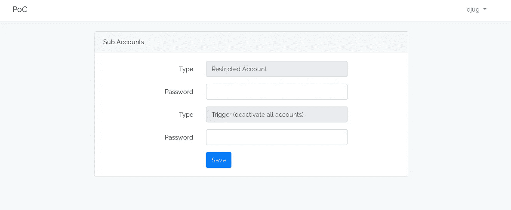
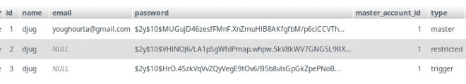

# [PoC]基于密码的用户角色和触发器/操作

> 原文：<https://medium.com/hackernoon/poc-password-based-user-roles-and-triggers-actions-3019659ddcf6>

或者如何为同一帐户的多个角色使用不同的密码



我们都看过一两部电影，其中一个恶棍强迫一些无辜的人，给他密码以进入她的超级秘密账户(一个核设施，或瑞士银行账户)，这个恶棍最终获得了该账户，并将所有的钱转移到他自己的账户，或发射核武器。
我们也听说过一些国家的当局强迫他们的公民甚至访客交出他们的社交媒体账户和密码。通常“受害者”没有任何选择，他们最终会提供自己的密码。

防止这种情况的一种方法是在你的帐户上激活多级认证(2FA)，并在旅行时将你接收一次性密码的手机留在家里，但在很多情况下这可能不是一个真正的解决方案。

如果不是所有这些，我们有系统/网站，每个帐户有多个角色/密码，而不是一直只使用一个密码，我们可以使用另一个告诉系统**“嘿，系统，当我使用这个特定的密码时，这意味着我不在一个安全的地方(或者我被迫交出我的密码)，所以请只显示我的帐户的受限版本**，或者更好的“**嘿，系统， 当我使用这个特殊的密码时，只需禁用我的帐户，并且在 30 天内不接受任何激活它的请求。**

我将在本文中解释我们将如何实现这样一个系统，为了简单起见，我将只关注主要的概念，我将只使用一个控制器，一个用于用户及其角色的表，甚至只使用 3 种类型的帐户:主帐户、受限帐户和触发器帐户。我也将使用 PHP/Laravel，但是您可以用自己选择的语言实现同样的想法。

# 为用户添加多个角色

为了给用户添加多个角色，我们将为用户创建额外的[子]帐户。
为此，我们将创建一个用户表迁移，其中包含:

```
$table->string('email')->unique()->nullable();
$table->integer('master_account_id')->unsigned()->nullable();
   $table->foreign('master_account_id')->references('id')->on('users');
$table->string('type')->nullable();
```

正如你在这里看到的，`email`是可空的，所以我们可以不用电子邮件创建新帐户(我们可以用验证层防止用户不用密码创建新的“主”帐户)。
我们还引用了主账户和账户类型。

我们可以创建一个主帐户和两个子帐户，如下例所示:



# 基本/经典认证

当我们在 Laravel 应用程序中构建经典的身份验证时(不使用内置的 it authController)，我们通常会检查我们得到的密码是否对应于电子邮件，如下所示:

```
public function postLogin(Request $request)
{
   $data = $request->all();
   $email = $data['email'];
   $password = $data['password'];
   if (Auth::attempt(['email' => $email, 'password' => $password]) {
      // redirect the user to the dashboard
   } else {
   // redirect the user back to the login page
   }
…
}
```

在我们新的身份认证系统中，我们将对此稍作改变

首先，我们获得属于该电子邮件地址的所有帐户:

```
$emailOwner = User::where('email', $email)→first();
$users = User::where('master_account_id', $emailOwner->id)->get();
```

然后我们尝试用收到的密码逐一登录:

```
foreach ($users as $user) {
   if (Auth::attempt(['id' => $user->id, 'password' => $password])) {
      return redirect('/home');
   }
}
// if we finish the loop without finding a match, redirect the user back to the login page
```

请注意，我们正在尝试使用用户 ID(不是电子邮件)和密码进行身份验证，一旦找到匹配项，我们就会使用找到的帐户登录。

如您所见，我们创建了一个多角色帐户，并根据用户使用的密码选择了角色。

# 添加基于密码的触发器/操作

让我们添加一件事，让我们添加一种方法来触发一些行动时，我们登录的角色之一。为了简化示例，如果我们使用特定的密码进行身份验证，让我们禁用与电子邮件地址相关联的所有帐户。

首先，让我们向用户帐户添加一个附加字段:

```
$table->boolean('disabled')->default(false);
```

PostLogin 方法(我们用来验证用户的方法)将变成这样:

```
function postLogin(Request $request)
{
    $data       = $request->all();
    $email      = $data['email'];
    $emailOwner = User::where('email', $email)->first(); if (!$email) {
        return redirect()->route('login')->with('authentication-issue', true);
    } $password   = $data['password'];
    $users      = User::where('master_account_id', $emailOwner->id)->get();
    foreach ($users as $user) {
        if (Auth::attempt(['id' => $user->id, 'password' => $password])) {
            if ($user->type == "trigger") {
                $this->trigger($emailOwner->id);
            }
            if ($user->disabled) {
                return redirect()->route('login')->with('account-disabled', true);
            }
            return redirect('/home');
        }
    } return redirect()->route('login')->with('authentication-issue', true);
}function trigger($userId)
{
    $users = User::where('master_account_id', $userId)->get();
    foreach ($users as $user) {
        $user->disabled = true;
        $user->save();
    }
}
```

当我们使用与触发帐户关联的密码登录我们的帐户时，主帐户及其所有子帐户都会被禁用。

你可以在这个回购里找到 demo:
[https://github.com/djug/password-based-roles-actions](https://github.com/djug/password-based-roles-actions)

[](https://goo.gl/RDUt4v)