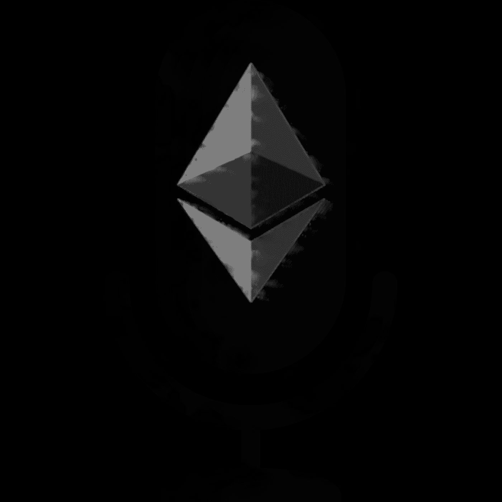

# Podcrypt:自动、公平、点对点的以太播客捐赠

> 原文：<https://medium.com/hackernoon/podcrypt-automatic-fair-peer-to-peer-podcast-donations-with-ether-f0a638111410>

Automatic, fair, peer-to-peer podcast donations with Ether

[下一篇文章](/@lastmjs/podcrypt-alpha-3f3f240ea1a0)

2019 年 2 月 20 日更新:我们做到了！我们达到了 100 个电报组成员的目标。MVP 开始得很匆忙。如果您有兴趣关注，请加入该小组并保持关注。

这篇博文的目的是介绍一个想法并收集反馈。我重视你宝贵的见解，这是为了子孙后代，所以要诚实。

参与 [Podcrypt](https://podcrypt.app/) 从验证到 MVP 到发布，加入[电报组](https://t.me/podcrypt)。在 100 人加入之前，我不会建立 MVP，所以如果你想看到这一切发生，请加入。

# 基本思想

Podcrypt 是一款播客应用。它可以让你听播客。它还允许你加载一个[乙醚](https://www.ethereum.org/ether)的余额，并设置一个支付其中一些[乙醚](https://www.ethereum.org/ether)的时间间隔。在间隔结束时(比如 30 天)，根据你听每个播客的时间以及你对每个播客每个单位时间的重视程度，你的预定量的乙醚会被分配到你的所有播客中。您总支出的 10%将返还给 [Podcrypt](https://podcrypt.app/) 。

# 为什么

播客和他们的创造者为他们的听众提供了巨大的服务。多年来，我听了许多小时的播客，从中受益匪浅。事实上，根据我目前使用的播客应用程序(向[播客迷](https://play.google.com/store/apps/details?id=com.bambuna.podcastaddict&hl=en_US)大喊！)，在过去的几年里，我已经听了超过 37 天的播客。超过 800 小时的内容。据我所知，我没有为此付出一分钱。也许那些广告商已经把我骗到了某个地方，我不确定，但是对于播客创作者来说，直接从他们的听众那里获得某种形式的金钱补偿不是很好吗？对我们播客听众来说，回馈社会不是很好吗？

我认为播客创作者免费为我们提供如此多的内容是令人惊讶的。我也知道播客给许多播客创作者带来了大量的商业利益。这并不是说没有人从播客中赚钱。但我敢说，绝大多数播客并没有从他们的播客努力中赚到大量的钱，那些在播客之外投入大量工作来赚钱的人。我提议的是一种更好的方式，一种自动的、公平的、对等的方式。

# 数字

让我们考虑一些市场数据，好吗？

## 保守估计(仅美国)

*   美国狂热的播客听众人数:~[1600 万](https://www.podcastinsights.com/podcast-statistics/)
*   活跃播客数量:~ [500，000](https://www.podcastinsights.com/podcast-statistics/)
*   通过 Podcrypt 的平均月支出:～5 美元
*   从听众到创作者的平均月流量:约 8000 万美元
*   从听众到创作者的平均年流量:～9.6 亿美元
*   每场演出的平均月收入约为 160 美元
*   每场演出的平均年收入约为 1920 美元

## 自由估计(仅美国)

*   美国狂热的播客听众人数:~[4600 万](https://www.podcastinsights.com/podcast-statistics/)
*   活跃播客节目数量:~ [500，000](https://www.podcastinsights.com/podcast-statistics/)
*   通过 Podcrypt 的平均月支出:～10 美元
*   从听众到创作者的平均月流量:～4.6 亿美元
*   从听众到创作者的年平均流量:～55.2 亿美元
*   每场演出的平均月收入:920 美元
*   每场演出的平均年收入:11040 美元

我不是说 [Podcrypt](https://podcrypt.app/) 将独自完成这项工作，但基于这些数字，这个想法实际上有可能自愿为播客生态系统带来 50 亿美元。我觉得这是一个值得为之奋斗的未来。

# 对于播客听众

要使用 [Podcrypt](https://podcrypt.app/) ，请前往 [podcrypt.app](https://podcrypt.app/) 。这是一个[渐进式网络应用](https://developers.google.com/web/progressive-web-apps/)，这意味着你可以首先完全在你的网络浏览器中使用它，并随时将其添加到你的主屏幕上，就像一个本地应用一样。这是一个 [dapp](https://ethereum.stackexchange.com/questions/383/what-is-a-dapp) 因为它将是完全开源的，并且大部分(如果不是全部的话)后台都运行在[以太坊](https://www.ethereum.org/) [网络](https://hackernoon.com/tagged/network)上。

一旦将 Podcrypt 加载到浏览器中，您将执行以下操作:

*   使用比特币基地([这是我的推荐链接，如果你喜欢](https://www.coinbase.com/join/59e07f213562550110702b78))或任何其他[以太坊钱包](https://cointelegraph.com/ethereum-for-beginners/ethereum-wallets)将[以太](https://www.ethereum.org/ether)发送到你的 [Podcrypt](https://podcrypt.app/) 钱包
*   设置支付间隔(即 1 天、7 天、30 天)
*   设定支出的美元金额(即 1 美元、5 美元、10 美元、50 美元)
*   开始听播客

然后你继续你的生活。在每个时段结束时， [Podcrypt](https://podcrypt.app/) 会根据你听每个播客的时间，在每个播客之间分配你的支出金额。例如，假设在 30 天的间隔结束时，您的收听时间如下:

*   播客 1: 5 小时
*   播客 2: 3 小时
*   播客 3: 1 小时

如果您的支付金额设置为 10 美元，支付将如下所示(见下面的免责声明):

*   播客 1:5.00 美元
*   播客 2:3.00 美元
*   播客 3:1.00 美元
*   pod crypt:1.00 美元

如果您用完了资金，您将被提示添加更多的资金，然后才能收听更多的播客。该数量实际上可以是任何值，但必须大于 0(大于 0 多少将是技术限制的问题)。这些限制旨在保持资金流动，同时让每个人都有机会根据自己的情况决定他们目前能够支付多少。

如果你喜欢这个想法，并希望看到它变成现实，请加入[电报小组](https://t.me/podcrypt)。请记住，这项工作将不会开始，直到 100 人加入。

# 对于播客创作者

要使用 [Podcrypt](https://podcrypt.app/) ，只需在你的播客描述中添加你的[以太坊](https://www.ethereum.org/)钱包地址。如果你还没有钱包或乙醚，我强烈推荐比特币基地([这是我的推荐链接，如果你想要](https://www.coinbase.com/join/59e07f213562550110702b78))。您可以在描述中的任何地方添加您的地址，只需将其格式化如下:

[以太坊](https://hackernoon.com/tagged/ethereum)地址:0x your-以太坊-钱包-地址

那就看你的了。你向你的用户推广 [Podcrypt](https://podcrypt.app/) 越多，你收到的捐款就越多。

# 结论

感谢阅读！请伸出援手，我确实需要你的帮助、想法和灵感:

电报:

电子邮件:jordan.michael.last@gmail.com

推特:@lastmjs

免责声明:由于每笔交易的[以太坊燃气](https://ethereum.stackexchange.com/questions/3/what-is-meant-by-the-term-gas)费用，确切的支付金额会有所不同。