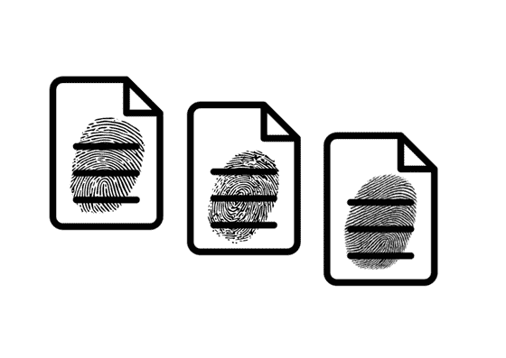
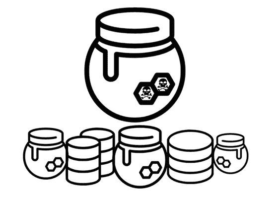
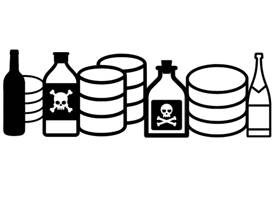
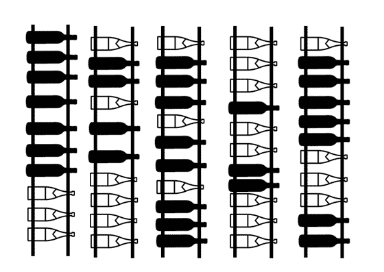
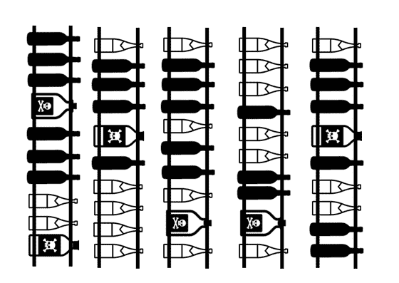
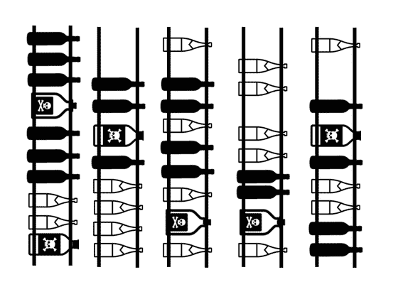
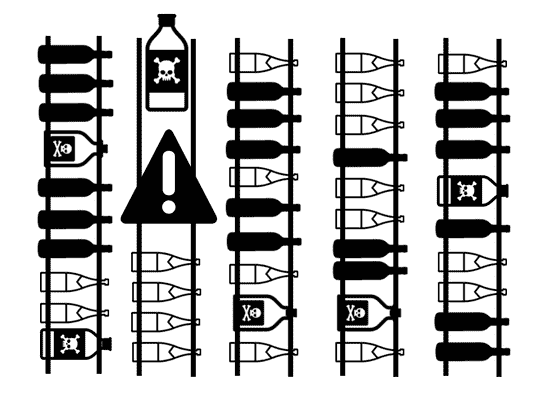
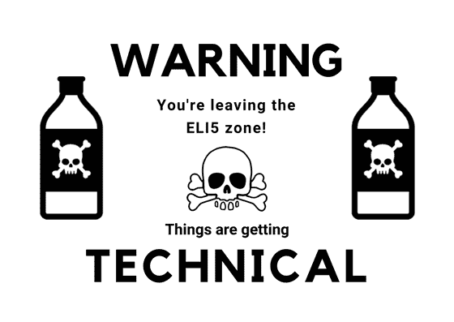
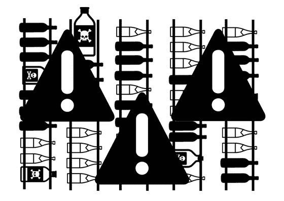

# 像我五岁一样解释:毒药记录(数据库表的蜜罐)

> 原文：<https://medium.com/hackernoon/poison-records-acra-eli5-d78250ef94f>

*什么是有害记录，以及如何使用它们来检测大规模数据库违规和泄漏。*

想象一下，您正在存储一个包含大量敏感数据的表:客户姓名、电子邮件、生物特征信息等……无论您在安全性方面做了多少努力，在某个时候，SQL 注入或恶意的内部人员会试图执行一个`SELECT *`语句来下载该表。在某些情况下，他们会成功。你能切实地做些什么来防止这种情况发生？例如，您可以使用毒药记录。嗯，什么？..

> **病毒记录**是伪装的数据库记录，创建的目的是模仿真实的数据库条目，在正常情况下不会作为合法查询的响应返回。

要检测到数据库以病毒记录响应，我们需要一些实体来“监视它们”。有关检测病毒记录的不同方法，请阅读我们关于病毒记录的技术文章。

例如，只要在通过“看门狗”代理服务器的数据库响应中出现并被检测到，病毒记录就会在系统中发出警报。

在[哥萨克实验室](https://www.cossacklabs.com/)，我们确信我们在数据库保护和入侵防御的上下文中的其他地方看到过“有毒记录”这个名称。然而，看起来“有毒记录”是我们在研究 Acra(开源数据库加密代理，用于保护数据库和数据库驱动的应用程序中的敏感数据)时创造的一个新术语。这是一篇解释什么是有害记录以及如何将它们用于防止数据库数据泄漏(ELI5 风格)的文章。

毒药记录的概念可以追溯到互联网出现之前的冷战时期，当时假档案将无辜公民标记为间谍，并与真正的间谍文件一起小批量存储。这样做的目的是为了追踪——如果一些非间谍被捕，这意味着该批中的所有其他档案和文件也受到了敌方情报机构的威胁。

在网络世界中，蜜罐和文档指纹数据丢失预防工具可以被称为有毒记录的近亲。

# **文件指纹**

[文档指纹](https://docs.microsoft.com/en-us/exchange/security-and-compliance/data-loss-prevention/document-fingerprinting)是一种数据丢失预防(DLP)工具，它将一些标准(文本)表单标记为敏感信息，可以为其定义传输规则和安全策略。

通常[电子文档不能包含真实的指纹信息](https://insights.speakwithageek.com/post/Prevent-Data-Loss-with-Document-Fingerprinting)，所以其他标记文件的方式被用于指纹识别。例如， [DLP 代理](https://en.wikipedia.org/wiki/Data_loss_prevention_software)基于独特的单词模式创建指纹文档。产生的指纹用于检测包含它的所有出站文档。如果预先配置，服务器将检测发送带有指纹信息的文档的尝试，并采取适当的措施(即警告系统管理员)。

# **蜜罐**

蜜罐是 IT 基础设施的诱饵，其唯一目的是通过有意引入脆弱和易受攻击的元素来引诱潜在的攻击者(蜜罐有目的地同时结合几种漏洞类型被称为"[呆子](http://misclassblog.com/database-design-and-development/honeypots-dorks-and-a-protective-sql-injection/)")。

蜜罐作为一个安全层，在此基础上可以研究攻击者的行为并找出未来可能攻击的目的(发生在真实的基础设施元素中)。

毒素记录与生产蜜罐有一些相似之处。[生产蜜罐](https://en.wikipedia.org/wiki/Honeypot_(computing))伪装成生产基础设施的真实功能元素，以转移攻击者的注意力，充当虚假目标，在渗透时发出安全警报。

蜜罐和病毒记录都可以成功地用于许多传统(数据库)入侵检测和预防系统效率低下的场合。就其本质而言，蜜罐和病毒记录不受诸如误报和漏报等妨碍 IDS 的常见问题的影响，它们消除了监控和筛选过量数据的必要性，并且比整个数据库的主动监控系统需要的资源少得多。然而，我们并不主张他们是替代品——而是一个有价值的助手和分级防御中的另一条线。

然而，毒药记录的工作机制完全不同于蜜罐。毒物记录不是功能基础设施元素的一部分。

那么，有哪些中毒记录呢？

# **毒药记录**

如果攻击者设法严重损害系统，以至于他们能够改变其行为(通过 [SQL 注入](https://gbhackers.com/latest-google-sql-dorks/)或本地代码执行错误)，该怎么办？必须有一种方法来设置被动监控系统，检测这些违规行为。

毒药记录是你的数据库中的数据(在[哥萨克实验室的 Acra](https://www.cossacklabs.com/acra/) 的情况下是二进制数据)，可以被描述为专门设计的内容假人。当部署在数据库中正确的位置时，它们只能通过`SELECT *`请求进行查询。病毒记录在大小和“外观”上可以类似于数据库中的任何其他类型的数据。它们可以放在表格单元格中，也可以占据整行。当在查询中被选中时，它们将作为违规的指示并向系统发出警报。就像蜜罐一样，病毒记录增加了额外的安全级别，并为监控数据库中发生的可疑和公然的恶意行为提供了另一种工具。

病毒记录的主要区别在于，您需要一个特定的工具来创建它们，还需要一个工具来检测它们；一种工具，允许您设置某个参数，将病毒记录与数据库中的“正常、常规”数据(即数据开头的某个字节序列)分开，然后进行检测。

病毒记录与您的监控系统一起工作，因为需要注意从数据库中查询的病毒记录(并在事后发出警报)。毒药记录只是数据(Acra 的情况下是二进制数据)，以特殊的方式标记。对于监控，可以使用 app 的中间件，流量监控，DLP 工具，甚至可以在特定的数据库单元上设置触发器，而不是使用 Acra。

# **Acra 毒录图文并茂**

比方说，有一个数据库，里面全是记录(加密和明文)。为了给合法的请求和用户提供解密，我们在应用程序和数据库之间放置了解密代理。除了解密数据库中的记录，Acra 还会检测数据库响应中的有毒记录。

为了让这个故事更有趣，让我们假设白色瓶子是未加密的记录，黑色不透明瓶子是加密的记录:

如果攻击者设法获得记录的访问权限并执行`SELECT *`，他们将能够窃取并泄露他们想要的所有信息，并且没有人会发现，直到由于某些其他原因(或非常公开的泄露)而注意到违规。

但是如果数据库也包含毒药记录呢？它看起来会像这样:

病毒记录被设计为在类型和大小上类似于常规数据库条目，并且在数据库的正常安全运行期间，它们从不被选择或以其他方式被寻址。

因此，在正常情况下，病毒记录将保留在原处，而数据库中的其他记录将被加密和解密、读取、写入、删除等。像这样:

当攻击者能够迫使数据库响应他们定制的请求时会发生什么？

位于攻击者和数据库之间的 AcraServer 将在输出的其他记录中识别出 poison 记录，这将触发安全事件。

简单明了。

等等，什么是 AcraServer？

# **什么是 Acra**

[Acra 是一个开源数据库安全套件](https://github.com/cossacklabs/acra)，它通过强大的选择性加密和入侵检测功能保护敏感数据免受泄露和许多其他典型威胁。简而言之， [Acra](https://www.cossacklabs.com/acra/) 就像一个有用的“中间人”,在数据进出数据库时对其进行加密/解密。毒药记录是在 [Acra](https://www.cossacklabs.com/acra/) 中用于入侵检测的工具之一(如果您决定尝试毒药记录，我们建议查看 Acra 的完整[架构方案)。](https://github.com/cossacklabs/acra/wiki/Architecture-and-data-flow)

由于 AcraServer 是基础架构中唯一解密敏感数据的实体(将敏感数据的攻击面缩小到一个专门的服务，而不是几十个地方),并且可以看到发送给它的所有请求，因此 AcraServer 有责任区分好的行为和坏的行为，并采取适当的措施。

AcraServer 的密钥存储包含一个特殊的密钥，用于识别病毒记录。病毒记录由一个特殊的实用程序生成，该实用程序可配置为使病毒记录类似于您的实际数据库条目..

在经过服务器时，病毒记录会通知它非典型行为。AcraServer 将检测病毒记录，停止执行查询，系统管理员将收到入侵警报(如果 Acra 的基础架构配置为这样做)。

你可以动手尝试 Acra 在[哥萨克实验室 GitHub 知识库](https://github.com/cossacklabs/acra/)中的毒药记录，或者使用 [Acra Live Demo](https://www.cossacklabs.com/acra/#acralivedemo) 不用写现场代码就可以完成。或者去我们的[技术博客](https://cossacklabs.com/blog/acra-poison-records.html)阅读更多关于毒物记录机制的技术描述。

***得到了评论？对毒录有疑问还是***[***Acra***](https://www.cossacklabs.com/acra/)***？此外，如果术语“毒药记录”不是我们创造的，请让我们知道——我们很乐意找到完整的背景故事。请通过***[***info@cossacklabs.com***](http://info@cossacklabs.com/)***或***[***@ cossacklabs***](https://twitter.com/cossacklabs)***联系我们。***