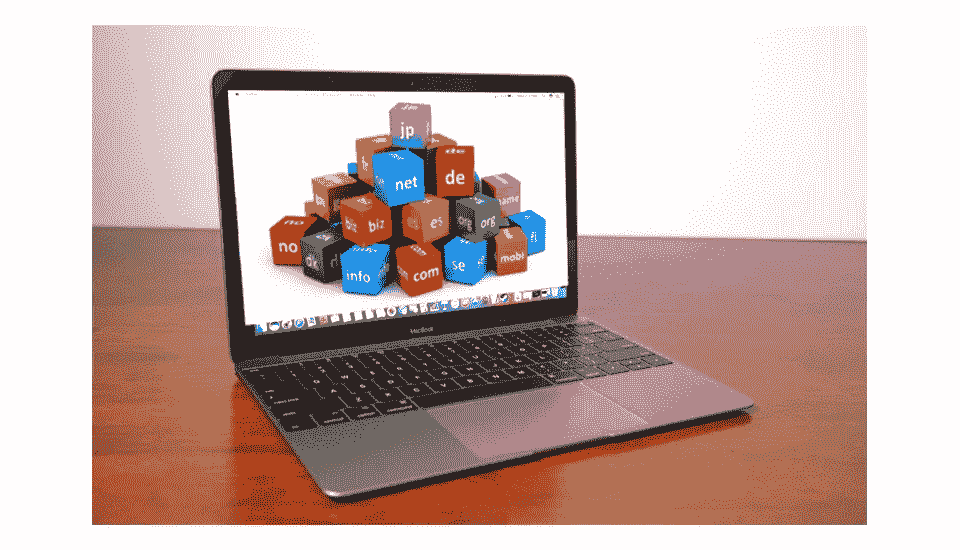
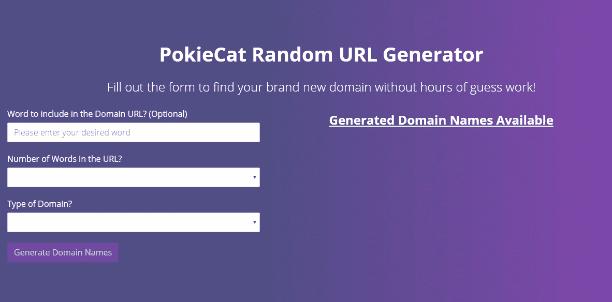
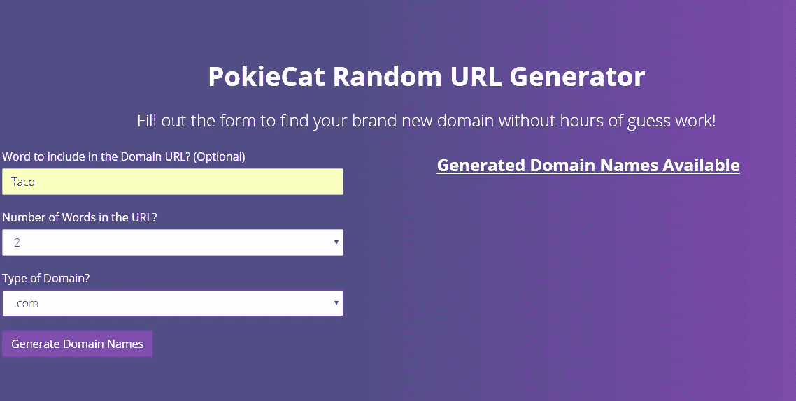
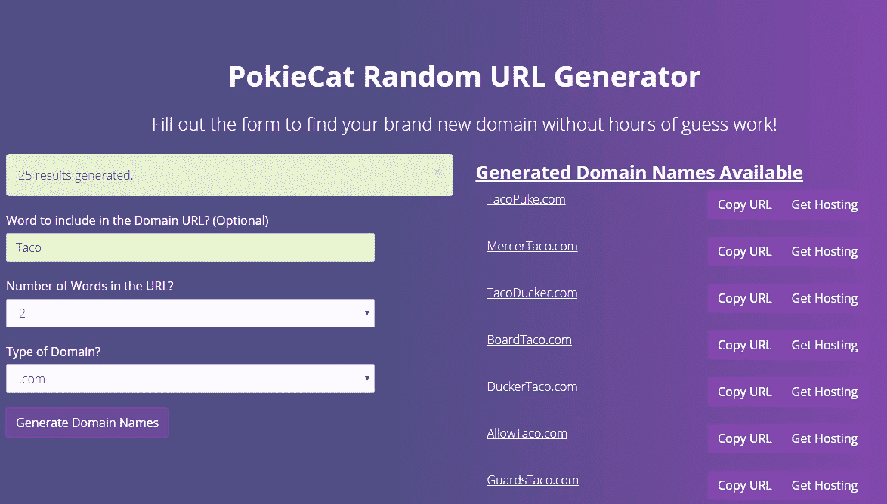
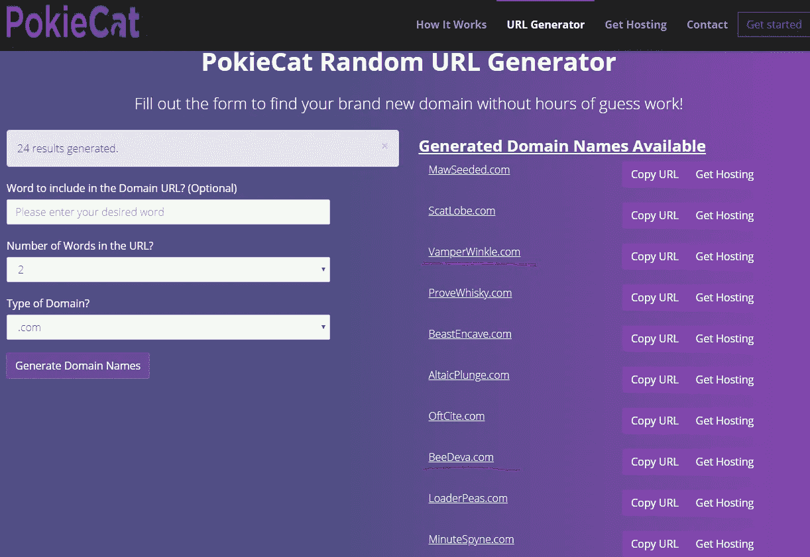

# PokieCat.com 域名生成器

> 原文：<https://medium.com/hackernoon/pokiecat-com-random-url-generator-bf3f281be75f>

Domain Extensions

任何试图为自己的全新网站寻找域名的人都知道真正找到一个域名的痛苦。经过几个小时的搜索一切你能想到的你发现该域名要么被占用或一些挺举持有该域名试图出售数千美元或更多。

寻找新的域名可能是一个严重的痛苦。网上有一些随机的域名生成器，但是在寻找新域名的时候，大多数都几乎没有用。90%的网站要么给你已经被占用的域名，要么试图向你追加销售其他产品。多年来，GoDaddy 和 Shopify 是你唯一的选择。但是一个名为[Pokiecat.com](https://pokiecat.com)的很有潜力的新网站出现了。

使用 Godaddy.com 的网址检查器是相当偶然的；它的唯一目的是试图向你追加销售或让你购买“优质域名”(那些被保留出售，为什么定价过高)。

Shopify.com 有一个像样的随机生成器，但也有针对性地试图让你购买“优质域名”。

Pokiecat.com 的[是独一无二的。它并没有试图向你推销什么，事实上，这是一项完全免费的服务。它允许你搜索随机生成的有许多不同扩展名的域名，并且只显示没有人拥有的域名。这意味着，它不仅保证是独一无二的，而且不会再找到那个完美的域名，却发现某个混蛋正试图以 5000 美元或更高的价格出售它。](https://pokiecat.com)

这是一个非常简单易用的 3 步流程:

## 第一步:

首先，你需要向下滚动到 PokieCat.com 的[URL 生成器。它看起来会像这样:](https://pokiecat.com)

Pokiecat Url Generator Form

## 第二步:

接下来，填写[PokieCat.com](https://pokiecat.com)随机 URL 生成器表单。如果您希望某个单词包含在域名中，只需将其包含在第一个文本框中。之后，从第一个下拉列表中选择 2、3 或 4 个单词包含在域名中。最后，选择您想要的域名类型，例如。com，。网，。政府等。从最后一个下拉菜单中，单击“生成域名”按钮。

它看起来会像这样:

## 第三步:

URL 名称，以寻找和测试每个 URL 创建，只显示你的领域，目前没有人拥有一个很好的格式列表。如果你没有找到你喜欢的名字，只需点击“生成域名”按钮再次获得另一批。

这个演示非常完美，因为第一个结果是 TacoPuke.com。爱死了！

因为它是随机的，一些名字只是胡言乱语。但是我们看到的一些胡言乱语可能很有趣。我是说，看看下一批:

Pokiecat.com Random URL Generator

你可以是[BeeDeva.com](https://www.bluehost.com/track/surefire/)或【VampireWinkle.com】T2 的骄傲主人，也许没有[TacoPuke.com](https://www.bluehost.com/track/surefire/)那么搞笑，但你明白这个想法。我很容易看到这变成了某种饮酒游戏。

[Pokiecat.com](https://Pokiecat.com)是完全免费使用的，而且据我所知，它完全由到 [BlueHost](https://www.bluehost.com/track/surefire/) 主机的附属链接支持，并引领一代人到部落媒体之家。如果只是为了一个廉价的笑声，这是值得一试的。

*作为免责声明，我不得不说，我确实为 PokieCat.com***免费建立了这个网站，以便将我的公司放在销售线索生成部分。来找我的项目并没有帮助或支持*[*PokieCat.com*](https://pokiecat.com)*，而是我制作网站的报酬。请支持*[*PokieCat.com*](https://pokiecat.com)*首先使用部落媒体屋来满足你的网站需求。我的公司不承担正常的网站项目或任何 WordPress，只有应用程序和应用程序，部落媒体屋处理所有的设计和营销的东西。**