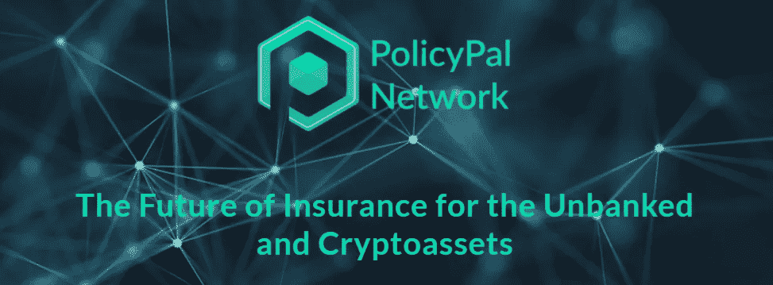
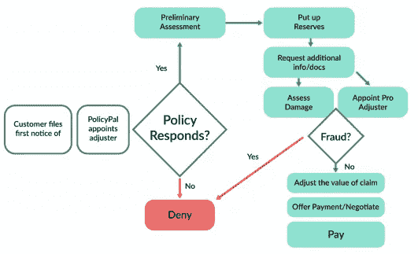
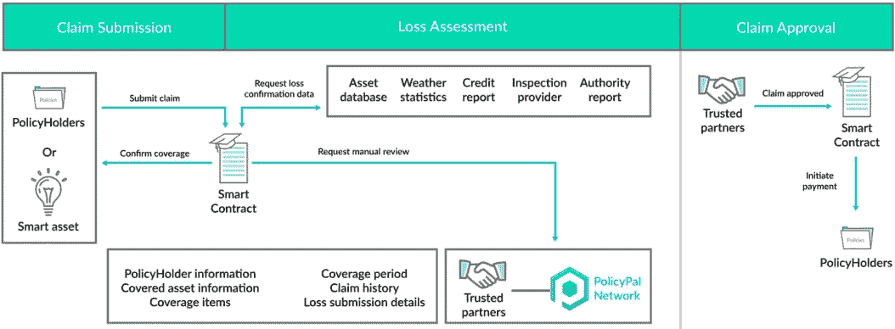
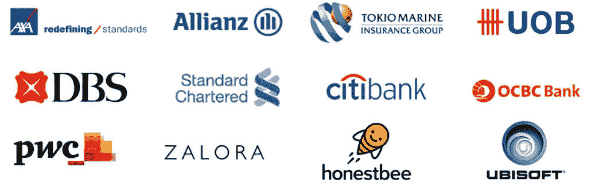
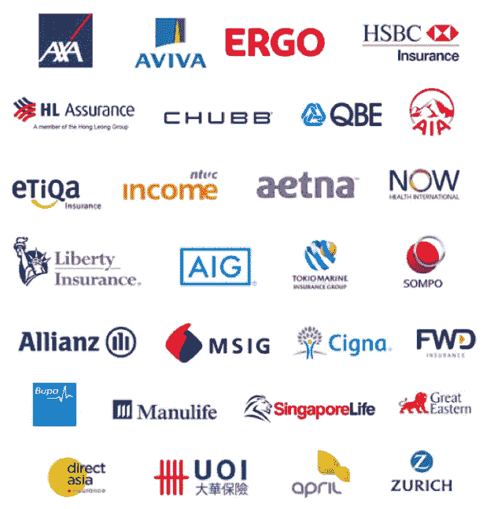
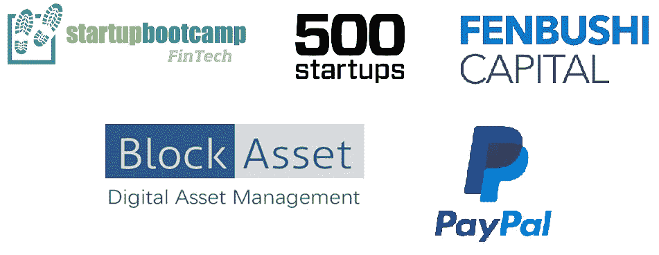
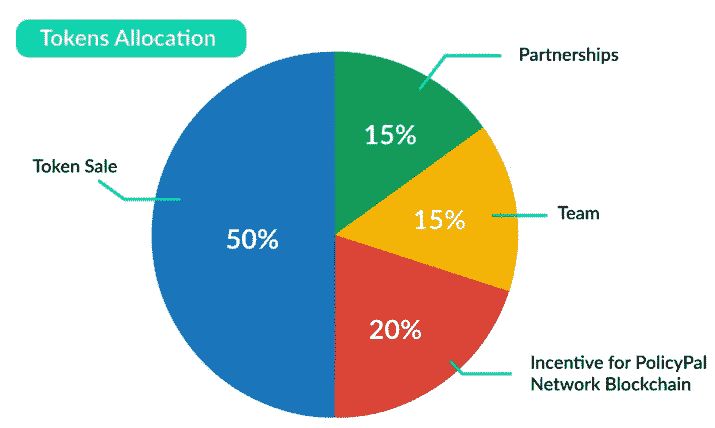
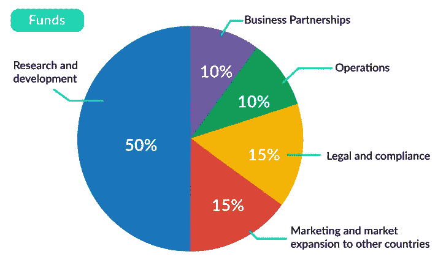

# policy pal Network——一家金融科技初创公司，将保险的可及性提升到了一个新的水平

> 原文：<https://medium.com/hackernoon/policypal-network-a-fintech-startup-taking-insurance-to-a-new-level-of-accessibility-974df376192d>

***免责声明*** *:我与 PolicyPal 团队没有任何关系。我既不是财务顾问，也不是财务建议。无论接下来发生什么，都只是反映了我对这个项目的理解，以及我对其未来前景的个人看法。*

我们目前正在见证区块链技术如何以某种形式颠覆几乎每个行业的早期阶段，尽管该技术仍处于起步阶段，并在全球采用的道路上面临着几个技术障碍。

区块链技术已经进入了几个行业，包括银行和支付系统、供应链管理、物联网(IoT)、广告、能源管理、医疗保健、零售、房地产、网络服务、云存储等。

然而，有一个行业仍在努力跟上数字领域新消费技术的发展步伐:保险业。根据[瑞士再保险协会](http://institute.swissre.com/)在 2016 年进行的[研究](http://institute.swissre.com/research/library/World_insurance_in_2016.html):

> 2016 年全球直接保险费总额为 4.6 万亿美元，占全球国内生产总值的 6.3%。

根据 2017 年 4 月[慕尼黑再保险](https://www.munichre.com/)发布的另一篇[报道](https://www.munichre.com/en/media-relations/publications/press-releases/2017/2017-04-20-press-release/index.html):

> 到 2018 年，全球保险业可能会略有增长。
> 
> 从长期来看，亚洲新兴市场将具有最大的增长潜力，预计未来几年它们在基本保险费中的份额将与西欧持平。

尽管是如此庞大的行业，**全球保险生态系统仍在使用非常陈旧的方法，在采用新的、更高效的消费者技术方面几乎没有创新**。如今，保险业中充斥着大量的中介机构，包括分销代理、经纪人和银行，他们使用效率低下的记录保存系统来运营，这些系统将文档存储在纸质印刷品的模拟世界中。这使得保险索赔和分配过程耗时、繁琐，并且对于索赔者来说是令人沮丧的经历。

此外，由于保险业普遍缺乏透明度，在潜在的保险索赔事件中，索赔人承受与理解保险范围细节和所需的数据收集相关的过度压力。即使符合所有要求，事故发生后，保险索赔也可能需要几个星期才能处理。

[**、PolicyPal、**](https://www.policypal.network/) 于 2016 年 4 月推出，旨在解决消费者在处理保险时面临的挑战，从选择和购买保单，到完成和处理保险索赔。

## 什么是 PolicyPal？

PolicyPal 是新加坡的一家注册保险经纪公司，采用*机器学习*和*人工智能*将保险单数字化，并允许用户无缝选择和管理现有保单。

PolicyPal 还利用区块链的技术构建了一个名为 **PolicyPal Network** 的分散化平台，通过改变保险生态系统的可及性，在发展中国家的消费者和保险提供商之间架起一座桥梁。PolicyPal Network 不仅允许用户选择和购买保单，还可以作为保单支付的安全验证引擎。

PolicyPal 的愿景有两个方面:

*   为发展中国家数百万没有银行账户、无法获得充分保险保护的人降低与传统保险相关的障碍。
*   确保商业公司和个人投资者免受加密货币交易所和钱包安全漏洞导致的加密资产损失。

## PolicyPal 计划如何实现这一目标？

**PolicyPal 正在使用光学字符识别(OCR)、基于规则的算法和分类法来数字化所有保险单并自动进行分析。**该系统只需大约 30 秒即可将保险单数字化，并通过使用算法，确定保险的具体细节，从而为最终用户提供个性化建议。

PolicyPal 正在利用其不断增长的全球保险合作伙伴列表中的数据来构建应用程序编程接口(API ),以便为消费者获取即时保险单报价和保险详情。

通过收集保险费、投保人人口统计数据和索赔数据，PolicyPal 还将发现保险市场的空白，并与其保险合作伙伴合作开发新产品来填补这些空白。因此，PolicyPal 与其全球保险合作伙伴处于一种共生关系。

最后， **PolicyPal Network 受益于区块链技术带来的深远改进**，这将显著增强用户体验以及消费者和保险提供商之间的互动。区块链给 PolicyPal 带来的优势是:

*   保单持有人所有相关信息的安全时间戳存储。
*   使用智能合同自动处理保险赔付，从而全面提高运营效率。
*   由于区块链的数据不变性和透明性，保险欺诈减少。

在第一阶段，PolicyPal 网络将使用以太坊区块链。然而，未来的计划是开发一个专门的区块链 PolicyPal 网络，为其产品和服务量身定制。

根据前面提到的双重愿景，PolicyPal 有两条产品线:

**第一条产品线:密码保护服务**

CryptoProtect Service 是一项与全球保险公司合作的网络安全服务，旨在保护加密货币资产。关于加密货币的最大挑战之一是加密资产在存储期间的安全性，无论是在交易所还是在各种在线和离线钱包上。不幸的事件，如 2014 年 2 月 MtGox 交易所因 85 万比特币被盗而关闭，以及 2016 年 Bitfinex 交易所被黑，约 12 万比特币被盗，加剧了投资者对其加密资产安全性的担忧。因此，CryptoProtect 服务将为使用加密货币钱包或在加密货币交易所交易的消费者提供加密货币资产保险。

**第二条产品线:新兴市场 P2P 互助产品**

P2P 互助产品的目的是创建一个由社区驱动的保险生态系统，这样加入保险平台的成员越多，平台就越强大。

传统的保险生态系统涉及许多层次、中介和子流程，导致较高的保险费和在扩展的地理区域上的较差可扩展性。对索赔人来说，在这个系统中登记保险索赔的过程既费时又麻烦。

Insurance claims process in the traditional insurance ecosystem, taken from PolicyPal Network whitepaper found [here (PDF)](https://www.policypal.network/whitepaper/PolicyPal_WhitePaper.pdf)

另一方面，通过 PolicyPal Network 的 P2P 互助保险旨在实现索赔流程的自动化，并通过解决信任问题，创建一个在扩展的地理区域内高度可扩展的保险生态系统。

P2P Mutual Aid insurance claims process using the blockchain technology for claims automation, taken from PolicyPal Network whitepaper found [here (PDF)](https://www.policypal.network/whitepaper/PolicyPal_WhitePaper.pdf)

P2P 互助保险涵盖多个险种，包括人寿保险、人身意外伤害计划、财产保险、农业保险等。

## 团队和顾问

PolicyPal 的团队由保险、区块链、金融和技术领域经验丰富的人员组成。

PolicyPal 的**首席执行官(CEO)和创始人**、[、 **Val Yap** 、](https://www.linkedin.com/in/valyap/)，被列入[福布斯 2017 年 30 岁以下亚洲 30 强](https://www.forbes.com/30-under-30-asia/2017/finance-venture-capital/#69f618d01193)的*金融&风险投资*类别，并拥有[伦敦帝国理工学院](http://www.imperial.ac.uk/)的商业管理硕士学位。此前，她还在华侨银行[担任助理副总裁](https://www.ocbc.com/group/group-home.html)以及在普华永道担任风险保证助理。

PolicyPal 的**首席战略官(CSO)** ，[， **Lucas Chua** ，](https://www.linkedin.com/in/lucaschua/)之前曾担任过 [IBM 全球企业家项目](https://developer.ibm.com/startups/)的 APAC 负责人。Lucas 与区块链和金融科技领域的几家初创公司合作过。他也是 TechinAsia 的首席技术官，目前是区块链一家物联网初创公司 BuzzVox 的顾问。

PolicyPal 的团队成员以前曾与许多知名组织合作过，包括:

Companies that PolicyPal’s team members have previously worked with

PolicyPal 的顾问委员会也是众星云集，包括来自区块链和金融科技领域的知名人士，特别是:[**Scott wal chek**](https://www.linkedin.com/in/scott-walchek-1822b854/)**—[trv](https://www.trov.com/)的首席执行官和创始人，也是[百度](http://www.baidu.com/)的早期投资者，**博深**—[芬布士资本](http://www.fenbushi.vc)的创始合伙人， [**肖恩·杰**](https://www.linkedin.com/in/shaundjie/) —【联合创始人**

## **伙伴关系**

**PolicyPal 已经与许多全球保险公司建立了合作伙伴关系，包括一些知名公司，如 [AIG](http://www.aig.com/) 、[安联](https://www.allianz.com/en/)、[安盛](https://www.axa.com/)、[保柏](https://www.bupa.com/)、 [Etiqa](https://www.etiqa.com.sg/) 、[汇丰保险](https://www.hsbc.co.uk/1/2/insurance)、 [MSIG](https://www.msig.com.sg/) 和[新加坡人寿](https://singlife.com/)。**

****

**PolicyPal’s global insurance partners, as of this writing**

**PolicyPal 还与泰国、缅甸、印度尼西亚和越南等国家的科技初创公司、电信公司、企业集团和便利店等其他值得信赖的合作伙伴展开了对话。**

## **投资者**

**PolicyPal 的投资者包括知名机构，如 [PayPal 孵化器](https://www.paypal-incubator.com/)、 [500 Startups](https://500.co/) 、 [Startupbootcamp Fintech](https://www.startupbootcamp.org/) 、 [Fenbushi Capital](http://www.fenbushi.vc/) 和 [BlockAsset](https://blockasset.io/) 。**

****

**Some of PolicyPal’s early investors**

## **奖项和媒体报道**

**PolicyPal 项目在新加坡以及全球范围内获得了巨大的认可和众多奖项。**

****PolicyPal 新加坡是 2017 年 8 月**第一家成功从 [**新加坡金融管理局(MAS) Fintech 沙箱**](http://www.mas.gov.sg/Singapore-Financial-Centre/Smart-Financial-Centre/FinTech-Regulatory-Sandbox.aspx) **毕业的创业公司。新加坡金融管理局建立的金融科技沙箱使金融科技实验成为可能，这样有前途的创新可以在市场上得到检验，并在新加坡和海外得到更广泛的采用。****

**以下是 PolicyPal 已经获得的部分奖项和媒体报道:**

*   **Slush 新加坡 6 强入围 2016**
*   **NTT Data 新加坡特别奖 2016**
*   **Seedstars 新加坡 2016 年决赛**
*   **Next Money FF17 香港入围 2017**
*   **2017 年 SiTF 奖决赛选手**
*   **数字保险议程阿姆斯特丹 2017 年 50 强**
*   **2017 年东京橙色 Fab 亚洲冠军**
*   **2017 年 TiECON 新加坡决赛**
*   **2016 年蒙达托峰会亚洲决赛**
*   **金奖—2017 年香港亚洲智能应用峰会**
*   **释放 2017 年马德里盘古奖**
*   **2017 首届全球潮州话创业大赛**
*   **T-Hero 国际创新和创业大赛新加坡冠军**
*   **[海峡时报:帮助你管理保险事务的应用](http://www.straitstimes.com/tech/app-that-helps-you-manage-your-insurance-matters)**
*   **[商业时报:职总收入计划公布第一批创业公司](http://www.businesstimes.com.sg/technology/ntuc-income-programme-unveils-first-batch-of-startups)**
*   **[TechWorld:上周我们在新加坡遇到的八家最酷的初创公司](https://www.techworld.com/picture-gallery/startups/8-coolest-startups-we-met-in-singapore-last-week-3640783/)**

## **路标**

**PolicyPal 在未来几个月有一个非常雄心勃勃的积极路线图，一些主要的里程碑是 PolicyPal Network 的 alpha 和 beta 版本，PolicyPal Network Blockchain 的 alpha 和 beta 版本，以及 CryptoProtect 和 P2P 互助保险的推出。**

**根据他们的白皮书，以下是 PolicyPal Network 在 2018 年将遵循的路线图:**

****Q1 2018 年奥运会****

*   **发布网站和白皮书**
*   **宣布在新兴国家的伙伴关系**
*   **全球保险公司的加密保护保险的概念证明**
*   **Alpha 版本:以太坊测试网上的 PolicyPal 网络**
*   **令牌生成事件(“令牌生成事件”)**

****Q2 2018 年奥运会****

*   **Alpha 版本:与新国家的合作伙伴在以太坊测试网上建立 PolicyPal 网络**
*   **测试版:与新国家的合作伙伴在以太坊主网上建立 PolicyPal 网络**
*   **Alpha 版本:与合作伙伴一起测试 CryptoProtect 保险**
*   **与全球保险公司合作推出加密货币保险**
*   **Alpha 版本:与选定的社区成员测试 PAL 令牌奖励**
*   **启动:购买保单的会员可获得 PAL 代币奖励**

****2018 年第三季度****

*   **Alpha 版本:PolicyPal 网络区块链**
*   **测试版发布:PolicyPal 网络区块链与股权证明**
*   **发布:PolicyPal 网络区块链，在 PolicyPal 网络主网上交换 ERC-20 令牌**
*   **推出:P2P 互助保险 PolicyPal 网络区块链上的人身和人寿保险**

****2018 年第四季度****

*   **将 PolicyPal 网络进一步扩展到其他亚洲国家**
*   **区块链上全球保险公司的新保险产品的概念验证**
*   **推出:P2P 互助保险 PolicyPal 网络区块链上的农业和财产保险**
*   **新产品创意和持续迭代**

## **PAL 令牌和令牌销售指标**

**在 PolicyPal 的生态系统中，Pal 令牌持有者可获得以下优势:**

*   **社区因完成调查而获得 PAL 代币奖励。**
*   **客户在 PolicyPal 平台上购买保险时，可额外获得 2%的 PAL 代币奖励。**
*   **PAL 令牌将用于在区块链的 Proof-Of-stage(POS)policy PAL 网络上运行网络节点。**

****PAL 代币总量的 50%将通过预售和众筹进行分配**，总硬限额为 23，809 ETH**(撰写本文时约为 2，300 万美元)**。预售筹集了 17，809 个 ETH，众筹筹集了 6，000 个 ETH。**

**PAL 的代币和资金分配如下所示。**

****

**Token allocation for PAL, taken from PolicyPal Network whitepaper found [here (PDF)](https://www.policypal.network/whitepaper/PolicyPal_WhitePaper.pdf)**

****

**Allocation of proceeds from PAL token sale, taken from PolicyPal Network whitepaper found [here (PDF)](https://www.policypal.network/whitepaper/PolicyPal_WhitePaper.pdf)**

**在撰写本文时，预售已经完成，众筹被大量超额认购。**

## **结果**

**PolicyPal 正在使用金融科技和区块链技术来解决困扰传统保险业的现实问题。因此，该项目有一个非常强大的用例，并且已经与全球保险公司建立了许多合作伙伴关系，并且在撰写本文时，**自 12 个月前推出该产品以来，仅在新加坡**就已经积累了超过 32，000 个用户群。**

**如果 PolicyPal 实现了它的雄心，预计它将成为发展中国家尚未开发的保险领域以及加密资产安全性的一个变革性项目。**

**PolicyPal 有非常有成就和能力的团队成员和顾问在这个项目上工作，并且在下一年有一个雄心勃勃的路线图。**

****PolicyPal 是一个值得关注的项目，不仅是其产品和服务的最终用户，还有 Pal 令牌的潜在投资者。****

## ****关于 PolicyPal 网络的进一步阅读****

*   ****网址**:[http://policy pal . network](https://policypal.network)**
*   ****电报**:[http://t.me/policypalnetwork](https://t.me/policypalnetwork)**
*   ****推特**:【http://twitter.com/PolicyPalNET】T2**
*   ****白皮书**:[http://www . policy pal . network/白皮书](https://www.policypal.network/whitepaper)**