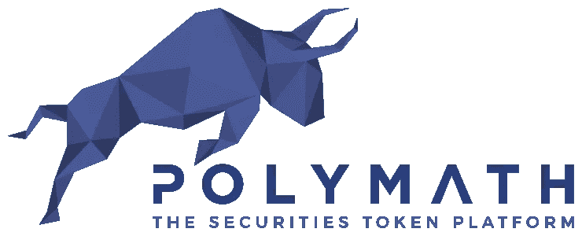

# Polymath 使用区块链的证券令牌平台

> 原文：<https://medium.com/hackernoon/polymath-the-securities-token-platform-using-blockchain-cb986fe22be2>

**什么是博学者**

Polymath 利用区块链帮助用户完成复杂的证券交易法律流程，同时提供完全的透明度和更高的安全性，以及使用智能合约审计交易的更有效方式。

该系统旨在为加密货币证券令牌带来急需的监管，但以一种完全革命性的方式设计，以利用区块链技术。

不受监管的加密货币世界正在经历来自政府和世界银行机构的又一轮攻击，然而，Polymath 是一个有可能改变这一切的平台。

**博学者解决什么问题？**

在 18 世纪早期，世界经历了通常被称为第一次全球股市崩盘，当时南海公司的股票被错误地推测为远远超过其基本价值，因此被试图套现的投资者迅速抛售。由于没有适当的法规来正确管理销售，该股暴跌了 83%。为了防止崩盘，英国制定了一项名为《泡沫法案》的法规。

《泡沫法案》旨在为证券买卖提供更好的监管，并要求公司在出售股票前获得皇家特许。该法令于 1825 年被废除，在 1900 年代早期，在法规还不完善的情况下，公司开始根据不可靠的、通常是欺诈性的信息出售证券。随后，1929 年的股市崩盘导致了大萧条，并催生了一套新的规则，这些规则现在构成了美国 1933 年证券法的基础。

新的证券法要求实现两个主要目标:

1.  要求投资者获得与公开发售的证券相关的财务和其他重要信息。
2.  禁止证券销售中的欺骗、虚假陈述和其他欺诈行为。

仅仅一年后，1934 年的证券交易法案出台，以更好地规范二级市场——公司首次发行后投资者之间的证券销售。美国证券交易委员会(SEC)也成立了，以协助证券交易事务，保护投资者。

随着该行业每年持续增长，发现漏洞和利用漏洞进行欺诈的尝试也在不断增加，因此系统必须不断改革，以跟上最新的漏洞利用。

2010 年，多德-弗兰克华尔街改革和消费者保护法案生效。新法规见证了改善金融监管体系的巨大转变，尽管这些变化肯定是朝着更好的方向发展，但这一切都是有代价的，代价如此之高，以至于在过去几年里，甚至更大的科技公司都被排除在公开市场之外。

根据美国证券交易委员会制定的法规，一级市场和二级市场的交易都受到保护。但当涉及到数字货币时，一个令许多人担忧的因素是整个系统不受监管。

Polymath 可以解决这个问题，方法是将 SEC 法规作为要求嵌入到区块链中，并利用智能合约来执行交易，只要交易获得批准，并且双方都有足够的资源来完成交易。

**博学者是如何工作的？**

Polymath 将区块链用于其全球分散的分类账，其中可以存储所有必要的数据和工具，以组织参与者实现合法合规的证券发行，并随着时间的推移降低交易成本。

该系统由 5 个主要参与者组成，每个参与者都提供了流程的一个重要部分，并在整个过程中受到激励。

**投资者** —希望交易或购买安全代币的个人消费者或组织。

**发行者**——那些希望出售安全令牌的人。

**法定代理人** —代理人投标，并在提案中提出链上限制。他们也可以作为代表的外链，以协助发行人通过满足合规要求。

**KYC(了解你的客户)** **供应商**——KYC 供应商验证参与者的真实身份，并进行必要的尽职调查，以认可投资者。通过在相关司法管辖区获得认证，投资者可以提高自己的地位，并消除一些限制。

**开发人员** —这些软件工程师创建并审查初始发行合同，以换取安全令牌。

参与者可以在 Polymath 系统的三个市场进行操作。其中包括:

**KYC 供应商市场**—kyc 向其管辖范围内的投资者提供验证和认证服务。他们公布使用他们服务的费用(没有出价)。

**法律代表市场** —代表协助完成法律代表流程。他们必须对在此过程中代表发行人的费用进行投标。区块链的透明性质允许第三方跟踪一名代表完成的发行数量，这应有助于发行人决定使用哪种 KYC。

**开发商市场—** 发行人可能希望让智能合约开发商制定或审查其安全令牌(STO)合约。开发人员能够对这些工作进行投标。

Polymath 为投资者提供了一个框架，帮助他们找到并自主协助发行人执行符合全球司法管辖区监管标准的合法证券交易。它允许法律代表投标以协助法律程序，允许开发人员投标以创建或分析智能合同，允许 KVCs 提供验证和鉴定服务以回报投资者。

为了使用该平台，用户必须使用其真实身份进行注册，并获得由 KYC 提供商验证的认证状态。除了确认用户的身份、管辖权之外，这也验证了他们在二级市场上与同样具有有效身份的其他投资者进行交易的资格。

所有交易都由 POLY 令牌提供资金，POLY 令牌是一种标准的 ERC20 令牌，嵌入了规定的要求，指定仅在经过验证的用户中使用。

这种系统有效地消除了对使用昂贵且复杂的审计系统的中间人和代理的需要，这些审计系统需要很长时间才能产生结果。

Polymath 协助完成整个复杂的法律程序，同时提高证券市场的安全性、可审计性和可问责性。因为所有的交易都在透明的区块链上公开进行，所有的公众都可以见证所有的交易。

**有价值的信息
钱币名称:**博学者(POLY)

**总供给:** —发起证券代币革命(1 万亿美元)

**社交媒体链接/联系人**

**脸书**

网址:——[https://www.facebook.com/polymathnetwork/](https://www.facebook.com/polymathnetwork/)

喜欢:19 824 个喜欢和 20 252 个关注者

过去 7 天有多少帖子/更新:7 个帖子

**推特**

网址:[https://twitter.com/polymathnetwork](https://twitter.com/polymathnetwork)

追随者:4401 名追随者

过去 7 天有多少条推文/转发:21 篇帖子

**电报**

网址:——[https://t.me/joinchat/GmbozxFfmqF4UkueyZVoig](https://t.me/joinchat/GmbozxFfmqF4UkueyZVoig)

用户:32 277 名成员

电报管理员

用户名:—克里斯·豪斯尔

**Reddit**

网址:[https://www.reddit.com/r/PolymathNetwork/](https://www.reddit.com/r/PolymathNetwork/)

读者:369 名读者

**Youtube**

网址:—[https://www . YouTube . com/channel/UC 77 sypqjo 0 ea 5 fbumczz 4 ba/featured](https://www.youtube.com/channel/UC77syPQJO0eA5FBUMczZ4bA/featured)

订户:289 名订户

**中型**

网址:——[https://blog . polymath . network/](https://blog.polymath.network/)

追随者:700 名追随者

过去 7 天有多少更新:—帖子

**领英**

网址:——[https://www.linkedin.com/company/polymathnetwork/](https://www.linkedin.com/company/polymathnetwork/)

追随者:431 名追随者

**GitHub**

网址:[https://github.com/PolymathNetwork](https://github.com/PolymathNetwork)

过去 7 天有多少更新:2 篇帖子

**员工/团队信息**

姓名:特雷弗·科维尔科

**头衔**:首席执行官

**领英**:[https://www.linkedin.com/in/trevorkoverko/](https://www.linkedin.com/in/trevorkoverko/)

**额外链接**:——[https://twitter.com/trevorkoverko?lang=en](https://twitter.com/trevorkoverko?lang=en)

姓名:克里斯·豪斯尔

**头衔**:博学者联合创始人

**领英**:[https://www.linkedin.com/in/chris-housser/](https://www.linkedin.com/in/chris-housser/)

**额外链接**:——[https://twitter.com/realbitlawyer?lang=en](https://twitter.com/realbitlawyer?lang=en)

姓名:斯坦·米罗什尼克

**头衔**:银行合作伙伴

**LinkedIn**:[https://www.linkedin.com/in/stanmiroshnik/](https://www.linkedin.com/in/stanmiroshnik/)

**额外链接**:——[https://twitter.com/stan_am?lang=en](https://twitter.com/stan_am?lang=en)

姓名:史蒂夫·达克

**头衔**:首席技术顾问

**领英**:[https://www.linkedin.com/in/steven-dakh-86a63712/?locale=de_DE](https://www.linkedin.com/in/steven-dakh-86a63712/?locale=de_DE)

**号外** **链接**:——【https://twitter.com/stevedakh?lang=en】T4

名字:苏克维尔·桑格拉

**标题**:Waze 全球营销

**领英**:[https://www.linkedin.com/in/sanghera/](https://www.linkedin.com/in/sanghera/)

**额外** **链接:——**[https://twitter.com/everhusk?lang=en](https://twitter.com/everhusk?lang=en)

名字:托什·夏尔马

**头衔**:可靠性团队领导

**额外链接**:——[https://twitter.com/toshsharma13](https://twitter.com/toshsharma13)

姓名:马特·阿什尔

**头衔**:总建筑师

**领英**:[https://www.linkedin.com/in/mattasher/](https://www.linkedin.com/in/mattasher/)

**额外链接**:——[https://twitter.com/mattasher?lang=en](https://twitter.com/mattasher?lang=en)

姓名:大卫·卡普斯特

**标题** : Solidity 开发者

**LinkedIn**:[https://www.linkedin.com/in/davidkajpust/](https://www.linkedin.com/in/davidkajpust/)

**额外链接**:——[https://twitter.com/davekajpust](https://twitter.com/davekajpust)

**姓名**:亚当·金

**标题**:全栈开发者

**领英**:[https://www.linkedin.com/in/adamdanielking/](https://www.linkedin.com/in/adamdanielking/)

**项目顾问**

Anthony Di Iorio —以太坊/ Jaxx

布鲁斯·芬顿-比特币基金会

加里·鲁宾诺夫——夏山

史蒂文·内拉约夫—瑞士联邦理工学院。气体发明家

技术顾问

马修·罗扎克——布洛克/塔利

Nic Cary —区块链

咨询委员会

史蒂夫·达克——氪星工具包

迈克尔·佩克林——保安，变形人

打开齐柏林飞艇

区块链实验室

rob Dermody——交易对手

数字战略