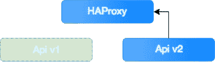

# 穷人的零停机部署

> 原文：<https://medium.com/hackernoon/poor-mans-zero-downtime-deployment-e457002ec539>

当你在做一个项目时，迟早你要向客户展示你的成果。不用说，您将更新数据库中的文件、服务或模式，这意味着只有一件事——部署时间！

对于许多程序员来说，这个过程可能是有压力的。有时服务会中断，数据库会崩溃，或者迁移会出错。客户也不会让我们的生活更轻松。他们希望部署能够顺利运行，并尽可能缩短时间。理想情况下，它的运行应该不会被用户注意到。不幸的是，条件可能会有所不同，后续版本的部署可能需要相当长的时间。它还会导致用户暂时停机。

> *在这种情况下，我们可以随时向 DevOps 团队寻求帮助。但是，他们通常非常忙，无法保证在现场重建整个部署流程。*

但是，我们可以对项目进行一些更改，以缩短部署时间和应用程序停机时间。下面是一些概念和解决方案，每个开发人员都应该能够顺利地在他们的项目中采用。

# 回到过去—过去和现在的部署

几乎可以肯定的是，绝大多数程序员都记得他们职业生涯的开始和他们的第一次部署。当我们自己做一个小项目时，我们完全在自己的机器上创建了一个应用程序。我们附加或构建了库，下载了各种类型的资源(图像、字体、样式)，并使用 FTP 客户端将准备好的应用程序发送到服务器。所以，大部分的准备工作都是在当地进行的。

随着技术的发展和新标准的产生，项目的部署方式也发生了变化。现在，在大多数情况下，开发人员远程登录生产/测试服务器，从存储库中下载项目的当前版本，然后启动应用程序构建过程。结果是一个完整的应用程序和必要的依赖项。很明显，整个过程已经转移到一台远程机器上，这使我们能够自动化该过程，并促进更容易的管理。

# 使用构建工具加快前端部署

构建前端应用程序通常如下所示:

1.  用当前应用程序版本清理文件夹
2.  运行捆绑任务
3.  移除未使用的代码
4.  翻译应用程序，使其可以在各种浏览器上工作
5.  加载环境变量
6.  压缩和缩小代码以获得尽可能小的文件
7.  复制附加资产
8.  搞定了。

构建一个完整的应用程序所需的时间是一个很大的问题。对于一个大项目，可以分分钟算。由于您使用当前版本清理文件夹(您希望删除旧的和不必要的文件)，用户将无法访问您的应用程序。为了避免这种情况，您可以将应用程序构建在不同于提供给客户端的文件夹中，并将文件移动到最后。

这种解决方案减少了应用程序对客户端不可用的时间，但是它有两个严重的问题:

1.  这些文件是重复的。
2.  当您想要返回到以前的版本时，您会丢失数据。

除了复制文件，您还可以创建符号链接，并将下一个版本保存在带有标签或时间戳的单独文件夹中。

# 带链接的任务示例

如有必要，回滚到以前的版本只需要链接另一个文件夹中的文件。

最后要记住的是，符号链接必须是相对的，构建文件夹也应该在服务器上可用。

# 路径示例

为了避免浏览器缓存的问题，给文件分配一个随机散列也是明智的。

# 后端部署

## HAProxy

长期以来，TSH 中的所有应用都是基于 Docker 容器化的。它增加了项目的灵活性，允许我们轻松地更改应用程序的各种元素。然而，为了以用户不可见的方式替换某些元素，您需要用负载平衡器来扩展您的架构。在我们的例子中，平衡器将在旧的和更新的容器之间重定向流量。HAProxy(高可用性代理)将完美地满足我们的需求。设置非常简单，只需在 docker 编写文件中添加几行即可。

## API 更新

在很大程度上，后端实现归结为为当前 API 版本构建一个新容器，并将所有流量从一个容器重定向到另一个容器。有了 HAProxy，整个过程变得几乎无缝。尽管如此，还是让我们把这方面的知识系统化吧。

在服务器上，您已经启动了连接到 LB(负载平衡器—这里是:HAProxy)的 API v1 版本。

您构建一个 API *v2* 容器，并将其添加到已经启动的容器中。为此，您必须使用 *docker-compose scale api=2* 命令，HAProxy 本身会将它添加到配置中，并将流量重定向到它(默认情况下，流量均匀分布在配置中的所有容器上)。

现在，剩下唯一要做的就是删除 v1 版本，并将所有流量重定向到 v2。不幸的是，将 API scaling 改为 1 将会删除最后添加的容器——即您当前的 API 版本。因此，在您更换秤之前，您必须记得停止并移除旧容器。这个问题可以用一个简单的 bash 脚本来解决。

## deploy.sh

在脚本被执行之后，只有 api v2 容器将保持活动状态，所有流量都被定向到它。

# 数据库ˌ资料库

这里要讨论的最后一个元素是数据库。取决于你想改变什么，它可能是系统中最简单或最具挑战性的元素之一。为了确保这个过程能够顺利运行，下面给出了一些简单的概念。此外，值得一提的是，您应该逐步修改 API，与数据库交替进行。

## 添加新列

1.  创建迁移以添加新列。
2.  将代码与迁移一起部署。
3.  上传使用新列的 API 版本。

## 删除列

1.  修改代码以不使用选定的列。
2.  为过时的列准备一个迁移，添加一个有意义的后缀，例如 *_deprecated:*
3.  如果新功能有效，并且您确定不再需要该数据，则可以删除该列。
4.  如果遇到问题，可以通过删除后缀轻松回滚数据库。

## 更改列名

1.  准备使用新名称创建列的迁移。
2.  添加一个事件，确保更新的数据被复制到新创建的列中。
3.  将数据从旧列迁移到新列(最好将记录分成几部分)。
4.  修改代码以仅使用新列。
5.  删除旧列(参见上面的示例)。

## 更改列类型

1.  创建包含不同类型的新列的迁移。在名称中添加一个带有列类型的后缀，以便更容易区分它们 *name_column_type* 。
2.  添加一个事件，确保更新的数据被复制到新创建的列中。
3.  将数据从旧列迁移到新列。
4.  在模型中，输入新列类型的名称。(兼容性在这里很重要，所以让我们的模型变得“智能”。如果没有找到列 *name_column_type* ，就使用原来的列名。在原则上，可以使用模式管理器获得列)。
5.  创建一个迁移，将 *_deprecated* 后缀添加到原始列中，并从新列中删除类型后缀。
6.  从模型中删除列名猜测逻辑。
7.  删除旧列(参见上面的示例)。

看一下上面的例子，您可以看到经过深思熟虑的迁移允许我们以一种用户几乎看不见的方式更新/修改数据库。

# 最后

总之，相对少量的工作可以显著缩短您的部署时间。当然，这个过程需要一些准备，谨慎，以及在执行过程中的纪律。但是，最终，这意味着更少的压力和更满意的客户。

## 也值得一读:

*   Bastien Libersa 在他的博客上
*   [培养基上的斯拉瓦·科洛列夫](/@korolvs/zero-downtime-deployment-with-docker-d9ef54e48c4)

这篇文章是 pawerychlewski 写的，最初发表在软件之家博客****上。访问博客，获得更多关于最佳开发实践和软件外包技巧的文章。****