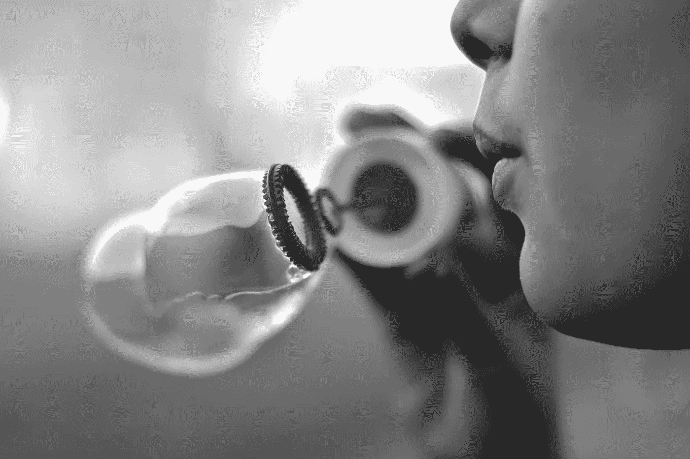

# 泡泡消失了。然后，它又发芽了。

> 原文：<https://medium.com/hackernoon/pop-goes-the-crypto-bubble-and-then-it-sprouts-again-55f34e293d1e>

## 投机的、不合规的数字泡沫背后

是的，我们姑且称之为金融泡沫。

加密货币是一个已经破裂的投机泡沫。然而，这还远远没有结束。

许多在线消息来源会指出，比特币的价格从 2013 年 12 月的 1200 新元左右跌至 2015 年 5 月的 200 美元左右。最近，BTC 从 2017 年 12 月的 2 万美元暴跌至今年多次跌至 5800 美元的低点。

当我们接近比特币诞生 10 周年的时候，事实上，在一个计数器上，投机泡沫已经被宣告死亡超过 300 次。许多人会问的问题是，“下一步是什么？”

# 什么是金融泡沫？

首先，如果我们理解泡沫的构成、它为什么会增长以及它为什么会破裂，那会有所帮助。

> 金融泡沫描述的是一项投资的价格大幅上涨，超过其内在价值，以至于当人们发现其真实价值时，它会引发大规模抛售，导致价格暴跌。泡沫就这样破灭了，价格下跌的速度和上涨的速度一样快。人们不切实际的预期和过度夸大的估值导致了泡沫的增长。
> –第七章，滚滚而来的密码

Photo by [Julie Laiymani](https://unsplash.com/photos/WOAg_s1Nhzo?utm_source=unsplash&utm_medium=referral&utm_content=creditCopyText), Unsplash.

在成长阶段，通常对资产的价值有一种过于乐观和旺盛的看法。有许多促成因素——缺乏适当的估值方法、投资者传染性的兴奋情绪、操纵市场的人。

无论是郁金香狂热、互联网泡沫还是房地产泡沫，它们都显示出投资者市场被误导和炒作的迹象。同样，加密货币市场也有快速增长的阶段，投资者的情绪过于乐观。

*补充说明:美国股市也有类似的乐观情绪，牛市已经持续了近 10 年——虽然缓慢而稳定，但仍是单向增长。*

# 戳破泡沫

回到加密泡沫，2014 年比特币价格的下跌在很大程度上可以归因于丝绸之路的关闭，以及随后 Mt Gox 的崩溃。最近的泡沫破裂可能是由于不可持续的 ICO(首次发行硬币)热。

次级贷款松散地支撑着房地产泡沫；互联网泡沫是由估值过高的科技公司支撑的。当市场意识到他们只是买了炒作，而他们所收购的资产实际上价值更低时，所有这些都崩溃了。

当然，事后来看，很容易判断出哪里出了问题，以及我们应该如何预见它的到来。当时，在泡沫破裂之前，投资者在想什么？

# 远见者看到了黄金

许多人提到的泡沫迹象之一是，当你的牙医、理发师、出租车司机或路上一个随机的陌生人问你是否投资了“它”时。当所有人都开始看到愿景时，你就不再是一个有远见的人了。

有趣的是，加密货币如此复杂，以至于这些远见卓识者的出现有多个维度。也就是说，泡沫增长，然后破灭(或者应该说，纠正)，然后以一个新的投机故事角度再次增长。

2013 年的增长建立在不受监管的数字现金的信念之上。2017 年的增长建立在通用、去中心化、数字现金的相同信念之上，但更重要的是，智能合约和区块链应用于许多行业。

如果下一个加密市场的增长将建立在通用货币和智能合约的当前“应用”上，但又增加了一个新的故事角度，那就不足为奇了。

无论是银行的大规模采用，作为交易资产的主流采用，物联网(IOT)和人工智能(人工智能)的工业采用，这些都是表明加密货币可以带来下一桶金的可能框架。这些是今天的密码幻想家所看到的，也可能是他们仍然在霍丁的原因。

# 所以，买加密货币？

读完所有这些，你可能正在等待一些建议，或者一个行动号召。不，我不能保证市场会再次增长。

但我确实看到，许多不同的项目都在做真正的工作。他们中的许多人会失败，但有些人会转向，少数人会大获成功。

如果他们做到了，他们的劳动成果将以很少或没有成本的方式造福于我们所有人。这就像我们今天如何访问互联网，获取万维网上的信息一样——我们用户将从中受益，并且使用这些服务不会花费我们一个炸弹。

因此，你不必成为投资者，就能获得去中心化和数字安全代币的好处。你甚至不需要现在就买，尤其是如果你不能承受风险的话(顺便说一下，所有的投资都伴随着风险)。

如果你决定购买一些加密货币，阅读技术和风险管理可能是明智的，因为从长远来看，这些可能会帮助你保护你的资本。或者你可以简单地拿起一份 [*滚动在加密*](http://book.herzigansel.com) 中，在那里我分享了更多关于什么是加密货币，如何策划加密项目，以及如何建立多元化的加密投资组合。

虽然大多数金融泡沫都会崩溃并结束，但加密货币是一个不合规的泡沫。加密泡沫将再次增长，因为有太多关于加密货币的东西外行人还不知道，而且有太多的潜力来创造另一个市场周期。是的，我相信在密码市场上有一个 [*大量的操纵*](/@h.ansel/3-simple-rules-to-crypto-investing-ad278c66f397) *。*

你能做的最好的投资不是金钱，而是对知识和学习的投资。

我在我的 blo 和 Medium 上写关于区块链和加密货币的文章，还经营一份免费的双月刊时事通讯，讨论加密市场。如果你喜欢加密投资/交易，请关注我，获取更多此类文章或订阅时事通讯。