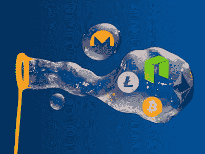
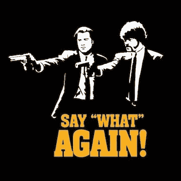
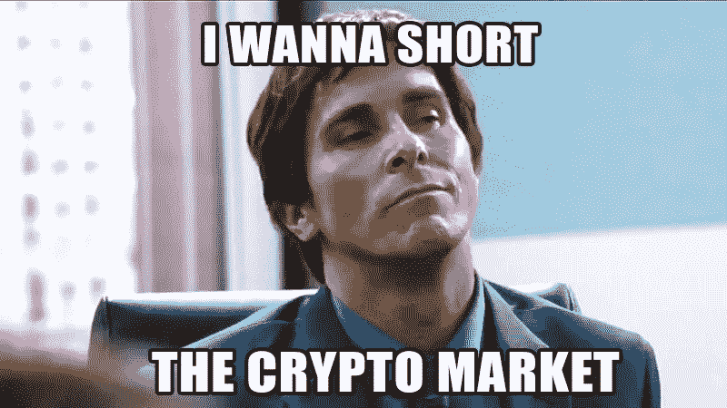
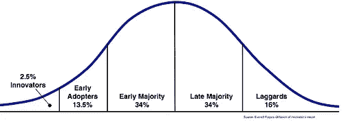
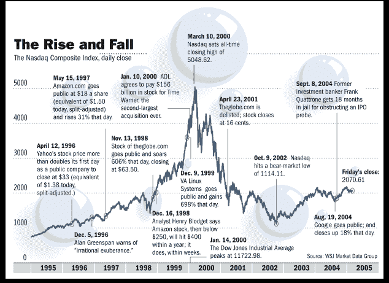
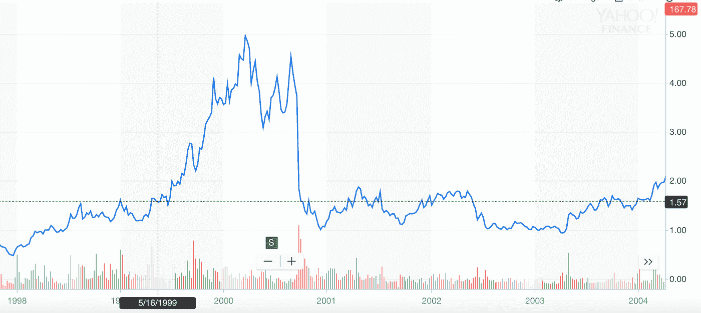
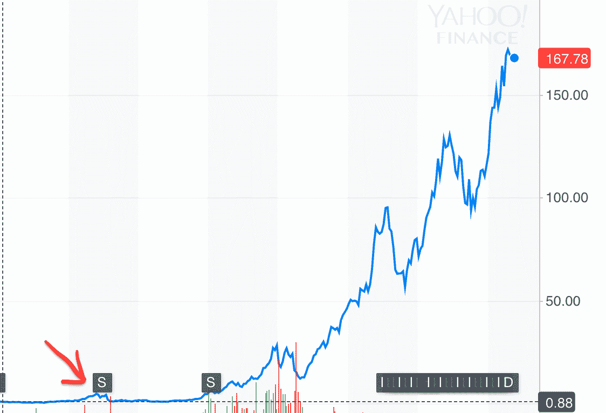
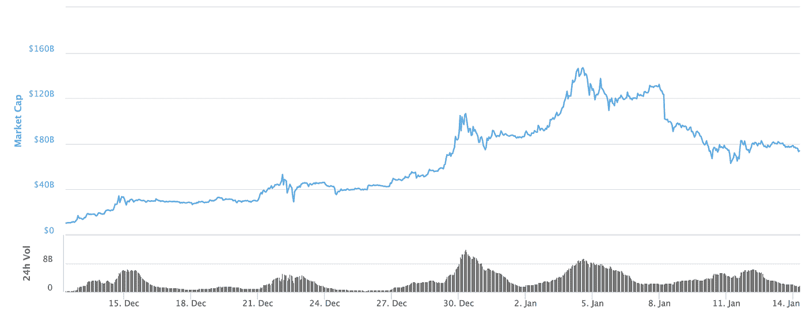

# 戳破泡沫:加密货币与网络公司

> 原文：<https://medium.com/hackernoon/popping-the-bubble-blockchain-and-cryptocurrency-7130156f91b2>

## 加密货币可能存在泡沫，但我们还远未达到顶峰

与 [Nir Kabessa](https://medium.com/u/cdf92943ce87?source=post_page-----7130156f91b2--------------------------------) 合著

*泡沫。*自从三年级生日派对后，我就没听过这个词用得这么多了。这是每个加密投资者的克星，最常见的第一个问题，美国消费者新闻与商业频道最喜欢的流行语。不管是哪个记者，它总是以同样的*呆若木鸡*的表情和免责声明“我们实际上不知道我们在说什么。”

每当我听到有人声称加密货币存在泡沫时，我都会本能地想要反驳它们。就像听某人严重错误地引用了你最喜欢的电影。大多数人声称存在泡沫，但对区块链、[比特币](https://hackernoon.com/tagged/bitcoin)或泡沫没有任何理解。不过，尽管这位美国消费者新闻与商业频道记者只是蒙着眼睛扔飞镖，希望自己能击中靶心，但这些泡沫的说法可能有些道理。

Don’t misquote Pulp Fiction

> 首先，泡沫的定义:“**以大大超过资产内在价值的价格或价格区间交易资产。**”

我将使用两个指标:*推测*和*应用*。我们推测资产将有什么样的应用，总是与它的实际应用相对照。最大的泡沫总是出现在潜在的破坏巨大的时候。这造成了*推测*和*应用*之间的最大差异。这就是为什么新的噪音消除耳机技术可能不会导致泡沫。这项技术的应用非常明显——淹没了空中婴儿的哭声——因此，没有太多猜测的余地。我们可以基于当前耳机行业的假设，此外，该技术只影响一个行业，因此其大规模颠覆的潜力有限。

想一想刚出现时的互联网，尤其是分布式账本技术(DLT——一个包含所有分布式账本技术的术语:DAG、HashGraph 等)。)今天。互联网曾经威胁并彻底改变了几乎所有现存的行业。如今，DLT 有可能做同样的事情，颠覆从 P2P 支付、金融和物联网到医疗保健、合同和供应链的各个行业。而且有*实*势。但是应用程序还没有出现。**这就为巨大的泡沫创造了环境。**因为没有办法反证，所以每个人都可以自由胡乱猜测。告诉我一个烤面包机将会彻底改变汽车工业，我会说这是胡说八道。类似烤面包机的技术*还没有做到这一点，所以这种猜测站不住脚。但是告诉我 DLT 会扰乱航空业，并提出令人信服的论点……我无法反驳。*

## 不可否认，我们正处于泡沫之中。

这使我想到以下几点。每个气泡的关键属性:

1.  大规模和广泛的破坏
2.  目前应用很少
3.  没有基础价值的资产— *难以估价*

新的理论化的 DLT 应用只会引发更多的猜测。然而，最终应用程序的生产将真正开始。挑战将会出现。颠覆将是困难的。收养更难。应用程序实现将会显著增加。但由于投机被定得如此之高，申请将不可避免地失败。当应用程序永远无法达到预期的时候，市场将会做出艰难的修正。 **泡沫会破裂。**

…and there goes the shitcoins.

我们在谈论互联网泡沫、大萧条、*第一天开车*崩盘。市场将急剧下跌，投机将突然远远低于应用。**会突然从根本上*被低估*。它将在那里停留几个月，那时，最强的公司将从灰烬中再次引领市场向上。**

但与许多人用“泡沫论”作为不投资的理由不同，这不是我的论点。我们总是生活在泡沫中；几乎每个市场都只是泡沫形成和破裂的循环。就连市值 18.5 万亿美元的纽约证券交易所也坚持这种循环；随着对美国经济未来的猜测越来越多，现实最终必须跟上。当市场高估现实时，泡沫就会形成。当现实无法满足这种期望时，市场就会崩溃。这些不一定是疯狂的，像我们在 crypto 中看到的 40%的下降，但事实仍然是泡沫只是投资的一个自然组成部分。

因此，真正的问题不是:**我们是在泡沫中吗**？而是，泡沫会变得有多大？如果我们尊重颠覆性技术的自然进化，那么我们必须明白，每一次大规模的投机性上涨，都会带来同样大规模的崩盘。从 17 世纪的郁金香泡沫到 15 年前的互联网泡沫，崩盘是不可避免的。因此，问题是，我们能从过去的泡沫中学到什么，它们能在多大程度上指导我们在[加密货币](https://hackernoon.com/tagged/cryptocurrency)市场的行动？

> 哲学家乔治·桑塔亚纳说:“那些不记得过去的人注定要重复过去。”。正如彼得·兰伯恩(Peter Lamborn)所说，或许更恰当地说，“那些了解历史的人注定要看着其他白痴重复历史。”

导致大量投机性购买的心理因素本质上是人类的。无论时间段，无论资产，它们都同样展现。**鱼要游泳，鸟要吃东西，人类需要投机购买。**基于这个原理，我们可以探索其他历史泡沫来理解现在的加密货币泡沫。明白了原因，明白了后果，明白了征兆，你就能更好的预见轨迹。做一个“大空头”的人。

需要明确的是，我的论点并不是围绕比特币展开的。如果你不明白比特币和其他分布式账本技术的区别，[看这个](/blockchain-for-grandma/beyond-bitcoin-why-ethereum-could-change-the-world-1b24a8ba1aef)。比特币的价值很低。交易费又慢又贵，比特币没有太多的功能性；如果没有功能性，比特币的价值很大程度上取决于人们对其价值的感知。另一方面，DLT 有重要的潜在应用。由于这篇文章围绕着加密货币的投机和应用，DLT 项目才是重点所在，而不是比特币。

每一项技术的采用都遵循相同的曲线:

The Technological Adoption Curve

这被称为技术采用曲线。它直接关系到我之前关于投机和应用的讨论。通过*创新者、早期采用者和早期多数*阶段的崛起是由投机推动的。但是当后期大多数开始采用时，对实际实现和应用的需求变得至关重要；实现无法满足海量推测，崩溃开始。

17 世纪 30 年代，荷兰的郁金香爆发，这就是今天众所周知的荷兰郁金香泡沫。历史数据估计，郁金香价格在暴跌 99%之前的四个月内上涨了 2000%。20 世纪 80 年代末，日本的大规模刺激措施推动了他们的经济，并导致了大规模的投机。来自 [Investopedia](https://www.investopedia.com/articles/personal-finance/062315/five-largest-asset-bubbles-history.asp) :“在 1989 年房地产泡沫的顶峰时期，东京皇宫的价值超过了整个加利福尼亚州的房地产价值。泡沫随后在 1990 年初破裂。”这就是所谓的**日本房地产和股票市场泡沫。**

但是对于我们的比较来说，最相关的泡沫是通常所说的 20 世纪 90 年代的互联网泡沫和随后在 2001-2002 年的崩溃。

到了新千年，很明显，互联网将改变世界。它开始颠覆每一个行业，并带来了一种新的经济，一种新的经营方式，一种点对点的连接… *听起来很熟悉*？该应用程序符合所有的猜测，然后一些。这可能是自工业革命以来最具影响力、最具革命性的技术发展；有人会说甚至更大。然而，尽管取得了突破性的成功，巨大的崩溃仍然发生了。

让我们回到 22 年前。现在是 1999 年，你是一个精明的投资者，对互联网革命充满热情。6 家最大的科技公司价值 1.65 万亿美元，占美国国内生产总值的 20%，但你仍然经常被你的朋友嘲笑投资新的“传真机”**低能儿**。你知道，如果你尽职调查，你会发现黄金网络公司投资。有一天你会发现一个。它检查你所有的箱子:强大的团队(Borders books 的两位创始人)和强大的机构支持(红杉资本和基准资本——后来的高盛)。这家公司叫 WebVan，是一家承诺 30 分钟送货上门的网上杂货店。在 1999 年的 ICO 中，他们筹集了 3.75 亿美元，然后迅速膨胀到 12 亿美元。看涨？颠覆性？听起来熟悉吗？然而，在 2001 年 7 月，股价从 30 美元跌至 6 美分，WebVan 一天之内损失了 7 亿美元。

# 互联网泡沫破裂

总体而言，2000 年至 2002 年间损失了 5 万亿美元。25 个比特币市场消失了。噗。只有 50%的网络公司幸存下来，华尔街和硅谷成了初创公司的墓地。想到互联网还没有先进到允许这些人以迷因的形式哀悼，我感到很难过。

# **哪里出了问题？**

在当今无处不在的连接和无缝体验的世界中，很难想象互联网及其许多应用程序曾经难以培养用户网络。但是在 20 世纪 90 年代中期，互联网仍然只有很少的用途，然而，anything.com 开始到处出现。**在你的公司名称中写上“dot com”就足以让你获得成为 IPO 明星的黄金入场券；更别说几个亿了。**

【Pets.com】， *Webvan* ，例子不胜枚举。燃烧得太亮然后死去的星星。投机发展得太快了。它已经超越了它的基本价值:用户。对*可能是什么的推测*突然被对它是什么的实现*所取代。*从长远来看，投机导致估值过高，摧毁了许多公司。公司需要现实检查；他们需要压力和障碍 IPO 后立即获得 5 亿美元的估值不会带来成功。

不幸的是，管理不善并不是唯一的受害者。大家一落千丈。随着崩盘的势头，纳斯达克(NASDAQ)也遭受了损失。*亚马逊*暴跌；苹果公司的股票大幅下跌。

Apple stock during the crash. From a high of $4.95 per share to $1.00 just nine months later.

And a little perspective…the arrow points to the dot-com crash

亚马逊的跌幅更大，从 1999 年的 85.06 美元跌至 2001 年的 5.97 美元。当市场调整到来时，没有人是安全的。

# **相同——相同但不同？**

每个人都会拿网络和加密货币做比较..两者都是由很难正确评估的有前途的新技术推动的。如前所述，无论资产是什么，泡沫就是泡沫。然而，游戏的条款已经改变。2018 年不是 2000 年。我们能用网络泡沫作为一个可行的衡量标准吗？DLT 的未来类似于互联网吗？让我们探索一下这两个巨头之间的主要区别:

# 过山车

如果网络泡沫是你最喜欢的迪斯尼乐园过山车，那么数字资产市场就是你“总有一天一定会乘坐的”过山车区块链市场比其他任何市场都发展得快。它更不稳定。**改变人生的收获，毁灭性的损失**。

区块链就像德克萨斯州，在德克萨斯州，一切都更大…甚至是损失。即使 WebVan 每天损失 7 亿美元的末日也无法掩盖一些 crypto 最大的输家，如今年 1 月 8 日 Ripple 的 250 亿美元雨天。

Ripple’s enormous volatility

这些波动是几个因素造成的:投资者可以接触到加密货币，以及通过互联网可以获得大量信息。这为加密货币的波动性制造了一场完美风暴。此外，过多的交易所，无论是集中的还是分散的，都允许疯狂的套利和市场操纵。由于区块链领域对内幕交易和市场操纵的监管非常少，可以肯定的是，这些恶意行为正在大量发生。一个百万富翁可以轻易地影响一个 500 万美元市场的价格。24 小时交易量为 10 万美元的 cap 区块链。鲸鱼对这些小硬币并不陌生，一般的小投资者无法区分这些操纵和市场情绪。

# **全球**

哈佛的捐赠不是数字资产。你父母退休也不是(如果是，滚！).今天的投资者不是经验丰富的机构投资者；他们年轻，没有经验，投机，想要在*快速致富。*在 90 年代纳斯达克上涨期间，投资只能通过经纪人和机构投资者进行；有了加密货币 a *任何人*都可以参与。你只需要一个连接到互联网的设备。即使是巴基斯坦的牧羊人也能成为密码交易员。与日内交易的兴奋相比，山地牧羊算什么？

What is the BTC/Sheep price?

这些投资者全天候访问他们的投资组合，即时收到 twitter 上的更新。他们并不完全了解他们投资背后的技术。互联网以前所未有的速度提供市场更新和信息。很多时候，这些信息可能会产生很大的误导。其他时候，你会从彻头彻尾的骗局中吸取教训。因此，恐慌性抛售频繁发生。害怕错过占主导地位。巨大的上涨之后是大规模的崩溃，其程度远远超过 2000 年前的纳斯达克。

但这也意味着加密泡沫可能会让网络泡沫相形见绌。纳斯达克在 2000 年 3 月达到了 5.048 万亿美元的高点。但是，这个高点受到投资者准入障碍的限制，受到快速和大规模分享信息时遇到的困难的限制，也受到网络投资主要限于北美的事实的限制。任何人，从任何地方，只要有一些钱和一部手机，都可以使用加密货币，这意味着随着全球开始了解 DLT 的价值，5 万亿美元可能看起来微不足道。

但这只是简单地承认，预测泡沫顶部是一个愚蠢的游戏。相反，我们应该关注那些发出“警告”的标识符。以下是一些指标:

1.  大众媒体不仅开始关注比特币(已经是了)，也开始关注 DLT、其潜力和相关项目。这将意味着很大一部分人开始意识到底层技术——与今天的情况大不相同。美国消费者新闻与商业频道正在迅速将这变成现实…
2.  大量机构资金涌入:对冲基金、退休账户、个人储蓄。这将导致市值大幅增加。
3.  实际上支持大型用户网络的区块链产品。当我们进入这个开发阶段时，很明显，今天的许多项目都没有达到预期。第一个失败的区块链项目将产生滚雪球效应。
4.  由现有公司生产的大量私营、中央集权的区块链涌入。这将表明，许多先前预测的分散式 DLT 解决方案实际上将被现有的传统公司超越，这些公司将开发自己的私有区块链解决方案，而不是采用分散式、基于令牌的平台。这可能会导致对区块链现实的大规模重新评估。
5.  市值在 5 万亿到 10 万亿美元之间。任何时候发生如此大规模的地震都会令人非常担忧。然而，重要的是要明白，速度是产生泡沫的原因，而不是总市值。快速上涨之后几乎总是会出现剧烈的崩盘。

考虑到公众和大众媒体基本上不了解 DLT，这支持了我的结论，即我们离泡沫的顶部还很远。世界现在才刚刚开始合法化*比特币。区块链的真正价值需要很多年才能被大众理解。与此同时，加密货币将在大规模波动时期继续发展。然而，总的趋势将是向上的——而且非常显著——随着市场走向顶峰，不可避免地走向崩溃。*

上周的崩盘与最终的“泡沫破裂”有何不同？也许没什么。数字资产市场可能会继续上涨、下跌、上涨、下跌，直到采用带来稳定。上周的崩盘可能是我们见过的最具戏剧性的一次。然而，我认为最大的不同在于，在上周的崩盘中，资产方面没有任何*基本面*的变化。崩盘完全是基于投机和市场不确定性。我认为最终的崩盘将会发生，因为基础资产发生了一些根本性的变化。这可能是一系列因管理不善或实施障碍而停止发展的 DLT 公司。可能在许多大型项目中发现了安全缺陷(有人知道吗？).无论如何，我认为在崩溃之后，许多以前的区块链将会死去，注定永远存在，没有进一步的发展。

# **结论**

也有可能区块链和加密货币无视所有的预测，所有的历史模型。区块链有可能改变了所有行业，而且从未出现过像 21 世纪初那样的崩盘。区块链和加密货币有可能成为当今股票市场的竞争对手。可能去中心化是如此显著的不同和成功，以至于它从根本上改变了公司和项目发展的方式，人类心理上与市场互动的方式。有可能…但我对此表示怀疑。我们可能在玩一个勇敢的新游戏，但是我们可以从之前的玩家和游戏中学到很多东西。

数字资产和 DLT 很可能会改变世界。但是旅程将会是崎岖不平的。

在 Twitter 上关注我们:@ noamlevinson—[**@**the block _ x](https://twitter.com/TheBlock_x)—@ kingkabessa

***免责声明:我们投资于加密货币。这不是投资建议，仅仅是我们对市场的看法。自己做研究。***

*如果你喜欢该内容，请按住鼓掌按钮！它帮助我们获得曝光率。*

***鼓掌 50 次！***

我们喜欢收到问题或建议，所以请留言吧！