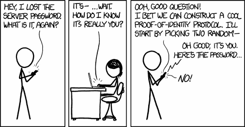
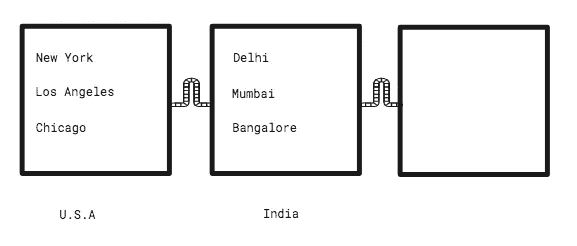
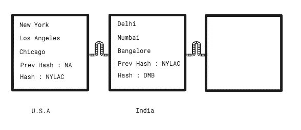
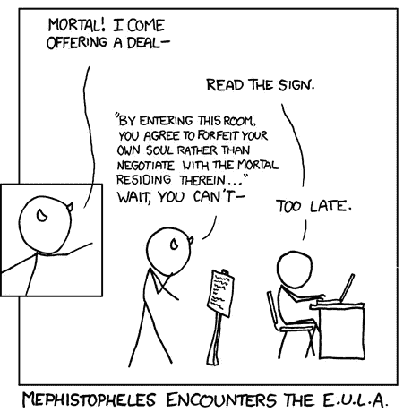

# 你需要知道的区块链技术的流行用例

> 原文：<https://medium.com/hackernoon/popular-use-cases-of-blockchain-technology-you-need-to-know-df4e1905d373>


[FilmGrab](https://film-grab.com/2016/12/19/avengers-age-of-ultron/#jp-carousel-121091)

## 区块链的应用

我就是区块链！我是无敌的，因为我在多台电脑上复制自己。是的，就像奥创。你不能腐蚀我。虽然比特币和以太坊是我的第一个应用。我真正的力量还没有释放出来。



Credits : [xkcd](https://xkcd.com/1121/)

# 身份


让我从身份证、徽章和其他东西开始。奇特的设计可以复制。你知道 3D 打印机吧？你如何验证它们？一些组织提供在线验证服务。你可以扫描卡或输入号码，并验证它是否是真实的。但是，这可能成本很高，您需要为云支付费用。有了区块链你就不用构建自己的身份基础设施，你可以使用以太坊的开放区块链来存储身份细节。任何人想要验证，只要查询公开的区块链就可以了。

# 公证人

你的大部分所有权记录都保存在纸质账本里。这些都是可以篡改的。区块链上的数据不能被篡改。在区块链上有两件事。一块积木和一条链子。在很高的层面上，它只是一个区块链。因为它在计算机内部，我们可以排除物理的东西。在这里，数字信息被分成块并链接在一起。例如，考虑下面的方块，每个方块代表一个国家。每个都包含各自国家的城市名称。



等等，还有别的。这些块中的每一个都有一个哈希。哈希是一组字符(例如“1hi515AHA5H”)。哈希是从块中包含的信息中导出的。美国的街区有城市纽约、洛杉矶和芝加哥。所以散列应该类似于“NYLAC”(*技术上来说不是这样，但是你得到了这个想法*)。



每个后续块都将包含前一个块的哈希。这就是将他们结合在一起的东西(*原力*)。如果有人篡改第一个街区添加城市波士顿。新的散列变成了“NYLACB”。然而，印度的后继块已经将散列存储为“NYLAC”。这种错配会断链。所以散列的目的是确保没有人篡改它。我想说的是你不能篡改我的记录。如果你做了，我会知道的。

# 数字资产

我希望你听说过 ICOs(check out[travel chain](http://travelchain.io?r=coinpot1992))。这是筹集投资的新方法。任何地方的任何人都可以成为投资者。当有人投资你的公司时，你应该回报他们一些东西，对吗？比如股票或者股份？ico 提供了一种叫做 token 的数字资产。这些代币将储存在你的区块链钱包里(结账[比特币基地](https://www.coinbase.com/join/58d416ab6586f20e3eb10647))。你可以用这些代币来支付公司的服务费用，甚至可以在以后代币增值时兑换。

# 智能合同



Credits : [xkcd](https://xkcd.com/501/)

***马克和萨拉***

马克已经五个月没付房租了。当 Sara 提问时，他答应以后再付钱。她很无助。她请不起律师。法院需要八个月到将近一年的时间来执行诉讼。唯一的选择是说服马克。

***乔氏企业***

乔是一名商人。他经常和不同的公司做生意。几个月前，他与一家零售商签订了合同。尽管合同的条件已经满足。零售商拒绝付款。这些人利用法律制度，说服乔接受较低的工资。乔以前有过这样的经历。在某些情况下，他会去法院。他在那里花费的时间和金钱损失了他的利润。

我们如何帮助萨拉和乔？

我们在其他地方解决过这个问题吗？就莎拉而言，我们需要让马克每个月付房租。基于时间的触发器。您的日历应用程序使用这样的触发器来通知您预定义的事件。

在 Joe 的案例中，一旦协议条款得到满足，当事人就需要付款。这是一个基于条件的触发器。想想你最后一次从亚马逊购买电子书。亚马逊只有在确认付款后才会发货。

关键是计算机程序始终如一地执行这样的指令。当你点击这篇文章，向下滚动，等等的时候，它就出现了。为了帮助 Sara，我们需要将合同中的协议转换成代码。

***萨拉和马克之间智能契约的伪代码***

```
If today’s date is 30th and rent is not paid thenTransfer $500 from Mark’s account to Sara’s account
```

但是我们在哪里部署这些代码呢？它应该部署在所有相关方的计算机上。萨拉和马克的银行将成为私有区块链网络的一部分。乔和莎拉将签署一份加密合同。然后部署在网络上。马克和莎拉的银行都会有一份副本。在每月 30 日时钟滴答 12.00 时。约定的金额从马克的账户转移到莎拉的账户。乔开始使用智能合同来迫使他的客户支付约定的金额。

> 莎拉很高兴，因为她不必相信马克同意转让租金。乔很高兴，因为他不必去法庭寻求公正。相反，他可以用这些努力来发展他的业务。

# 数字投票

还记得你最后一次排队投票吗？如果你能在家做呢？网络投票最大的问题是它的安全性。选票可以被篡改或者黑客可以查出你投了谁的票。区块链可以让你的投票匿名，提供更好的安全性。由于美国的投票率很低，数字投票可以带来更多的参与者。

# 分布式存储

目前，你使用 Gdrive、Dropbox 等服务来存储文件。问题是你必须相信他们不会偷看你的数据。如果需要，政府可以强迫他们披露数据。在区块链上，数据以高度加密的方式分散存储在网络上的不同计算机上。这样可以降低成本。如果您的电脑有多余的存储空间，您可以租借多余的存储空间。Storj 就是一个例子。是的， [Airbnb](http://www.airbnb.co.in/c/febinjohnj) 或[优步](https://www.uber.com/invite/e5n9b)用于数字存储。

[](/wethinkideas/how-to-validate-if-your-ideas-need-a-blockchain-e1a4846d16fd) [## 如何验证你的想法是否需要区块链

medium.com](/wethinkideas/how-to-validate-if-your-ideas-need-a-blockchain-e1a4846d16fd) 

***鼓掌请*** 👏，*谢谢*😊。*关注我们，*[*HackerNoon*](https://hackernoon.com)*和我(*[*Febin John James*](https://medium.com/u/75a616711f4e?source=post_page-----df4e1905d373--------------------------------)*)了解更多故事。*

我想向您介绍两款加密产品。 [*比特币基地*](https://www.coinbase.com/join/58d416ab6586f20e3eb10647) *是一款简单易用的加密货币钱包，支持比特币、以太坊、比特币现金和莱特币。* [*赚*](https://earn.com/febin/referral/?a=rzjbj73qc4dhiv6y) *付给你读邮件的比特币。*

[](https://www.linkedin.com/in/febinjohnjames/)